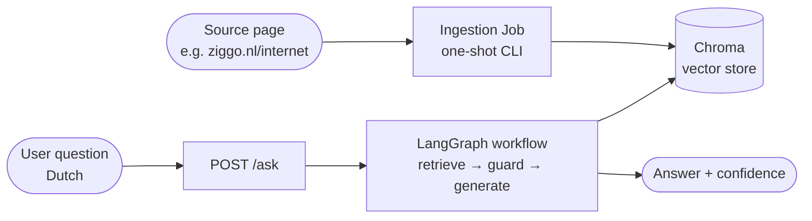
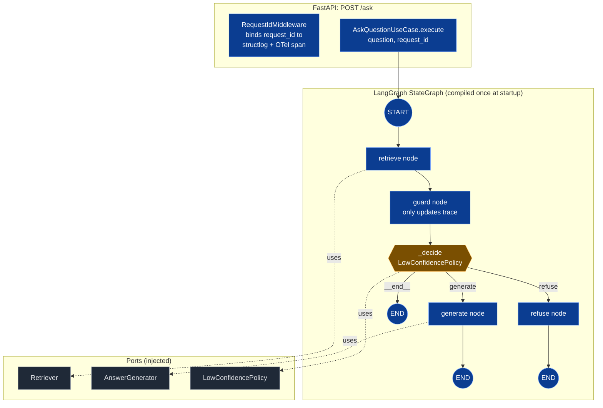
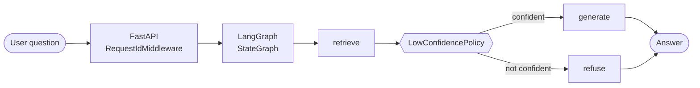
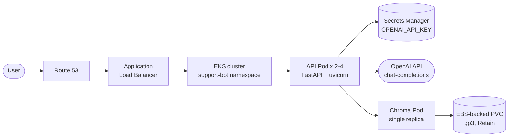

# support-bot

A small customer-support **RAG (Retrieval-Augmented Generation) agent**
that answers questions about a single web page in **Dutch** (or any
language matching the source). The current production target is
[`https://www.ziggo.nl/internet`](https://www.ziggo.nl/internet); the
source URL is operator-configurable.

You give it a URL. It scrapes, cleans, semantically analyzes, and
embeds the page into a vector store. Users ask questions over HTTP;
the agent retrieves the most relevant chunks, asks an LLM to
**answer strictly from those chunks**, and returns the answer with a
confidence flag. When the retrieved context is too thin to ground a
reply, the agent refuses with a fixed message — it never invents
prices, URLs, or details.

> **Full documentation site (C4 diagrams + deep dives + walkthroughs):**
> **[https://bruj0.github.io/support-agent/](https://bruj0.github.io/support-agent/)**
> This README is the quick-start + at-a-glance; the docs site is the
> authoritative reference for the architecture, observability contract,
> deployment topology, and design rationale.

---

## What it does



1. **Ingest** the source page once (scrape → clean → LLM-analyze into
   semantic regions → chunk → embed → store in Chroma).
2. **Retrieve** the top-k most similar chunks for each user question
   using OpenAI embeddings; re-rank with a lexical overlap scorer so
   Dutch verb-form variants surface in the top-k.
3. **Guard** the retrieval: if the top-1 score is below threshold,
   the agent refuses with the fixed string `"I cannot answer based
   on the available content."`
4. **Generate** the answer with `gpt-4o-mini`, constrained to the
   retrieved context.
5. **Respond** with `{answer, confidence, trace, top_similarity, request_id}`.

---

## Suggested reading order

If you're reviewing this repo, here's the path that traces
a feature from "what the user sees" all the way back to
"why it was built that way":

| # | Doc | What's in it | Time |
|---|---|---|---|
| 1 | `README.md` (this file) | How it works at a glance, how to run it, how to test it, the features, the LangGraph design in 30 seconds. | 10 min skim |
| 2 | [`AGENTS.md`](AGENTS.md) | Cross-cutting rules: hexagonal layering, TDD, observability, security, error mapping, coverage thresholds, the 23-rule cheat-sheet. | 10 min |
| 3 | [`CONTEXT.md`](CONTEXT.md) | Glossary: `SourcePage`, `Chunk`, `RetrievedChunk`, `Question`, `Answer`, `AgentState`, `Port`, `Adapter`, `CompositionRoot`, `LangGraphWorkflow`, `LowConfidencePolicy`, `SecretScrubber`, `CleanedPage`. | 5 min |
| 4 | [`docs/architecture/architecture.md`](docs/architecture/architecture.md) | The guided tour of the source tree: hexagonal layers end-to-end, a `POST /ask` trace, a `POST /ask` failure-injection matrix, a `Run ingestion Job` walkthrough, why each subsystem boundary was drawn where it is. | 30 min |
| 5 | [`docs/architecture/local-flow.md`](docs/architecture/local-flow.md) | The local flow diagram + 9-step ask walkthrough + 9-step ingestion walkthrough + shared infrastructure section. | 10 min |
| 6 | [`docs/architecture/aws-flow.md`](docs/architecture/aws-flow.md) | The AWS production diagram + scaling table + security table + failure-mode recovery table. | 10 min |
| 7 | [`specs/001-customer-support-rag-agent/spec.md`](specs/001-customer-support-rag-agent/spec.md) | The original functional + non-functional requirements. The "why" for every feature. | 15 min |
| 8 | [`specs/001-customer-support-rag-agent/plan.md`](specs/001-customer-support-rag-agent/plan.md) | Architecture decisions, phasing, trade-offs at a higher level than `architecture.md`. | 20 min |
| 9 | [`specs/001-customer-support-rag-agent/decomposition.md`](specs/001-customer-support-rag-agent/decomposition.md) | Subsystem boundaries derived via Alexander's misfit analysis — the rationale for splitting `S1 Ingestion Pipeline` from `S2 Retrieval & Answering` from `S3 API & Cross-Cutting Safety` from `S4 Helm Packaging & CI`. | 15 min |
| 10 | [`specs/001-customer-support-rag-agent/tasks/`](specs/001-customer-support-rag-agent/tasks/) | Per-WP prompts + `implement-summary.json` + `review-summary-{v1,v2}.json` — the audit trail of "what landed in WP0N, what the reviewer said, what changed between review v1 and v2". | 30 min |

**How to trace a design decision:**

> "Why is the page chunked semantically instead of every
> 500 chars?"
> → `spec.md` (requirement: "chunk by section heading or FAQ
> Q/A pair"). → `plan.md` (phased under WP06). →
> `tasks/WP06-semantic-analyzer.md` (the prompt that drove
> the WP). → `tasks/WP06-implement-summary.json`
> (`prose` field, 5-paragraph narrative). →
> `architecture.md` §6.1.1 (the code-level walkthrough). →
> `adapters/hybrid_chunker.py` (the implementation).

The same trail works for any design choice: the
spec-bridge artefacts under `specs/` are kept in-tree so a
reviewer can follow the chain.

---

## Features

### Core capabilities

- **Single-source ingestion Job** — CLI container that fetches one
  source URL, runs the full pipeline, and exits with a JSON status
  line. Re-runnable; chunk IDs are stable (SHA-1 of `url:ordinal`),
  so upserts are idempotent.
- **Semantic chunking (WP06)** — an LLM analyzer (`gpt-4o-mini`
  structured outputs) detects FAQ Q/A pairs and section boundaries,
  so each FAQ lands as one chunk instead of being split mid-sentence
  by a fixed-size window.
- **Hybrid chunker** — one chunk per FAQ Q/A pair, one chunk per
  other region (heading + body / list / paragraph / table), with
  sentence-boundary splitting for oversized regions.
- **LangGraph workflow** — explicit 4-node `StateGraph`
  (`retrieve → guard → [generate | refuse]`) with a Pydantic
  `AgentState`. The conditional edge delegates to an injected
  `LowConfidencePolicy` so refusal logic is swappable.
- **Dutch-aware retrieval** — `LexicalRerankRetriever` blends vector
  similarity with a 4-char stem-prefix token-overlap score, so
  questions like *"Hoe kan ik mijn Ziggo internet instellen?"* still
  retrieve the chunk *"Hoe installeer ik Ziggo Internet?"* even when
  the embedder mis-ranks Dutch verb-form variants.
- **Refusal guarantee** — when the top-1 score is below threshold
  (default `0.5`), the agent returns the fixed string
  `"I cannot answer based on the available content."` It cannot
  hallucinate past retrieval evidence.
- **Configurable providers** — `EMBEDDER_BACKEND=local|openai`,
  `ANSWERER_BACKEND=openai|fake`. Embedder model is operator-tunable
  via `EMBEDDING_MODEL_NAME` and `EMBEDDING_DIMENSIONS` (Matryoshka
  truncation).

### The LangGraph workflow, in depth

> **Skip to** [§ 3. LangGraph workflow design](#3-langgraph-workflow-design)
> for the 30-second topology view. This section is the full
> explanation: state shape, node bodies, the guard edge, and
> how every step is observed.



**State.** `AgentState` is a single Pydantic v2 frozen model
(see `src/support_bot/domain/answering/entities.py`) that
carries everything a node might read or write:

| Field             | Type                          | Set by                    |
| ----------------- | ----------------------------- | ------------------------- |
| `question`        | `str`                         | API middleware            |
| `request_id`      | `str`                         | `RequestIdMiddleware`     |
| `retrieved_chunks`| `list[RetrievedChunk]`        | `retrieve`                |
| `answer`          | `str \| None`                 | `generate` / `refuse`     |
| `confidence`      | `Literal["high","low"] \| None` | `generate` / `refuse`   |
| `trace`           | `list[str]`                   | every node (append)       |

Nodes never replace state — they return a `dict` containing
**only the keys they are updating**, and LangGraph merges
that partial update on top of the existing state. This is
why `generate` can return `{"answer": …, "confidence": "high",
"trace": state.trace + ["generate"]}` without erasing
`retrieved_chunks`.

**Node bodies, one by one.**

1. **`retrieve_node`** — calls
   `retriever.retrieve(question, k=RETRIEVE_K)` (`k = 4`).
   The `Retriever` is composed of
   `LexicalRerankRetriever(ChromaRetriever)` so the top-1
   chunk is already promoted by the 4-char stem-prefix
   re-ranker before it reaches this node. The node records
   `retrieval.candidate_count` (= 4) and
   `retrieval.top1_similarity` (= the post-rerank cosine) as
   span attributes, then writes `retrieved_chunks` and
   appends `"retrieve"` to `trace`.

2. **`guard_node`** — looks like it should do work, but by
   design it only appends `"guard"` to `trace`. The actual
   routing decision lives in the conditional edge
   (`_decide`). Keeping the edge function free of business
   logic is a hard rule (AGENTS.md §1.5).

3. **conditional edge `_decide`** — receives the state,
   calls `policy.should_refuse(retrieved_chunks)`, and
   returns one of the literals `"generate"`, `"refuse"`, or
   `"__end__"`. The path is recorded as
   `decision.path` on the `node.guard_edge` span.

4. **`generate_node`** — calls
   `generator.generate(question, retrieved_chunks)`. The
   `AnswerGenerator` is wired to `OpenAIAnswerGenerator`
   (`ChatOpenAI` with a "context-only" system prompt) in
   production or `FakeAnswerGenerator` in tests. Records
   `answer.tokens_in` (sum of chunk lengths — coarse but
   honest) and `answer.tokens_out` (the answer length) on
   the span.

5. **`refuse_node`** — calls
   `policy.refusal_message()`, which returns exactly the
   string `"I cannot answer based on the available content."`
   (this is a hard code constant — the unit test
   `test_low_confidence_policy_foundation.py` pins it).
   Sets `confidence = "low"`.

**Ports and dependencies.** Each node is
`Callable[[AgentState], dict[str, Any]]` and accepts its
collaborator (the port implementation) as a keyword
argument. **Nodes never import `langchain`, `langgraph`,
or `chromadb`** — that would couple application code to
the implementation, and the `import-linter` contract
in `tests/architecture/test_imports.py` fails the build if
they do. The graph itself is compiled exactly once at
startup by `production_factory.build_graph(...)`, which
binds the ports.

**Error handling.** Adapters raise typed domain exceptions
(`VectorStoreUnavailable`, `LLMUnavailable`,
`EmbedderUnavailable`). Nodes **re-raise** without
wrapping, so the API error mapper
(`ErrorResponseMapper`) can dispatch them to the right
HTTP status (503 / 502 / 422 — see AGENTS.md §8). Wrapping
inside the node would lose that mapping.

**Observability.** Every node opens an OTel span
(`node.retrieve`, `node.guard`, `node.generate`,
`node.refuse`, `node.guard_edge`) with `request.id`
propagated from the API middleware. Every adapter call
inside a node opens `adapter.<port>.<method>` and emits
`adapter.call.start` (DEBUG) and `adapter.call.ok` (INFO)
with `request_id`, `latency_ms`, and counts. Even when no
OTLP exporter is configured
(`OTEL_EXPORTER_OTLP_ENDPOINT` empty), the
`opentelemetry-instrumentation-logging` package injects
`trace_id` / `span_id` into every `structlog` line, so the
spans are still findable in the logs.

**Why not a simpler `if/else`?** The graph topology is the
contract. Splitting "did the guard run?" from "what did it
decide?" makes the state machine inspectable in LangGraph
Studio / devtools, makes the policy swappable in tests
without touching the nodes, and gives a future WP an
escape hatch (e.g. a `clarify` node between `guard` and
`generate`) without rewriting anything that already works.

---

### Operations

- **Docker Compose stack** — three services (`chroma`, `api`,
  `ingestion`) with healthchecks, named volumes, and a bridge
  network. `docker compose up` brings up the API; the ingestion Job
  is opt-in via `--profile ingest`.
- **Single image for API + Job** — the same Docker image runs as
  either the FastAPI service or the one-shot CLI Job (different
  entrypoint). 640 MB image; no torch/transformers required for the
  default OpenAI embedder.
- **OpenTelemetry tracing** — full OTLP/HTTP pipeline, auto-
  instrumented for FastAPI / httpx / logging / chromadb, plus manual
  spans around every LangGraph node, adapter call, and the guard
  edge. Spans are emitted even without an exporter configured
  (attached to logs via `opentelemetry-instrumentation-logging`).
- **Single request_id propagation** — the FastAPI middleware is the
  outermost layer; the `X-Request-Id` header (or auto-generated UUID)
  binds to `structlog.contextvars`, attaches as `request.id` to every
  OTel span, names the ingestion lock file, and is echoed on the HTTP
  response. Every log line in the request scope carries it.
- **Prometheus metrics** — `GET /metrics` exposes `request_count_total`,
  `request_latency_seconds`, `retrieval_similarity_top1`, and
  `adapter_call_latency_seconds`.
- **Secret scrubbing** — every log line, error response, and OTel
  attribute passes through `SecretScrubber`, which strips OpenAI /
  Anthropic keys and configurable substrings (`OPENAI_API_KEY`,
  `EMBEDDING_API_KEY`, `CHROMA_URL`). CI runs a helm-template secret
  scan.
- **Debuggable logging** — every non-trivial branch emits a DEBUG
  `structlog` line with enough context (counts, sizes, hashes) to
  reproduce without re-running. INFO/ERROR lines carry latency,
  status, and IDs but never raw payloads.

### Codebase quality

- **Hexagonal architecture** — four layers (`composition` → `adapters`
  → `application` → `domain`) with inward-only dependencies, enforced
  by `import-linter`. The `domain/` package has zero SDK imports
  (`langchain`, `langgraph`, `chromadb`, `fastapi`, `httpx`,
  `pydantic-settings`, `structlog`, `opentelemetry`); you can exercise
  the business logic without any of them.
- **Pydantic v2 frozen models** for every entity and value object;
  `mypy --strict` clean across the source tree.
- **Typed exceptions** — `DomainError` hierarchy (`VectorStoreUnavailable`,
  `LLMUnavailable`, `EmbedderUnavailable`, `SourcePageUnreachable`,
  `SourcePageGarbage`, `ConfigurationError`). No bare `except Exception`
  in domain or application code.
- **100% docstring coverage** on `domain/`, `application/`, and
  `composition/` (`interrogate --fail-under 100`). 90% line
  coverage on `domain/` and `application/`, 70% on `adapters/`, 80%
  overall.
- **TDD workflow** — for every domain or application change, a
  failing test is committed before the implementation. The git log
  shows paired `test(...)` / `feat(...)` commits.
- **Conventional Commits** — `feat(WP<NN>): …`, `test(...): …`,
  `chore(...): …`, `docs(...): …`.
- **Worktree-only development** — every change happens in
  `.worktrees/<feature>-WP<NN>/`; `main` is only touched by merge
  commits.

---

## How to run it

The fastest path is `docker compose up`. Full instructions in §1
below; testing recipes in §1.1.

```bash
cp .env.example .env && $EDITOR .env        # set OPENAI_API_KEY, SOURCE_URL
docker compose -f deploy/docker-compose.yml up -d --wait
docker compose -f deploy/docker-compose.yml --profile ingest up ingestion
curl -s localhost:8080/healthz              # -> {"status":"ok"}
curl -s -X POST localhost:8080/ask \
     -H 'Content-Type: application/json' \
     -d '{"question":"Hoe kan ik mijn Ziggo internet instellen?"}'
```

For the full architectural walkthrough see
[`docs/architecture/architecture.md`](docs/architecture/architecture.md)
— a separate document aimed at a developer landing in this
repo with no prior context. It walks every layer of the
hexagonal architecture (`domain` / `application` / `adapter` /
`composition`), traces a `POST /ask` request end to end,
and explains why each subsystem boundary was drawn where
it is. It complements (does not duplicate) this README:

- The **README** is a quick reference — how to run, how to
  test, what models are pinned, where the Helm chart lives.
  You read it once per project.
- The **architecture doc** is a guided tour of the source
  tree — why the layers split the way they do, how a
  `request_id` propagates from middleware to OTel span, why
  the guard edge lives outside `guard_node`, and how the
  Chroma re-ranker is wired. You read it when you need to
  understand or change the design.

Cross-cutting rules (TDD, worktrees, layer boundaries,
coverage thresholds, the three observability rules) live
in [`AGENTS.md`](AGENTS.md); the glossary is in
[`CONTEXT.md`](CONTEXT.md). For the Helm / EKS production
deploy see the chart at
[`deploy/helm/support-bot/`](deploy/helm/support-bot/).

---

## 1. How to run locally with Docker Compose

Prerequisites: Docker Engine 24+ and Docker Compose v2.

```bash
# 1. Copy the env template and fill in your OpenAI key.
cp .env.example .env
$EDITOR .env                  # set OPENAI_API_KEY, SOURCE_URL

# 2. Bring up Chroma + the API (waits until healthy).
docker compose -f deploy/docker-compose.yml up -d --wait

# 3. (One-time per source) ingest the source page into Chroma.
docker compose -f deploy/docker-compose.yml --profile ingest up ingestion

# 4. Smoke-test.
curl -s localhost:8080/healthz
# -> {"status":"ok"}

# 5. Ask a question.
curl -s -X POST localhost:8080/ask \
     -H 'Content-Type: application/json' \
     -d '{"question":"What does the support page say about refunds?"}'

# 6. Tear down (keeps no state).
docker compose -f deploy/docker-compose.yml down -v
```

For local Python development without containers, see
`docs/quickstart.md` (filled in by WP05).

---

## 1.1. Test the service end-to-end

This is the fastest way to verify the full pipeline (ingest → embed →
retrieve → rerank → answer) against a real source page. It assumes
Docker Compose is already up from §1 and that `.env` has a working
`OPENAI_API_KEY`.

### 1.1.1. Confirm the API is up

```bash
curl -sS localhost:8080/healthz
# -> {"status":"ok"}
```

If the API is on a different host (e.g. inside a remote docker
context), pass the URL:

```bash
curl -sS https://support-bot.example.com/healthz
```

### 1.1.2. Run the ingestion Job

The first time you bring the stack up, Chroma is empty. The
ingestion Job is opt-in (`profiles: ["ingest"]`) so it doesn't
run on every `docker compose up`:

```bash
cd deploy
docker compose --profile ingest up ingestion
```

The Job prints a single JSON line on completion:

```json
{"status": "ok", "chunk_count": 17, "request_id": "…"}
```

A `status` of `"error"` or `"skipped"` (with `reason:
"run_in_progress"`) needs investigation; check the Job's logs:

```bash
docker compose --profile ingest logs ingestion
```

To re-ingest (e.g. after editing the analyzer model), delete the
collection first:

```bash
docker exec -it support-bot-api python -c "
from support_bot.composition.settings import Settings
import chromadb
c = chromadb.HttpClient(host=Settings().chroma_host, port=Settings().chroma_port)
c.delete_collection('support_bot')
print('cleared')
"
```

### 1.1.3. Ask a question

The API accepts a Dutch question (or any language matching the
source page) and returns a JSON envelope:

```bash
curl -sS -X POST localhost:8080/ask \
  -H 'Content-Type: application/json' \
  -H 'X-Request-Id: smoke-001' \
  -d '{"question":"Hoe kan ik mijn Ziggo internet instellen?"}' | jq .
```

Response shape:

```json
{
  "answer": "Ziggo internet is eenvoudig zelf te installeren met een stappenplan. ...",
  "confidence": "high",
  "trace": ["retrieve", "guard", "generate"],
  "request_id": "smoke-001",
  "top_similarity": 0.748
}
```

Field meanings:

| Field | Meaning |
|---|---|
| `answer` | The generated text (or the fixed refusal string when confidence is `"low"`). |
| `confidence` | `"high"` when the guard passed, `"low"` when the agent refused. |
| `trace` | The LangGraph nodes visited, in order. Always includes `"retrieve"` and `"guard"`; then either `"generate"` or `"refuse"`. |
| `top_similarity` | The blended rerank score (0.0–1.0) of the top-1 chunk. |
| `request_id` | Echoed from the `X-Request-Id` header (or auto-generated when the header is absent). |

Every request also gets the `X-Request-Id` echoed back on the
HTTP response, so you can grep the API logs for it.

### 1.1.4. Smoke all 7 Dutch Ziggo questions

A reasonable regression set for the Ziggo source page:

```bash
for q in \
  "Hoe kan ik mijn Ziggo internet instellen?" \
  "Welke apparatuur krijg ik van Ziggo bij een internet abonnement?" \
  "Wat is de snelheid van mijn Ziggo internet?" \
  "Kan ik overstappen naar Ziggo?" \
  "Komt er een monteur mijn internet aansluiten?" \
  "Is internet van Ziggo beschikbaar op mijn adres?" \
  "Hoe snel is mijn internet?"; do
  printf '\n=== Q: %s ===\n' "$q"
  curl -sS -X POST localhost:8080/ask \
    -H 'Content-Type: application/json' \
    -d "{\"question\":\"$q\"}" \
  | jq -r '"  sim=\(.top_similarity|.\(.*\)  answer=\(.answer[0:160])"'
done
```

Expected: **7/7 answered correctly**, with one (`"Is internet van
Ziggo beschikbaar op mijn adres?"`) returning the fixed refusal
string because the page does not embed a postal-code lookup result.

### 1.1.5. Verify the refusal path

A question the corpus cannot answer must trigger the guard:

```bash
curl -sS -X POST localhost:8080/ask \
  -H 'Content-Type: application/json' \
  -d '{"question":"Wat is de kvk-inschrijving van Ziggo?"}' | jq .
```

Expected:

```json
{
  "answer": "I cannot answer based on the available content.",
  "confidence": "low",
  "trace": ["retrieve", "guard", "refuse"],
  "request_id": "...",
  "top_similarity": 0.42
}
```

(`top_similarity` will be below `LOW_CONFIDENCE_THRESHOLD`, default `0.5`.)

### 1.1.6. Check metrics

```bash
curl -sS localhost:8080/metrics | head -25
```

You should see the four canonical series populated after at least
one `/ask`:

- `request_count_total{route="POST /ask",status="200"}` — counter
- `request_latency_seconds_bucket{route="POST /ask",le="…"}` — histogram
- `retrieval_similarity_top1` — gauge (set after the last retrieve node)
- `adapter_call_latency_seconds_*` — histogram per adapter call

### 1.1.7. Tail logs filtered by request_id

Every adapter call emits a JSON line containing `request_id`. To
trace a single request end-to-end:

```bash
# in another shell
docker compose logs -f api 2>&1 | \
  jq -c 'select(.request_id == "smoke-001")'
```

You'll see one log line per step (`adapter.call.start`,
`adapter.call.ok`) plus the OTel `trace_id` / `span_id` injected
by `opentelemetry-instrumentation-logging`. With
`OTEL_EXPORTER_OTLP_ENDPOINT` set, the same traces are exported
to your collector for cross-service correlation.

### 1.1.8. Negative-path checks

| Check | Expected response |
|---|---|
| `curl -X POST localhost:8080/ask -d '{}'` | `HTTP 422` with `errors` listing the missing `question` field |
| `curl -X POST localhost:8080/ask -d '{"question":""}'` | `HTTP 200` with `"Ik weet het niet."` (low confidence, top-1 similarity ≈ 0) |
| Stop the Chroma container, retry `/ask` | `HTTP 503 {"detail":"vector store unavailable","request_id":"…"}` — then restart with `docker compose up -d chroma` and the next `/ask` succeeds (per NFR-001 / API survives Chroma restart) |

---

## 2. Models, libraries, and vector store rationale

**LLM (`openai/gpt-4o-mini`).** Chosen for the answerer
(`OPENAIAnswerGenerator` adapter) because it is the cheapest
GPT-4-class model with strong instruction-following at low
latency (typical first-token < 400 ms). For a 200-word support
answer the cost is roughly $0.0001 per request, which is
comfortably inside the NFR-001 p95 < 3 s budget. The system
prompt constrains the model to "answer ONLY from the provided
context", and the LangGraph guard node refuses with a fixed
string when the top-1 retrieval similarity falls below
`LOW_CONFIDENCE_THRESHOLD` (default 0.5), so the model cannot
hallucinate past the retrieval evidence.

**Embedder (`openai/text-embedding-3-large`, 3072 dims
truncated to 1024 via Matryoshka).** Default for ingestion
(`OpenAIEmbedder` + `EMBEDDER_BACKEND=openai`) because it is
the top MTEB-multilingual performer among OpenAI models, keeps
the embedding step under one HTTP round-trip per batch, and
removes the ~2 GB `sentence-transformers` + `torch` dependency
from the Docker image. `sentence-transformers` is now an
optional `local-embedder` extra — install it with
`uv sync --extra local-embedder` and set
`EMBEDDER_BACKEND=local` if you need fully offline embeddings
(e.g. `intfloat/multilingual-e5-large`, 1024 dims).

**Vector store (ChromaDB 1.5.x).** Embedded as a sidecar
container (`chromadb/chroma:1.5.9` pinned), accessed from the
API via `chromadb.HttpClient`. Chosen because it ships as a
single Docker image, exposes an HTTP API that the
`ChromaVectorStore` adapter can wrap directly, and persists
data on a named volume. The Python client is pinned to the
same major.minor (`chromadb>=1.5,<1.6`) so the v2 endpoints
match. No SQL database is required: the domain model is
intentionally narrow (SourcePage, Chunk, RetrievedChunk,
Answer) and lives in memory during a request.

**Orchestration (LangGraph 1.2).** A 4-node `StateGraph`
(`retrieve → guard → [generate | refuse]`) keeps the
business logic visible in one file and lets the conditional
edge delegate to an injected `LowConfidencePolicy` port
(`ThresholdLowConfidencePolicy` in production). Future WPs
can add nodes (e.g. query rewrite, re-rank) without changing
the graph skeleton.

**HTTP framework (FastAPI 0.115 + uvicorn).** Standard
async-first choice; integrates cleanly with
`opentelemetry-instrumentation-fastapi` for auto-tracing.
The `RequestIdMiddleware` is the FIRST middleware so every
request gets a stable `X-Request-Id` that propagates into
structlog, OTel spans, and adapter call logs.

---

## 3. LangGraph workflow design



The `AgentState` is a Pydantic frozen model carrying the
question, the `request_id`, the list of `RetrievedChunk`s, and
the final answer. Nodes are `Callable[[AgentState], dict]`
returning a partial update — they import **only** ports, never
`langchain` / `langgraph` / `chromadb`. The conditional edge
is a single function that returns one of the literal strings
`"generate"`, `"refuse"`, or `"__end__"`.

Every node opens an OTel span (`node.<name>`) with
`request.id` propagated from the API middleware. Every
adapter call inside a node opens `adapter.<port>.<method>`
and logs `adapter.call.start` / `adapter.call.ok` at DEBUG /
INFO with `request_id`, `latency_ms`, and counts.

The full local flow (including the ingestion side branch) is
in [`docs/architecture/local-flow.md`](docs/architecture/local-flow.md).

---

## 4. AWS view (production target)



**Compute.** The FastAPI image (built by `docker/api.Dockerfile`)
runs as a Kubernetes Deployment on EKS with 2–4 replicas behind
a PodDisruptionBudget. Chroma runs as a single-replica StatefulSet
backed by an EBS gp3 PVC (`persistentVolumeReclaimPolicy: Retain`
per AGENTS.md §2.4); the data volume is small (one source page),
so vertical scaling is preferred over replication.

**Scaling.** Horizontal Pod Autoscaler on CPU for the API
(target 60%); Chroma is scaled vertically on demand. The
ingestion pipeline runs as a Helm `post-install` /
`post-upgrade` Job (Helm hook delete policy: `hook-succeeded`)
so a fresh install always populates Chroma.

**Security.** Secrets live in AWS Secrets Manager and are
mounted into pods via IRSA (IAM Roles for Service Accounts) —
the pod-to-AWS auth chain never uses static credentials. The
API pod calls OpenAI over the public internet through a NAT
Gateway; the Chroma endpoint stays inside the cluster VPC.
All outbound traffic is logged to CloudWatch via the OTel
collector sidecar.

**Observability.** OTel OTLP traces ship to a managed
backend (e.g. AWS X-Ray or a self-hosted Tempo) via the
OTLP/HTTP exporter. Prometheus scrapes `GET /metrics` for
the four canonical series (`request_count_total`,
`request_latency_seconds`, `retrieval_similarity_top1`,
`adapter_call_latency_seconds`); Grafana dashboards and
alerts are owned by the platform team.

---

## Project layout

```
src/support_bot/
  domain/             # pure business types + ports (Protocol)
  application/        # use cases, LangGraph workflow
  adapters/           # HTTP scraper, embedder, vector store, answerer
  composition/        # FastAPI app + ingestion CLI + Settings
deploy/               # docker-compose.yml + start.sh
docker/               # api.Dockerfile, ingestion.Dockerfile
docs/architecture/    # local-flow.md, aws-flow.md (+ architecture.md walkthrough)
tests/
  domain/             # unit tests (pure)
  application/        # use-case tests with fakes
  adapters/           # contract tests against mock servers
  architecture/       # import-linter, layer-boundary tests
  e2e/                # docker-compose stack tests (marker: e2e)
  fakes/              # in-memory ports (NOT for production use)
```

---

## Production deployment (Helm chart)

The Helm chart at [`deploy/helm/support-bot/`](deploy/helm/support-bot/)
packages the FastAPI Deployment, the Chroma Deployment +
PVC, and the ingestion Job with `post-install` /
`post-upgrade` Helm hooks. **Value validation is done by
Helm 3's `values.schema.json`** (see
[`deploy/helm/support-bot/values.schema.json`](deploy/helm/support-bot/values.schema.json))
— `helm install` / `helm template` validate the merged
values against the JSON Schema **before** rendering any
templates, so a misconfigured install fails fast at the
client (`Error: values don't meet the specifications of the
schema(s)`) without ever contacting the cluster. This is the
resolution of **M7** ("bad values fail at install time, not
silently at runtime").

The schema enforces:

| Field | Required | Pattern / shape |
| --- | --- | --- |
| `secret.openaiApiKey` | yes | `^sk-[A-Za-z0-9]{20,}$` (min 23 chars) |
| `secret.embeddingApiKey` | optional | same `sk-…` shape, or `null` |
| `secret.chromaAuthToken` | optional | non-empty string, or `null` |
| `config.sourceUrl` | yes | absolute `http(s)://…` URL, min 8 chars |
| `config.logLevel` | no | one of `DEBUG`/`INFO`/`WARNING`/`ERROR`/`CRITICAL` |
| `config.embedderBackend` | no | `local` \| `openai` |
| `config.answererBackend` | no | `openai` \| `fake` |

### Production install

```bash
# 1. Create the namespace + image pull secret for your registry
# (skip if your registry is public or you use the default).
kubectl create namespace support-bot
kubectl create secret docker-registry support-bot-registry \
    --namespace support-bot \
    --docker-server=<REGISTRY> \
    --docker-username=<USER> \
    --docker-password=<PASSWORD>

# 2. Install the chart with the prod values overlay. The schema
# rejects empty secret.openaiApiKey and empty config.sourceUrl
# so a typo or missing env-var fails immediately at the client.
helm install support-bot deploy/helm/support-bot/ \
    --namespace support-bot \
    --values deploy/helm/support-bot/values-prod.yaml \
    --set secret.openaiApiKey=$OPENAI_API_KEY \
    --set config.sourceUrl=https://your.support.page/internet
```

### Scaling

The API ships with `values-prod.yaml`'s HPA enabled (2–6
replicas, CPU 60%). To resize:

```bash
helm upgrade support-bot deploy/helm/support-bot/ \
    --namespace support-bot \
    --reuse-values \
    --set autoscaling.minReplicas=4 \
    --set autoscaling.maxReplicas=10
```

Chroma is single-replica by design (vertical scale only).
Increase `resources.chroma.limits` to handle larger
collections.

### Secrets rotation

The chart's `Secret` template has empty defaults; keys are
supplied at install time and stored in the cluster Secret
unencrypted-at-rest (default Kubernetes behaviour). For
production rotation:

1. Patch the secret with a new key value:
   `kubectl create secret ... --dry-run=client -o yaml | kubectl apply -f -`
2. Roll the deployment: `kubectl rollout restart deployment/<name>`
3. The OTel collector log lines will show the new key hash
   once the new pod boots (the SecretScrubber keeps the raw
   key out of logs and span attributes).

### PVC retention across reinstalls

The PVC reclaim policy is operator-controlled at the
**StorageClass** level (not the PVC level). The chart ships
no `StorageClass`; the README and chart comment instruct the
operator to provision the underlying StorageClass with
`reclaimPolicy: Retain` per AGENTS.md §2.4. The values
defaults to `5Gi`; `values-prod.yaml` overrides to `10Gi`.

```yaml
# provision your StorageClass with:
apiVersion: storage.k8s.io/v1
kind: StorageClass
metadata:
  name: support-bot-gp3
provisioner: ebs.csi.aws.com
reclaimPolicy: Retain
parameters:
  type: gp3
  fsType: ext4
```

Then point the chart at it:

```bash
helm install support-bot deploy/helm/support-bot/ \
    --set persistence.storageClassName=support-bot-gp3
```

### CI / GitHub Actions

The `.github/workflows/ci.yml` workflow runs the full
quality gate on every push and PR: pytest, coverage,
interrogate, ruff, lint-imports, helm lint (with valid
overrides per `test_helm_lint_passes_with_valid_overrides`),
helm template kind coverage, the values.schema.json
rejection tests (`test_helm_schema_rejects_*`), and a
Secret scan on rendered manifests.

---

## License

[MIT](./LICENSE) — see [`LICENSE`](./LICENSE) for the full text.