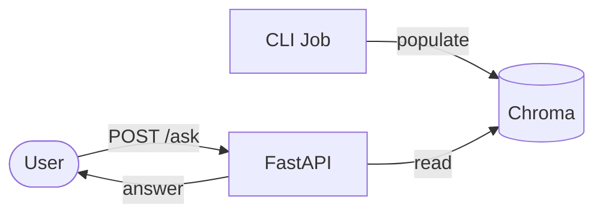
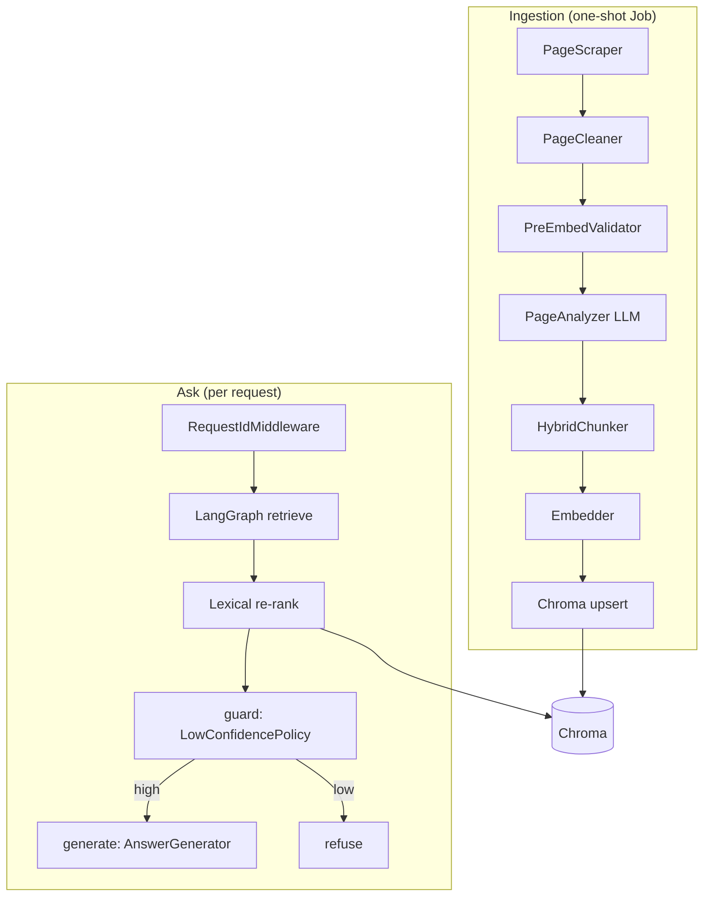
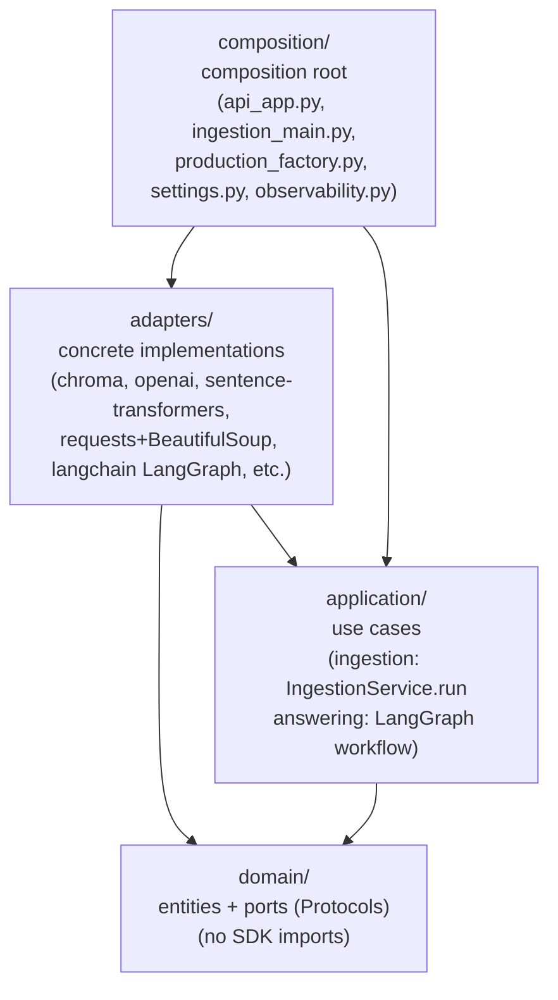
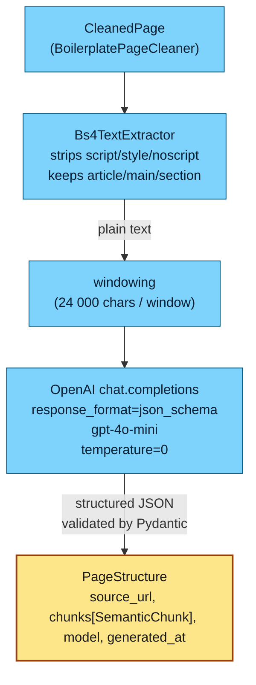
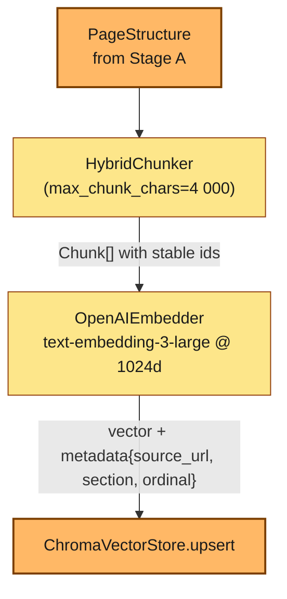
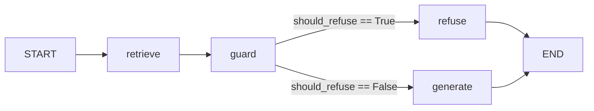
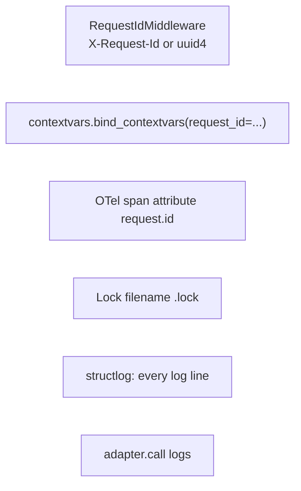

# `support-bot` — Architecture & Codebase Walkthrough

> **Audience:** a developer with no prior knowledge of this repository.
> **Goal:** after reading this document you understand the design, can
> navigate the source tree, and can reason about how a question flows
> from `POST /ask` to a final answer.
>
> This document complements — it does not replace — the
> project-specific [AGENTS.md](https://github.com/bruj0/support-agent/blob/main/AGENTS.md) (cross-cutting rules),
> [CONTEXT.md](https://github.com/bruj0/support-agent/blob/main/CONTEXT.md) (glossary), and the per-work-package
> task files under `specs/001-customer-support-rag-agent/tasks/`.

---

## Table of contents

1. [What the system does](#1-what-the-system-does)
2. [The two flows at a glance](#2-the-two-flows-at-a-glance)
3. [Layered architecture (hexagonal)](#3-layered-architecture-hexagonal)
4. [Layer rules and the dependency direction](#4-layer-rules-and-the-dependency-direction)
5. [The domain layer](#5-the-domain-layer)
   - [5.1 Entities](#51-entities)
   - [5.2 Ports](#52-ports)
6. [The application layer](#6-the-application-layer)
   - [6.1 Ingestion use case](#61-ingestion-use-case)
   - [6.2 Answering workflow (LangGraph)](#62-answering-workflow-langgraph)
7. [The adapter layer](#7-the-adapter-layer)
8. [The composition root](#8-the-composition-root)
9. [Observability: one request_id across all layers](#9-observability-one-request_id-across-all-layers)
10. [Security: secret scrubbing](#10-security-secret-scrubbing)
11. [Configuration](#11-configuration)
12. [Local development end-to-end](#12-local-development-end-to-end)
13. [Walkthroughs — tracing a request from end to end](#13-walkthroughs-tracing-a-request-from-end-to-end)
   - [13.1 Walkthrough: `POST /ask`](#131-walkthrough-post-ask)
   - [13.2 Walkthrough: ingestion Job](#132-walkthrough-ingestion-job)
14. [Glossary](#14-glossary)

---

## 1. What the system does

`support-bot` is a small **RAG (Retrieval-Augmented Generation) agent**.
It answers customer-support questions in **Dutch** about a single web
page (e.g. `https://www.ziggo.nl/internet`).

There are exactly two runtime flows:

| Flow | When | What it does |
|---|---|---|
| **Ingestion** | Once per source page (or whenever the page changes) | Fetches the page, cleans it, analyzes it with an LLM into semantic regions, chunks it, embeds the chunks, and stores them in Chroma. |
| **Ask** | Every time a user calls `POST /ask` | Embeds the user's question, retrieves the most relevant chunks from Chroma, applies a lexical re-ranker, asks an LLM to answer *only* from those chunks, and returns the answer plus a confidence flag. |

The product is a single FastAPI service plus a one-shot CLI "Job"
container that runs ingestion. Both share the same code (the same
`support_bot` package) — only the entry point differs.



---

## 2. The two flows at a glance

The repository ships a full Mermaid diagram of the local
flow at [docs/architecture/local-flow.md](../architecture/local-flow.md)
and the AWS production topology at
[docs/architecture/aws-flow.md](../architecture/aws-flow.md).
A simplified, post-WP06 view:



The **ingestion flow** builds the corpus. The **ask flow** reads from
it. Both flows emit OpenTelemetry spans and `structlog` JSON logs
under a single `request_id`.

---

## 3. Layered architecture (hexagonal)

The repository follows **hexagonal / ports-and-adapters** layering
(AGENTS.md §1.1). There are four layers, and dependencies point
**strictly inward** — outer layers may import inner ones, never the
reverse:



What lives where:

| Layer | Path | Role | May import | Must NOT import |
|---|---|---|---|---|
| **domain** | `src/support_bot/domain/` | Business nouns (`Chunk`, `AgentState`, `Answer`), and the `Port` Protocols (`Retriever`, `Embedder`, `VectorStore`, etc.). Pure stdlib + Pydantic v2. | stdlib, Pydantic | `langchain`, `langgraph`, `chromadb`, `fastapi`, `requests`, `httpx`, `pydantic-settings`, `structlog`, `opentelemetry` |
| **application** | `src/support_bot/application/` | Use cases (`IngestionService.run`, the LangGraph workflow). Orchestrates ports. | domain | SDKs (`langchain`, `chromadb`, ...), `pydantic-settings` |
| **adapters** | `src/support_bot/adapters/` | Concrete implementations of the ports: HTTP fetcher, OpenAI answerer, Chroma vector store, sentence-transformers embedder, LangGraph nodes, lexical reranker. | domain, application, SDKs | `composition` |
| **composition** | `src/support_bot/composition/` | The single place that wires adapters to ports and builds the FastAPI app / CLI Job. Imports `pydantic-settings`. | all layers | — |

`import-linter` enforces these rules in CI; see
`tests/architecture/test_imports.py`.

---

## 4. Layer rules and the dependency direction

If you change anything in `domain/`, you cannot accidentally pull in
an SDK — the linter will fail the build. This is the architectural
invariant that lets us swap any adapter (e.g. swap Chroma for a
different vector store) without rewriting use cases.

A short example — `Retriever` is a domain Protocol:

```python
# src/support_bot/domain/answering/ports.py
@runtime_checkable
class Retriever(Protocol):
    """Fetch `RetrievedChunk`s for a question."""

    def retrieve(self, question: str, k: int = 4) -> list[RetrievedChunk]:
        """Fetch top-`k` chunks for `question`."""
        ...
```

The implementation lives in `adapters/`:

```python
# src/support_bot/adapters/vectorstore_chroma.py
class ChromaRetriever:
    """``Retriever`` adapter backed by a ``ChromaVectorStore`` + injected ``Embedder``."""

    def __init__(self, *, vectorstore: ChromaVectorStore, embedder: Any) -> None:
        self.vectorstore = vectorstore
        self.embedder = embedder

    def retrieve(self, query: str, k: int = 4) -> list[RetrievedChunk]:
        vectors = self.embedder.embed([query])
        if not vectors:
            return []
        return self.vectorstore.query(vectors[0], k=k)
```

The application layer depends on the **Protocol**, not on
`ChromaRetriever`:

```python
# src/support_bot/application/answering/graph.py
def retrieve_node(
    state: AgentState,
    *,
    retriever: Retriever,        # <-- domain Protocol
    tracer: Any = None,
) -> dict[str, Any]:
    ...
    chunks = retriever.retrieve(state.question, k=RETRIEVE_K)
```

Swapping the underlying store is a one-line change in
`composition/production_factory.py`; nothing in `application/` or
`domain/` needs to know.

---

## 5. The domain layer

### 5.1 Entities

Entities are **Pydantic v2 frozen models** (immutable). They live in
two packages — `domain/ingestion/` and `domain/answering/` — plus
`domain/shared/` for things consumed by both.

`domain/ingestion/entities.py`:

```python
class Chunk(BaseModel):
    """A piece of cleaned text ready for embedding."""
    model_config = ConfigDict(frozen=True)
    chunk_id: str = Field(min_length=40, max_length=40)
    source_url: str = Field(min_length=1)
    ordinal: int = Field(ge=0)
    text: str = Field(min_length=1)
    embedding: list[float] | None = None  # set by Embedder, not domain
    section: str | None = None
```

The `chunk_id` is **stable**: it is
`sha1(source_url + ":" + ordinal)[:40]`. Re-ingesting the same page
yields the same chunk ids, so Chroma upserts are **idempotent** (FR-012).
The application layer's `IngestionService` relies on this; so does the
test suite.

WP06 added two new entities — `SemanticChunk` and `PageStructure` —
that capture the **LLM-analyzed semantic regions** of a page:

```python
ContentKind = Literal["faq", "section", "list", "paragraph", "table", "other"]

class SemanticChunk(BaseModel):
    model_config = ConfigDict(frozen=True)
    kind: ContentKind
    title: str = Field(min_length=1)
    text: str = Field(min_length=1)
    anchor: str | None = None

class PageStructure(BaseModel):
    model_config = ConfigDict(frozen=True)
    source_url: str
    chunks: list[SemanticChunk]
    model: str = Field(min_length=1)
    generated_at: str
```

`domain/shared/retrieval.py` defines `RetrievedChunk`, which adds
`similarity: float` (clamped to `[0.0, 1.0]`) to the fields the
retriever needs to expose to the LangGraph workflow.

### 5.2 Ports

A **port** is a `typing.Protocol` declaring the shape of a
dependency. The domain *owns* the port; adapters *implement* it.
Every port has a Google-style docstring stating intent, params,
return value, raised exceptions, and design rationale.

`domain/ingestion/ports.py` declares five ports:

```python
@runtime_checkable
class PageScraper(Protocol):
    """Fetch the SOURCE_URL and return a SourcePage.

    Raises SourcePageUnreachable on HTTP non-2xx / DNS / TCP failure.
    """
    def fetch(self, url: str) -> SourcePage: ...

@runtime_checkable
class PageCleaner(Protocol):
    def clean(self, html: str) -> CleanedPage: ...

@runtime_checkable
class Chunker(Protocol):
    def chunk(
        self, text: str, *, source_url: str,
        chunk_size: int = 500, overlap: int = 50,
        structure: PageStructure | None = None,   # WP06 — hybrid path
    ) -> list[Chunk]: ...

@runtime_checkable
class Embedder(Protocol):
    def embed(self, texts: list[str]) -> list[list[float]]: ...

@runtime_checkable
class VectorStore(Protocol):
    def upsert(self, chunks: list[Chunk]) -> None: ...
    def delete_by_source(self, source_url: str) -> None: ...
    def count(self) -> int: ...
    def query(self, embedding: list[float], k: int = 4) -> list[RetrievedChunk]: ...
```

WP06 added a sixth — `PageAnalyzer`:

```python
@runtime_checkable
class PageAnalyzer(Protocol):
    """Return a PageStructure for the cleaned page text.

    Used by the hybrid ingestion pipeline to drive semantic chunking
    instead of fixed-size windowing.
    """
    def analyze(
        self, *, source_url: str, text: str, request_id: str,
    ) -> PageStructure: ...
```

`domain/answering/ports.py` declares three ports the agent depends on:

```python
class Retriever(Protocol):       # already shown above
    ...

class LowConfidencePolicy(Protocol):
    """Decide whether the agent should refuse on these chunks."""
    def should_refuse(self, chunks: list[RetrievedChunk]) -> bool: ...
    def refusal_message(self) -> str: ...

class AnswerGenerator(Protocol):
    def generate(
        self, question: str, retrieved: list[RetrievedChunk],
    ) -> str: ...
```

The **refusal message is fixed** by the domain
(`"I cannot answer based on the available content."`) — adapters and
the test suite assert this constant.

Errors are typed and live in `domain/shared/errors.py` —
`DomainError` is the base; examples are `VectorStoreUnavailable`,
`LLMUnavailable`, `EmbedderUnavailable`, `SourcePageUnreachable`,
`SourcePageGarbage`, `ConfigurationError`. The error mapper in
`application/api/error_mapper.py` translates each to an HTTP status
(503 / 502 / 422 / 500).

---

## 6. The application layer

The application layer holds two use cases:

- `application/ingestion/ingestion_service.py` — `IngestionService.run(...)`
- `application/answering/graph.py` — the LangGraph workflow

Both are **pure orchestrators**: they take their dependencies
(scraper, cleaner, embedder, retriever, answerer, policy, ...) as
**constructor / kwarg arguments**. They never import from `adapters/`
or `composition/`. This makes them testable with hand-written fakes
(`tests/fakes/...`).

### 6.1 Ingestion use case

`IngestionService.run(source_url, *, request_id)` is the canonical
call. Its body is the linear pipeline:

```python
# src/support_bot/application/ingestion/ingestion_service.py
class IngestionService:
    def __init__(
        self,
        *,
        scraper: _Scraper,
        cleaner: _Cleaner,
        validator: _Validator,
        chunker: _Chunker,
        embedder: _Embedder,
        vectorstore: _VectorStore,
        lock: _Lock,
        analyzer: _Analyzer | None = None,    # WP06 — None skips the step
    ) -> None:
        ...

    def run(self, source_url: str, *, request_id: str) -> dict[str, Any]:
        # Acquire lock (TTL-keyed file at <LOCK_DIR>/<request_id>.lock)
        if not self._lock.try_acquire(request_id):
            return {"status": "skipped", "reason": "run_in_progress",
                    "request_id": request_id}
        try:
            with tracer.start_as_current_span("ingestion.run") as span:
                span.set_attribute("request.id", request_id)
                span.set_attribute("source.url", source_url)

                page = self._scraper.fetch(source_url)        # ingestion.fetch
                cleaned = self._cleaner.clean(page.raw_html)  # ingestion.clean
                self._validator.validate(cleaned)             # ingestion.validate
                if self._analyzer is not None:
                    structure = self._analyzer.analyze(       # ingestion.analyze
                        source_url=source_url,
                        text=cleaned.text,
                        request_id=request_id,
                    )
                else:
                    structure = None
                chunks = self._chunker.chunk(                 # ingestion.chunk
                    cleaned.text, source_url=source_url,
                    structure=structure,
                )
                vectors = self._embedder.embed([c.text for c in chunks])
                for c, v in zip(chunks, vectors):
                    c.embedding = v
                self._vectorstore.upsert(chunks)               # ingestion.upsert
                return {"status": "ok", "chunk_count": len(chunks),
                        "request_id": request_id}
        finally:
            self._lock.release(request_id)
```

Failure handling is **explicit**:

- Scraper 5xx → `SourcePageUnreachable` → propagated, **vectorstore never touched**.
- Cleaner returns empty text → `SourcePageGarbage` → propagated, vectorstore never touched.
- Lock held → returns `{"status": "skipped", "reason": "run_in_progress"}`.
- Lock is **always released** in `finally`, even on exceptions.

The `request_id` flows as an explicit keyword argument; the OTel span
sets `request.id` so every child span (and the SDK-instrumented FastAPI
/ httpx / chromadb spans) inherits it.

#### 6.1.1 The LLM-assisted analyzer + `HybridChunker` (WP06)

The pipeline above runs two chunking strategies via
`CHUNKER_BACKEND`. The legacy WP03 path (`fixed_size`) slices
the cleaned text every `chunk_size` characters with `overlap`
characters of overlap — that's a constant-size byte
chunker. The WP06 path (`hybrid`, the default) is qualitatively
different: an **LLM first reads the page** and emits a
structured `PageStructure` of semantic regions; the
`HybridChunker` then turns each region into one (or more)
`Chunk` objects. This sub-section is the deep-dive on the
hybrid path, since it's the one that actually runs in
production and the one the recent retrieval-quality work
depends on.

##### Pipeline order

The ingestion sub-pipeline splits cleanly into two stages.
Stage A turns a `CleanedPage` into a structured
`PageStructure` (an LLM call). Stage B turns that
`PageStructure` into persisted vectors in Chroma (pure
local code). Splitting the diagram this way keeps each
stage on its own line — easy to read, and the natural
fault boundary: if stage A fails the vector store is
never touched.

###### Stage A — analyse (LLM)



###### Stage B — chunk, embed, persist (local)



##### 1. `Bs4TextExtractor` — pre-processor, not the analyzer

```python
# src/support_bot/adapters/bs4_text_extractor.py
class Bs4TextExtractor:
    """Strip noise tags; keep the article/main/section content."""

    def __init__(self, *, min_text_length: int = 100) -> None: ...
    def extract(self, html: str) -> str: ...
```

By the WP06 design decision the analyzer is **LLM-only** —
bs4 is used **only** to strip `<script>`, `<style>`,
`<noscript>` and similar non-content nodes before the LLM
call. No heuristic FAQ/heading detection lives here; the
LLM does that. The minimum-text-length gate (default 100
chars) catches pages that collapsed to nothing after
extraction.

##### 2. `OpenAIPageAnalyzer` — structured extraction via JSON-schema

```python
# src/support_bot/adapters/llm_page_analyzer.py
class OpenAIPageAnalyzer:
    def __init__(
        self, *, model: str = "gpt-4o-mini",
        max_input_chars: int = 24_000,
        max_retries: int = 3,
    ) -> None: ...
    def analyze(self, *, source_url, text, request_id) -> PageStructure: ...
    def _call_with_retries(self, *, window, request_id) -> PageStructure: ...
```

How it works:

- **Windowing.** Long pages are split into
  `max_input_chars`-sized windows (default 24 000 chars ≈
  6 000 tokens, well inside `gpt-4o-mini`'s context). Each
  window is analyzed independently and the resulting
  `SemanticChunk` lists are concatenated into a single
  `PageStructure`.
- **Structured output.** The call sets
  `response_format={"type": "json_schema", "json_schema": …}`
  with the **strict** schema below; the SDK refuses any
  response that does not match. Pydantic re-validates after
  `json.loads` (defence in depth — the schema is also
  `PageStructure.model_validate`'d).
- **System prompt.** Locks down four rules: (1) never invent
  content; (2) for FAQ-style pages emit one `kind='faq'` entry
  per Q/A pair; (3) for non-FAQ pages emit `kind='section'`,
  `'list'`, `'paragraph'`, `'table'`, or `'other'` per
  region; (4) preserve the source language.
- **Retry policy.** `max_retries=3` attempts per window.
  `ValidationError` / `JSONDecodeError` / `KeyError` trigger
  one retry with a **stricter prompt** (`STRICT_RETRY_PROMPT`
  — "Reply with ONLY the JSON object. No prose, no markdown
  fences."); `openai.OpenAIError` (5xx / timeouts) trigger
  plain retries on the original prompt. After the third
  attempt `LLMUnavailable` is raised.
- **Observability.** Manual span `adapter.page_analyzer.analyze`
  with `request.id`, `analyzer.input_text_length`,
  `analyzer.window_count`, `analyzer.model`,
  `analyzer.region_count`, `analyzer.faq_count`,
  `analyzer.tokens_in`, `analyzer.tokens_out`. Logs use the
  standard `adapter.call.start` / `adapter.call.ok` shape
  with `text_hash` for any line that would echo source
  text (AGENTS.md §6.4 PII rule).

The strict JSON schema (hand-built; the SDK requires this
shape for `strict: True`):

```json
{
  "type": "object",
  "properties": {
    "source_url": {"type": "string"},
    "chunks": {
      "type": "array",
      "items": {
        "type": "object",
        "properties": {
          "kind": {"type": "string",
                   "enum": ["faq","section","list","paragraph","table","other"]},
          "title": {"type": "string", "minLength": 1},
          "text":  {"type": "string", "minLength": 1},
          "anchor": {"type": ["string", "null"]}
        },
        "required": ["kind", "title", "text", "anchor"],
        "additionalProperties": false
      }
    },
    "model": {"type": "string", "minLength": 1},
    "generated_at": {"type": "string"}
  },
  "required": ["source_url", "chunks", "model", "generated_at"],
  "additionalProperties": false
}
```

`anchor` is a free-form string the model may attach to a
chunk (e.g. a CSS selector / heading id) so a future WP can
link the answer back to the source HTML. It's optional in
practice but OpenAI's `strict: True` mode requires every
key in `required`, so it's listed and allowed to be
`null`.

##### 3. `HybridChunker` — one `Chunk` per `SemanticChunk`

```python
# src/support_bot/adapters/hybrid_chunker.py
class HybridChunker:
    def __init__(self, *, max_chunk_chars: int = 4_000) -> None: ...
    def chunk(
        self, text: str, *,
        source_url: str,
        chunk_size: int = 500,   # ignored — analyzer decides size
        overlap: int = 50,       # ignored
        structure: PageStructure | None = None,
    ) -> list[Chunk]: ...
    def _split_oversized(self, text: str) -> list[str]: ...
```

How it works:

- **Per-region chunking.** Walks `PageStructure.chunks`
  (a `list[SemanticChunk]`) and emits **one `Chunk` per
  region**. For `kind='faq'` regions the question (`title`)
  is prepended to the chunk text so retrieval matches the
  Q/A pair as a unit; the title is **also** stored in
  `Chunk.section` so the lexical re-ranker (or a future
  Chroma metadata filter) can prefer FAQ headings by exact
  match.
- **Oversized-region split.** Sections whose joined
  `title + body` exceed `max_chunk_chars` (default 4 000)
  are split **on sentence boundaries** (`[.!?]\s+`). Every
  resulting piece still carries the section title in
  `Chunk.section`, so a single long answer still re-ranks
  correctly against its question. A single sentence longer
  than the cap is emitted as one oversized chunk rather
  than split mid-sentence — readability for the downstream
  answerer beats mechanical balance.
- **Idempotent ids.** `chunk_id = sha1(source_url + ":" +
  ordinal)[:40]` with `ordinal` 0-based and monotonic
  across the full chunk list. Re-running the chunker
  against the same `PageStructure` (or re-ingesting an
  unchanged source) produces identical ids, so
  `ChromaVectorStore.upsert` overwrites in place — no
  duplicate chunks, no orphaned vectors.
- **Loud contract.** `HybridChunker.chunk(structure=None)`
  raises `ConfigurationError` ("HybridChunker requires a
  PageStructure; use FixedSizeChunker for the
  no-analyzer path."). Forgetting to wire the analyzer is
  a programming error and the chunker refuses to silently
  fall back.

##### 4. Why two paths (`fixed_size` vs `hybrid`)

| Path | When | Trade-off |
|---|---|---|
| `CHUNKER_BACKEND=hybrid` (default) | Production. Use when the page has obvious semantic structure (headings, FAQ lists, sections). | One LLM call per window (~1-3 windows on the Ziggo page, ~$0.001 total at `gpt-4o-mini` pricing). Chunks respect the page's logical regions, so retrieval precision is dramatically better — the lexical re-ranker + region-aware metadata makes Dutch verb-form variants resolve correctly. |
| `CHUNKER_BACKEND=fixed_size` | Dev, tests, fall-back when the analyzer is unavailable. WP03's original behaviour. | Zero LLM cost. Chunks are character-count slices that ignore page structure — fine for unit tests, poor for end-user answer quality on real help pages. |

The selector is a one-line change at the composition root
(`composition/ingestion_main.py`):

```python
chunker = HybridChunker() if settings.chunker_backend == "hybrid" else FixedSizeChunker()
```

##### 5. End-to-end trace of one window, on one call

For the Ziggo `https://www.ziggo.nl/internet` page:

1. `Bs4TextExtractor` strips `<script>` / `<style>` /
   `<noscript>` from the cleaned HTML → ~30 000 chars of
   plain Dutch text.
2. `OpenAIPageAnalyzer` windows this into two
   24 000-char chunks. For each window it issues
   `chat.completions.create(..., response_format=json_schema,
   temperature=0)` and parses a `PageStructure`.
3. The merged `PageStructure` for the Ziggo page has
   ~17 `SemanticChunk` entries: a mix of `kind='section'`
   (heading + body), `kind='faq'` (Q/A pairs like
   *"Hoe installeer ik Ziggo Internet?"* /
   *"Download de Ziggo-app en volg de stappen."*), and
   `kind='list'` (bullet enumerations).
4. `HybridChunker.chunk(...)` walks the 17 regions; for FAQ
   regions it prepends the question, splits anything over
   4 000 chars on sentence boundaries, and emits ~17 chunks
   with stable ids.
5. `OpenAIEmbedder.embed([c.text for c in chunks])` returns
   17 vectors at 1024 dimensions (Matryoshka truncation of
   `text-embedding-3-large`).
6. `ChromaVectorStore.upsert(chunks)` writes
   `text + vector + metadata{source_url, section, ordinal}`
   to the collection. Re-running ingestion tomorrow overwrites
   the same ids — no duplicates.

##### Failure injection matrix (WP06 path)

| Failure | Step | Outcome |
|---|---|---|
| LLM returns malformed JSON | analyzer, attempt 1 | Retry with `STRICT_RETRY_PROMPT`. If still invalid after attempt 3, raise `LLMUnavailable`. |
| OpenAI 5xx / timeout | analyzer, attempt 1..3 | Retry on the original prompt up to `max_retries=3`. After that, `LLMUnavailable`. |
| `PageStructure.source_url` mismatches the chunker's `source_url` | `HybridChunker.chunk` | `ConfigurationError` (programming error, not a data error). |
| `PageStructure.chunks` is empty | `HybridChunker.chunk` | Returns `[]`; `IngestionService.run` returns `{"status": "ok", "chunk_count": 0}`. |
| Section longer than 4 000 chars | `HybridChunker._split_oversized` | Split on sentence boundaries; emit multiple chunks, each carrying the same `section` title. |
| Single sentence longer than 4 000 chars | `HybridChunker._split_oversized` | Emitted as one oversized chunk (readability beats balance). |

### 6.2 Answering workflow (LangGraph)

The agent is a LangGraph `StateGraph` with **four nodes** and **one
conditional edge**:



`AgentState` is a Pydantic frozen model (not a TypedDict, per
AGENTS.md §1.5):

```python
# src/support_bot/domain/answering/entities.py
class AgentState(BaseModel):
    model_config = ConfigDict(frozen=True)
    request_id: str
    question: str
    retrieved_chunks: list[RetrievedChunk] = Field(default_factory=list)
    answer_text: str = ""
    confidence: Confidence = "low"      # Literal["high","low"]
    trace: list[str] = Field(default_factory=list)
```

Each node is a `Callable[[AgentState], dict]` returning a partial
state update. Nodes **never import `langchain`, `langgraph`, or
`chromadb`** (AGENTS.md §1.5) — they only touch ports.

`retrieve_node`:

```python
# src/support_bot/application/answering/graph.py
def retrieve_node(state: AgentState, *, retriever: Retriever,
                  tracer: Any = None) -> dict[str, Any]:
    ...
    chunks = retriever.retrieve(state.question, k=RETRIEVE_K)
    top1 = chunks[0].similarity if chunks else 0.0
    span.set_attribute("retrieval.candidate_count", len(chunks))
    span.set_attribute("retrieval.top1_similarity", top1)
    return {"retrieved_chunks": chunks,
            "trace": state.trace + ["retrieve"]}
```

`guard_node` is a **pure pass-through** that records the visit. The
actual decision is made by the **conditional edge**:

```python
def _guard_edge(state: AgentState, *, policy: LowConfidencePolicy) -> str:
    with tracer.start_as_current_span("node.guard_edge") as span:
        span.set_attribute("request.id", state.request_id)
        if policy.should_refuse(state.retrieved_chunks):
            span.set_attribute("decision.path", "refuse")
            return "refuse"
        span.set_attribute("decision.path", "generate")
        return "generate"
```

`generate_node` and `refuse_node` build the final state. The graph is
compiled by `build_graph(...)` in `application/answering/graph.py` and
invoked by `application/answering/answering_service.py`:

```python
# src/support_bot/application/answering/answering_service.py
class AnsweringService:
    def __init__(self, *, graph, retriever, policy, generator, tracer):
        ...

    def answer(self, question: Question, *, request_id: str) -> Answer:
        initial = AgentState(request_id=request_id, question=question.text, ...)
        final = self._graph.invoke(initial)        # LangGraph tick
        return Answer(
            text=final.answer_text,
            confidence=final.confidence,
            trace=tuple(final.trace),
            request_id=final.request_id,
            top_similarity=final.retrieved_chunks[0].similarity
                          if final.retrieved_chunks else 0.0,
        )
```

---

## 7. The adapter layer

Each adapter is a concrete class implementing one or more domain
ports. They are the only place where external SDKs are imported.

Selected adapters:

| Port | Adapter(s) | File |
|---|---|---|
| `PageScraper` | `RequestsPageScraper` | `adapters/http_source.py` |
| `PageCleaner` | `BoilerplatePageCleaner` | `adapters/cleaner.py` |
| `Chunker` | `FixedSizeChunker` (legacy), `HybridChunker` (WP06) | `adapters/chunker.py`, `adapters/hybrid_chunker.py` |
| `PageAnalyzer` | `OpenAIPageAnalyzer` (WP06) | `adapters/llm_page_analyzer.py` |
| `Embedder` | `SentenceTransformersEmbedder`, `OpenAIEmbedder` | `adapters/embedding_local.py`, `adapters/embedding_openai.py` |
| `VectorStore` | `ChromaVectorStore` | `adapters/vectorstore_chroma.py` |
| `Retriever` | `ChromaRetriever` + `LexicalRerankRetriever` | `adapters/vectorstore_chroma.py`, `adapters/lexical_rerank_retriever.py` |
| `LowConfidencePolicy` | `ThresholdLowConfidencePolicy` | `adapters/low_confidence_policy.py` |
| `AnswerGenerator` | `OPENAIAnswerGenerator` | `adapters/answerer_openai.py` |

The lexical reranker is a thin wrapper that **re-orders** a wider
candidate set returned by the vector store:

```python
# src/support_bot/adapters/lexical_rerank_retriever.py (abridged)
class LexicalRerankRetriever:
    def __init__(self, *, inner, alpha=0.5, candidate_k_multiplier=5):
        ...

    def retrieve(self, question: str, k: int = 4) -> list[RetrievedChunk]:
        fetch_k = max(k * self.candidate_k_multiplier, 20)
        candidates = self.inner.retrieve(question=question, k=fetch_k)
        ...
        qtoks = _tokenize(question)
        scored = [
            (c, self.alpha * c.similarity + (1 - self.alpha) *
                  _lexical_overlap(qtoks, c.text))
            for c in candidates
        ]
        scored.sort(key=lambda t: t[1], reverse=True)
        ...
```

Why is this needed? When the local embedder (`all-MiniLM-L6-v2` /
`intfloat/multilingual-e5-large`) is weak on Dutch verb-form
variants, a question like *"Hoe kan ik mijn Ziggo internet
instellen?"* can be vector-similar to *"Is Internet van Ziggo
beschikbaar op mijn adres?"* (false friend) while missing the
semantically correct *"Hoe installeer ik Ziggo Internet?"*. The
reranker blends cosine similarity with a token-overlap score
(using a 4-character stem-prefix to bridge morphology) and reliably
promotes the right chunk to top-1.

---

## 8. The composition root

`composition/` is the **only** layer that knows about concrete
adapters. Three small files:

| File | Role |
|---|---|
| `composition/settings.py` | `pydantic-settings.BaseSettings`. Reads env vars + `.env`. The only place that imports `pydantic-settings`. |
| `composition/production_factory.py` | Functions like `select_embedder`, `select_retriever`, `select_vectorstore`, `select_answer_generator` that return **adapter instances**. |
| `composition/api_app.py` | `create_app(...)` — builds the FastAPI app: registers middleware (in the correct order), includes the API router, wires `RequestIdMiddleware` first. |
| `composition/__main__.py` | `python -m support_bot.composition` — runs uvicorn on the production app. |
| `composition/ingestion_main.py` | CLI entry point for the ingestion Job (`--source-url`, `--chroma-host`, `--chroma-port`, `--embedder-backend`, ...). |
| `composition/observability.py` | `init_tracing(...)` — OpenTelemetry SDK + auto-instrumentation for FastAPI / httpx / logging / chromadb. |

`create_app` is the most important entry point:

```python
# src/support_bot/composition/api_app.py
def create_app(
    *,
    settings: Settings | None = None,
    answering_service_factory: Callable[[], AnsweringService] | None = None,
) -> FastAPI:
    settings = settings or Settings()
    app = FastAPI(title="support-bot", version="0.1.0")

    # Middleware order matters: the LAST added runs FIRST.
    # RequestIdMiddleware must be FIRST (outermost).
    app.add_middleware(PrometheusMetricsMiddleware, recorder=...)
    app.add_middleware(RequestIdMiddleware)
    app.add_middleware(ErrorResponseMapperMiddleware)
    app.include_router(build_api_router(answering_service_factory))

    @app.on_event("shutdown")
    def _shutdown_tracing() -> None: ...
    return app
```

Production wiring is one line:

```python
# src/support_bot/composition/__main__.py
def main() -> None:
    import uvicorn
    app = build_production_app()
    uvicorn.run(app, host=os.environ.get("HOST", "0.0.0.0"),
                port=int(os.environ.get("PORT", "8000")), log_config=None)
```

---

## 9. Observability: one request_id across all layers

A `support-bot` invariant (AGENTS.md §6.3): **a single `request_id`
propagates through every layer that touches a request.**



Concrete example — the FastAPI middleware:

```python
# src/support_bot/application/api/middleware.py
class RequestIdMiddleware(BaseHTTPMiddleware):
    async def dispatch(self, request, call_next):
        rid = request.headers.get("X-Request-Id") or uuid4().hex
        bind_contextvars(request_id=rid)            # structlog
        trace.get_current_span().set_attribute("request.id", rid)  # OTel
        try:
            response = await call_next(request)
        finally:
            clear_contextvars()
        response.headers["X-Request-Id"] = rid      # echo on response
        return response
```

The same id is:

1. The lock filename in the ingestion Job (`<LOCK_DIR>/<request_id>.lock`).
2. The `request_id` kwarg passed into `IngestionService.run(...)` and `AnsweringService.answer(...)`.
3. Every OTel span attribute (`request.id`).
4. Every `structlog` log line in the request scope.
5. Every metric exemplar (where Prometheus supports it).

No layer may re-generate a new ID; downstream IDs (e.g. Chroma's
internal request id) are logged under a different field name.

OpenTelemetry is initialised in `composition/observability.py`:

```python
# src/support_bot/composition/observability.py
def init_tracing(*, service_name, namespace, environment, version,
                 otlp_endpoint="", sampler="parentbased_traceidratio",
                 sampler_arg=1.0) -> None:
    resource = Resource.create({
        "service.name": service_name,
        "service.namespace": namespace,
        "deployment.environment": environment,
        "service.version": version,
    })
    provider = TracerProvider(resource=resource, sampler=...)
    if otlp_endpoint:
        provider.add_span_processor(BatchSpanProcessor(
            OTLPSpanExporter(endpoint=f"{otlp_endpoint}/v1/traces")))
    trace.set_tracer_provider(provider)
    # Auto-instrumentation
    FastAPIInstrumentor().instrument()
    HTTPXClientInstrumentor().instrument()
    LoggingInstrumentor().instrument(set_logging_format=False)
    # chromadb auto-instrumentation if installed
```

If no `OTEL_EXPORTER_OTLP_ENDPOINT` is set, spans are still created and
attached to logs but **not exported** — the dev default.

Every non-trivial branch emits a DEBUG-level `structlog` line with
enough context to reproduce it (AGENTS.md §6.5). The mandatory
processors are `merge_contextvars` → `add_log_level` →
`TimeStamper(iso, utc)` → `SecretScrubber()` → `JSONRenderer()`.

---

## 10. Security: secret scrubbing

`adapters/secret_scrubber.py` is the **single** secret-stripping
utility. It runs as:

1. A **structlog processor** on every log line.
2. A step inside `ErrorResponseMapper` on every error response body.
3. An OTel span attribute filter.

Regex set:

```python
_PATTERNS = [
    re.compile(r"sk-[A-Za-z0-9]{32,}"),          # OpenAI
    re.compile(r"sk-ant-[A-Za-z0-9-]{32,}"),      # Anthropic
]
_SUBSTRINGS = ("OPENAI_API_KEY", "EMBEDDING_API_KEY", "CHROMA_URL")
```

Replacement is the literal `"[REDACTED]"`. CI runs a `helm template |
! grep sk-...` secret-scan; the test suite asserts no log line or
response body ever contains a secret-shaped substring.

Helm templates **never** ship a real key: `value:` is empty by
default. Operators supply keys at install time (Kubernetes Secret or
external Secrets Manager).

---

## 11. Configuration

`composition/settings.py` is the only file that reads env vars.
Required keys (from AGENTS.md §9):

```python
class Settings(BaseSettings):
    # Ingestion
    source_url: str = ""
    lock_dir: str = "/var/run/support-bot"
    request_id: str = ""

    # Vector store
    chroma_host: str = "localhost"
    chroma_port: int = 8000

    # Provider selection
    embedder_backend: Literal["local", "openai", "fake"] = "local"
    embedding_model_name: str = "intfloat/multilingual-e5-large"
    answerer_backend: Literal["openai", "fake"] = "fake"

    # WP06 — semantic analyzer + chunker backends
    analyzer_backend: Literal["openai", "none"] = "openai"
    chunker_backend: Literal["fixed_size", "hybrid"] = "hybrid"
    openai_page_analyzer_model: str = "gpt-4o-mini"

    # Logging
    log_level: str = "INFO"

    # OpenTelemetry
    otel_exporter_otlp_endpoint: str = ""
    otel_service_namespace: str = "support-bot"
    otel_deployment_environment: str = "dev"
    otel_traces_sampler: str = "parentbased_traceidratio"
    otel_traces_sampler_arg: float = 1.0

    # Service identity
    service_name: str = "support-bot"
    service_version: str = "0.1.0"
```

Secrets (never in defaults):

```python
OPENAI_API_KEY      # required if answerer_backend=openai
EMBEDDING_API_KEY   # required if embedder_backend=openai
CHROMA_AUTH_TOKEN   # optional
```

---

## 12. Local development end-to-end

```bash
# 1. Set up
uv sync
cp .env.example .env  # then edit secrets

# 2. Boot the local stack
docker compose up -d --wait chroma api

# 3. Smoke
curl localhost:8080/healthz                  # {"status":"ok"}

# 4. Run ingestion
docker compose --profile ingest up ingestion

# 5. Ask a question
curl -sS -X POST http://localhost:8080/ask \
  -H 'Content-Type: application/json' \
  -H 'X-Request-Id: smoke-001' \
  -d '{"question":"Hoe kan ik mijn Ziggo internet instellen?"}' | jq .

# 6. Metrics
curl localhost:8080/metrics
```

For iterative development, run uvicorn and ingestion directly:

```bash
# Terminal A — Chroma
uv run --with chromadb==1.5.9 chroma run --host 127.0.0.1 --port 8000 \
  --path /tmp/chroma-data

# Terminal B — API
PORT=8080 CHROMA_HOST=127.0.0.1 CHROMA_PORT=8000 \
  OPENAI_API_KEY=sk-... ANSWERER_BACKEND=openai \
  EMBEDDER_BACKEND=local EMBEDDING_MODEL_NAME=intfloat/multilingual-e5-large \
  uv run python -m support_bot.composition

# Terminal C — ingestion (one-shot)
CHROMA_HOST=127.0.0.1 CHROMA_PORT=8000 LOCK_DIR=/tmp/support-bot-locks \
  ANALYZER_BACKEND=openai CHUNKER_BACKEND=hybrid \
  SOURCE_URL=https://www.ziggo.nl/internet \
  OPENAI_API_KEY=sk-... \
  uv run python -m support_bot.composition.ingestion_main
```

---

## 13. Walkthroughs — tracing a request from end to end

### 13.1 Walkthrough: `POST /ask`

A user POSTs a question to `/ask`. Here's every line of code that
runs, in order:

1. **uvicorn** receives the request on port 8080.

2. **`RequestIdMiddleware.dispatch`** runs first (outermost):

   ```python
   rid = request.headers.get("X-Request-Id") or uuid4().hex
   bind_contextvars(request_id=rid)
   trace.get_current_span().set_attribute("request.id", rid)
   ```

3. **`PrometheusMetricsMiddleware`** starts a timer and increments
   `request_count_total` later.

4. **`POST /ask` route handler** (in `application/api/routes.py`)
   parses the request body into a Pydantic `AskRequest`, then calls
   `answering_service.answer(question, request_id=rid)`.

5. **`AnsweringService.answer`** builds the initial `AgentState` and
   calls `graph.invoke(state)`.

6. **`retrieve_node`** runs:
   - `retriever.retrieve(state.question, k=4)` →
     `LexicalRerankRetriever.retrieve(...)`.
   - The reranker's inner retriever is `ChromaRetriever`, which:
     - calls `query_embedder.embed(["query: " + question])` (E5 prefix)
     - calls `ChromaVectorStore.query(embedding, k=20)`
     - returns the top-20 by cosine similarity
   - The reranker computes a blended score `0.5 * sim + 0.5 * lex` per
     chunk, sorts descending, returns the top-4.
   - OTel span `node.retrieve` gets attributes
     `retrieval.candidate_count=4`, `retrieval.top1_similarity=0.88`.

7. **`guard_node`** runs — pure pass-through, just records the
   visit.

8. **`_guard_edge`** runs:
   - `policy.should_refuse(chunks)` → `False` (top sim 0.88 > 0.5).
   - Span `node.guard_edge` gets `decision.path="generate"`.

9. **`generate_node`** runs:
   - `generator.generate(question, chunks)` →
     `OPENAIAnswerGenerator.generate(...)`.
   - Builds messages `[{system: "You are a support assistant..."},
     {user: question}]` with chunks injected into the system
     prompt as `Context:\n[1] <chunk1 text>\n[2] <chunk2 text>...`.
   - Calls OpenAI chat completions (`gpt-4o-mini`).
   - Returns the assistant message text.

10. **`generate_node`** returns a partial state update:
    `{"answer_text": "...", "confidence": "high",
    "trace": ["retrieve", "guard", "generate"]}`.

11. **LangGraph** routes the partial update on top of the existing
    state. **END** node reached. The compiled graph returns the
    final state.

12. **`AnsweringService`** builds the `Answer` value object:
    `Answer(text=..., confidence="high", top_similarity=0.88,
    trace=("retrieve","guard","generate"), request_id=rid)`.

13. **The route handler** maps it to an `AskResponse`:
    `{"answer": "...", "confidence": "high",
    "top_similarity": 0.88, "trace": [...], "request_id": "..."}`.

14. **`SecretScrubber`** runs on the response body (last mile safety).

15. **`PrometheusMetricsMiddleware`** records `request_count_total`
    and `request_latency_seconds`; on the way out the
    `RequestIdMiddleware` echoes `X-Request-Id` and clears
    contextvars.

A single `request_id` (`smoke-001`) is now visible in:

- The OTel trace (`request.id` attribute on every span).
- Every JSON log line emitted during the request.
- The HTTP response header.
- The Prometheus exemplar (where supported).

### 13.2 Walkthrough: ingestion Job

`python -m support_bot.composition.ingestion_main` runs once and
exits. Steps:

1. **CLI parsing** (`ingestion_main.py`): `--source-url`,
   `--chroma-host`, `--chroma-port`, `--lock-dir`, etc., falling
   back to env vars and `.env`.

2. **`init_tracing(...)`** — sets up OTel SDK.

3. **`build_service(args)`** selects each adapter by reading
   `Settings`:

   ```python
   settings = Settings(
       source_url=args.source_url,
       lock_dir=args.lock_dir,
       analyzer_backend=args.analyzer_backend,
       chunker_backend=args.chunker_backend,
       embedding_model_name="intfloat/multilingual-e5-large",
       ...
   )
   ```

   Then:

   ```python
   scraper = RequestsPageScraper()
   cleaner = BoilerplatePageCleaner()
   validator = PreEmbedValidator(min_length=200)
   analyzer = OpenAIPageAnalyzer() if settings.analyzer_backend == "openai" else None
   chunker = HybridChunker() if settings.chunker_backend == "hybrid" else FixedSizeChunker()
   embedder = SentenceTransformersEmbedder(
       model_name=settings.embedding_model_name,
       input_kind="passage",
   )
   vectorstore = ChromaVectorStore(host=..., port=..., collection_name="support_bot")
   lock = FileLockIngestionRunLock(lock_dir=settings.lock_dir)
   service = IngestionService(
       scraper=scraper, cleaner=cleaner, validator=validator,
       chunker=chunker, embedder=embedder, vectorstore=vectorstore,
       lock=lock, analyzer=analyzer,
   )
   ```

4. **`service.run(source_url, request_id=...)`** — see §6.1 for the
   pipeline.

5. The Job exits with status 0 on success, non-zero on
   `SourcePageUnreachable` / `SourcePageGarbage` / `LLMUnavailable`.

---

## 14. Glossary

| Term | Meaning |
|---|---|
| **Port** | A `typing.Protocol` declaring the shape of a dependency. Lives in `domain/`. |
| **Adapter** | A concrete class implementing a port. Lives in `adapters/`. |
| **Composition root** | The single place that wires adapters to ports. Lives in `composition/`. |
| **AgentState** | The Pydantic frozen model that flows through the LangGraph workflow. |
| **request_id** | The single correlation ID propagated across every layer of a single request or ingestion run. |
| **Threshold** | The cosine-similarity minimum below which `LowConfidencePolicy.should_refuse` returns `True`. Default `0.5`. |
| **Refusal message** | The fixed string `"I cannot answer based on the available content."` returned when the agent refuses. |
| **Stable chunk id** | `sha1(source_url + ":" + ordinal)[:40]`. Re-ingestion is idempotent (same id → upsert). |
| **Span** | An OpenTelemetry trace unit. In this codebase: `ingestion.run`, `node.retrieve`, `adapter.embedder.embed`, etc. |
| **Refusal policy** | An object that decides "is the agent confident enough to answer?". Default: `ThresholdLowConfidencePolicy(threshold=0.5)`. |
| **Hybrid chunker** | WP06 chunker that consumes a `PageStructure` from the LLM analyzer. Emits one chunk per FAQ Q/A pair plus one chunk per other region. |
| **Lexical rerank retriever** | Wrapper that re-orders a wider top-N from the vector store by blending cosine similarity with a token-overlap score. |
| **E5 prefix** | The `"query: "` / `"passage: "` prefix required by `intfloat/multilingual-e5-*` models. Applied automatically by `SentenceTransformersEmbedder`. |
| **SecretScrubber** | Regex-based redaction utility that strips API keys from logs, OTel attributes, and response bodies. |
| **WP** | "Work package" — a scoped, code-reviewed unit of work tracked under `specs/001-customer-support-rag-agent/tasks/WP*.md`. |
| **FR / NFR** | "Functional requirement" / "Non-functional requirement" — IDs in `specs/001-customer-support-rag-agent/spec.md`. |
| **Misfit** | A failure mode catalogued in `decomposition.md` and addressed by a specific WP. E.g. M9 = "semantic chunking" → WP06. |
