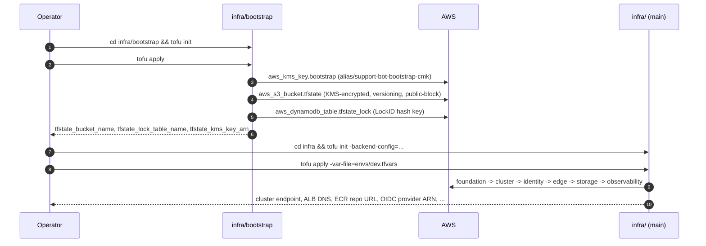
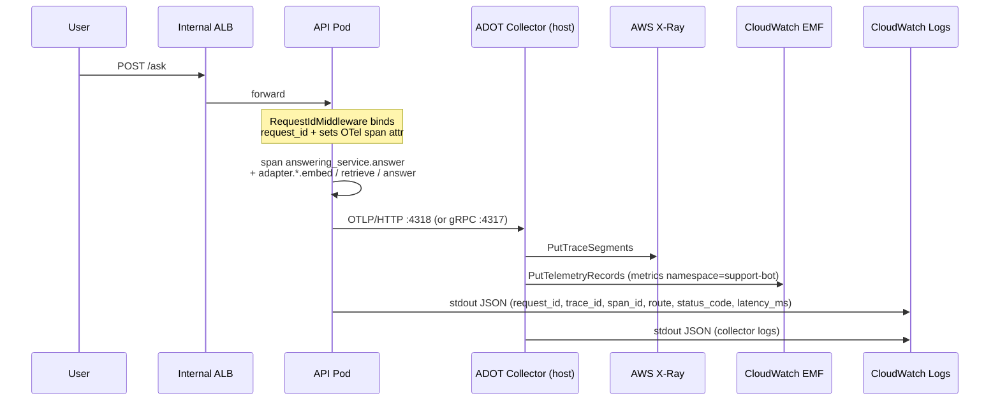
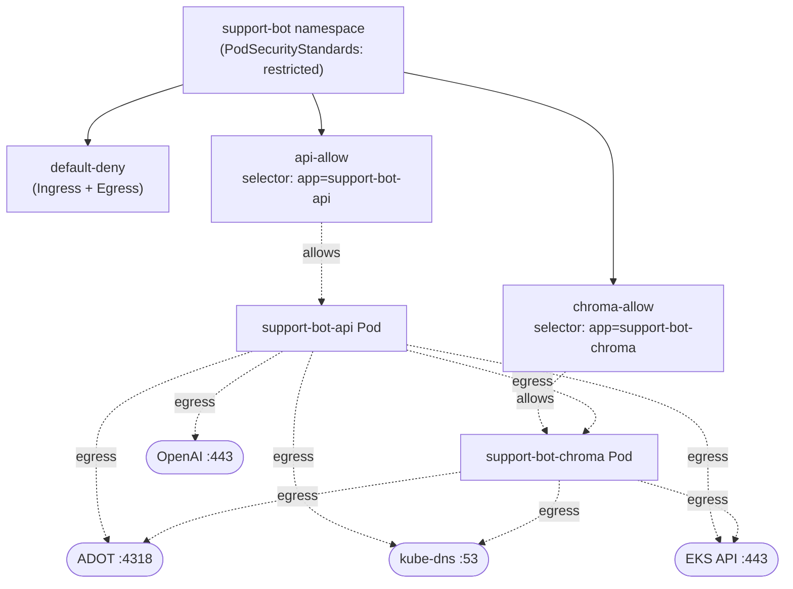

# AWS deployment (v2 — OpenTofu-managed)

> **Audience:** operators and reviewers of the `002-alternative-aws-infrastructure`
> feature. This document is the prose companion to the code under
> [`infra/`](https://github.com/bruj0/support-agent/tree/main/infra).
> It supersedes [`aws-flow.md`](aws-flow.md), which describes the
> pre-OpenTofu hand-rolled design.
>
> **Source of truth:** every claim below maps to a concrete resource in
> `infra/{bootstrap,modules,root.tf}`. When the code and this doc
> disagree, the code wins and this file is wrong — open a PR.

---

## Table of contents

- [1. What this feature provisions](#1-what-this-feature-provisions)
- [2. Workspace layout](#2-workspace-layout)
- [3. End-to-end topology](#3-end-to-end-topology)
- [4. The six subsystems](#4-the-six-subsystems)
  - [4.1 Foundation (`S1`)](#41-foundation-s1-inframodulesfoundation)
  - [4.2 Cluster & Compute (`S2`)](#42-cluster-compute-s2-inframodulescluster)
  - [4.3 Identity & Secrets (`S3`)](#43-identity-secrets-s3-inframodulesidentity)
  - [4.4 Edge & Traffic (`S4`)](#44-edge-traffic-s4-inframodulesedge)
  - [4.5 Data Plane & Storage (`S5`)](#45-data-plane-storage-s5-inframodulesstorage)
    - [4.5.1 DLM daily snapshot — how it works](#451-dlm-daily-snapshot-how-it-works)
  - [4.6 Observability & Policy (`S6`)](#46-observability-policy-s6-inframodulesobservability)
- [5. Bootstrap → main workspace](#5-bootstrap-main-workspace)
- [6. Apply / destroy lifecycle per environment](#6-apply-destroy-lifecycle-per-environment)
- [7. Secrets chain (end-to-end)](#7-secrets-chain-end-to-end)
- [8. Observability wiring (request_id → X-Ray + CloudWatch)](#8-observability-wiring-request_id-x-ray-cloudwatch)
- [9. Network policy posture](#9-network-policy-posture)
- [10. Why the chart is *not* installed by OpenTofu](#10-why-the-chart-is-not-installed-by-opentofu)
- [11. CI / secret-scan / lint](#11-ci-secret-scan-lint)
- [12. Operator playbook](#12-operator-playbook)

---

## 1. What this feature provisions

Two independent EKS clusters (`support-bot-dev`, `support-bot-prod`)
in `eu-central-1`, each with:

- a dedicated VPC (10.0.0.0/16 by default, 3 AZs, single NAT gateway
  in dev),
- the per-env bootstrap remote-state backend (S3 + DynamoDB lock +
  per-env CMK),
- EKS 1.30 with the **Pod Identity Agent** addon, VPC CNI
  (`enableNetworkPolicy = true`), and a baseline managed node group
  (`m7i.large × 2`, AL2023, On-Demand),
- Karpenter v1 (`oci://public.ecr.aws/karpenter/karpenter`, version
  pinned in tfvars) — absorbed by HPA scale-out,
- per-env KMS CMK, Secrets Manager secrets for `openai-api-key` and
  (optional) `chroma-auth-token`,
- External Secrets Operator, ADOT Collector, and AWS Load Balancer
  Controller IAM roles with Pod Identity associations,
- an ACM certificate (DNS-validated, wildcard SAN
  `*.{env}.{domain_suffix}`), a WAFv2 web ACL with AWS managed rule
  groups + 1000 req/IP rate limit, an internal ALB, an ALB Ingress,
- an S3 bucket for ALB access logs (KMS-encrypted, 30-day expiry →
  STANDARD_IA at day 7),
- an ECR repository (KMS-encrypted, immutable tags, scan-on-push)
  with a push policy scoped to the GitHub Actions OIDC role,
- a DLM daily snapshot policy for the Chroma PVC (7-day retention,
  target tags `Cluster=support-bot-{env}` / `Component=chroma`),
- the ADOT Collector (DaemonSet, `hostNetwork`, OTel gRPC `:4317` and
  HTTP `:4318`) exporting traces to **AWS X-Ray** and metrics to
  **CloudWatch EMF**,
- Pod Security Standards `restricted` on the `support-bot` namespace,
  and three `NetworkPolicy` resources (`default-deny`, `api-allow`,
  `chroma-allow`).

It does **not** install the Helm chart, run GitHub Actions workflows,
or set up Argo CD / Flux — those are downstream CI/CD features.

---

## 2. Workspace layout

```
infra/
├── bootstrap/                 # one-shot: S3 state backend + DynamoDB lock + KMS CMK
├── modules/
│   ├── foundation/            # S1 — VPC, subnets, NAT, VPC endpoints
│   ├── cluster/               # S2 — EKS, baseline MNG, Pod Identity Agent, Karpenter
│   ├── identity/              # S3 — per-env CMK, Secrets Manager, ESO/ADOT/LBC/GH IAM roles
│   ├── edge/                  # S4 — ACM, Route53, WAFv2, ALBC helm, Ingress
│   ├── storage/               # S5 — gp3 StorageClass, ECR, DLM
│   └── observability/         # S6 — ADOT helm, CloudWatch log groups, PSS, NetworkPolicies
├── envs/
│   ├── dev.tfvars
│   └── prod.tfvars
├── root.tf                    # orchestration: which env -> which modules, in which order
├── root_variables.tf          # all knobs (with defaults where safe)
├── root_outputs.tf
├── versions.tf
└── README.md                  # operator how-to (bootstrap, init, apply, destroy, troubleshoot)
```

The composition is wired in `root.tf`. Per-env knobs live in
`envs/{env}.tfvars`; the secrets `openai_api_key` and
`chroma_auth_token` are passed at apply time via `TF_VAR_*` env vars
(NFR-003), never stored in tfvars.

---

## 3. End-to-end topology

```mermaid
flowchart LR
    USER(["End user<br/>HTTPS"])

    subgraph DNS["DNS"]
        R53["Route 53<br/>parent zone"]
    end

    subgraph EDGE["Edge (S4)"]
        ACM["ACM cert<br/>*.env.support-bot.example.com"]
        WAF["WAFv2 Web ACL<br/>Common + SQLi + BotControl<br/>+ RateLimit 1000/IP"]
        ALB["Internal ALB<br/>scheme: internal<br/>TLS13-1-2-2021-06"]
        ALBC["AWS Load Balancer<br/>Controller (kube-system)"]
        LOGS["S3 access-log bucket<br/>30d -> STANDARD_IA<br/>KMS-encrypted"]
    end

    subgraph VPC["VPC (S1)"]
        PUB["Public subnets<br/>(NAT)"]
        PRIV["Private subnets<br/>(EKS nodes)"]
        EP["VPC endpoints<br/>SecretsManager, STS,<br/>ECR api/dkr, Logs, Monitoring, S3 gw"]
    end

    subgraph EKS["EKS (S2)"]
        CTRL["Control plane"]
        API["API Deployment<br/>HPA 2-6"]
        ING["Ingestion Job<br/>(post-install hook)"]
        CHR["Chroma Deployment<br/>gp3 PVC"]
        PODID["Pod Identity Agent<br/>addon"]
        BASELINE["Baseline MNG<br/>2x m7i.large<br/>AL2023 On-Demand"]
        KARP["Karpenter v1<br/>NodePool burst"]
    end

    subgraph OBS["Observability (S6)"]
        ADOT["ADOT Collector<br/>DaemonSet hostNetwork<br/>OTLP 4317/4318"]
        XRAY["AWS X-Ray"]
        EMF["CloudWatch<br/>EMF metrics"]
        CWL["CloudWatch Logs<br/>/aws/eks/support-bot-&#123;env&#125;/&#123;application,otel&#125;"]
    end

    subgraph SEC["Identity (S3)"]
        CMK["Per-env CMK<br/>alias/support-bot-&#123;env&#125;-cmk"]
        SM["Secrets Manager<br/>openai-api-key<br/>chroma-auth-token"]
        ESO["External Secrets<br/>Operator (Workload Identity)"]
    end

    subgraph GHCI["CI"]
        GHOIDC["GitHub Actions<br/>OIDC role"]
        ECR["ECR<br/>support-bot-api-&#123;env&#125;<br/>immutable, KMS, scan-on-push"]
    end

    USER --> R53 --> ACM --> WAF --> ALB --> API
    ALBC -.manages.-> ALB
    ALB -.access logs.-> LOGS
    API -.HTTPS.-> OPENAI(["OpenAI<br/>api.openai.com"])
    API -.HTTPS.-> CHR
    ING -.HTTPS.-> SM
    ESO -.reads.-> SM
    ESO -.writes k8s Secret.-> API
    ING -.reads k8s Secret.-> API
    API --> ADOT --> XRAY
    ADOT --> EMF
    API -.stdout JSON.-> CWL
    ADOT -.stdout JSON.-> CWL
    GHOIDC -.assumes.-> CMK
    GHOIDC -.push.-> ECR
    ECR -.pull.-> API
    PRIV -.egress via NAT.-> OPENAI
    PRIV -.private.-> EP
```



Key properties visible in this diagram:

- **No public subnet for workloads.** EKS nodes live in private
  subnets; the ALB is `internal-scheme` and is reached via the
  Route53 → ACM → WAF → ALB path. Operators reach the EKS API via
  `endpoint_public_access = true` but only from `var.admin_cidr`.
- **No NAT egress for AWS service calls.** VPC endpoints cover
  Secrets Manager, STS, ECR (`api` and `dkr`), CloudWatch Logs, CloudWatch
  Monitoring, and S3 (gateway endpoint). NAT is only used for OpenAI
  and the ADOT → X-Ray fallback path.
- **One `request_id` end-to-end.** The application middleware sets it;
  ADOT forwards the trace to X-Ray; logs flow to CloudWatch Logs
  with the same `request_id` injected by `opentelemetry-instrumentation-logging`.

---

## 4. The six subsystems

### 4.1 Foundation (`S1`) — `infra/modules/foundation/`

Provisions:

| Resource | Notes |
|---|---|
| `aws_vpc.main` | `var.vpc_cidr` (default `10.0.0.0/16`); DNS support + hostnames enabled. |
| `aws_subnet.public[az_count]` | `/24` slice per AZ; `map_public_ip_on_launch = false`. |
| `aws_subnet.private[az_count]` | `/24` slice per AZ, offset 100 to keep public/private disjoint. |
| `aws_eip.nat[*]` + `aws_nat_gateway.main[*]` | `nat_gateway_count` (default 1) — dev runs single NAT for cost; prod overrides to 3 for AZ-isolated egress. |
| `aws_internet_gateway.main`, route tables + associations | Standard 3-tier routing. |
| `aws_security_group.vpc_endpoints` | Allow HTTPS (443) from `var.vpc_cidr`; egress open. |
| `aws_vpc_endpoint.interface[6]` | `secretsmanager`, `sts`, `ecr.api`, `ecr.dkr`, `logs`, `monitoring` — `private_dns_enabled = true`. |
| `aws_vpc_endpoint.s3` | Gateway endpoint on every private route table; free S3 egress. |

Outputs: `vpc_id`, `public_subnet_ids`, `private_subnet_ids`,
`vpc_endpoint_security_group_id`.

### 4.2 Cluster & Compute (`S2`) — `infra/modules/cluster/`

| Resource | Notes |
|---|---|
| `aws_eks_cluster.main` | Kubernetes **1.30**, `endpoint_public_access = true` restricted to `var.admin_cidr`, `endpoint_private_access = true`. Cluster log types: `api`, `audit`, `authenticator`. Secret encryption with the per-env CMK (`encryption_config { resources = ["secrets"] }`). |
| `aws_iam_openid_connect_provider.oidc` | Built from the cluster's OIDC issuer URL; trusted by all Pod Identity associations in `S3`. |
| `aws_eks_addon.pod_identity_agent` | Required for every IAM role created in `S3`; `addon_version` is the latest matching the cluster version. |
| `aws_eks_addon.vpc_cni` | Pinned with `configuration_values = { enableNetworkPolicy = "true" }` — required for the `NetworkPolicy` resources in `S6`. |
| `aws_eks_node_group.baseline` | `m7i.large × var.baseline_desired_size` (default 2), On-Demand, AL2023, 50 GiB root disk, tainted `workload=baseline:NO_SCHEDULE`, labelled `workload=baseline` and `karpenter.sh/discovery={cluster}`. |
| `helm_release.karpenter` | `oci://public.ecr.aws/karpenter/karpenter`, version `var.karpenter_version` (default `1.0.0`); SA annotated with `eks.amazonaws.com/role-arn = var.karpenter_iam_role_arn`. **Skipped under `test_mode = true`** (operator-credentialed applies set this to `false`). |
| Security groups | `cluster-sg` ↔ `nodes-sg` mutual `0–65535/tcp` ingress; nodes egress open. |

Two more IAM roles live here for convenience but are scoped to the
cluster lifecycle: `cluster-role` (EKS), `node-role` (EC2), and
`pod-identity-agent-role` (addon).

The `NodePool` and `EC2NodeClass` are **not** in this module — they
are applied with `kubectl apply -f` against the live cluster after
identity lands (see `infra/modules/cluster/CONTEXT.md`).

### 4.3 Identity & Secrets (`S3`) — `infra/modules/identity/`

Provisions in dependency order:

1. **`aws_kms_key.env_cmk`** — per-env CMK with
   `enable_key_rotation = true`. The key policy grants EKS envelope
   encryption **only** when the encryption context matches
   `cluster = support-bot-{env}`.
2. **`aws_secretsmanager_secret.openai`** (and optional `chroma`) —
   `kms_key_id = cmk.arn`, `recovery_window_in_days = 30`,
   `lifecycle.prevent_destroy = true` (NFR-003). Initial
   `secret_string` is taken from `TF_VAR_openai_api_key` /
   `TF_VAR_chroma_auth_token` at apply time.
3. **Pod-Identity IAM roles** (only created when
   `var.eks_oidc_provider_arn != null`):
   - `external-secrets-operator-{env}` — policy
     `secretsmanager:GetSecretValue` + `DescribeSecret` scoped to
     both secret ARNs, plus `kms:Decrypt` / `kms:DescribeKey` scoped
     to the per-env CMK.
   - `adot-collector-{env}` — `xray:PutTraceSegments`,
     `xray:PutTelemetryRecords`, and CloudWatch Logs writes scoped
     to `/aws/eks/support-bot-{env}/*`.
   - `aws-load-balancer-controller-{env}` — verbatim AWS-published
     ALBC policy with `Resource` lists narrowed to the per-env
     ACM / WAFv2 / ELBv2 ARN patterns.
   - `karpenter-controller-{env}` — placeholder today; the
     `cluster/main.tf` `helm_release.karpenter` uses the value
     passed in from `root.tf` (`module.cluster.karpenter_iam_role_arn`).
4. **GitHub Actions OIDC provider + role** —
   `token.actions.githubusercontent.com` trusted; role assumed by
   `repo:*/{domain_suffix}:ref:refs/heads/main`. The role ARN is
   passed into the storage module (`S5`) to scope the ECR push
   policy.

All Pod Identity assume-role policies use the
`aws:RequestTag/cluster = support-bot-{env}` condition so a stolen
token cannot be replayed against another cluster.

### 4.4 Edge & Traffic (`S4`) — `infra/modules/edge/`

| Resource | Notes |
|---|---|
| `aws_acm_certificate.env_cert` | DNS-validated, `<env>.<domain_suffix>` + wildcard SAN `*.<env>.<domain_suffix>`. `lifecycle.create_before_destroy = true`. |
| `aws_route53_record.env_cert_validation[*]` | One per `domain_validation_options`; TTL 60; `allow_overwrite = true`. |
| `aws_acm_certificate_validation.env_cert` | 10-min create timeout; fails the apply if validation doesn't complete. |
| `aws_wafv2_web_acl.env_waf` | REGIONAL, attached to the ALB. **Four rules, in priority order:** (1) `AWSManagedRulesCommonRuleSet` (override `none`), (2) `AWSManagedRulesSQLiRuleSet`, (3) `AWSManagedRulesBotControlRuleSet`, (4) `RateLimitPerIp` — `block`, `limit = 1000`, `aggregate_key_type = IP`. All rules have CloudWatch metrics + sampled requests enabled. |
| `aws_s3_bucket.alb_access_logs` | `force_destroy = false`, `lifecycle.prevent_destroy = true`. Bucket-owner-enforced ACL, all four public-access blocks, KMS-encrypted (`bucket_key_enabled = true`), 30-day expiry → STANDARD_IA at day 7, noncurrent versions expire after 30d, incomplete multipart aborts at 7d. Policy grants `s3:PutObject` to the regional ELB service account and denies any non-TLS request. |
| `helm_release.aws_load_balancer_controller` | `aws-load-balancer-controller` chart `1.7.2`, replicaCount 2, SA annotated with the Pod-Identity association ARN from `S3`. |
| `kubernetes_namespace_v1.env` | Creates the `support-bot` namespace. |
| `kubernetes_manifest.env_ingress` | One `Ingress` resource with `alb.ingress.kubernetes.io/scheme = internal`, `target-type = ip`, `ssl-policy = ELBSecurityPolicy-TLS13-1-2-2021-06`, health check `/healthz` every 15s, `wafv2-acl-arn` attached. |

The Helm release for the application chart is **not** applied here
(see §10).

### 4.5 Data Plane & Storage (`S5`) — `infra/modules/storage/`

| Resource | Notes |
|---|---|
| `kubernetes_manifest.support_bot_gp3_storageclass` | `support-bot-gp3`, **not** the default class. `provisioner = ebs.csi.aws.com`, `reclaimPolicy = Retain` (NFR-005 / WP03), `volumeBindingMode = WaitForFirstConsumer`, `allowVolumeExpansion = true`, gp3 params `iops = 3000`, `throughput = 250`, `encrypted = true`. |
| `aws_ecr_repository.support_bot_api` | `image_tag_mutability = IMMUTABLE`, `scan_on_push = true`, KMS-encrypted with the per-env CMK, `lifecycle.prevent_destroy = true`. Name: `support-bot-api-{env}` by default; `var.shared_ecr = true` switches to `support-bot-api`. |
| `aws_ecr_repository_policy.support_bot_api` | Two statements: (a) `AllowGitHubActionsPush` scoped to `var.github_actions_role_arn` with the seven push verbs; (b) `AllowAccountPull` for account root with `GetDownloadUrlForLayer` / `BatchGetImage` / `DescribeImages`. |
| `aws_dlm_lifecycle_policy.chroma_snapshot` | `EBS_SNAPSHOT_MANAGEMENT`; target tags `Cluster = support-bot-{env}`, `Component = chroma`; schedule `daily-7day-retention` — daily at 03:00 UTC, retain 7, `copy_tags = true`. |

#### 4.5.1 DLM daily snapshot — how it works

The Chroma vector store is the only stateful piece of the system;
losing it costs the user one full re-ingestion (60 s budget per
NFR-002, but the OpenAI-assisted path makes it longer). Daily EBS
snapshots give us a 7-day recovery window without paying for a
multi-AZ HA database.

##### End-to-end pipeline

```mermaid
flowchart LR
    subgraph CHART["Helm chart (values-&#123;env&#125;.yaml)"]
        PVC["templates/pvc.yaml<br/>PVC metadata.labels"]
    end
    subgraph CSI["EBS CSI driver"]
        PROV["PersistentVolume<br/>+ EBS Volume<br/>(tagged Cluster, Component)"]
    end
    subgraph DLM["AWS Data Lifecycle Manager"]
        POLICY["dlm_lifecycle_policy.chroma_snapshot<br/>target_tags = Cluster, Component"]
        EVAL["03:00 UTC daily:<br/>scan volumes with matching tags"]
        SNAP["ec2:CreateSnapshot"]
        KEEP["retain_rule.count = 7"]
        DEL["older than 7: delete"]
    end
    subgraph RESTORE["Operator-driven restore"]
        CR["CreateVolume from snapshot"]
        PATCH["Patch PVC spec.volumeName"]
    end

    PVC -."metadata.labels".-> PROV
    PROV -.matches.-> POLICY
    POLICY --> EVAL --> SNAP --> KEEP
    KEEP -."older than 7d".-> DEL
    SNAP -."ec2 create".-> CR --> PATCH
```



##### Step-by-step

1. **The EBS volume gets the right tags.** When the chart renders
   the Chroma PVC, the `persistence.labels` block in
   `values-{env}.yaml` becomes labels on the PVC metadata:

   ```yaml
   # deploy/helm/support-bot/values-prod.yaml
   persistence:
     labels:
       Cluster: support-bot-prod
       Component: chroma
   ```

   The EBS CSI driver copies PVC metadata labels onto the
   underlying EBS volume as AWS tags. In production the cluster's
   EBS CSI addon is configured with
   `--set "settings.extra-volume-tags-from-pvc-labels=Cluster,Component"`
   (this is the documented CSI driver knob for label → tag
   propagation).

2. **DLM selects volumes by tag.** The
   `aws_dlm_lifecycle_policy.chroma_snapshot` resource declares:

   ```hcl
   policy_type    = "EBS_SNAPSHOT_MANAGEMENT"
   resource_types = ["VOLUME"]

   target_tags = {
     Cluster   = "support-bot-${var.env}"
     Component = "chroma"
   }
   ```

   It is `state = "ENABLED"` and uses the AWS-managed
   `AWSDataLifecycleManagerDefaultRole` for the snapshot API
   calls (DLM creates this role in the account on first use if
   it's missing — verified during WP05).

3. **The schedule runs.** At 03:00 UTC every day, DLM:

   - Enumerates EBS volumes tagged `Cluster = support-bot-{env}` AND
     `Component = chroma`.
   - Creates one incremental snapshot per matched volume
     (`ec2:CreateSnapshot`).
   - Tags the snapshot with the volume's tags
     (`copy_tags = true`) so restore scripts can find them later
     via the same selector.

4. **Retention is bounded.** `retain_rule { count = 7 }` keeps the
   7 most recent snapshots and deletes the older ones. Storage
   cost is `O(1)` in the cluster lifetime — older snapshots are
   pruned automatically. **Restore window = 7 days.**

5. **Encryption is inherited.** The EBS volume was created
   `encrypted = true` from the gp3 StorageClass, using the per-env
   CMK (`kms_key_id = var.cmk_arn`). Snapshots inherit the same
   KMS key — no extra wiring needed.

##### Restore procedure (operator playbook)

```bash
# 1. List snapshots for this env, newest first.
aws ec2 describe-snapshots \
  --filters Name=tag:Cluster,Values=support-bot-prod \
            Name=tag:Component,Values=chroma \
  --query 'reverse(sort_by(Snapshots,&StartTime))[:7].[SnapshotId,StartTime,VolumeSize,State]' \
  --output table

# 2. Pick a snapshot id, e.g. snap-0abc123...
SNAP=snap-0abc123

# 3. Create a new volume from the snapshot in the same AZ as the chroma pod.
aws ec2 create-volume \
  --availability-zone eu-central-1a \
  --snapshot-id "$SNAP" \
  --volume-type gp3 \
  --iops 3000 \
  --throughput 250 \
  --encrypted \
  --tag-specifications 'ResourceType=volume,Tags=[{Key=Cluster,Value=support-bot-prod},{Key=Component,Value=chroma}]'

# 4. The new volume id (vol-xxx...) is what the EBS CSI driver
#    binds to. Two ways to swap it in:

#    a) In-place (recommended for non-prod): delete the PVC, then re-create.
#       The StorageClass is WaitForFirstConsumer + Retain, so the old PV
#       stays as Released; delete the PV manually after.
kubectl delete pvc -n support-bot chroma-data
kubectl apply -f deploy/helm/support-bot/templates/pvc.yaml
#    Then patch the PV's spec.awsElasticBlockStore / spec.csi source to
#    reference the new volume id.

#    b) Cluster swap (zero data loss on prod): restore into a second cluster
#       first, validate, then promote.
```

##### Operational notes

- **No application-level quiescing.** Chroma writes to its data
  dir synchronously; an in-flight write at 03:00 UTC may be split
  across two snapshots (the pre-snapshot state and the
  post-snapshot state). Chroma recovers from this on the next
  start (it re-builds its HNSW index from the persisted segment
  files) — but **expect a brief unavailability on the first
  startup after a restore** while the index rebuilds.
- **No cross-region copy.** Snapshots live in `eu-central-1`. DR
  across regions is a separate feature; see `aws-flow.md` for the
  pre-OpenTofu design notes.
- **DLM is eventually consistent.** A tag change on a volume takes
  up to ~15 minutes to propagate to DLM's resource cache. Adding
  the `Component=chroma` tag to a volume in an emergency doesn't
  cause a snapshot to fire immediately — the next 03:00 UTC window
  picks it up.
- **No automatic backup of the application logs / OTel
  pipeline.** Those live in CloudWatch Logs with their own
  retention (30d application, 7d otel) and are not part of this
  policy.

### 4.6 Observability & Policy (`S6`) — `infra/modules/observability/`

| Resource | Notes |
|---|---|
| `helm_release.adot_collector` | `aws-otel-collector` chart `0.13.0`, `mode = daemonset`, `hostNetwork = true`, SA annotated with the ADOT Pod-Identity ARN. Receivers: `otlp` on `:4317` (gRPC) and `:4318` (HTTP). Processors: `memory_limiter` (limit 512 MiB / spike 128 MiB) and `batch` (timeout 10s / batch 1024). Exporters: `awsxray` (region from `var.region`) and `awsemf` (`namespace = support-bot`). Service pipelines: `traces → memory_limiter → batch → awsxray`, `metrics → memory_limiter → batch → awsemf`. |
| `aws_cloudwatch_log_group.application` | `/aws/eks/support-bot-{env}/application`, **30-day retention**, KMS-encrypted. |
| `aws_cloudwatch_log_group.otel` | `/aws/eks/support-bot-{env}/otel`, **7-day retention**, KMS-encrypted. |
| `kubernetes_manifest.support_bot_namespace_labels` | Labels the `support-bot` namespace `pod-security.kubernetes.io/{enforce,warn,audit} = restricted`. |
| `kubernetes_manifest.support_bot_default_deny` | Namespace-wide default-deny (Ingress + Egress). |
| `kubernetes_manifest.support_bot_api_allow` | PodSelector `app = support-bot-api`. Ingress `:8000` from any pod in the namespace. Egress: (1) Chroma `:8000` by podSelector; (2) OpenAI `:443` to `0.0.0.0/0` excluding the three RFC1918 ranges; (3) ADOT `:4318` to `0.0.0.0/0`; (4) `kube-dns :53` (UDP + TCP) to `kube-system`; (5) EKS API `:443` to `0.0.0.0/0`. |
| `kubernetes_manifest.support_bot_chroma_allow` | PodSelector `app = support-bot-chroma`. Ingress `:8000` only from pods labelled `app = support-bot-api`. Egress: ADOT `:4318`, `kube-dns :53`, EKS API `:443`. |

---

## 5. Bootstrap → main workspace



The bootstrap workspace uses **local state** (it creates the remote
backend, so it can't use the remote backend). Back up
`infra/bootstrap/terraform.tfstate` off-box.

---

## 6. Apply / destroy lifecycle per environment

```bash
# dev
cd infra
tofu apply -var-file=envs/dev.tfvars
# requires: TF_VAR_openai_api_key=sk-...
# optional: TF_VAR_chroma_auth_token=...

# prod — same flow with prod.tfvars
tofu apply -var-file=envs/prod.tfvars

# destroy — dev only without explicit approval
tofu destroy -var-file=envs/dev.tfvars
```

`lifecycle.prevent_destroy = true` is set on:

- `aws_s3_bucket.tfstate`, `aws_dynamodb_table.tfstate_lock`,
  `aws_kms_key.bootstrap` (bootstrap workspace),
- `aws_s3_bucket.alb_access_logs` (edge module),
- `aws_secretsmanager_secret.openai`, `aws_secretsmanager_secret.chroma` (identity module),
- `aws_ecr_repository.support_bot_api` (storage module).

`tofu destroy` against these resources fails with a clear error —
that is the desired behaviour for production data.

The `cluster` module has a `test_mode` flag that disables
`helm_release.karpenter` and the ECR auth-token data source so
`tofu test` runs offline. Operator-credentialed applies always set
`test_mode = false` (or override it in a wrapper).

---

## 7. Secrets chain (end-to-end)

```mermaid
flowchart LR
    OP(["Operator<br/>TF_VAR_openai_api_key=sk-..."]) -->|"apply time"| SM["Secrets Manager<br/>support-bot/&#123;env&#125;/openai-api-key<br/>KMS-encrypted<br/>prevent_destroy"]
    SM -->|"GetSecretValue<br/>via Pod Identity<br/>refreshInterval 1m"| ESO["External Secrets<br/>Operator"]
    ESO -->|mirrors| KS["Kubernetes Secret<br/>support-bot/openai-api-key"]
    KS -->|"env var"| API["API Deployment"]
    KS -->|"env var"| ING["Ingestion Job"]
    API -->|"HTTPS bearer auth"| OPENAI(["api.openai.com"])
```



Why this shape:

- The key **never** appears in HCL, in `helm template` output, in
  Terraform state (the state bucket is KMS-encrypted with the
  bootstrap CMK), or in CloudWatch logs.
- Rotation is `aws secretsmanager update-secret`; ESO picks up the
  new value within `refreshInterval` (default 1m). No pod restart
  is required unless `refreshInterval` exceeds the pod's lifetime
  — operator can `kubectl rollout restart deploy/support-bot-api` to
  force a refresh.
- The chroma auth token follows the same path when
  `var.chroma_auth_token != null` (its secret is created with
  `count = var.chroma_auth_token != null ? 1 : 0`).

---

## 8. Observability wiring (request_id → X-Ray + CloudWatch)



Key guarantees from `AGENTS.md §6`:

- `request.id` is set on every OTel span and inherited by every
  auto-instrumented child.
- `request_id` appears in every structlog line emitted in the
  request scope.
- No raw question / answer text in span names or attributes —
  `sha256(text).hexdigest[:16]` only (`question.text_hash`,
  `answer.text_hash`).
- `SecretScrubber` is a `structlog` processor, an
  `ErrorResponseMapper` step, and an OTel attribute filter —
  `sk-…` and `sk-ant-…` patterns are replaced with `[REDACTED]`
  before persistence.

See [`observability.md`](observability.md) for the operator
playbook (how to grep by `request_id`, how to use `*_text_hash` to
debug without seeing raw text, etc.).

---

## 9. Network policy posture

The `support-bot` namespace ships with three NetworkPolicies; the
default-deny makes everything else closed by default.



Note that ADOT's hostNetwork is **not** affected — `NetworkPolicy`
operates on the pod network namespace. ADOT reaches
`hostNetwork :4317/4318` and exports out via the node's default
route.

---

## 10. Why the chart is *not* installed by OpenTofu

Three reasons:

1. **OCI / public-ECR auth.** The chart consumes the
   `support-bot-api-{env}` ECR repository, which needs the
   GitHub Actions OIDC role to push and the EKS Pod Identity agent
   to pull. Doing this from OpenTofu means storing the ECR login
   in the OpenTofu process — exactly the secret-leak surface the
   stack is designed to avoid.
2. **Helm release drift vs Terraform state.** Helm has its own
   release history; reconciling it through `helm_release` works
   for stateless workloads but is fragile for the `post-install`
   ingestion Job (Helm will re-run it on every refresh).
3. **GitOps-shaped deploys.** The intended deployment vehicle is a
   downstream CI/CD workflow (`kubectl apply` from GitHub Actions,
   or Argo CD). Keeping OpenTofu out of the chart lifecycle means
   either can replace the other without churning infra.

The chart *itself* is **additive-only** — see
[`c4/4-deep-dive-deployment.md`](../c4/4-deep-dive-deployment.md)
for the boundary.

---

## 11. CI / secret-scan / lint

`.github/workflows/infra-ci.yml` runs on every PR:

- `tofu fmt -check -recursive infra/`
- `tofu validate` on bootstrap and every module
- `tflint -f compact infra/`
- `tofu test` on every module (uses the per-module `test_mode`
  flag where needed)
- `helm lint deploy/helm/support-bot`
- `helm template deploy/helm/support-bot` + `grep -E
  'sk-[A-Za-z0-9]{32,}'` — the secret-scan guard from
  AGENTS.md §7.1.

A failure in any of these fails the PR check.

---

## 12. Operator playbook

### "I can't reach the EKS API"

`endpoint_public_access = true` is restricted to `var.admin_cidr`.
Update the tfvar and `tofu apply` (the `aws_eks_cluster.main`
update is in-place; no resource replacement).

### "Pods can't reach `api.openai.com`"

Two possible causes:

1. NAT gateway count is `0` (dev runs `nat_gateway_count = 1` by
   default). Check the route table — the private subnets must have a
   `0.0.0.0/0 → nat-…` route.
2. The `api-allow` NetworkPolicy is missing the egress rule. It is
   generated from `modules/observability/main.tf`; verify with
   `kubectl get networkpolicy api-allow -n support-bot -o yaml`.

### "X-Ray is empty but logs are flowing"

Check that:

- `var.adot_role_arn` is wired in `root.tf` (it comes from
  `module.identity.adot_role_arn`).
- The ADOT service account has the Pod-Identity annotation matching
  the role.
- The IAM role's trust policy has
  `aws:RequestTag/cluster = support-bot-{env}` — if you applied
  with the wrong env, the tag check fails and ADOT can't assume.

### "The ECR push is denied"

`aws_ecr_repository_policy.support_bot_api` allows pushes only from
`var.github_actions_role_arn`. If you created the role with a
different `domain_suffix`, the OIDC sub claim
(`repo:*/{domain_suffix}:ref:refs/heads/main`) won't match and the
push will be rejected with `denied: not authorized to perform
ecr:PutImage`.

### "State lock is stuck"

```bash
aws dynamodb scan --table-name support-bot-tfstate-lock
tofu force-unlock <lock-id-from-DynamoDB>
```

The lock table is at `aws_dynamodb_table.tfstate_lock` in the
bootstrap workspace.

### "OpenAI key rotation"

```bash
aws secretsmanager update-secret \
  --secret-id support-bot/{env}/openai-api-key \
  --secret-string 'sk-...'
```

ESO picks up the new value within `refreshInterval` (default 1m).
No pod restart needed unless the pod predates the rotation window.

---

## Appendix A — Resource count (rough, per env)

| Module | Resources (approx.) |
|---|---|
| `bootstrap/` | 7 (S3, DynamoDB, KMS, alias, IAM policy, …) |
| `foundation/` | 6 subnets × 2 + 2 IGW + 3 NGW + 8 endpoints + SGs + RTs = ~30 |
| `cluster/` | EKS, OIDC, 2 addons, MNG, 2 SGs, 3 IAM roles, 1 helm = ~15 |
| `identity/` | 1 KMS, 2 secrets, 2 secret versions, 4 IAM roles + 4 policies, 2 OIDC providers = ~17 |
| `edge/` | 1 cert, validation, WAF, ~4 S3 resources, 1 helm, 1 ingress, 1 namespace = ~10 |
| `storage/` | 1 SC, 1 ECR, 1 ECR policy, 1 DLM = 4 |
| `observability/` | 1 helm, 2 log groups, 1 namespace, 3 network policies = 7 |
| **Total** | **~90 resources per env** |

This number is intentionally bounded — every module is designed so
that adding one more application would add ~3 resources (Ingress +
ServiceAccount + IAM role), not grow this base.