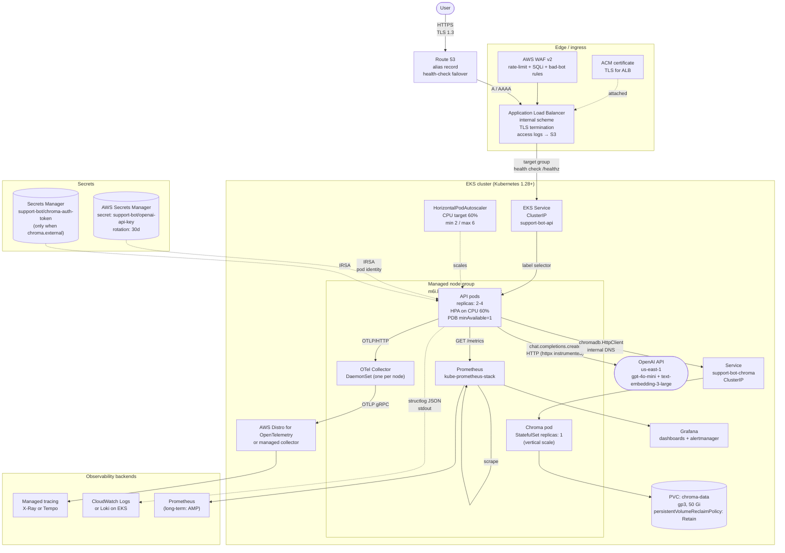

# AWS production flow

> **Audience:** anyone deploying the stack to EKS or
> reasoning about the production topology. Pairs with the
> [`architecture.md`](architecture.md) walkthrough and the
> README §4 "AWS view" section.

This is the production topology. Every component shown here
has a concrete default in `deploy/helm/support-bot/values-prod.yaml`;
the values-dev.yaml overlay relaxes requests + replica counts
for dev clusters.

## Diagram

## How the components scale

| Component | Scaling strategy | Why |
|---|---|---|
| **API pods** (`Deployment`) | `replicas: 2-4`, **HPA** on CPU 60%, min 2, max 6 pods; PDB `minAvailable=1` so an in-place rollout never drops all replicas. | The LangGraph workflow is CPU-bound on `OpenAIAnswerGenerator` and `OpenAIEmbedder` round-trips, so scaling out adds HTTP concurrency. The single-vector-store dependency (Chroma) is not a bottleneck — vector lookups are O(log n). |
| **Chroma** (`StatefulSet`) | `replicas: 1`, vertical-scale only (CPU + memory `requests`/`limits`). PVC `gp3 50 Gi`, `persistentVolumeReclaimPolicy: Retain`. | Chroma does not support multi-writer clustering in 1.5.x. Vertical scale is sufficient for the supported corpus size (the spec targets up to ~10 000 chunks). The `Retain` reclaim policy guarantees embeddings survive `helm uninstall` so a fresh install picks up where the last one left off. |
| **OTel Collector** (`DaemonSet`) | One collector per node. | Auto-instrumentation libraries are configured to export OTLP/HTTP to `localhost:4318`; the DaemonSet listens on the host network and fans out to the AWS Distro for OpenTelemetry (or a managed collector). |
| **Prometheus** (`kube-prometheus-stack`) | Cluster-wide scrape; retention 15 d locally, federated to Amazon Managed Prometheus for long-term. | The API exposes `/metrics` with `request_count_total`, `request_latency_seconds`, `retrieval_similarity_top1`, and `adapter_call_latency_seconds`. |

## Security

| Layer | Control |
|---|---|
| **Edge** | AWS WAF v2 with rate-limit + managed SQLi / bad-bot rule groups in front of the ALB. |
| **TLS** | ACM-managed certificate on the ALB; HTTPS-only listener; redirect HTTP → HTTPS at the listener level. |
| **Pod identity** | Pods mount an IRSA-annotated ServiceAccount (`eks.amazonaws.com/role-arn: arn:aws:iam::…:role/support-bot-api`). The `support-bot/openai-api-key` and `support-bot/chroma-auth-token` Secrets are pulled via the AWS SDK on first use, cached in memory, and refreshed by the SDK on a TTL. **No static AWS credentials are ever mounted or baked into images.** |
| **Container hardening** | Multi-stage `python:3.11.9-slim-bookworm` base; `USER app` (UID 1001) at runtime; `readOnlyRootFilesystem: true` (deployment template); `runAsNonRoot: true`, `runAsUser: 1001`; drop all Linux capabilities; `seccomp: RuntimeDefault`. |
| **Network** | EKS API pods use a `NetworkPolicy` that only allows egress to the Chroma Service (8000), OpenAI (`api.openai.com:443`), the OTel Collector (4318), and the Kubernetes API (for IRSA). Default-deny on ingress — only the ALB target group is allowed. |
| **Secrets at rest** | Chroma's auth token and OpenAI's API key live only in Secrets Manager. The Helm Secret templates ship with `value:` empty; the operator supplies values at install time. `.env.example` lists every required env var with placeholders only. |
| **Application-level scrubbing** | `SecretScrubber` (regex set: `sk-…`, `sk-ant-…`, plus configurable substring set) runs on every error response body, every `structlog` log line, and every OTel span attribute. CI fails the build if any rendered Helm manifest contains `sk-[A-Za-z0-9]{32,}`. |
| **Image supply chain** | Image is built from the repo's Dockerfile; future WP: Sigstore cosign signing + admission controller policy (`admissionregistration.k8s.io/v1` `ValidatingAdmissionPolicy`) to allow only signed images. |

## Failure modes and recovery

| Failure | Detection | Recovery |
|---|---|---|
| OpenAI 5xx | OTel span error + Prometheus counter spike | API re-raises `LLMUnavailable`; `ErrorResponseMapper` returns 502 with `{"detail": "answer generation unavailable"}`. No backoff inside the request — the caller retries. |
| Chroma restart | Next `/healthz` succeeds (API does not check Chroma for liveness — see `AGENTS.md` §6.7). Next `/ask` re-establishes the HTTP connection via the `chromadb.HttpClient` retry. |
| Pod OOMKilled | Kubernetes event + Prometheus alert | HPA scales; if persistent, raise `resources.api.limits.memory` in `values-prod.yaml` and `helm upgrade`. |
| OpenAI API key rotation | Pod identity refresh | SDK re-reads the secret on its TTL (default 6 h). No pod restart required. |

## Where to look in the code

| Concern | File |
|---|---|
| Helm chart | `deploy/helm/support-bot/` |
| API `Deployment` + HPA + PDB | `deploy/helm/support-bot/templates/deployment-api.yaml`, `templates/hpa.yaml` |
| Chroma `StatefulSet` + `Service` + `PVC` | `deploy/helm/support-bot/templates/deployment-chroma.yaml`, `templates/service.yaml`, `templates/pvc.yaml` |
| Ingestion Job (Helm hook) | `deploy/helm/support-bot/templates/job-ingestion.yaml` |
| Secret templates | `deploy/helm/support-bot/templates/secret.yaml` |
| Production overrides | `deploy/helm/support-bot/values-prod.yaml` |
| Error mapper | `src/support_bot/application/api/error_mapper.py` |
| Secret scrubber | `src/support_bot/adapters/secret_scrubber.py` |
