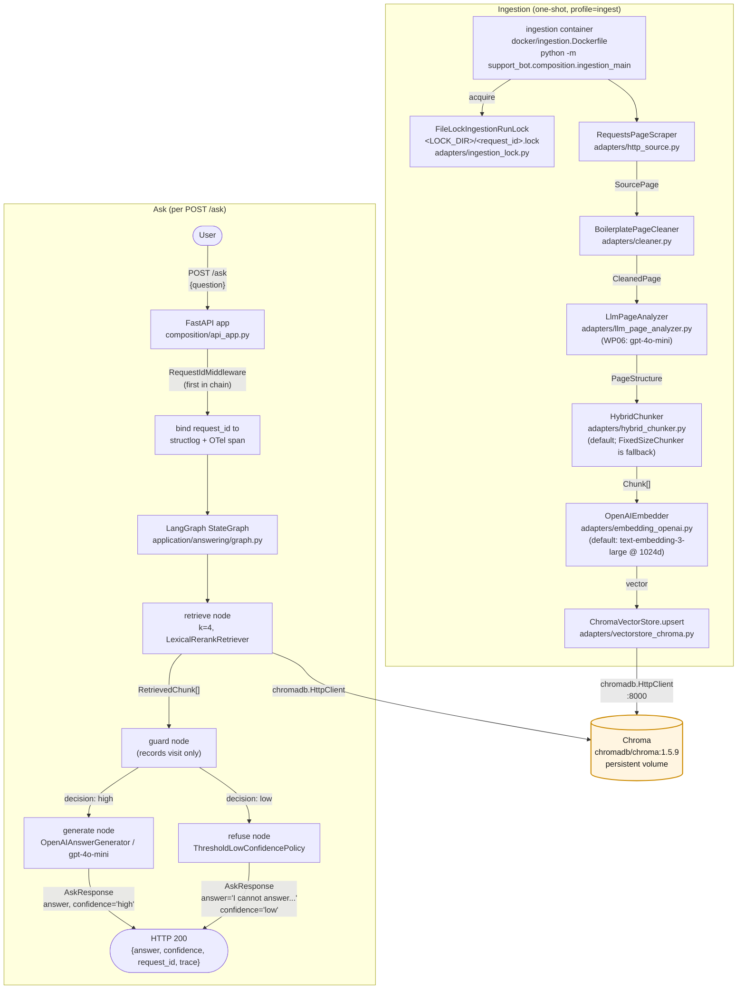

# Local development flow

> **Audience:** anyone running the stack with `docker compose
> up` from the repo root. Pairs with the
> [`architecture.md`](architecture.md) walkthrough and the
> README §1 quick-start.

Two flows live in the same Docker Compose stack on your
laptop. Both share Chroma as the persistent vector store.

## At a glance

| Flow | When | Container | Purpose |
|---|---|---|---|
| **Ask** | Every `POST /ask` | `support-bot-api` (long-running) | Embed the question, retrieve + re-rank chunks from Chroma, generate an answer with the configured LLM, return `{answer, confidence, request_id, trace}` as JSON. |
| **Ingestion** | Once per source page (or whenever the page changes) | `support-bot-ingestion` (one-shot, on the `ingest` profile) | Scrape → clean → analyse → chunk → embed → upsert into Chroma. |

## Diagram

## Step-by-step — the ask flow

1. **User → FastAPI.** `POST /ask` with `{"question": "..."}`.
2. **`RequestIdMiddleware`** is the first middleware. It
   reads `X-Request-Id` from the inbound headers or mints a
   `uuid4().hex`, binds it to `structlog.contextvars`, sets
   it as the `request.id` OTel attribute on the active span,
   and echoes `X-Request-Id` on the response. Every log
   line, span, and metric emitted downstream in this request
   scope inherits this single id.
3. **`AskQuestionUseCase.execute(question, *, request_id=...)`**
   builds an initial `AgentState` and hands it to the
   compiled `StateGraph`.
4. **`retrieve` node** calls
   `Retriever.retrieve(question, k=4)`. In production the
   `Retriever` is `LexicalRerankRetriever(ChromaRetriever)`,
   so the top-1 chunk is already promoted by the 4-char
   stem-prefix re-ranker before the answerer sees it.
5. **`guard` node** records the visit. It does **not** make
   the decision — that's the conditional edge's job.
6. **Conditional edge `_decide`** calls
   `LowConfidencePolicy.should_refuse(retrieved_chunks)` and
   returns `"generate"` (top-1 ≥ 0.5) or `"refuse"`.
7. **`generate` node** (high confidence) calls
   `AnswerGenerator.generate(question, retrieved)` →
   `OpenAIAnswerGenerator` (`ChatOpenAI`, default
   `gpt-4o-mini`). The system prompt forbids external
   knowledge.
8. **`refuse` node** (low confidence) returns the fixed
   string `"I cannot answer based on the available content."`
9. **FastAPI** wraps the `AgentState.answer` /
   `AgentState.confidence` in `AskResponse` and returns 200.

## Step-by-step — the ingestion flow

1. **Operator triggers** `docker compose --profile ingest up
   ingestion` (or runs the container in CI / Helm hook).
2. **Lock acquire.** `FileLockIngestionRunLock` creates
   `<LOCK_DIR>/<request_id>.lock` (TTL 600s). A second
   concurrent run returns `{"status": "skipped", "reason":
   "run_in_progress"}`.
3. **Scrape.** `RequestsPageScraper.fetch(source_url)`
   issues `requests.get(...)` with a configured timeout +
   retries. 5xx, timeouts, and connection errors raise typed
   exceptions (`VectorStoreUnavailable` / `EmbedderUnavailable`).
4. **Clean.** `BoilerplatePageCleaner` walks the DOM and
   strips `nav / footer / header / aside / script / style /
   noscript` and `[role="navigation"]` /
   `[class*="cookie" i]` / `[id*="cookie" i]` selectors.
5. **Analyse (WP06).** `LlmPageAnalyzer` calls
   `gpt-4o-mini` with a JSON-schema `PageStructure`
   describing semantic regions (headings, FAQ items with
   `Q`/`A` text, generic paragraphs).
6. **Chunk.** `HybridChunker` (default) walks the
   `PageStructure` and emits `Chunk` objects. Each chunk
   has a stable `chunk_id = sha1(source_url + ":" +
   ordinal)[:40]` so re-ingesting the same source is
   idempotent (upsert overwrites by id). `FixedSizeChunker`
   is still selectable as a fallback via
   `CHUNKER_BACKEND=fixed_size`.
7. **Embed.** `OpenAIEmbedder` (default) calls
   `text-embedding-3-large` and requests 1024-dim output
   via the Matryoshka `dimensions` parameter. The local
   `SentenceTransformersEmbedder` (`intfloat/multilingual-e5-large`)
   is selectable via `EMBEDDER_BACKEND=local`.
8. **Upsert.** `ChromaVectorStore.upsert(chunks)` writes
   `text + embedding + metadata{source_url, section, ordinal}`
   to the configured collection. `Retry-After` is respected
   on transient Chroma 5xx.
9. **Lock release.** `try`/`finally` guarantees the lock
   file is removed even if any step above raised.

## Shared infrastructure

- **Chroma** is the only persistent state. Both flows talk
  to it via `chromadb.HttpClient` on `CHROMA_HOST:CHROMA_PORT`
  (default `chroma:8000` inside the compose network).
  `PersistentClient` is **not** used — Chroma runs as its
  own container so the API can be redeployed without losing
  embeddings.
- **OpenTelemetry.** Initialised once in
  `composition/observability.py` before any adapter is built.
  Both flows get auto-instrumentation for FastAPI, httpx,
  logging, and chromadb; manual spans around every LangGraph
  node, every adapter call, and every ingestion step.
  Spans are emitted even when no OTLP exporter is configured
  — `opentelemetry-instrumentation-logging` injects
  `trace_id` / `span_id` into every `structlog` line.
- **Single request id.** The `RequestIdMiddleware` mints one
  for every ask request; the ingestion container reads
  `REQUEST_ID` from the env (default `uuid4().hex`) and uses
  it for the whole run. That single id appears in every
  log line, span attribute, lock filename, and Helm Job
  stdout — see `AGENTS.md` §6.

## Where to look in the code

| Concern | File |
|---|---|
| FastAPI app | `src/support_bot/composition/api_app.py` |
| Routes (`POST /ask`, `/healthz`, `/metrics`) | `src/support_bot/application/api/routes.py` |
| RequestIdMiddleware | `src/support_bot/application/api/middleware.py` |
| LangGraph topology | `src/support_bot/application/answering/graph.py` |
| Answerer | `src/support_bot/adapters/answerer_openai.py` |
| OpenAI embedder | `src/support_bot/adapters/embedding_openai.py` |
| Local embedder | `src/support_bot/adapters/embedding_local.py` |
| Hybrid chunker | `src/support_bot/adapters/hybrid_chunker.py` |
| Page analyser | `src/support_bot/adapters/llm_page_analyzer.py` |
| Vector store | `src/support_bot/adapters/vectorstore_chroma.py` |
| Lexical re-ranker | `src/support_bot/adapters/lexical_rerank_retriever.py` |
| Refusal policy | `src/support_bot/adapters/low_confidence_policy.py` |
| Ingestion entry | `src/support_bot/composition/ingestion_main.py` |
| Settings | `src/support_bot/composition/settings.py` |
| Compose stack | `deploy/docker-compose.yml` |
