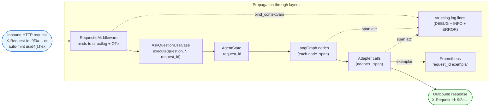
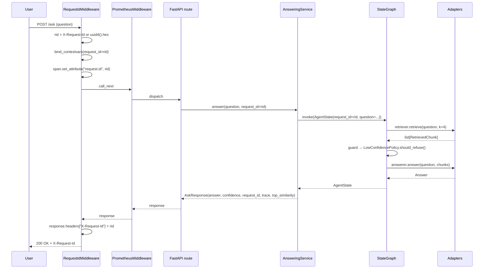
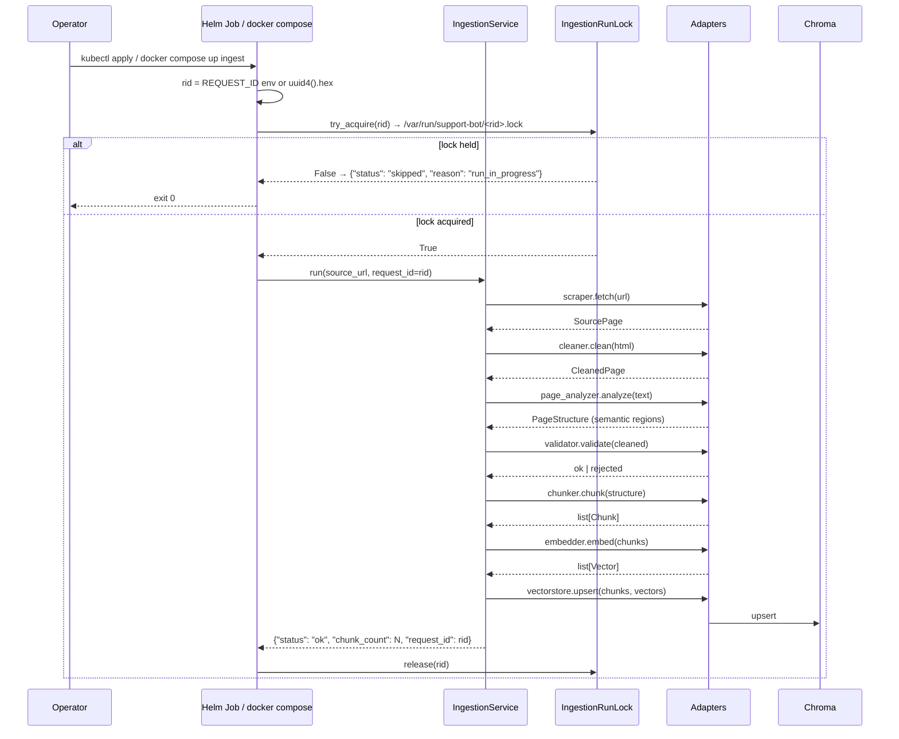

# Observability

> **Audience:** engineers, SREs, and reviewers who need to understand
> how `support-bot` is observed in production, how to correlate a
> single user request across every layer, and how to debug failures
> from logs alone.
>
> **Status:** architectural reference. The HARD rules are codified in
> `AGENTS.md` §6 (see the [repository root](https://github.com/bruj0/support-agent/blob/main/AGENTS.md));
> this report explains *what the system looks like at runtime* and
> *how to use it*.
>
> See also:
> - [C4 deep dive — Observability](../c4/4-deep-dive-observability.md) — the diagram-first view
> - [Architecture walkthrough §9](./architecture.md#9-observability-one-request_id-across-all-layers) — short prose version
> - [Architecture walkthrough §10](./architecture.md#10-security-secret-scrubbing) — secret scrubbing (an observability concern)

---

## Table of contents

- [1. Goals and non-goals](#1-goals-and-non-goals)
- [2. The three observability rules](#2-the-three-observability-rules)
- [3. The `request_id` invariant](#3-the-request_id-invariant)
- [4. Structured logging — `structlog` to stdout](#4-structured-logging-structlog-to-stdout)
- [5. Distributed tracing — OpenTelemetry](#5-distributed-tracing-opentelemetry)
- [6. Metrics — Prometheus + OTel](#6-metrics-prometheus-otel)
- [7. Secret scrubbing (`SecretScrubber`)](#7-secret-scrubbing-secretscrubber)
- [8. The two runtime flows at a glance](#8-the-two-runtime-flows-at-a-glance)
- [9. Worked examples](#9-worked-examples)
- [10. Configuration reference](#10-configuration-reference)
- [11. Where to look in the code](#11-where-to-look-in-the-code)
- [12. Operational playbook](#12-operational-playbook)

---

## 1. Goals and non-goals

### Goals

| Goal | How it is met |
|---|---|
| Trace a single user request end-to-end from one log search. | A single `request_id` is bound to structlog contextvars and to the active OTel span at the API boundary, then propagated as an explicit kwarg through every layer. |
| Diagnose a refusal ("I cannot answer based on the available content") without re-running the request. | Every non-trivial branch emits a DEBUG-level `structlog` line with enough context (counts, sizes, `*_text_hash`) to reproduce the call deterministically. |
| Connect traces and logs without forcing the operator to run a collector. | `opentelemetry-instrumentation-logging` injects `trace_id` and `span_id` into every `structlog` line; the OTel SDK is a no-op when `OTEL_EXPORTER_OTLP_ENDPOINT` is empty. |
| Never leak a secret in a log, span, or response body. | `SecretScrubber` is invoked by `ErrorResponseMapper`, the `structlog` processor chain, and the OTel span-attribute filter. |
| Survive a Chroma restart without crashing the API. | `GET /healthz` is decoupled from Chroma reachability; the next `/ask` request reconnects via `chromadb.HttpClient`. |

### Non-goals

- **Long-term metrics storage.** Prometheus exposition is provided via `GET /metrics`; persisting and alerting on those series is the operator's responsibility.
- **Client-side telemetry.** The API is server-side only; `X-Request-Id` is the one inbound header we honour.
- **Sampling-based privacy.** Every request is sampled at the configured ratio; we do not tokenise, hash, or otherwise pseudonymise user text in logs beyond the `*_text_hash` convention.

---

## 2. The three observability rules

These are not aspirational; they are enforced by code review and by
tests that fail the build when violated.

### Rule 1 — OpenTelemetry for distributed tracing

- The OTel SDK is initialised in `composition/observability.py`,
  imported once at the start of both `composition/api_app.py` and
  `composition/ingestion_main.py` — **before** any adapter, app, or
  use case is built.
- The exporter is OTLP/HTTP; the endpoint comes from
  `OTEL_EXPORTER_OTLP_ENDPOINT`. If it is empty, spans are still
  created and attached to logs but discarded (the dev default).
- Auto-instrumentation covers **FastAPI, httpx, logging, chromadb**.
- Manual spans wrap every LangGraph node (`node.<name>`), every
  adapter call (`adapter.<port>.<method>`), the guard / conditional
  edge (`node.guard_edge` with `decision.path`), and every ingestion
  step (`ingestion.run`, `ingestion.lock`, `ingestion.fetch`,
  `ingestion.clean`, `ingestion.analyze`, `ingestion.validate`,
  `ingestion.chunk`, `ingestion.embed`, `ingestion.upsert`).
- **No raw question or answer text in spans.** Use
  `sha256(text).hexdigest[:16]` as `*.text_hash`. The full text
  goes only to logs (after `SecretScrubber`).

### Rule 2 — A single `request_id` propagates through every layer

| Source | Where it is set | Where it is used |
|---|---|---|
| `RequestIdMiddleware` | Reads `X-Request-Id` from the inbound header or mints `uuid4().hex`. | First in the FastAPI middleware chain. |
| `AskQuestionUseCase.execute` | Explicit `request_id` keyword argument. | `AgentState.request_id`. |
| LangGraph nodes | Read from `state.request_id`. | Set as `span.set_attribute("request.id", ...)`. |
| Adapter call logs | Passed in the kwargs of every adapter call. | Emitted in `adapter.call.start` / `adapter.call.ok` log lines. |
| Ingestion Job | `REQUEST_ID` env var (default `uuid4().hex`; `RUN_ID` is a deprecated alias). | Names the lock file `<LOCK_DIR>/<request_id>.lock`; sets every ingestion step's `request.id` span attribute. |

**No layer may re-generate a new ID.** If a downstream service
issues its own ID (e.g. Chroma's request id), log both with explicit
field names — `upstream_request_id`, never reuse the field
`request_id`.

### Rule 3 — All implementations must log enough to be debuggable

Every non-trivial branch emits a DEBUG-level log with enough context
to diagnose without re-running. The bar: **given only the log line
and the line number, an engineer can explain *why* this branch was
taken.**

```python
logger.debug(
    "adapter.call.start",
    adapter="HttpEmbedder",
    operation="embed",
    request_id=request_id,
    input_count=len(texts),
    batch_size=self._batch_size,
    batch_text_hash=sha256("|".join(texts).encode()).hexdigest()[:16],
)
# ... do the work ...
logger.info(
    "adapter.call.ok",
    adapter="HttpEmbedder",
    operation="embed",
    request_id=request_id,
    latency_ms=elapsed_ms,
    returned=len(vectors),
    dimensions=self._dimensions,
)
```

- **DEBUG** lines include enough inputs to reproduce the call
  deterministically (counts, sizes, `*_text_hash`).
- **INFO / ERROR** lines carry `latency_ms`, status, counts, and IDs
  but never raw payloads or secrets.
- Use `*_text_hash` consistently when the content is text.

---

## 3. The `request_id` invariant

The `request_id` is the single correlation id that ties together
every artefact produced while handling one request — log lines,
OpenTelemetry spans, Prometheus exemplars, the on-disk lock file in
the ingestion Job, and the response header.

### Inbound flow



### Ingestion flow

```mermaid
flowchart TB
    REQ_ING(["Helm Job / docker compose --profile ingest<br/>REQUEST_ID env var<br/>default uuid4().hex"]):::ing
    LOCK["IngestionRunLock<br/>path: LOCK_DIR / request_id.lock"]
    ING["IngestionService.run<br/>(adapter.page_analyzer.analyze,<br/>ingestion.run spans)"]
    STEPS["ingestion.lock → fetch → clean →<br/>analyze → validate → chunk →<br/>embed → upsert"]
    LOG[structlog]
    OTL[OTel spans]

    REQ_ING --> LOCK
    REQ_ING --> ING --> STEPS
    LOCK -.file name.-> LOG
    ING -.request.id attr.-> OTL
    STEPS -.adapter.* spans.-> OTL

    classDef ing fill:#fff4e8,stroke:#b15a00
```

The lock file is named after the `request_id` so on-disk artefacts,
logs, spans, and Helm Job stdout all share one ID. When an operator
runs `kubectl logs job/support-bot-ingest`, the `request_id` in the
JSON line is also the lock filename they should look for.

### Code reference

```python
# src/support_bot/application/api/middleware.py
async def dispatch(self, request, call_next):
    rid = request.headers.get("X-Request-Id") or uuid4().hex
    bind_contextvars(request_id=rid)            # structlog
    span = trace.get_current_span()
    if span.is_recording():
        span.set_attribute("request.id", rid)   # OTel
    try:
        response = await call_next(request)
    finally:
        clear_contextvars()
    response.headers["X-Request-Id"] = rid      # echo on response
    return response
```

---

## 4. Structured logging — `structlog` to stdout

Every log line is a single JSON object on stdout. There are no log
files on the API container; aggregation is the operator's job
(`kubectl logs`, Loki, Fluent Bit, etc.).

### Mandatory processor chain

```python
structlog.configure(
    processors=[
        structlog.contextvars.merge_contextvars,    # picks up request_id, trace_id, span_id
        structlog.processors.add_log_level,
        structlog.processors.TimeStamper(fmt="iso", utc=True),
        SecretScrubber(),                            # scrubs sk-…, sk-ant-…, configurable substrings
        structlog.processors.JSONRenderer(),
    ]
)
```

`merge_contextvars` is the linchpin: it reads the request-scoped
contextvar populated by `RequestIdMiddleware`, so every `structlog`
call in the request handler inherits `request_id` without any
plumbing in the call site.

### Required fields per request

| Field | Source | Notes |
|---|---|---|
| `timestamp` | `TimeStamper(fmt="iso", utc=True)` | Always ISO-8601 UTC. |
| `request_id` | `merge_contextvars` | Absent only on startup / shutdown logs. |
| `route` | Set by `RequestIdMiddleware` | FastAPI route template (`POST /ask`). |
| `status_code` | Set by `PrometheusMiddleware` | Only on response logs. |
| `latency_ms` | Set by `PrometheusMiddleware` | Only on response logs. |
| `trace_id` | `opentelemetry-instrumentation-logging` | Even when no OTLP exporter is configured. |
| `span_id` | `opentelemetry-instrumentation-logging` | Same. |

### Example log stream (one `/ask` request)

```json
{"event": "http.request",          "request_id": "9f3a…", "route": "POST /ask", "level": "info"}
{"event": "adapter.call.start",     "adapter": "OpenAIEmbedder", "operation": "embed", "request_id": "9f3a…", "input_count": 1, "level": "debug"}
{"event": "adapter.call.ok",        "adapter": "OpenAIEmbedder", "operation": "embed", "request_id": "9f3a…", "latency_ms": 1062, "returned": 1, "dimensions": 1536, "level": "info"}
{"event": "node.retrieve.ok",       "request_id": "9f3a…", "candidate_count": 4, "top1_similarity": 0.88, "level": "debug"}
{"event": "node.guard_edge.decision","request_id": "9f3a…", "decision_path": "generate", "candidate_count": 4, "top1_similarity": 0.88, "level": "debug"}
{"event": "adapter.call.start",     "adapter": "ChatOpenAIAnswerer", "operation": "answer", "request_id": "9f3a…", "context_token_estimate": 612, "level": "debug"}
{"event": "adapter.call.ok",        "adapter": "ChatOpenAIAnswerer", "operation": "answer", "request_id": "9f3a…", "latency_ms": 1104, "tokens_in": 612, "tokens_out": 89, "level": "info"}
{"event": "http.response",          "request_id": "9f3a…", "route": "POST /ask", "status_code": 200, "latency_ms": 2189, "level": "info"}
```

One filter — `select(.request_id == "9f3a…")` — returns the full
story for the request.

---

## 5. Distributed tracing — OpenTelemetry

### Resource attributes

| Attribute | Source | Example |
|---|---|---|
| `service.name` | hard-coded | `support-bot` |
| `service.namespace` | `OTEL_SERVICE_NAMESPACE` env var | `support-bot` |
| `deployment.environment` | `OTEL_DEPLOYMENT_ENVIRONMENT` env var | `dev`, `staging`, `prod` |
| `service.version` | `pyproject.toml` | `0.4.2` |

### Auto-instrumentation

| Library | What it covers |
|---|---|
| `opentelemetry-instrumentation-fastapi` | Every FastAPI route, including middleware. |
| `opentelemetry-instrumentation-httpx` | The HTTP embedder / answerer / cleaner adapters. |
| `opentelemetry-instrumentation-logging` | Injects `trace_id` / `span_id` into every `structlog` line. |
| `opentelemetry-instrumentation-chromadb` | The Chroma client. |

### Manual spans — required locations

| Span name | Location | Notes |
|---|---|---|
| `ingestion.run` | `IngestionService.run` | Top of the ingestion Job. |
| `ingestion.lock` | `IngestionRunLock.try_acquire` / `release` | |
| `ingestion.fetch` | adapter call | |
| `ingestion.clean` | adapter call | |
| `ingestion.analyze` | adapter call (WP06 `OpenAIPageAnalyzer`) | Sets `analyzer.region_count`, `analyzer.faq_count`, `analyzer.model`, `analyzer.tokens_in`, `analyzer.tokens_out`. |
| `ingestion.validate` | `PreEmbedValidator` | On rejection, sets `rejected.cleaned_length`, `min_cleaned_length`. |
| `ingestion.chunk` | `HybridChunker` / fixed-size `Chunker` | |
| `ingestion.embed` | adapter call | Sets `embedder.backend`, `embedder.input_count`, `embedder.dimensions`. |
| `ingestion.upsert` | adapter call | Sets `vectorstore.chunk_count`, `vectorstore.source_url`. |
| `node.retrieve` | LangGraph retrieve node | Sets `retrieval.top1_similarity`, `retrieval.candidate_count`. |
| `node.guard_edge` | conditional edge | Sets `decision.path`. |
| `node.generate` | LangGraph generate node | Sets `answer.tokens_in`, `answer.tokens_out`. |
| `node.refuse` | LangGraph refuse node | Sets `answer_text_hash`. |
| `adapter.<port>.<method>` | every adapter method | |

### Span attributes that MUST be set

| Attribute | Value |
|---|---|
| `request.id` | The propagated `request_id`. |
| `route` | FastAPI route template, e.g. `POST /ask`. |
| `question.text_hash` | `sha256(question.text).hexdigest[:16]`. Never the raw text. |
| `retrieval.top1_similarity` | After the `retrieve` node. |
| `retrieval.candidate_count` | After the `retrieve` node. |
| `decision.path` | `generate` \| `refuse` \| `__end__` on the guard span. |
| `answer.tokens_in`, `answer.tokens_out` | When the answerer is called. |
| `embedder.backend` | `local` \| `openai` on `adapter.embedder.embed`. |
| `embedder.input_count` | Number of texts in the embed call. |
| `embedder.dimensions` | Embedding dimensionality. |
| `vectorstore.chunk_count` | On `adapter.vectorstore.upsert`. |
| `vectorstore.source_url` | On `adapter.vectorstore.upsert`. |
| `analyzer.region_count`, `analyzer.faq_count`, `analyzer.model`, `analyzer.tokens_in`, `analyzer.tokens_out` | On `adapter.page_analyzer.analyze` and `ingestion.analyze`. |
| `source.url` | On `ingestion.run`. |
| `rejected.cleaned_length`, `min_cleaned_length` | On validation rejection. |

### PII rule

The raw question or answer text MUST NOT appear in a span name or
span attribute. Use `sha256(text).hexdigest[:16]` as `*.text_hash`.
The full text goes only to logs (after `SecretScrubber`).

### Using `*_text_hash` to debug

Because every adapter / node / guard span carries a stable
`*.text_hash` instead of the raw text, an operator can correlate
a question or answer across the entire request — without ever
seeing the original content. Here is the workflow.

**Step 1 — capture the hash from a user-visible artefact.**

A customer gives you the question they typed and the response they
got back (e.g. via support ticket). Recompute the hashes locally:

```bash
QUESTION="hoe zeg ik mijn abonnement op?"
echo "question: $(echo -n "$QUESTION" | sha256sum | cut -c1-16)"

# Answer text only if you have it (e.g. from a screenshot
# transcribed by the customer).
ANSWER="..."
echo "answer:   $(echo -n "$ANSWER" | sha256sum | cut -c1-16)"
```

Alternatively, the response body's `request_id` field already
echoes the correlation id (see §3). Start from that and skip the
hash step.

**Step 2 — grep by `request_id` first.**

```bash
docker compose logs api 2>&1 \
  | jq -c 'select(.request_id == "9f3a…")'
```

Every line in the request scope carries the same `request_id`. The
span attributes you want are emitted on `adapter.call.start`
(DEBUG), `adapter.call.ok` (INFO), and the node `*.ok` (DEBUG)
lines.

**Step 3 — narrow to the span with the matching hash.**

The `question.text_hash` attribute is set on the top-level
`answering_service.answer` span AND copied onto every downstream
span in the same request. So:

```bash
# Filter by both — eliminates noise from concurrent requests that
# happen to share the same id prefix.
docker compose logs api 2>&1 \
  | jq -c 'select(.request_id == "9f3a…") | select(.question_text_hash == "9b1f2c…")'
```

If your collector exposes spans (Tempo, Honeycomb, Jaeger), the
same filter works:

```
service.name = support-bot
  AND request.id = "9f3a…"
  AND question.text_hash = "9b1f2c…"
```

**Step 4 — find the answer's span.**

The generate node and the answerer adapter set `answer_text_hash`
on the corresponding spans. With that, you can locate the exact
LLM call without ever seeing the prompt:

```
service.name = support-bot
  AND answer_text_hash = "4ad8…"
```

The answer's `tokens_in` / `tokens_out` attributes (set on
`adapter.answerer.answer`) tell you the prompt size and
generation length — usually enough to know whether the LLM was
prompted correctly, even without the text.

**Why this works (and why it's safe).**

- The hash is `sha256(text).hexdigest[:16]` — 16 hex chars, 64 bits
  of entropy. Collisions are not a concern at the rates `support-bot`
  sees (≪ 2³² questions per id space).
- The raw text never leaves the process. The only places that see
  it are the LLM call body (sent to OpenAI over TLS) and the
  structlog `DEBUG` line on the answerer adapter — both of which
  pass through `SecretScrubber` before persistence or rendering.
- If the operator needs the original text (e.g. for a regulatory
  disclosure), they need the customer to provide it again. The
  hash is **not** reversible by design.

### Sampling

Parent-based ratio:

- Dev: `OTEL_TRACES_SAMPLER=parentbased_traceidratio`,
  `OTEL_TRACES_SAMPLER_ARG=1.0` (sample everything).
- Prod: `OTEL_TRACES_SAMPLER_ARG=0.1` (10 %).

---

## 6. Metrics — Prometheus + OTel

### Prometheus exposition (`GET /metrics`)

| Series | Type | Labels | When |
|---|---|---|---|
| `request_count_total` | counter | `route`, `status` | Every response. |
| `request_latency_seconds` | histogram | `route` | Every response. Uses `request_id` as OpenMetrics exemplar. |
| `retrieval_similarity_top1` | gauge | — | After the `retrieve` node. |
| `adapter_call_latency_seconds` | histogram | `adapter`, `operation` | Every adapter call. |

When both Prometheus and OTel metrics exist, **prefer OTel** for new
code; Prometheus stays for backwards compatibility with the existing
`GET /metrics` endpoint.

### OTel metrics (new code)

The same four series are mirrored to OTel histograms / gauges so they
can be exported via OTLP to any backend (Prometheus, Datadog, Honeycomb,
Tempo, etc.). The OTel-to-Prometheus bridge is acceptable as a
follow-up; today the two are emitted in parallel.

---

## 7. Secret scrubbing (`SecretScrubber`)

One utility in `adapters/secret_scrubber.py`. Regex set:

```python
_PATTERNS = [
    re.compile(r"sk-[A-Za-z0-9]{32,}"),          # OpenAI
    re.compile(r"sk-ant-[A-Za-z0-9-]{32,}"),     # Anthropic
]
_SUBSTRINGS = ("OPENAI_API_KEY", "EMBEDDING_API_KEY", "CHROMA_URL")
```

Replacement is the literal `"[REDACTED]"`. `SecretScrubber` is
invoked by:

1. the `ErrorResponseMapper` on every error response body,
2. the `structlog` processor chain on every log line,
3. the OTel span-attribute filter (so scrubbed attributes never
   leave the process).

### Tests that enforce the rule

- Failure-injection tests assert that response bodies and log lines
  never contain `sk-` followed by 32+ chars.
- CI secret-scan: `helm template … | ( ! grep -E 'sk-[A-Za-z0-9]{32,}' )`.

### Why it lives in `adapters/` and not `domain/`

`SecretScrubber` depends on `re` (stdlib) and a configurable substring
set; it could in principle live in `domain/`. It is placed in
`adapters/` because `SecretScrubber` is invoked by the structlog
processor chain (`adapters/structured_logger.py`) and the
`ErrorResponseMapper`, both of which are adapters — the
domain stays free of cross-cutting concerns.

---

## 8. The two runtime flows at a glance

### `/ask` — request-response flow



### Ingestion Job — one-shot CLI



---

## 9. Worked examples

### Example A — debugging a refusal

User report: *"My question returned 'I cannot answer based on the
available content.'"*

```bash
# 1. Find the request_id from the API response header.
curl -i -X POST localhost:8000/ask \
  -H 'Content-Type: application/json' \
  -d '{"question":"hoe zeg ik mijn abonnement op?"}'
# HTTP/1.1 200 OK
# X-Request-Id: 9f3a…

# 2. Filter the API logs by that id.
docker compose logs api 2>&1 \
  | jq -c 'select(.request_id == "9f3a…")'
```

Expected output:

```json
{"event": "adapter.call.start",     "adapter": "ChromaRetriever", "operation": "retrieve", "request_id": "9f3a…", "k": 4, "level": "debug"}
{"event": "adapter.call.ok",        "adapter": "ChromaRetriever", "operation": "retrieve", "request_id": "9f3a…", "candidate_count": 4, "top1_similarity": 0.42, "latency_ms": 8, "level": "info"}
{"event": "node.guard_edge.decision","request_id": "9f3a…", "decision_path": "refuse", "candidate_count": 4, "top1_similarity": 0.42, "level": "debug"}
{"event": "adapter.call.ok",        "adapter": "ThresholdLowConfidencePolicy", "operation": "should_refuse", "request_id": "9f3a…", "top1": 0.42, "threshold": 0.5, "decision": "refuse", "level": "info"}
{"event": "node.refuse.ok",         "request_id": "9f3a…", "answer_text_hash": "9b1f2c…", "level": "debug"}
{"event": "http.response",          "request_id": "9f3a…", "route": "POST /ask", "status_code": 200, "latency_ms": 24, "level": "info"}
```

**Diagnosis:** retrieval returned 4 candidates with top-1 similarity
0.42. The guard decided `refuse` (below threshold 0.5). The refuse
node returned the fixed refusal string.

**Actionable data:** `top1_similarity=0.42`. The re-ranker is not
promoting the right chunk for this question. Options:

1. Raise `LOW_CONFIDENCE_THRESHOLD` slightly to allow borderline
   answers (only if the re-ranker evidence supports it).
2. Inspect the top-4 chunk IDs in Chroma to see whether the right
   semantic region was retrieved at all.
3. Re-run the ingestion Job against the live page — the source may
   have changed.

### Example B — debugging a slow `/ask`

User report: *"`POST /ask` took 8 seconds."*

```bash
docker compose logs api 2>&1 \
  | jq -c 'select(.request_id == "9f3a…") | select(.latency_ms != null)'
```

Look at the `latency_ms` per adapter call. The breakdown tells you
which layer is slow:

```json
{"event": "adapter.call.ok", "adapter": "OpenAIEmbedder",     "operation": "embed",  "request_id": "9f3a…", "latency_ms": 420, "level": "info"}
{"event": "adapter.call.ok", "adapter": "ChromaRetriever",    "operation": "retrieve","request_id": "9f3a…", "latency_ms": 18,  "level": "info"}
{"event": "adapter.call.ok", "adapter": "ChatOpenAIAnswerer", "operation": "answer", "request_id": "9f3a…", "latency_ms": 7120, "tokens_in": 612, "tokens_out": 89, "level": "info"}
{"event": "http.response",   "request_id": "9f3a…", "route": "POST /ask", "latency_ms": 7612, "status_code": 200, "level": "info"}
```

**Diagnosis:** the answerer took 7.1 s of the 7.6 s total. The
embedder and retriever are healthy.

**Actionable data:** `tokens_in=612`. A long context is being sent
to the LLM. Check whether the retriever is producing too many chunks
or whether the chunks are larger than expected — the re-ranker should
have surfaced a tighter top-k.

### Example C — debugging a skipped ingestion Job

The Helm Job logs show:

```json
{"event": "ingestion.skipped", "reason": "run_in_progress", "request_id": "9f3a…", "lock_path": "/var/run/support-bot/9f3a….lock", "level": "info"}
```

```bash
# 1. Confirm the lock file exists.
kubectl exec -it support-bot-ingest-xxx -- \
  ls -la /var/run/support-bot/

# 2. Check its mtime.
kubectl exec -it support-bot-ingest-xxx -- \
  stat /var/run/support-bot/9f3a….lock
```

If the lock is older than `lock_ttl_seconds` (default 600 s), the
operator can delete it manually — the next Job will acquire it
fresh.

---

## 10. Configuration reference

`composition/settings.py` is the only file that reads env vars.
Relevant keys for observability:

| Env var | Default | Used for |
|---|---|---|
| `LOG_LEVEL` | `INFO` | Minimum structlog level. |
| `REQUEST_ID` | `uuid4().hex` | `request_id` for the ingestion run (alias: `RUN_ID`). |
| `RUN_ID` | (deprecated) | Alias for `REQUEST_ID` — kept for one release. |
| `LOCK_DIR` | `/var/run/support-bot` | Where `IngestionRunLock` writes `<request_id>.lock`. |
| `OTEL_EXPORTER_OTLP_ENDPOINT` | `""` | OTLP/HTTP endpoint. Empty → spans attached to logs only. |
| `OTEL_SERVICE_NAMESPACE` | `support-bot` | `service.namespace` resource attribute. |
| `OTEL_DEPLOYMENT_ENVIRONMENT` | `dev` | `deployment.environment` resource attribute. |
| `OTEL_TRACES_SAMPLER` | `parentbased_traceidratio` | Sampler name. |
| `OTEL_TRACES_SAMPLER_ARG` | `1.0` | Sampler argument (ratio). |

Secrets — never in defaults: `OPENAI_API_KEY`, `EMBEDDING_API_KEY`,
`CHROMA_AUTH_TOKEN`.

---

## 11. Where to look in the code

| Concern | File |
|---|---|
| OTel SDK init | `src/support_bot/composition/observability.py` |
| `init_tracing(...)` | same |
| `RequestIdMiddleware` | `src/support_bot/application/api/middleware.py` |
| `PrometheusMiddleware` | `src/support_bot/application/api/metrics_middleware.py` |
| `MetricsRecorder` | `src/support_bot/adapters/metrics.py` |
| `SecretScrubber` | `src/support_bot/adapters/secret_scrubber.py` |
| `configure_logging` | `src/support_bot/adapters/structured_logger.py` |
| `ErrorResponseMapper` | `src/support_bot/adapters/error_response.py` |
| Span attributes in the LangGraph nodes | `src/support_bot/application/answering/graph.py` |
| Span attributes in the ingestion use case | `src/support_bot/application/ingestion/service.py` |
| Manual spans around adapter calls | each `src/support_bot/adapters/<port>/*.py` |

---

## 12. Operational playbook

### "Where is the OTel collector endpoint?"

Look at the deployment's env vars. In production it is set from a
Kubernetes Secret mounted into both the API Deployment and the
ingestion Job. If it is empty, no exporter is configured and spans
are discarded (logs still carry `trace_id` / `span_id`).

### "Where is the Prometheus scrape config?"

`GET /metrics` is exposed on the API container's HTTP port (same
port as `/ask`). Scrape interval 15 s; labels: `route`,
`status`, `adapter`, `operation`.

### "Where is the lock file?"

`/var/run/support-bot/<request_id>.lock` in both the API container
and the ingestion Job pod. The PVC `persistentVolumeReclaimPolicy:
Retain` (AGENTS.md §2.4) ensures the lock directory survives a pod
restart.

### "I see `decision.path: __end__` — what does that mean?"

The guard edge returned `__end__` — the conditional edge function
chose to terminate the graph without routing to `generate` or
`refuse`. This happens when `state.retrieved_chunks` is empty (no
candidates at all). The agent returns the fixed refusal message.

### "Why are spans empty in my backend?"

Check that `OTEL_EXPORTER_OTLP_ENDPOINT` is set AND that the OTel
collector accepts OTLP/HTTP at that endpoint AND that the collector
is configured to export to your backend. The pipeline is
**SDK → OTLP/HTTP → collector → backend**.

### "Why is the `request_id` missing from a log line?"

Two possibilities:

1. The log line was emitted at module import time (before any
   request handler runs). `merge_contextvars` returns `{}` because no
   request has bound a `request_id` yet.
2. The `structlog` logger was configured without
   `merge_contextvars` — this is a HARD violation of AGENTS.md §6.5.

### "How do I trace an ingestion Job end-to-end?"

```bash
# 1. Find the request_id for the Job's run.
kubectl logs job/support-bot-ingest | jq -c 'select(.event == "ingestion.run") | {request_id, source_url}'

# 2. Filter all logs by that request_id.
kubectl logs job/support-bot-ingest | jq -c 'select(.request_id == "9f3a…")'
```

Every step (`fetch`, `clean`, `analyze`, `validate`, `chunk`,
`embed`, `upsert`) emits at least one `adapter.call.start` and one
`adapter.call.ok` log line with the same `request_id`, plus an OTel
span named `ingestion.<step>`.

### "How do I add a new observability concern?"

Three steps:

1. Add the env var to `composition/settings.py` (with default).
2. Wire it into `composition/observability.py:init_tracing` (or a new
   helper) so the operator can control it without code changes.
3. Document the new series / span name in AGENTS.md §6 and add a
   test that asserts the series / span attribute is emitted in the
   canonical scenario.

---

## Appendix A — Field-name vocabulary

These field names are reserved. Do not reuse them for unrelated data.

| Field | Meaning |
|---|---|
| `request_id` | The propagated correlation id for the current request. **Only the middleware may set this.** |
| `upstream_request_id` | An id issued by a downstream service (e.g. Chroma). Log alongside `request_id`, never in its place. |
| `trace_id`, `span_id` | Injected by `opentelemetry-instrumentation-logging`. |
| `route` | FastAPI route template (`POST /ask`, `GET /metrics`). |
| `latency_ms` | Adapter or HTTP latency, in milliseconds. |
| `status_code` | HTTP status. |
| `adapter`, `operation` | Adapter port name + method. |
| `*_text_hash` | `sha256(text).hexdigest[:16]` of any user-visible text. |