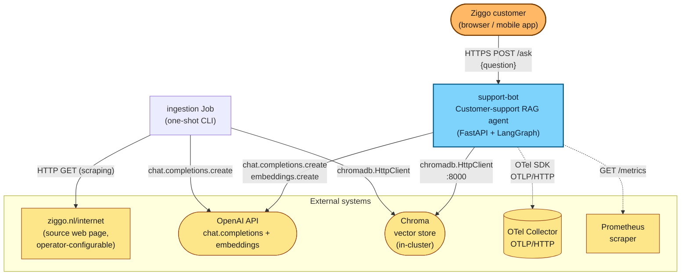

# C4 Level 1 — System Context

> **Goal:** show `support-bot` as a black box. Who uses it?
> What external systems does it depend on? What's outside
> the boundary?

## Diagram

## Actors

| Actor | What they do | How they reach the system |
|---|---|---|
| **Ziggo customer** | Asks questions in Dutch (or any language matching the source page). | `POST https://<host>/ask` with JSON `{question: "..."}`. |

## External systems the system depends on

| System | Why | Failure mode |
|---|---|---|
| **OpenAI API** (`api.openai.com`) | Two roles: (a) generate the final answer with `gpt-4o-mini`, (b) embed the question and the chunks with `text-embedding-3-large` (Matryoshka-truncated to 1024 dims). | OpenAI 5xx → `LLMUnavailable` / `EmbedderUnavailable` → API returns 502 with a structured error envelope. |
| **Chroma vector store** (`chromadb/chroma:1.5.9`) | Persists the embeddings between ingestion and ask flows. Both flows use the same collection via `chromadb.HttpClient`. | Chroma restart → next `/ask` reconnects via the HTTP client's retry; `/healthz` stays 200 (does not check Chroma). |
| **Source web page** (default `https://www.ziggo.nl/internet`) | Read **once per ingestion** by the scraping adapter. Operator-configurable via `SOURCE_URL` env var. | 5xx / timeout → `SourcePageUnreachable`; ingestion Job exits non-zero; no chunk upsert happens. |
| **OTel Collector** | Receives OTLP/HTTP traces from every node + adapter call. Optional — when `OTEL_EXPORTER_OTLP_ENDPOINT` is empty, spans are still created and attached to logs via `opentelemetry-instrumentation-logging` but discarded. | Collector down → traces are dropped; logs continue with `trace_id` / `span_id` injected. |
| **Prometheus** | Scrapes `GET /metrics` for `request_count_total`, `request_latency_seconds`, `retrieval_similarity_top1`, `adapter_call_latency_seconds`. | Scrape failure → no alert; `/metrics` continues to serve. |

## Outside the boundary (explicitly)

These are **not** part of `support-bot`:

- **A browser / mobile app for the customer.** The API serves JSON; presentation is the integrator's concern.
- **A multi-tenant user-management layer.** The source is a single web page; there's one logical "tenant" per `SOURCE_URL`.
- **A persistent user-history store.** No session is stored between requests — every ask is stateless.
- **A monitoring / alerting stack.** The service emits metrics; dashboards and alerts live in the operator's Prometheus / Grafana setup.

## Where to look in the code

| Concern | File |
|---|---|
| Customer-facing endpoint | `src/support_bot/application/api/routes.py` |
| OpenAI client wiring | `src/support_bot/composition/production_factory.py` |
| Chroma client wiring | `src/support_bot/composition/production_factory.py` |
| OTel SDK initialisation | `src/support_bot/composition/observability.py` |
| Prometheus metrics registry | `src/support_bot/adapters/metrics.py` |
| Scraper adapter (source page) | `src/support_bot/adapters/http_source.py` |
