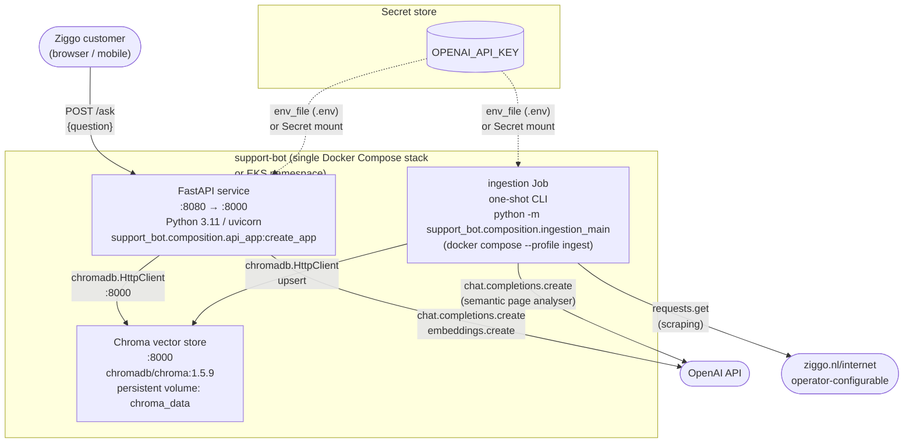

# C4 Level 2 — Containers

> **Goal:** zoom into `support-bot` and show the deployable
> units (processes / containers / pods), the technologies
> they use, and how they communicate.

## Diagram

## Container inventory

| Container | Technology | Lifecycle | Image | Purpose |
|---|---|---|---|---|
| **FastAPI service** | Python 3.11 + FastAPI 0.115 + uvicorn | Long-running, scaled by HPA on CPU | `support-bot-api` (built from `docker/api.Dockerfile`) | Receives `POST /ask`, runs the LangGraph workflow, returns JSON. |
| **ingestion Job** | Python 3.11 (same image, different entrypoint) | One-shot per source change; runs as Helm `post-install` / `post-upgrade` hook or `docker compose --profile ingest` | `support-bot-api` (same image, different `CMD`) | Scrapes → cleans → analyses → chunks → embeds → upserts into Chroma. |
| **Chroma** | `chromadb/chroma:1.5.9` (Debian-based slim image) | Long-running; single replica, StatefulSet on EKS | Upstream Docker image, pinned | Stores embeddings + metadata; serves `chromadb.HttpClient` over HTTP. |

## Communication paths

| From | To | Protocol | Notes |
|---|---|---|---|
| Customer browser | FastAPI service | HTTPS (HTTP/1.1) | `POST /ask` with JSON body. CORS is not configured by default. |
| FastAPI service | OpenAI API | HTTPS (`api.openai.com:443`) | httpx auto-instrumented; structured output mode for the page analyser; chat completions for the answerer. |
| FastAPI service | Chroma | HTTP (cleartext inside the cluster) | `chromadb.HttpClient` over `:8000`; per-request `Authorization` header when `CHROMA_AUTH_TOKEN` is set. |
| ingestion Job | Source web page | HTTPS | `requests.get` with timeout + retries; raises `SourcePageUnreachable` on failure. |
| ingestion Job | OpenAI API | HTTPS | Same as FastAPI service. |
| ingestion Job | Chroma | HTTP | Same as FastAPI service. |

## Storage

| Container | Storage | Type | Retention |
|---|---|---|---|
| FastAPI service | None | — | Stateless. Replicas can be killed without data loss. |
| ingestion Job | None during the run; uses the lock file at `<LOCK_DIR>/<request_id>.lock` | File system | Lock file is `try`/`finally`-released. |
| Chroma | `chroma_data:/chroma/chroma` (Docker volume) / PVC `chroma-data` (Helm, `gp3 50 Gi`, `persistentVolumeReclaimPolicy: Retain`) | Persistent | Survives pod restarts; survives `helm uninstall` (operator-controlled at the StorageClass level). |

## Resource sizing (Helm values)

| Component | `requests.cpu` | `requests.memory` | `limits.cpu` | `limits.memory` | Scaling |
|---|---|---|---|---|---|
| API pod | 100m | 256 MiB | 1000m | 1 GiB | 2–4 replicas, HPA on CPU 60% |
| Chroma pod | 50m | 128 MiB | 500m | 512 MiB | 1 replica, vertical scale only |
| Ingestion Job | 200m | 512 MiB | 1000m | 2 GiB | One-shot |

## Where to look in the code

| Concern | File |
|---|---|
| FastAPI entrypoint + uvicorn wiring | `src/support_bot/composition/api_app.py` |
| Ingestion entrypoint (CLI) | `src/support_bot/composition/ingestion_main.py` |
| Docker Compose | `deploy/docker-compose.yml` |
| Helm chart | `deploy/helm/support-bot/` |
| Helm chart values | `deploy/helm/support-bot/values.yaml`, `values-dev.yaml`, `values-prod.yaml` |
| Dockerfile (multi-stage, non-root) | `docker/api.Dockerfile` |
