# C4 Level 3 — Components

> **Goal:** zoom into the **FastAPI service** container and
> show the major software components (the hexagonal layers),
> their dependencies, and the ports they implement.

## Diagram

```mermaid
flowchart TB
    subgraph COMPOSITION["composition/ (composition root)"]
        APP["api_app.create_app<br/>wires adapters to ports<br/>(composition root)"]
        FACTORY["production_factory<br/>select_embedder<br/>select_retriever<br/>select_answerer"]
        OBS["observability.init_tracing<br/>OTel SDK init"]
        CFG["settings.Settings<br/>(pydantic-settings)"]
        IM["ingestion_main<br/>(separate entrypoint,<br/>same image)"]
    end

    subgraph APPLICATION["application/ (use cases)"]
        ROUTES["api.routes<br/>POST /ask, GET /healthz,<br/>GET /metrics"]
        MID["api.middleware<br/>RequestIdMiddleware<br/>(FIRST in chain)"]
        ERR["api.error_mapper<br/>typed exceptions -><br/>HTTP status codes"]
        METRICS["api.metrics_middleware<br/>Prometheus exporter"]
        SERVICE["answering.answering_service<br/>AnsweringService"]
        GRAPH["answering.graph<br/>LangGraph StateGraph<br/>(4 nodes + 1 edge)"]
        ISERVICE["ingestion.ingestion_service<br/>IngestionService"]
        ILOCK["ingestion.ingestion_lock<br/>IngestionRunLock"]
        VAL["ingestion.pre_embed_validator<br/>(validation gate)"]
    end

    subgraph ADAPTERS["adapters/ (concrete implementations)"]
        SCRAPER["http_source<br/>RequestsPageScraper"]
        CLEANER["cleaner<br/>BoilerplatePageCleaner"]
        EXTRACT["bs4_text_extractor<br/>(pre-processor)"]
        ANALYZER["llm_page_analyzer<br/>OpenAIPageAnalyzer<br/>(WP06)"]
        HCHUNKER["hybrid_chunker<br/>HybridChunker<br/>(WP06)"]
        FCHUNKER["chunker<br/>FixedSizeChunker<br/>(fallback)"]
        OPENAI_EMB["embedding_openai<br/>OpenAIEmbedder<br/>(default)"]
        LOCAL_EMB["embedding_local<br/>SentenceTransformersEmbedder<br/>(fallback)"]
        LEX["lexical_rerank_retriever<br/>(Dutch verb-form fix)"]
        CHR_VS["vectorstore_chroma<br/>ChromaVectorStore + ChromaRetriever"]
        ANSWERER["answerer_openai<br/>OpenAIAnswerGenerator"]
        POLICY["low_confidence_policy<br/>ThresholdLowConfidencePolicy"]
        SCRUB["secret_scrubber<br/>SecretScrubber"]
        METRICS_AD["metrics<br/>MetricsRecorder"]
    end

    subgraph DOMAIN["domain/ (pure business types + ports)"]
        D_ENT_A["answering.entities<br/>AgentState, RetrievedChunk,<br/>Confidence"]
        D_PORTS_A["answering.ports<br/>Retriever, AnswerGenerator,<br/>LowConfidencePolicy"]
        D_ENT_I["ingestion.entities<br/>SourcePage, Chunk,<br/>PageStructure"]
        D_PORTS_I["ingestion.ports<br/>PageScraper, PageCleaner,<br/>Chunker, Embedder,<br/>VectorStore, IngestionRunLock"]
        D_ERR["shared.errors<br/>VectorStoreUnavailable,<br/>LLMUnavailable, ...<br/>(DomainError hierarchy)"]
    end

    ROUTES --> MID --> METRICS --> SERVICE
    ROUTES --> ERR
    SERVICE --> GRAPH
    GRAPH -.uses.-> D_PORTS_A
    GRAPH --> ANSWERER
    GRAPH --> LEX
    LEX --> CHR_VS
    GRAPH --> POLICY
    ROUTES --> METRICS_AD

    IM --> ISERVICE
    ISERVICE --> ILOCK
    ISERVICE --> SCRAPER
    ISERVICE --> CLEANER
    ISERVICE --> ANALYZER
    ISERVICE --> HCHUNKER
    ISERVICE --> FCHUNKER
    ISERVICE --> OPENAI_EMB
    ISERVICE --> LOCAL_EMB
    ISERVICE --> CHR_VS
    ISERVICE --> VAL
    ISERVICE -.uses.-> D_PORTS_I

    APP --> FACTORY
    FACTORY --> D_PORTS_A
    FACTORY --> D_PORTS_I
    APP --> OBS
    APP --> CFG

    ANALYZER --> D_ENT_I
    ANSWERER --> D_ERR
    CHR_VS --> D_ERR
    POLICY --> D_ERR

    classDef comp fill:#7dd3fc,stroke:#075985,stroke-width:1px,color:#0c1f33;
    classDef app fill:#ffb866,stroke:#7a3e00,stroke-width:1px,color:#1a1a1a;
    classDef adp fill:#fde68a,stroke:#92400e,stroke-width:1px,color:#1a1a1a;
    classDef dom fill:#f9a8d4,stroke:#831843,stroke-width:2px,color:#1a1a1a;
    class APP,FACTORY,OBS,CFG,IM comp;
    class ROUTES,MID,ERR,METRICS,SERVICE,GRAPH,ISERVICE,ILOCK,VAL app;
    class SCRAPER,CLEANER,EXTRACT,ANALYZER,HCHUNKER,FCHUNKER,OPENAI_EMB,LOCAL_EMB,LEX,CHR_VS,ANSWERER,POLICY,SCRUB,METRICS_AD adp;
    class D_ENT_A,D_PORTS_A,D_ENT_I,D_PORTS_I,D_ERR dom;
```



## Layer rules (enforced by `import-linter`)

```
composition   →   adapters   →   application   →   domain
  (top)                                                    (bottom, pure)
```

| Layer | May import | Must NOT import |
|---|---|---|
| `domain/` | stdlib only | `application/`, `adapters/`, `composition/`, `langchain`, `langgraph`, `chromadb`, `fastapi`, `requests`, `beautifulsoup4`, `httpx`, `pydantic-settings`, `structlog`, `opentelemetry` |
| `application/` | `domain/` | `adapters/`, `composition/`, the SDKs listed above |
| `adapters/` | `domain/`, `application/`, SDKs | `composition/` |
| `composition/` | all layers | — |

`pydantic-settings` is banned from `domain/` (it's a framework import). `pydantic` v2 is fine (BaseModel, field validators).

The contract is enforced by `tests/architecture/test_imports.py` (CI gate). A signature change in a port without an updated adapter fails the build.

## Component inventory

### `composition/` — composition root (3 files)

| File | Purpose |
|---|---|
| `composition/api_app.py` | Builds the FastAPI app; wires every adapter to its port via the factory. |
| `composition/ingestion_main.py` | CLI entrypoint for the ingestion Job. Same image, different `CMD`. |
| `composition/production_factory.py` | Adapter-selection functions: `select_embedder`, `select_query_embedder`, `select_retriever`, `select_answerer`. |
| `composition/observability.py` | OTel SDK init, auto-instrumentation, span lifecycle. |
| `composition/settings.py` | `BaseSettings` (pydantic-settings); the single source of operator-tunable values. |
| `composition/__main__.py` | `python -m support_bot.composition` dispatcher. |

### `application/` — use cases (8 files)

| File | Purpose |
|---|---|
| `application/api/routes.py` | `POST /ask`, `GET /healthz`, `GET /metrics` route handlers. |
| `application/api/middleware.py` | `RequestIdMiddleware` (first in chain). |
| `application/api/error_mapper.py` | Maps `DomainError` subclasses to HTTP status codes. |
| `application/api/metrics_middleware.py` | Prometheus exporter middleware (after RequestIdMiddleware so it sees the request id). |
| `application/answering/answering_service.py` | `AnsweringService.answer(question, *, request_id)`. |
| `application/answering/graph.py` | The LangGraph topology (4 nodes + 1 conditional edge). |
| `application/ingestion/ingestion_service.py` | `IngestionService.run(source_url, *, request_id)`. |
| `application/ingestion/ingestion_lock.py` | `IngestionRunLock` (TTL-keyed file lock). |
| `application/ingestion/pre_embed_validator.py` | Validation gate between clean and embed steps. |

### `adapters/` — concrete implementations (16 files)

| File | Purpose |
|---|---|
| `http_source.py` | `RequestsPageScraper` (requests-based HTTP fetcher). |
| `cleaner.py` | `BoilerplatePageCleaner` (strips nav/footer/cookie/etc.). |
| `bs4_text_extractor.py` | `Bs4TextExtractor` (HTML → plain text pre-processor). |
| `llm_page_analyzer.py` | `OpenAIPageAnalyzer` (WP06: chat-completions with strict JSON-schema response_format). |
| `hybrid_chunker.py` | `HybridChunker` (WP06: per-region chunking + sentence-boundary split). |
| `chunker.py` | `FixedSizeChunker` (WP03 fallback). |
| `embedding_openai.py` | `OpenAIEmbedder` (default; supports Matryoshka `dimensions`). |
| `embedding_local.py` | `SentenceTransformersEmbedder` (fallback; supports E5 prefix). |
| `lexical_rerank_retriever.py` | `LexicalRerankRetriever` (4-char stem-prefix re-ranker). |
| `vectorstore_chroma.py` | `ChromaVectorStore` + `ChromaRetriever`. |
| `answerer_openai.py` | `OpenAIAnswerGenerator` (ChatOpenAI with "context-only" system prompt). |
| `low_confidence_policy.py` | `ThresholdLowConfidencePolicy` (default threshold 0.5). |
| `secret_scrubber.py` | `SecretScrubber` (regex: `sk-…`, `sk-ant-…`, configurable substrings). |
| `metrics.py` | `MetricsRecorder` (Prometheus registry builder). |
| `structured_logger.py` | `configure_logging` (structlog JSON renderer). |

### `domain/` — pure business types + ports (5 files)

| File | Purpose |
|---|---|
| `domain/answering/entities.py` | `AgentState`, `RetrievedChunk`, `Confidence` literal. |
| `domain/answering/ports.py` | `Retriever`, `AnswerGenerator`, `LowConfidencePolicy` (Protocols). |
| `domain/ingestion/entities.py` | `SourcePage`, `CleanedPage`, `Chunk`, `PageStructure`, `SemanticChunk`, `ContentKind`. |
| `domain/ingestion/ports.py` | `PageScraper`, `PageCleaner`, `PageAnalyzer`, `Chunker`, `Embedder`, `VectorStore`, `IngestionRunLock`, `PreEmbedValidator` (Protocols). |
| `domain/shared/errors.py` | `DomainError` hierarchy: `VectorStoreUnavailable`, `LLMUnavailable`, `EmbedderUnavailable`, `SourcePageUnreachable`, `SourcePageGarbage`, `ConfigurationError`. |
| `domain/shared/retrieval.py` | `RetrievedChunk` (with `from_chunk` classmethod + `_clamp_similarity` validator). |

## Where to look next

- Deep dive into how the **ingestion** components collaborate: [`4-deep-dive-ingestion.md`](4-deep-dive-ingestion.md).
- Deep dive into the **answering** LangGraph workflow: [`4-deep-dive-answering.md`](4-deep-dive-answering.md).
- Deep dive into **observability** (the request_id propagation contract): [`4-deep-dive-observability.md`](4-deep-dive-observability.md).
- Deep dive into the **Helm chart** for EKS deployment: [`4-deep-dive-deployment.md`](4-deep-dive-deployment.md).
