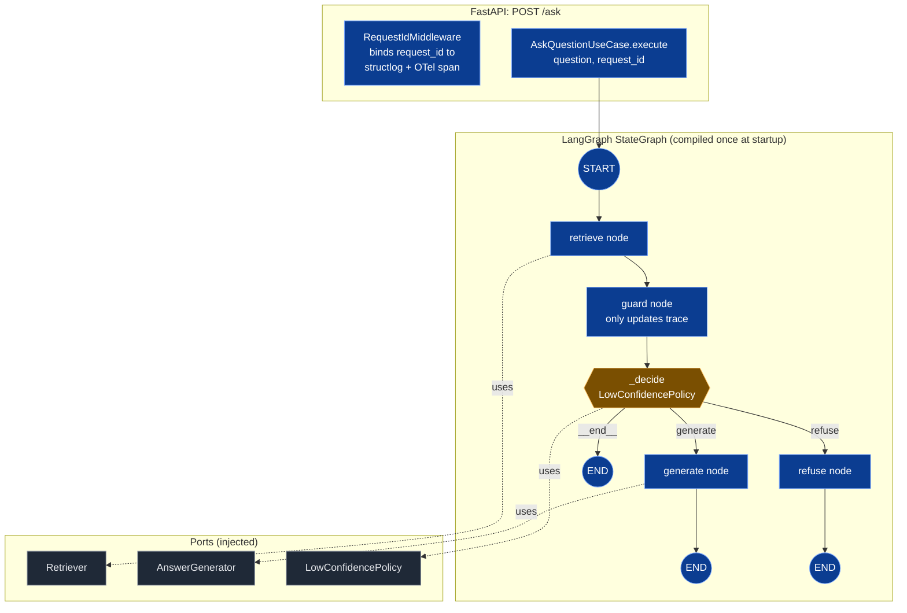

# Deep Dive — Answering Workflow (LangGraph)

> **Goal:** trace one `POST /ask` request from arrival to
> response, showing exactly what each LangGraph node does,
> how the conditional edge makes its routing decision, and
> how the state evolves.

## Topology



## State shape

`AgentState` is a single Pydantic v2 frozen model (see `src/support_bot/domain/answering/entities.py`):

| Field              | Type                              | Set by                       |
| ------------------ | --------------------------------- | ---------------------------- |
| `question`         | `str`                             | API middleware               |
| `request_id`       | `str`                             | `RequestIdMiddleware`        |
| `retrieved_chunks` | `list[RetrievedChunk]`            | `retrieve`                   |
| `answer`           | `str \| None`                     | `generate` / `refuse`        |
| `confidence`       | `Literal["high","low"] \| None`   | `generate` / `refuse`        |
| `trace`            | `list[str]`                       | every node (append)          |

**Partial-update merge.** Nodes never replace state — they return a `dict` containing **only the keys they are updating**. LangGraph merges that partial update on top of the existing state. This is why `generate` can return `{"answer": …, "confidence": "high", "trace": state.trace + ["generate"]}` without erasing `retrieved_chunks`.

## Step-by-step

### 1. `RequestIdMiddleware` (FIRST in the chain)

- Reads `X-Request-Id` from inbound headers or mints `uuid4().hex`.
- Binds to `structlog.contextvars` → every log line in the request scope inherits it.
- Sets `trace.get_current_span().set_attribute("request.id", request_id)` → every span emitted downstream inherits it.
- Echoes `X-Request-Id` back on the response.

### 2. `AskQuestionUseCase.execute(question, *, request_id)`

```python
# src/support_bot/application/answering/answering_service.py
state = AgentState(
    question=question,
    request_id=request_id,
    retrieved_chunks=[],
    answer=None,
    confidence=None,
    trace=[],
)
final_state = graph.invoke(state)
return AskResponse(
    answer=final_state.answer,
    confidence=final_state.confidence,
    request_id=request_id,
    trace=final_state.trace,
    top_similarity=...,
)
```

### 3. `retrieve_node`

```python
# src/support_bot/application/answering/graph.py
def retrieve_node(state, *, retriever, tracer=None):
    with tracer.start_as_current_span("node.retrieve") as span:
        span.set_attribute("request.id", state.request_id)
        span.set_attribute("route", "POST /ask")
        span.set_attribute("question.text_hash", _text_hash(state.question))
        chunks = retriever.retrieve(state.question, k=RETRIEVE_K)  # k=4
        top1 = chunks[0].similarity if chunks else 0.0
        span.set_attribute("retrieval.candidate_count", len(chunks))
        span.set_attribute("retrieval.top1_similarity", top1)
        return {"retrieved_chunks": chunks, "trace": state.trace + ["retrieve"]}
```

The `Retriever` is composed of `LexicalRerankRetriever(ChromaRetriever)`. The re-ranker:

1. Calls `ChromaRetriever.retrieve(question, k=RETRIEVE_K * 5)` → 20 candidates by cosine.
2. Re-ranks by blended score: `alpha * cosine + (1 - alpha) * lexical_overlap`.
3. Returns the top `RETRIEVE_K = 4`.

The lexical overlap uses 4-char stem-prefix matching plus a recall-only overlap (so a question word that appears in the chunk text gets credit even if it doesn't appear in any retrieved chunk). Default `alpha=0.5`.

### 4. `guard_node`

```python
# src/support_bot/application/answering/graph.py
def guard_node(state, *, policy, tracer=None):
    with tracer.start_as_current_span("node.guard") as span:
        span.set_attribute("request.id", state.request_id)
        return {"trace": state.trace + ["guard"]}
```

By design, the guard node **does no work**. It just records the visit in the trace. The actual decision is made by the conditional edge `_decide`. Keeping the edge function free of business logic is a hard rule (AGENTS.md §1.5) — the conditional edge delegates to the injected `LowConfidencePolicy`.

### 5. Conditional edge `_decide`

```python
# src/support_bot/application/answering/graph.py
def _decide(state, *, policy, tracer=None) -> Literal["generate", "refuse", "__end__"]:
    with tracer.start_as_current_span("node.guard_edge") as span:
        span.set_attribute("request.id", state.request_id)
        should_refuse = policy.should_refuse(state.retrieved_chunks)
        path = "refuse" if should_refuse else "generate"
        span.set_attribute("decision.path", path)
        return path
```

The `Literal["generate", "refuse", "__end__"]` return type is the contract — the graph's compiled edge mapping depends on this annotation. `__end__` is reserved for future WPs (e.g. early-exit when the question is empty); the WP02 wiring only emits `generate` or `refuse`.

The `LowConfidencePolicy` adapter (`ThresholdLowConfidencePolicy`):

```python
# src/support_bot/adapters/low_confidence_policy.py
class ThresholdLowConfidencePolicy:
    def __init__(self, *, threshold: float = 0.5): ...
    def should_refuse(self, chunks: list[RetrievedChunk]) -> bool:
        if not chunks:
            return True
        return chunks[0].similarity < self.threshold
```

Returns `True` when retrieval is empty OR top-1 similarity is below threshold. The threshold defaults to 0.5; it's operator-tunable via `LOW_CONFIDENCE_THRESHOLD` env var.

### 6. `generate_node`

```python
def generate_node(state, *, generator, tracer=None):
    with tracer.start_as_current_span("node.generate") as span:
        span.set_attribute("request.id", state.request_id)
        span.set_attribute("question.text_hash", _text_hash(state.question))
        tokens_in = sum(len(c.text) for c in state.retrieved_chunks)
        span.set_attribute("answer.tokens_in", tokens_in)
        text = generator.generate(state.question, state.retrieved_chunks)
        span.set_attribute("answer.tokens_out", len(text))
        return {
            "answer": text,
            "confidence": "high",
            "trace": state.trace + ["generate"],
        }
```

The `AnswerGenerator` is wired to `OpenAIAnswerGenerator` in production or `FakeAnswerGenerator` in tests. The system prompt:

```python
# src/support_bot/adapters/answerer_openai.py
SYSTEM_PROMPT = (
    "You are a support assistant. Answer ONLY using the context "
    "below. If the answer is not in the context, say you don't "
    "know. Do not invent URLs, prices, or people."
)
```

Two layers of safety: (1) the system prompt forbids external knowledge and hallucinated facts; (2) the graph routes to `refuse` when retrieval is too thin, so the model never sees the question in those cases.

### 7. `refuse_node`

```python
def refuse_node(state, *, policy, tracer=None):
    with tracer.start_as_current_span("node.refuse") as span:
        span.set_attribute("request.id", state.request_id)
        text = policy.refusal_message()
        return {
            "answer": text,
            "confidence": "low",
            "trace": state.trace + ["refuse"],
        }
```

The refusal message is the fixed string `"I cannot answer based on the available content."` — pinned by the unit test `tests/domain/test_low_confidence_policy_foundation.py`. A future refactor that "improves" the message into something the model generates would break the test.

### 8. `AskResponse`

The FastAPI route handler wraps the final `AgentState`:

```json
{
  "answer": "...",
  "confidence": "high",
  "trace": ["retrieve", "guard", "generate"],
  "request_id": "smoke-001",
  "top_similarity": 0.748
}
```

`top_similarity` is the post-rerank blended score of the top-1 chunk. It's exposed so callers can debug "why did I get this answer" without re-implementing the retrieval.

## Ports and dependencies

Each node is `Callable[[AgentState], dict[str, Any]]` and accepts its collaborator (the port implementation) as a keyword argument.

**Nodes never import `langchain`, `langgraph`, or `chromadb`** — that would couple application code to the implementation. The `import-linter` contract in `tests/architecture/test_imports.py` fails the build if they do.

The graph itself is compiled exactly once at startup by `production_factory.build_graph(...)`, which binds the ports:

```python
# src/support_bot/composition/production_factory.py
graph = StateGraph(AgentState)
graph.add_node("retrieve", retrieve_node)
graph.add_node("guard", guard_node)
graph.add_node("generate", generate_node)
graph.add_node("refuse", refuse_node)
graph.set_entry_point("retrieve")
graph.add_edge("retrieve", "guard")
graph.add_conditional_edges(
    "guard", _decide, {"generate": "generate", "refuse": "refuse"}
)
graph.add_edge("generate", END)
graph.add_edge("refuse", END)
compiled = graph.compile()
```

## Error handling

Adapters raise typed domain exceptions:

| Exception | HTTP status (via `ErrorResponseMapper`) |
|---|---|
| `VectorStoreUnavailable` | 503 `{"detail": "vector store unavailable"}` |
| `LLMUnavailable` | 502 `{"detail": "answer generation unavailable"}` |
| `EmbedderUnavailable` | 502 `{"detail": "embedding unavailable"}` |
| `ConfigurationError` | 503 `{"detail": "service not configured"}` |
| `pydantic.ValidationError` | 422 `{"detail": "invalid request", "errors": [...]}` |
| any other `DomainError` | 500 `{"detail": "internal error"}` |

Nodes **re-raise** without wrapping, so the API error mapper can dispatch them. Wrapping inside the node would lose the mapping.

## Observability

Every node opens an OTel span (`node.retrieve`, `node.guard`, `node.generate`, `node.refuse`, `node.guard_edge`) with `request.id` propagated from the API middleware. Every adapter call inside a node opens `adapter.<port>.<method>` and emits `adapter.call.start` (DEBUG) and `adapter.call.ok` (INFO) with `request_id`, `latency_ms`, and counts.

Even when no OTLP exporter is configured (`OTEL_EXPORTER_OTLP_ENDPOINT` empty), `opentelemetry-instrumentation-logging` injects `trace_id` / `span_id` into every `structlog` line, so spans are still findable in the logs.

## Why not a simpler `if/else`?

The graph topology is the contract. Splitting "did the guard run?" from "what did it decide?" makes the state machine inspectable in LangGraph Studio / devtools, makes the policy swappable in tests without touching the nodes, and gives a future WP an escape hatch (e.g. a `clarify` node between `guard` and `generate`) without rewriting anything that already works.

## Where to look in the code

| Concern | File |
|---|---|
| `AgentState`, `RetrievedChunk`, `Confidence` | `src/support_bot/domain/answering/entities.py` |
| `Retriever`, `AnswerGenerator`, `LowConfidencePolicy` ports | `src/support_bot/domain/answering/ports.py` |
| LangGraph topology (4 nodes + 1 edge) | `src/support_bot/application/answering/graph.py` |
| `AnsweringService` orchestration | `src/support_bot/application/answering/answering_service.py` |
| `OpenAIAnswerGenerator` | `src/support_bot/adapters/answerer_openai.py` |
| `ThresholdLowConfidencePolicy` | `src/support_bot/adapters/low_confidence_policy.py` |
| `LexicalRerankRetriever` | `src/support_bot/adapters/lexical_rerank_retriever.py` |
| `ChromaRetriever` | `src/support_bot/adapters/vectorstore_chroma.py` |
| Graph compilation + factory | `src/support_bot/composition/production_factory.py` |
