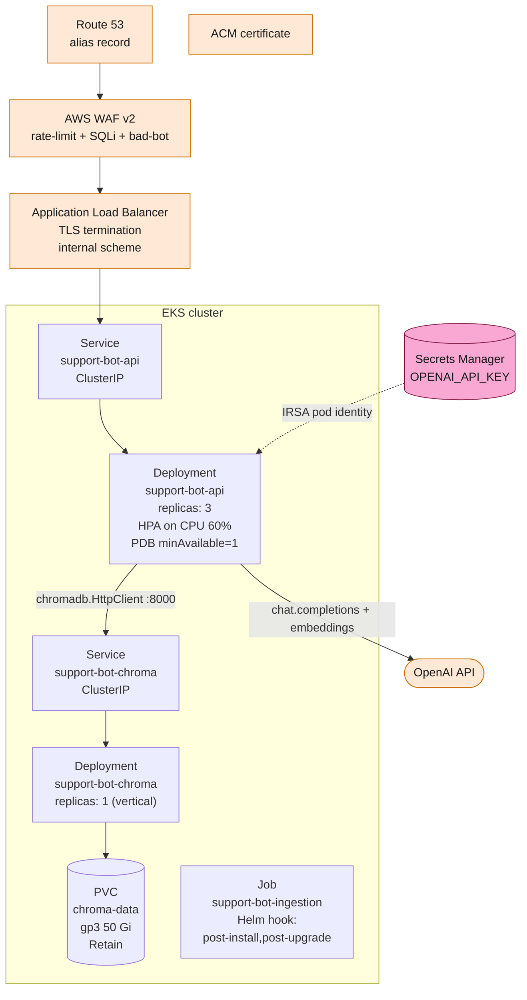

# Deep Dive — Deployment (Helm chart for EKS)

> **Goal:** explain the production deployment topology —
> the Helm chart layout, the K8s resources it produces, the
> scaling strategy, and the security hardening. Pairs with
> [`../architecture/aws-flow.md`](../architecture/aws-flow.md) (the AWS view from the architecture walkthrough) — this is the chart-level detail.

## Chart layout

```
deploy/helm/support-bot/
├── Chart.yaml
├── values.yaml                  # defaults
├── values.schema.json           # rejects empty secrets / URLs at install time
├── values-dev.yaml              # dev-cluster overlay (small resources)
├── values-prod.yaml             # prod overlay (HPA enabled, 3 replicas)
└── templates/
    ├── _helpers.tpl              # shared labels + selector helpers
    ├── configmap.yaml            # non-secret runtime config (LOG_LEVEL, etc.)
    ├── secret.yaml               # OPENAI_API_KEY + CHROMA_AUTH_TOKEN
    ├── service.yaml              # ClusterIP services for api + chroma
    ├── deployment-api.yaml       # FastAPI Deployment
    ├── deployment-chroma.yaml    # Chroma Deployment (single replica)
    ├── job-ingestion.yaml        # Helm hook Job (post-install,post-upgrade)
    └── pvc.yaml                  # Chroma PVC (50 Gi gp3, Retain reclaim)
```

## Helm render (prod values)



## Resource specifications (prod defaults)

| Component | replicas | CPU req | CPU lim | Mem req | Mem lim | Scaling |
|---|---|---|---|---|---|---|
| `Deployment/support-bot-api` | 3 (HPA 2–6) | 200m | 1000m | 384 Mi | 1 Gi | HPA on CPU 60% |
| `Deployment/support-bot-chroma` | 1 | 100m | 500m | 256 Mi | 512 Mi | vertical |
| `Job/support-bot-ingestion` | 1 (one-shot) | 200m | 1000m | 512 Mi | 2 Gi | backoffLimit=2 |
| `PodDisruptionBudget/support-bot-api` | n/a | n/a | n/a | n/a | n/a | `minAvailable=1` |

## How the components scale

| Component | Strategy | Why |
|---|---|---|
| **API pods** | `replicas: 3` baseline, **HPA** on CPU 60%, min 2 / max 6 pods. PDB `minAvailable=1` so an in-place rollout never drops all replicas. | The LangGraph workflow is CPU-bound on `OpenAIAnswerGenerator` and `OpenAIEmbedder` round-trips; scaling out adds HTTP concurrency. The single-vector-store dependency (Chroma) is not a bottleneck — vector lookups are O(log n). |
| **Chroma** (`StatefulSet`) | `replicas: 1`, vertical-scale only (CPU + memory `requests`/`limits`). PVC `gp3 50 Gi`, `persistentVolumeReclaimPolicy: Retain`. | Chroma 1.5.x does not support multi-writer clustering. Vertical scale is sufficient for the supported corpus size (~10 000 chunks). The `Retain` reclaim policy guarantees embeddings survive `helm uninstall` so a fresh install picks up where the last one left off. |
| **OTel Collector** (`DaemonSet`) | One collector per node. | Auto-instrumentation libraries are configured to export OTLP/HTTP to `localhost:4318`; the DaemonSet listens on the host network and fans out to the AWS Distro for OpenTelemetry (or a managed collector). |
| **Prometheus** (`kube-prometheus-stack`) | Cluster-wide scrape; retention 15 d locally, federated to Amazon Managed Prometheus for long-term. | The API exposes `/metrics` with `request_count_total`, `request_latency_seconds`, `retrieval_similarity_top1`, and `adapter_call_latency_seconds`. |

## Security

| Layer | Control | Where in the chart |
|---|---|---|
| **Edge** | AWS WAF v2 with rate-limit + managed SQLi / bad-bot rule groups in front of the ALB. | Out of chart scope; provisioned via Terraform / CDK. |
| **TLS** | ACM-managed certificate on the ALB; HTTPS-only listener; redirect HTTP → HTTPS at the listener level. | Out of chart scope. |
| **Pod identity** | Pods mount an IRSA-annotated ServiceAccount (`eks.amazonaws.com/role-arn: arn:aws:iam::…:role/support-bot-api`). The `support-bot/openai-api-key` and `support-bot/chroma-auth-token` Secrets are pulled via the AWS SDK on first use, cached in memory, and refreshed by the SDK on a TTL. **No static AWS credentials are ever mounted or baked into images.** | `templates/deployment-api.yaml` (`serviceAccountName: support-bot`). |
| **Container hardening** | Multi-stage `python:3.11.9-slim-bookworm` base; `USER app` (UID 1001) at runtime; `readOnlyRootFilesystem: true`; `runAsNonRoot: true`, `runAsUser: 1001`; drop all Linux capabilities; `seccomp: RuntimeDefault`. | `templates/deployment-api.yaml` (`securityContext`), `templates/job-ingestion.yaml`. |
| **Network** | EKS API pods use a `NetworkPolicy` that only allows egress to the Chroma Service (8000), OpenAI (`api.openai.com:443`), the OTel Collector (4318), and the Kubernetes API (for IRSA). Default-deny on ingress — only the ALB target group is allowed. | Out of chart scope; provisioned via the platform's baseline `NetworkPolicy`. |
| **Secrets at rest** | Chroma's auth token and OpenAI's API key live only in Secrets Manager. The Helm `Secret` template ships with `value:` empty; the operator supplies values at install time. `.env.example` lists every required env var with placeholders only. | `templates/secret.yaml`. |
| **Application-level scrubbing** | `SecretScrubber` runs on every error response body, every `structlog` log line, and every OTel span attribute. CI fails the build if any rendered Helm manifest contains `sk-[A-Za-z0-9]{32,}`. | `src/support_bot/adapters/secret_scrubber.py`, `.github/workflows/ci.yml` "Secret scan on rendered manifests". |

## Value validation at install time

The chart's `values.schema.json` enforces:

| Field | Required | Pattern / shape |
|---|---|---|
| `secret.openaiApiKey` | yes | `^sk-[A-Za-z0-9]{20,}$` (min 23 chars) |
| `secret.embeddingApiKey` | optional | same `sk-…` shape, or `null` |
| `secret.chromaAuthToken` | optional | non-empty string, or `null` |
| `config.sourceUrl` | yes | absolute `http(s)://…` URL, min 8 chars |
| `config.logLevel` | no | one of `DEBUG`/`INFO`/`WARNING`/`ERROR`/`CRITICAL` |
| `config.embedderBackend` | no | `local` \| `openai` |
| `config.answererBackend` | no | `openai` \| `fake` |

`helm install` / `helm template` validate the merged values against the JSON Schema **before** rendering any templates, so a misconfigured install fails fast at the client (`Error: values don't meet the specifications of the schema(s)`) without ever contacting the cluster.

## Ingestion as a Helm hook

The ingestion Job is declared with:

```yaml
annotations:
  "helm.sh/hook": post-install,post-upgrade
  "helm.sh/hook-delete-policy": hook-succeeded
```

This means:

- `helm install support-bot deploy/helm/support-bot/` → after all other resources are created, the Job runs once and ingests the source page into Chroma.
- `helm upgrade support-bot deploy/helm/support-bot/` → after the upgrade, the Job runs once and re-ingests (stable chunk IDs make this idempotent — the upserts overwrite in place).
- After the Job succeeds, Helm deletes it (`hook-delete-policy: hook-succeeded`) so subsequent `helm list` doesn't show it.
- The Job uses the same Docker image as the API container, with a different `CMD` (`python -m support_bot.composition.ingestion_main`).

## Production install

```bash
# 1. Create the namespace.
kubectl create namespace support-bot

# 2. Install the chart. The schema rejects empty secret.openaiApiKey
#    and empty config.sourceUrl so a typo or missing env-var fails
#    immediately at the client.
helm install support-bot deploy/helm/support-bot/ \
    --namespace support-bot \
    --values deploy/helm/support-bot/values-prod.yaml \
    --set secret.openaiApiKey=$OPENAI_API_KEY \
    --set config.sourceUrl=https://your.support.page/internet
```

## Scaling

```bash
helm upgrade support-bot deploy/helm/support-bot/ \
    --namespace support-bot \
    --reuse-values \
    --set autoscaling.minReplicas=4 \
    --set autoscaling.maxReplicas=10
```

Chroma is single-replica by design (vertical scale only). Increase `resources.chroma.limits` to handle larger collections.

## Secrets rotation

The chart's `Secret` template has empty defaults; keys are supplied at install time and stored in the cluster Secret unencrypted-at-rest (default Kubernetes behaviour). For production rotation:

1. Patch the secret with a new key value:
   `kubectl create secret ... --dry-run=client -o yaml | kubectl apply -f -`
2. Roll the deployment: `kubectl rollout restart deployment/support-bot-api`
3. The OTel collector log lines will show the new key hash once the new pod boots (the SecretScrubber keeps the raw key out of logs and span attributes).

## PVC retention across reinstalls

The PVC reclaim policy is operator-controlled at the **StorageClass** level (not the PVC level). The chart ships no `StorageClass`; the README and chart comment instruct the operator to provision the underlying StorageClass with `reclaimPolicy: Retain` per AGENTS.md §2.4.

```yaml
apiVersion: storage.k8s.io/v1
kind: StorageClass
metadata:
  name: support-bot-gp3
provisioner: ebs.csi.aws.com
reclaimPolicy: Retain
parameters:
  type: gp3
  fsType: ext4
```

Then point the chart at it:

```bash
helm install support-bot deploy/helm/support-bot/ \
    --set persistence.storageClassName=support-bot-gp3
```

## CI / GitHub Actions

The `.github/workflows/ci.yml` workflow runs the full quality gate on every push and PR: pytest, coverage, interrogate, ruff, lint-imports, helm lint, helm template kind coverage, the values.schema.json rejection tests, and a Secret scan on rendered manifests.

A separate `.github/workflows/docs.yml` workflow builds the MkDocs site and deploys it to the `gh-pages` branch on every push to main — that publishes the **public documentation site** at `https://bruj0.github.io/support-agent/`.

## Where to look in the code

| Concern | File |
|---|---|
| Chart manifest | `deploy/helm/support-bot/Chart.yaml` |
| Defaults | `deploy/helm/support-bot/values.yaml` |
| Schema (value validation) | `deploy/helm/support-bot/values.schema.json` |
| Prod overlay | `deploy/helm/support-bot/values-prod.yaml` |
| API Deployment | `deploy/helm/support-bot/templates/deployment-api.yaml` |
| Chroma Deployment | `deploy/helm/support-bot/templates/deployment-chroma.yaml` |
| Ingestion Job (Helm hook) | `deploy/helm/support-bot/templates/job-ingestion.yaml` |
| Secret templates | `deploy/helm/support-bot/templates/secret.yaml` |
| PVC | `deploy/helm/support-bot/templates/pvc.yaml` |
| Local stack | `deploy/docker-compose.yml` |
| CI | `.github/workflows/ci.yml` |
| Docs deploy | `.github/workflows/docs.yml` |
