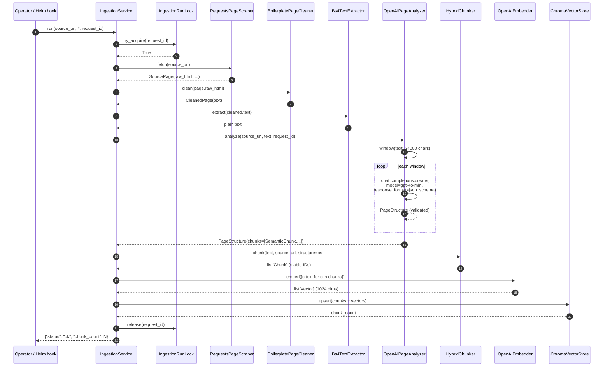

# Deep Dive — Ingestion Pipeline

> **Goal:** trace one ingestion Job from start to finish,
> showing exactly what each adapter does and how they
> collaborate. This is the implementation-level walkthrough
> that complements the high-level `IngestionService.run` in
> `docs/architecture/architecture.md` §6.1.

## High-level sequence



## Stages in detail

### Stage 0 — Lock acquisition

```python
# src/support_bot/application/ingestion/ingestion_service.py
if not self._lock.try_acquire(request_id):
    return {"status": "skipped", "reason": "run_in_progress",
            "request_id": request_id}
try:
    ...  # the entire pipeline runs inside this try
finally:
    self._lock.release(request_id)
```

The lock is a TTL-keyed file at `<LOCK_DIR>/<request_id>.lock`. Default TTL 600 s. A second concurrent run with a different `request_id` returns `"skipped"` immediately. Same `request_id` from a stale run will acquire (the TTL has expired) so re-ingesting with the same id is safe.

### Stage A — Analyse (LLM)

This is the WP06 path: the LLM reads the cleaned page and emits a structured `PageStructure` of semantic regions.

#### A.1 — `Bs4TextExtractor` (pre-processor)

```python
# src/support_bot/adapters/bs4_text_extractor.py
class Bs4TextExtractor:
    def extract(self, html: str) -> str: ...
```

Strips `<script>`, `<style>`, `<noscript>`. Keeps `<main>` and `<article>` if present, otherwise falls back to `<body>`. **No heuristic FAQ/heading detection lives here** — by the WP06 design decision the analyzer is LLM-only; bs4 is used solely to pre-strip noise tags.

Minimum-text-length gate (default 100 chars) catches pages that collapsed to nothing after extraction.

#### A.2 — `OpenAIPageAnalyzer` (LLM)

```python
# src/support_bot/adapters/llm_page_analyzer.py
class OpenAIPageAnalyzer:
    def __init__(self, *, model="gpt-4o-mini",
                 max_input_chars=24_000, max_retries=3): ...
    def analyze(self, *, source_url, text, request_id) -> PageStructure: ...
```

How it works:

- **Windowing.** Long pages are split into `max_input_chars`-sized windows (default 24 000 chars ≈ 6 000 tokens, well inside `gpt-4o-mini`'s context). Each window is analyzed independently; `SemanticChunk` lists are concatenated.
- **Structured output.** The call sets `response_format={"type": "json_schema", "json_schema": …}` with a **strict** schema; the SDK refuses any response that doesn't match. Pydantic re-validates after `json.loads` (defence in depth).
- **System prompt rules:**
  1. Never invent content.
  2. FAQ pages → emit one `kind='faq'` entry per Q/A pair.
  3. Non-FAQ pages → emit `kind='section'` / `'list'` / `'paragraph'` / `'table'` / `'other'` per region.
  4. Preserve the source language.
- **Retry policy.** `max_retries=3` attempts per window. `ValidationError` / `JSONDecodeError` / `KeyError` → one retry with `STRICT_RETRY_PROMPT` ("Reply with ONLY the JSON object."). `openai.OpenAIError` (5xx / timeouts) → plain retries on the original prompt. After the third attempt, `LLMUnavailable` is raised.
- **Observability.** Manual span `adapter.page_analyzer.analyze` with `request.id`, `analyzer.input_text_length`, `analyzer.window_count`, `analyzer.model`, `analyzer.region_count`, `analyzer.faq_count`, `analyzer.tokens_in`, `analyzer.tokens_out`.

The Ziggo page (~30 000 chars cleaned) → 2 windows → ~21 `SemanticChunk` entries (10 FAQ + 11 other).

### Stage B — Chunk, embed, persist (local)

#### B.1 — `HybridChunker`

```python
# src/support_bot/adapters/hybrid_chunker.py
class HybridChunker:
    def __init__(self, *, max_chunk_chars=4_000): ...
    def chunk(self, text, *, source_url, structure, ...) -> list[Chunk]: ...
```

- **Per-region chunking.** Walks `PageStructure.chunks`, emits one `Chunk` per `SemanticChunk`.
- **FAQ chunks.** For `kind='faq'`: prepend the question (`title`) to the chunk text so retrieval matches the Q/A pair as a unit. Also store `title` in `Chunk.section` for lexical-re-rank exact-match preference.
- **Oversized split.** Sections whose `title + body` exceed `max_chunk_chars` are split on **sentence boundaries** (`[.!?]\s+`). Each piece still carries the section title. A single sentence longer than the cap is emitted as one oversized chunk (readability over balance).
- **Idempotent IDs.** `chunk_id = sha1(source_url + ":" + ordinal)[:40]` with monotonic ordinal. Re-running against the same source produces identical IDs → Chroma upsert overwrites, no duplicates.
- **Loud contract.** `HybridChunker.chunk(structure=None)` raises `ConfigurationError` ("requires a PageStructure; use FixedSizeChunker for the no-analyzer path"). Forgetting to wire the analyzer is a programming error and the chunker refuses to silently fall back.

#### B.2 — `OpenAIEmbedder`

```python
# src/support_bot/adapters/embedding_openai.py
class OpenAIEmbedder:
    def __init__(self, *, model="text-embedding-3-large",
                 dimensions=1024, api_key=None): ...
    def embed(self, texts: list[str]) -> list[list[float]]: ...
```

- **Default model:** `text-embedding-3-large` (3072 dims truncated to 1024 via Matryoshka).
- **Matryoshka truncation** passes `dimensions=1024` to the SDK; the OpenAI v3 models are MRL-trained so the first N dimensions are an independently useful embedding. Storage is 3× cheaper; cosine is 3× faster.
- **Batching.** Single `embeddings.create` call with the full batch; one HTTP round-trip per ingestion.
- **For `text-embedding-3-large`, `dimensions` is supported;** for older models the kwarg is ignored.

#### B.3 — `ChromaVectorStore.upsert`

```python
# src/support_bot/adapters/vectorstore_chroma.py
class ChromaVectorStore:
    def upsert(self, chunks: list[Chunk]) -> None: ...
```

- **Stable IDs.** Uses `chunk.chunk_id` as the Chroma document id → idempotent upserts.
- **Metadata.** `source_url`, `section`, `ordinal` stored as Chroma metadata. Useful for future filtering (`WHERE section = '...'`).
- **Batching.** Splits into batches of ≤ 400 chunks per `upsert` call to stay under Chroma's payload limits.
- **Retry.** Transient Chroma 5xx triggers `Retry-After` honoured retries inside the adapter.

## Failure injection matrix

| Failure | Stage | Outcome |
|---|---|---|
| Scraper 5xx / timeout | Stage 0.5 | `SourcePageUnreachable`; pipeline aborts; vectorstore **not touched**. |
| Cleaner returns empty | Stage 0.6 | `SourcePageGarbage`; pipeline aborts; vectorstore **not touched**. |
| LLM returns malformed JSON | Stage A.2 (attempt 1) | Retry with `STRICT_RETRY_PROMPT` (attempt 2). If still invalid, `LLMUnavailable`; pipeline aborts. |
| OpenAI 5xx / timeout | Stage A.2 (any attempt) | Plain retries up to `max_retries=3`. After that, `LLMUnavailable`; pipeline aborts. |
| `PageStructure.source_url` ≠ chunker's `source_url` | Stage B.1 | `ConfigurationError` (programming error). |
| Empty `PageStructure.chunks` | Stage B.1 | Returns `[]`; ingestion returns `{"status": "ok", "chunk_count": 0}`. |
| Section > 4 000 chars | Stage B.1 | Split on sentence boundaries; multiple chunks, each carrying the same `section` title. |
| Single sentence > 4 000 chars | Stage B.1 | Emitted as one oversized chunk. |
| Chroma 5xx | Stage B.3 | `Retry-After` honoured; after retries, `VectorStoreUnavailable` → API returns 503 (if reached via ask flow). |
| Lock held by another run | Stage 0 | `{"status": "skipped", "reason": "run_in_progress"}`. |
| Lock TTL expires mid-run | Stage 0+ | Lock is **always released** in `finally` — no stale lock can block subsequent runs. |

## Span / log shape (one chunk-embed-upsert sequence)

```
node.retrieve                  (none — this is the ingestion flow)

adapter.page_analyzer.analyze
  request.id=<request_id>
  analyzer.input_text_length=30000
  analyzer.window_count=2
  analyzer.model=gpt-4o-mini
  analyzer.region_count=21
  analyzer.faq_count=10
  analyzer.tokens_in=...        (sum of chunk lengths)
  analyzer.tokens_out=...       (response length)

adapter.call.start             (DEBUG, adapter="HybridChunker", operation="chunk")
adapter.call.ok                (INFO,  region_count=21, faq_count=10,
                                oversized_count=0, emitted_count=21,
                                latency_ms=0.1)

adapter.call.start             (DEBUG, adapter="OpenAIEmbedder", operation="embed")
adapter.call.ok                (INFO,  returned=21, dimensions=1024,
                                latency_ms=1062)

adapter.call.start             (DEBUG, adapter="ChromaVectorStore", operation="upsert")
adapter.call.ok                (INFO,  chunk_count=21, latency_ms=319)
```

## Where to look in the code

| Concern | File |
|---|---|
| `IngestionService.run` | `src/support_bot/application/ingestion/ingestion_service.py` |
| `IngestionRunLock` | `src/support_bot/application/ingestion/ingestion_lock.py` |
| Scraper | `src/support_bot/adapters/http_source.py` |
| Cleaner | `src/support_bot/adapters/cleaner.py` |
| Bs4 extractor | `src/support_bot/adapters/bs4_text_extractor.py` |
| Page analyser | `src/support_bot/adapters/llm_page_analyzer.py` |
| Hybrid chunker | `src/support_bot/adapters/hybrid_chunker.py` |
| OpenAI embedder | `src/support_bot/adapters/embedding_openai.py` |
| Chroma vector store | `src/support_bot/adapters/vectorstore_chroma.py` |
