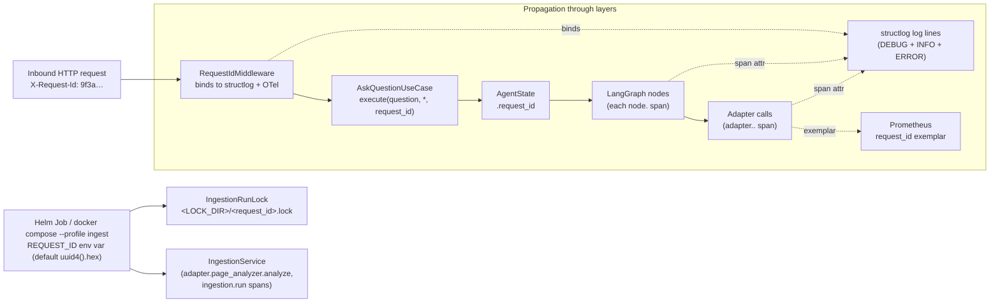
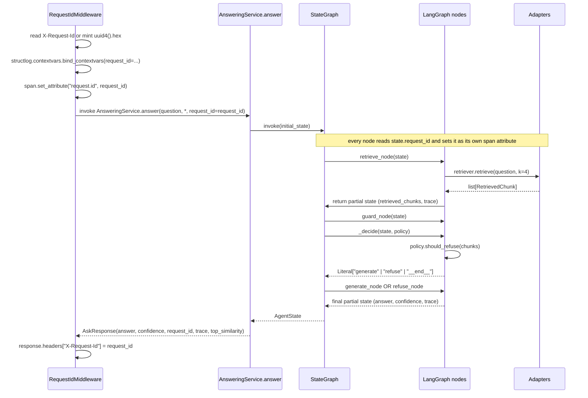

# Deep Dive — Observability (one `request_id` across all layers)

> **Goal:** explain the observability contract that ties
> every layer together. A single `request_id` travels from
> the inbound HTTP header to every log line, OTel span,
> metric exemplar, and on-disk artefact in the same
> request's lifetime — so when a user reports "my question
> returned 'I cannot answer based on the available content'",
> you can filter the logs by that id and see exactly what
> happened.

## The contract



## The three rules

These are not aspirational; they are enforced by code review and by the tests that fail the build when violated.

### Rule 1 — OpenTelemetry for distributed tracing

- **OTel SDK initialised in `composition/observability.py`**, imported once at the start of both `composition/api_app.py` and `composition/ingestion_main.py` (in that order — before building any adapter, app, or use case).
- **Exporter:** OTLP/HTTP, endpoint from `OTEL_EXPORTER_OTLP_ENDPOINT` env var. No exporter configured → spans still created and attached to logs, but discarded.
- **Resource attributes:** `service.name=support-bot`, `service.namespace=<from env>`, `deployment.environment=<from env>`, `service.version=<from pyproject>`.
- **Auto-instrumentation:** FastAPI, httpx, logging, chromadb.
- **Manual spans:** every LangGraph node (`node.<name>`), every adapter call (`adapter.<port>.<method>`), the guard / conditional edge (`node.guard_edge` with `decision.path`), and each ingestion step (`ingestion.run`, `ingestion.lock`, `ingestion.fetch`, `ingestion.clean`, `ingestion.analyze`, `ingestion.validate`, `ingestion.chunk`, `ingestion.embed`, `ingestion.upsert`).
- **PII rule:** no raw question / answer text in spans. Use `sha256(text).hexdigest[:16]` as `*.text_hash`. The full text goes only to logs (after `SecretScrubber`).

### Rule 2 — A single `request_id` propagates through every layer

| Source | Where it's set | Where it's used |
|---|---|---|
| `RequestIdMiddleware` | Reads `X-Request-Id` from inbound headers or mints `uuid4().hex`. | First in the FastAPI middleware chain. |
| `AskQuestionUseCase.execute` | Explicit `request_id` keyword argument. | `AgentState.request_id`. |
| LangGraph nodes | Read from `state.request_id`. | Set as `span.set_attribute("request.id", ...)`. |
| Adapter call logs | Passed in the kwargs of every adapter call. | Emitted in `adapter.call.start` / `adapter.call.ok` log lines. |
| Ingestion Job | `REQUEST_ID` env var (default `uuid4().hex`; `RUN_ID` is a deprecated alias). | Names the lock file `<LOCK_DIR>/<request_id>.lock`; sets every ingestion step's `request.id` span attribute. |

**No layer may re-generate a new ID.** If a downstream service issues its own ID (e.g. Chroma's request id), log both with explicit field names (`upstream_request_id`, never reuse the field `request_id`).

### Rule 3 — All implementations must log enough to be debuggable

Every non-trivial branch emits a DEBUG-level log with enough context to diagnose without re-running. The bar: given only the log line and the line number, an engineer can explain *why* this branch was taken.

```python
logger.debug(
    "adapter.call.start",
    adapter="HttpEmbedder",
    operation="embed",
    request_id=request_id,
    input_count=len(texts),
    batch_size=self._batch_size,
)
# ... do the work ...
logger.info(
    "adapter.call.ok",
    adapter="HttpEmbedder",
    operation="embed",
    request_id=request_id,
    latency_ms=elapsed_ms,
    returned=len(vectors),
    dimensions=self._dimensions,
)
```

DEBUG-level lines include enough inputs to reproduce the call deterministically (counts, sizes, `*_text_hash` where the content itself is sensitive). INFO / ERROR lines carry `latency_ms`, status, counts, and IDs but never raw payloads or secrets. Use `*_text_hash` consistently when the content is text.

## Logging contract — minimum `structlog` processors

Every module that emits logs uses this chain (set up in `composition/api_app.py`):

```python
structlog.configure(
    processors=[
        structlog.contextvars.merge_contextvars,   # picks up request_id, trace_id, span_id
        structlog.processors.add_log_level,
        structlog.processors.TimeStamper(fmt="iso", utc=True),
        SecretScrubber(),                          # scrubs sk-…, sk-ant-…, configurable substrings
        structlog.processors.JSONRenderer(),
    ]
)
```

The output is one JSON line per event on stdout. Example:

```json
{"event": "adapter.call.ok", "adapter": "OpenAIEmbedder", "operation": "embed", "request_id": "9f3a…", "latency_ms": 1062, "returned": 21, "dimensions": 1024, "level": "info", "timestamp": "2026-09-09T08:52:50.358Z"}
```

The `trace_id` and `span_id` fields are injected automatically by `opentelemetry-instrumentation-logging` — even when no OTLP exporter is configured, every log line carries the trace id.

## Request ID propagation in the LangGraph graph



## Metrics (Prometheus)

`GET /metrics` — text/plain Prometheus exposition.

| Series | Type | Labels | Set when |
|---|---|---|---|
| `request_count_total` | counter | `route`, `status` | Every response. |
| `request_latency_seconds` | histogram | `route` | Every response. Uses `request_id` as OpenMetrics exemplar. |
| `retrieval_similarity_top1` | gauge | — | After the `retrieve` node. |
| `adapter_call_latency_seconds` | histogram | `adapter`, `operation` | Every adapter call. |

Where both Prometheus and OTel metrics exist, **prefer OTel** for new code; Prometheus stays for backwards compatibility with the existing `GET /metrics` endpoint.

## Health endpoint

`GET /healthz` returns 200 `{"status":"ok"}` regardless of Chroma reachability (per FR-002). The API must survive a Chroma restart without crashing — the `chromadb.HttpClient` reconnects on the next request after recovery.

## Debugging a single request — worked example

A user reports: *"My question returned 'I cannot answer based on the available content.'"*

```bash
# 1. Find the request_id from the API logs (it was echoed on the response).
docker compose logs api | jq -c 'select(.event == "http.response") | {request_id, status}'

# 2. Trace that request_id end-to-end through the logs.
docker compose logs api 2>&1 | jq -c 'select(.request_id == "9f3a…")'
```

You'll see one log line per step (`adapter.call.start`, `adapter.call.ok`) plus the OTel `trace_id` / `span_id` injected by `opentelemetry-instrumentation-logging`. With `OTEL_EXPORTER_OTLP_ENDPOINT` set, the same traces are exported to your collector for cross-service correlation.

```json
{"event": "adapter.call.start", "adapter": "ChromaRetriever", "operation": "retrieve", "request_id": "9f3a…", "k": 4, "level": "debug"}
{"event": "adapter.call.ok", "adapter": "ChromaRetriever", "operation": "retrieve", "request_id": "9f3a…", "candidate_count": 4, "top1_similarity": 0.42, "latency_ms": 8, "level": "info"}
{"event": "node.guard_edge.decision", "request_id": "9f3a…", "decision_path": "refuse", "candidate_count": 4, "level": "debug"}
{"event": "adapter.call.ok", "adapter": "ThresholdLowConfidencePolicy", "operation": "should_refuse", "request_id": "9f3a…", "top1": 0.42, "threshold": 0.5, "decision": "refuse", "level": "info"}
{"event": "node.refuse.ok", "request_id": "9f3a…", "answer_text_hash": "9b1f2c…", "level": "debug"}
{"event": "http.response", "request_id": "9f3a…", "route": "POST /ask", "status_code": 200, "latency_ms": 24, "level": "info"}
```

In one minute you have the full story: retrieval returned 4 candidates with top-1 similarity 0.42, the guard decided `refuse` (below threshold 0.5), the refuse node returned the fixed refusal string. The `top1_similarity=0.42` is the actionable data — the re-ranker isn't promoting the right chunk for this question.

## Where to look in the code

| Concern | File |
|---|---|
| OTel SDK init | `src/support_bot/composition/observability.py` |
| `RequestIdMiddleware` | `src/support_bot/application/api/middleware.py` |
| Prometheus middleware | `src/support_bot/application/api/metrics_middleware.py` |
| `MetricsRecorder` | `src/support_bot/adapters/metrics.py` |
| `SecretScrubber` | `src/support_bot/adapters/secret_scrubber.py` |
| `configure_logging` | `src/support_bot/adapters/structured_logger.py` |
| Span attributes in the LangGraph nodes | `src/support_bot/application/answering/graph.py` |
