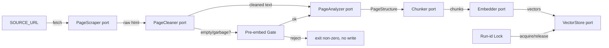
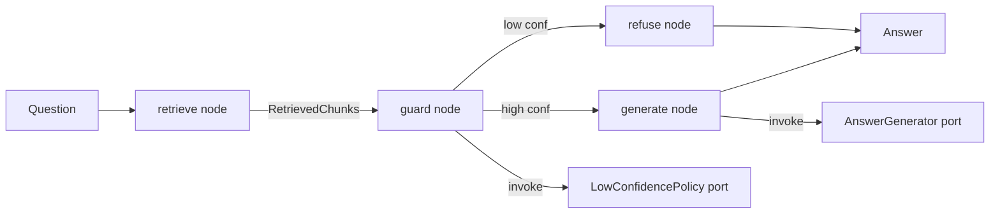
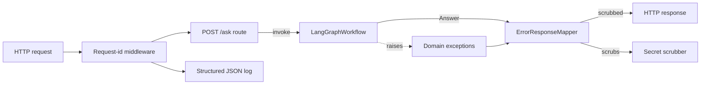
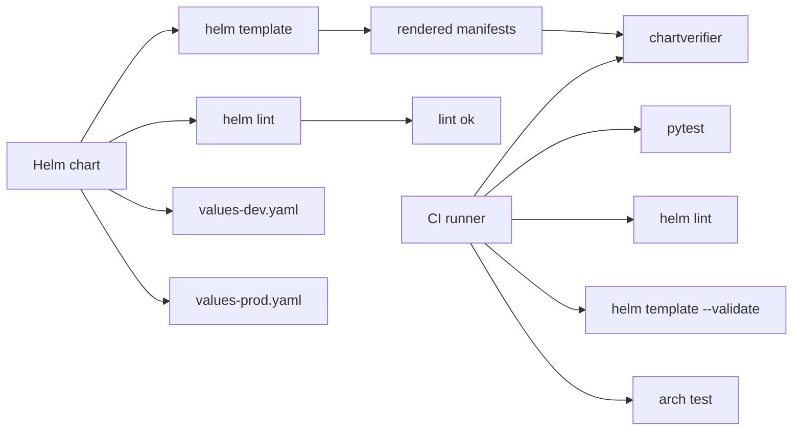

# Decomposition: Customer Support RAG Agent

**Feature Branch**: `001-customer-support-rag-agent`
**Created**: 2026-09-06
**Status**: Draft

---

## Misfit Inventory

Source: `specs/001-customer-support-rag-agent/spec.md` § Misfits.
Domains are taken verbatim from the spec; one misfit can carry multiple
domain tags.

| ID  | Misfit | Domain | Description |
|-----|--------|--------|-------------|
| M1  | A | Data Integrity | Source URL unreachable / non-2xx / empty body → ingestion must fail without half-populating Chroma. |
| M2  | B | Data Integrity | Source page structure changes → scraper returns garbage/empty → ingestion must reject before embedding. |
| M3  | C | Retrieval Quality | Lexically distant question → zero or low-similarity retrieval → agent must refuse, never invent. |
| M4  | D | Concurrency | Two ingestion Jobs run concurrently → index must end in a consistent state with no duplicate chunks. |
| M5  | E | Security | LLM/embedding API key leaks via logs, error messages, or response bodies. |
| M6  | F | Availability | Chroma unreachable on `/ask` → API returns 503, never a stack trace or hang. |
| M7  | G | Operational | Helm chart installed with invalid values / missing Secret → must fail at `helm install` / `helm template` time, not silently at runtime. |
| M8  | H | Retrieval Quality | LLM hallucinates outside retrieved context → must be prompt-constrained and testable. |

---

## Interaction Matrix

Linked pairs (X) reflect the Misfit Interaction Notes in spec.md and the
spec author's reasoning about resolution dependencies. A row/column pair
is marked X when resolving one misfit forces a change in the resolution
strategy of the other.

|     | M1 | M2 | M3 | M4 | M5 | M6 | M7 | M8 |
|-----|----|----|----|----|----|----|----|----|
| M1  | -- | X  |    | X  |    |    | X  |    |
| M2  | X  | -- |    | X  |    |    |    |    |
| M3  |    |    | -- |    |    |    |    | X  |
| M4  | X  | X  |    | -- |    |    | X  |    |
| M5  |    |    |    |    | -- | X  |    |    |
| M6  |    |    |    |    | X  | -- |    |    |
| M7  | X  |    |    | X  |    |    | -- |    |
| M8  |    |    | X  |    |    |    |    | -- |

**Reading the matrix:**
- **Dense cluster {M1, M2, M4, M7}**: ingestion-side failure modes share a
  common resolution surface (the ingestion Job's pre-embed gate, run-id
  lock, and the Helm chart's pre-install hook).
- **Dense cluster {M3, M8}**: retrieval quality and hallucination share
  the same mitigation surface (retrieval contract + system prompt +
  low-confidence policy).
- **Dense cluster {M5, M6}**: secret redaction and Chroma unavailability
  share the same resolution surface (a single error-response mapper at
  the API boundary).
- **Sparse links** (M1↔M7, M4↔M7): the Helm chart must coordinate with
  the ingestion Job on secrets/PVC/run-id — a cross-subsystem contract,
  not a tightly-coupled subsystem.

---

## Subsystem Identification

Four subsystems emerge from the matrix. The boundaries follow
Alexander's rule: dense internal coupling, sparse external coupling.

### Subsystem S1 — Ingestion Pipeline

**Misfits**: M1 (A), M2 (B), M4 (D)
**Boundary justification**: All three misfits happen at the *same seam* —
the boundary between the scraper output and the embedder input, plus
the run-id lock that guards concurrent Jobs. Resolving M1 and M2 share a
single pre-embed validation gate; resolving M4 lives in the same Job
process as the gate. Pulling M1/M2 out of the Job process forces the
validation into the API, which is the wrong place — the API does not
have access to the source page.
**Key responsibilities**:
- Fetch the configured `SOURCE_URL` via an HTTP client.
- Extract and clean main content via `PageScraper` + `PageCleaner`.
- Analyze the cleaned text with a `PageAnalyzer` to produce a
  `PageStructure` (semantic regions — FAQ, section, list, paragraph,
  table). Added by **WP06** to fix fragmented retrieval caused by
  naïve fixed-size chunking. May be skipped (`analyzerBackend=none`)
  when the source is small or to revert to the WP03 path.
- Chunk via the `Chunker` port. The default `HybridChunker` consumes
  `PageStructure` and emits one `Chunk` per FAQ plus semantic chunks
  for the rest; `FixedSizeChunker` is the WP03 fallback.
- Embed via the `Embedder` port.
- Persist atomically via the `VectorStore` port.
- Coordinate a run-id lock to prevent concurrent writes.
- Exit non-zero on any pre-embed failure *without* mutating the store.

### Subsystem S2 — Retrieval & Answering (LangGraph Agent)

**Misfits**: M3 (C), M8 (H)
**Boundary justification**: Both misfits reduce to the same problem —
*the agent must answer only from retrieved context and must signal when
context is insufficient*. The resolution is a single graph topology
(retrieve → guard → generate or refuse) and a single system prompt.
Separating retrieval quality from hallucination produces two adjacent
agents that share data but not policy; Alexander's misfit analysis says
keep them together because the prompt template and the
`LowConfidencePolicy` port are joint artefacts.
**Key responsibilities**:
- Receive a `Question` and produce an `Answer` + confidence flag.
- Invoke the `Retriever` port to fetch `RetrievedChunk`s.
- Apply the `LowConfidencePolicy` port to decide generate-vs-refuse.
- Invoke the `AnswerGenerator` port with a context-constrained prompt.
- Emit a trace of node visits for observability.

### Subsystem S3 — API & Cross-Cutting Safety

**Misfits**: M5 (E), M6 (F)
**Boundary justification**: Both misfits surface at the API error
boundary. M5 (secret leakage) and M6 (Chroma unavailability) both
require a single `ErrorResponseMapper` that scrubs credentials and
connection strings from any error path. Keeping them in one subsystem
avoids two competing scrubbers.
**Key responsibilities**:
- Expose `POST /ask` and `GET /healthz`.
- Map domain exceptions to HTTP responses (200/422/502/503).
- Scrub secrets and connection strings from all log lines and response
  bodies.
- Emit structured JSON logs with `request_id` propagation.
- Expose Prometheus metrics on `GET /metrics`.

### Subsystem S4 — Helm Packaging & CI

**Misfits**: M7 (G) plus the operational discipline implied by all
misfits (CI must run `pytest`, `helm lint`, and architecture tests).
**Boundary justification**: M7 lives in the chart. The CI gate is the
operational companion to every other subsystem's "test-first" constraint;
grouping it here keeps the cross-cutting enforcement surface in one
place. Cross-subsystem contracts from S1 (run-id lock, PVC name) and S3
(Secret references) terminate here.
**Key responsibilities**:
- Provide a renderable Helm chart with Deployments, Service, ConfigMap,
  Secret, PVC, and Job.
- Provide `values-dev.yaml` and `values-prod.yaml` overrides.
- Validate the chart with `helm lint` and `helm template` in CI.
- Run `pytest` (unit + contract + architecture) in CI.

---

## Constructive Diagrams

Each diagram shows the *constructive* pattern: a single diagram that
both expresses the misfit and implies the software structure that
resolves it.

### S1 — Ingestion Pipeline Diagram

**Components derived**:
- `PageScraper` (port) + HTTP/BS4 adapter — resolves M2 (rejects empty/garbage HTML).
- `PageCleaner` (port) + boilerplate-removal adapter — resolves M2 (further rejects after stripping).
- `PreEmbedValidator` (application service) — resolves M1 + M2 (the gate).
- `PageAnalyzer` (port) + LLM-driven adapter — added by WP06.
  Returns `PageStructure` with one `SemanticChunk` per logical region
  (FAQ, section, list, paragraph, table). Resolves the WP06 misfit
  (naïve fixed-size chunking fragments FAQ pairs and lists).
- `Chunker` (port) — interface accepts an optional `PageStructure`
  keyword. `HybridChunker` consumes the structure (one chunk per
  FAQ, semantic chunks elsewhere); `FixedSizeChunker` ignores it
  (WP03 fallback).
- `Embedder` (port) + OpenAI/local adapter — depends on config.
- `VectorStore` (port) + Chroma adapter — wraps atomic upsert + delete-by-source.
- `IngestionRunLock` (application service) — resolves M4.
- `IngestionJob` (composition root) — wires the above and reads `SOURCE_URL`.

### S2 — Retrieval & Answering Diagram

**Components derived**:
- `Retriever` (port) + Chroma adapter — wraps top-k similarity.
- `LowConfidencePolicy` (port) + threshold-based default — resolves M3.
- `AnswerGenerator` (port) + OpenAI adapter — resolves M8 (context-constrained prompt).
- `LangGraphWorkflow` (composition) — wires `retrieve → guard → generate|refuse`.
- `AgentState` (TypedDict) — `{question, retrieved_chunks, answer, confidence, trace}`.
- `Answer` entity — domain value object with `high|low` confidence tag.

### S3 — API & Cross-Cutting Safety Diagram

**Components derived**:
- `FastAPIApp` (composition) — wires routes + middleware.
- `RequestIdMiddleware` — emits `X-Request-Id` and propagates to logs.
- `AskRoute` — handles `POST /ask`.
- `HealthRoute` — handles `GET /healthz`.
- `MetricsRoute` — handles `GET /metrics`.
- `ErrorResponseMapper` — single point that converts domain exceptions
  to HTTP responses and applies the secret scrubber — resolves M5 + M6.
- `SecretScrubber` — utility that strips keys and Chroma URIs from any
  string before logging or responding.

### S4 — Helm Packaging & CI Diagram

**Components derived**:
- `chart/` — root chart directory.
- `chart/templates/deployment-api.yaml`, `deployment-chroma.yaml`,
  `service.yaml`, `configmap.yaml`, `secret.yaml`, `pvc.yaml`,
  `job-ingestion.yaml`.
- `chart/values.yaml`, `values-dev.yaml`, `values-prod.yaml`.
- `chart/Chart.yaml`, `chart/requirements.yaml` (if any).
- `.github/workflows/ci.yml` (or equivalent) — runs pytest + helm lint +
  helm template + chartverifier.

---

## Cross-Subsystem Contracts

Each contract is the single permitted coupling point between two
subsystems. Contracts are unidirectional; the receiving subsystem never
imports the producing subsystem's internals.

### Contract: S1 → S2 (Vector Store)

- **Data exchanged**: chunks (id, text, embedding, source_url, ordinal).
- **Failure mode**: S2 sees a missing chunk or empty store; must surface
  via `LowConfidencePolicy` (no propagation of S1's exceptions).
- **Coupling type**: shared schema (the `Chunk` entity) accessed through
  the `VectorStore` port only.

### Contract: S2 → S3 (Answer)

- **Data exchanged**: `Answer` (string, confidence tag, trace list).
- **Failure mode**: domain exceptions raised by S2 (e.g. `LLMUnavailable`,
  `VectorStoreUnavailable`) propagate; S3's `ErrorResponseMapper`
  converts them. S3 never re-raises; S2 never knows HTTP.
- **Coupling type**: port interface (`Answer` + exception types live in
  `domain/answering`).

### Contract: S4 → S1, S3 (Manifests + Secrets)

- **Data exchanged**:
  - To S1: `SOURCE_URL` via ConfigMap; Chroma credentials via Secret.
  - To S3: LLM/embedding API keys via Secret; Chroma URL via ConfigMap.
- **Failure mode**: missing Secret at install time → chart pre-install
  hook fails (M7). Stale PVC after `helm uninstall` → PVC is retained
  intentionally (per spec FR-018 / NFR).
- **Coupling type**: Kubernetes manifest contract (file paths and
  env-var names are an implicit schema, enforced by integration tests in
  S4's CI).

### Contract: S4 → all (Test gate)

- **Data exchanged**: CI runs domain + application tests against
  every subsystem's ports; subsystems must keep port interfaces stable.
- **Failure mode**: a port signature change without a corresponding
  adapter update fails CI.
- **Coupling type**: test artifacts (pytest collection) — no runtime
  coupling.

---

## Mapping to Plan

The plan should structure work packages (WPs) around the four subsystems,
with the cross-cutting contracts landing in their dependent WPs.

| Subsystem | Components | Suggested WP Scope |
|-----------|------------|-------------------|
| S1 Ingestion Pipeline | `PageScraper`, `PageCleaner`, `PageAnalyzer`, `Chunker`, `Embedder`, `VectorStore` ports; `PageStructure` / `SemanticChunk` entities; `IngestionRunLock`; `IngestionJob`; pre-embed gate | WP1: domain ports + fakes + tests. WP3: Docker image for ingestion. WP5: Helm Job template + pre-install hook. **WP6**: semantic `PageAnalyzer` + `HybridChunker` (LLM-driven region segmentation; replaces fragmented fixed-size chunks). |
| S2 Retrieval & Answering | `Retriever`, `LowConfidencePolicy`, `AnswerGenerator` ports; `LangGraphWorkflow`; `AgentState`; `Answer` entity | WP1: domain ports + fakes + tests (shared). WP2: LangGraph workflow + retrieval + refusal path. |
| S3 API & Cross-Cutting Safety | `FastAPIApp`, routes, middleware, `ErrorResponseMapper`, `SecretScrubber`, structured logging, Prometheus metrics | WP2 (shared composition root): API wiring. WP4: docker-compose stack. WP5: Helm Deployment + Service + Secret + ConfigMap. |
| S4 Helm Packaging & CI | Helm chart, `values-dev.yaml`/`values-prod.yaml`, CI workflow, architecture tests | WP4: docker-compose. WP5: full Helm chart + CI workflow. |

**Sequencing rationale**: WP1 establishes the domain ports and fakes
that all later WPs depend on (no adapter code yet). WP2 builds the
LangGraph workflow and the API composition root. WP3 builds the
ingestion Job container. WP4 wires docker-compose end-to-end. WP5
packages everything in Helm with a CI gate.

**Note on decomposition completeness**: every misfit is assigned to at
least one subsystem. Misfits M1, M2, M4, M7 have cross-subsystem
effects (S1↔S4) which are handled by the explicit contracts above
rather than by duplicating resolution across subsystems.