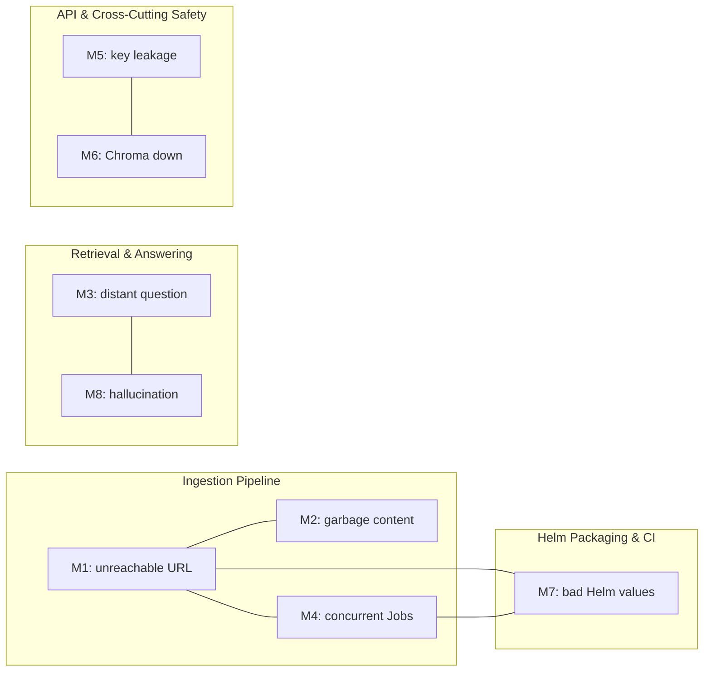
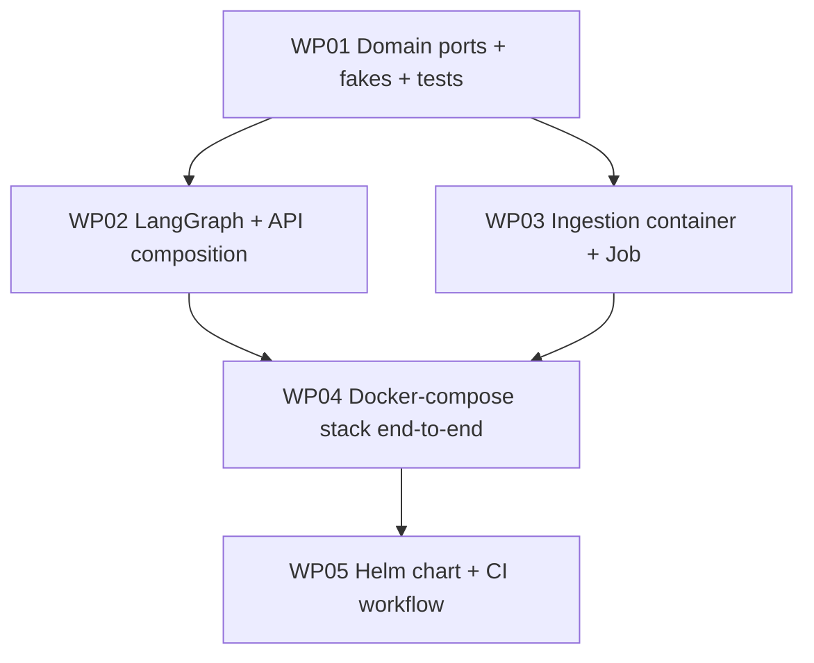

# Implementation Plan: 001 — Customer Support RAG Agent

**Branch**: `001-customer-support-rag-agent` | **Date**: 2026-09-06
**Spec**: [spec.md](spec.md) · **Decomposition**: [decomposition.md](decomposition.md)

---

## Summary

Build a self-hosted customer-support assistant that scrapes a configurable
public product page, builds a Chroma-backed retrieval index, and answers
end-user questions through a FastAPI endpoint backed by a custom
LangGraph workflow (`retrieve → guard → generate|refuse`). The system
ships as Docker images orchestrated by docker-compose for local
development and as a Helm chart for Kubernetes production. The
codebase follows a hexagonal (ports-and-adapters) layering, is
test-first for all domain/application code, and every module carries
Google-style docstrings explaining intent and design choices.

---

## Technical Context

**Language / Version**: Python 3.11
**Primary Dependencies** (pinned via `uv` lockfile):
- `fastapi` ≥ 0.115
- `uvicorn[standard]` ≥ 0.30
- `pydantic` ≥ 2.7
- `langgraph` ≥ 1.2, < 2.0 (uses `langgraph.graph.StateGraph` with the
  current `START`/`END` sentinels, Pydantic state, and `Literal[...]`
  conditional-edge return types). Pinned to the 1.2.x line because
  `create_react_agent` was deprecated in v1 in favour of
  `langchain.agents.create_agent`; we keep the explicit `StateGraph`
  because our control flow is *not* a single ReAct-style loop (the
  guard node short-circuits *before* the LLM call).
- `langchain` ≥ 1.3, < 2.0 (installed transitively for `create_agent`
  parity; we do **not** depend on `create_agent` directly in this
  feature, but we pin the version so future WP extensions can use it).
- `langchain-openai` ≥ 0.1
- `langchain-core` ≥ 0.3
- `chromadb` ≥ 0.5 (uses `chromadb.HttpClient` against the server image)
- `sentence-transformers` ≥ 3.0 (default local embedder)
- `requests` ≥ 2.32
- `beautifulsoup4` ≥ 4.12
- `prometheus-client` ≥ 0.20
- `structlog` ≥ 24.1 (JSON-formatted logs)
- `pytest` ≥ 8.2, `pytest-cov` ≥ 5.0, `pytest-asyncio` ≥ 0.23
- `import-linter` ≥ 2.0 (architecture layering enforcement — see
  Phase 0 / Research note for the combined `layers` + `forbidden`
  contract pattern)
- `interrogate` ≥ 1.7 (docstring-coverage gate; `--fail-under 100`
  on `domain/` and `application/`)
- `pydantic` ≥ 2.7 (used for graph state via `langgraph` 1.2.x's
  Pydantic state support)

**Storage**:
- Chroma vector store running in its own container (default image
  `chromadb/chroma:0.5.x`).
- Kubernetes PVC for Chroma persistence in the Helm chart.
- No SQL database. No object storage.

**Testing**:
- `pytest` for unit + contract tests.
- `pytest-cov` with thresholds: `domain/` ≥ 90%, `application/` ≥ 90%,
  `adapters/` ≥ 70%.
- `import-linter` (`lint-imports`) as a pytest step enforcing no
  back-imports from `domain/` or `application/` into `adapters/`.
- Failure-injection contract tests for HTTP, LLM, and Chroma adapters.
- A smoke test that runs `helm template` against `values-dev.yaml` and
  `helm lint` on the chart.

**Target Platform**:
- Local development: Docker Compose on Linux/macOS.
- Production: Kubernetes 1.28+ with a default StorageClass.
- Optional AWS mapping documented in README (EKS + ALB + Secrets
  Manager + EBS-backed PVCs).

**Project Type**: Single Python package + Helm chart + Docker artifacts.

**Performance Goals**:
- `POST /ask` p95 < 3 s end-to-end with up to 10,000 indexed chunks.
- Ingestion completes for the source page in < 60 s on a single CPU.
- `GET /healthz` p99 < 50 ms.

**Constraints**:
- API keys never appear in source, logs, response bodies, or rendered
  Helm manifests.
- Domain and application packages must not import from `adapters/`
  (full rule in **Phase 0.4: Hexagonal Layering**, section B — table
  of "may import / must not import" per layer).
- The `LangGraphWorkflow` must be a pure composition of ports — no
  direct `langchain`/`chromadb` imports inside the workflow. The
  full layering rationale is in **Phase 0.4** (sections A–I); the
  forward-compatibility escape hatch is in **Phase 0.5**.

**Scale / Scope**:
- One source page per index.
- One FastAPI Deployment (default 1 replica, scale 2–4 on prod).
- One Chroma Deployment (single replica, persistent PVC).
- One-time Helm Job per ingestion run.

---

## Constitution Check

*GATE: Must pass before implementation. Re-check after each WP lands.*

| Gate | Status | Notes |
|------|--------|-------|
| Python 3.11+ | ✅ | Pinned via `uv` and `python:3.11-slim` base image. |
| pytest + 90%+ coverage on domain/application | ✅ | Enforced in CI by `pytest-cov` with `--cov-fail-under`. |
| Architecture layering (hexagonal) | ✅ | Enforced by `import-linter` with `layers` (exhaustive) + `forbidden` SDK contracts. |
| Google-style docstrings | ✅ | Enforced by `interrogate` ≥ 1.7 with `--fail-under 100` on `domain/` and `application/`. |
| Test-first (TDD) | ✅ | Mandated for every WP; commit log reviewed in PR. |
| Secrets out of artifacts | ✅ | CI scans rendered Helm manifests and built images. |

---

## Project Structure

```
support-bot/
├── pyproject.toml                 # uv-managed, deps + tool config
├── uv.lock
├── README.md                      # local run, model/store rationale, LangGraph design, AWS view
├── .env.example                   # SOURCE_URL, OPENAI_API_KEY, CHROMA_URL, etc.
├── .importlinter                  # layering contracts
├── src/
│   └── support_bot/
│       ├── domain/                  # NO adapter imports allowed
│       │   ├── ingestion/
│       │   │   ├── ports.py         # PageScraper, PageCleaner, Chunker, Embedder, VectorStore
│       │   │   └── entities.py      # SourcePage, Chunk
│       │   ├── answering/
│       │   │   ├── ports.py         # Retriever, AnswerGenerator, LowConfidencePolicy
│       │   │   └── entities.py      # Question, RetrievedChunk, Answer, Confidence
│       │   └── shared/
│       │       ├── errors.py        # Domain exceptions (LLMUnavailable, VectorStoreUnavailable, ...)
│       │       └── logging.py       # Log line schema, request_id helpers
│       ├── application/
│       │   ├── ingestion/
│       │   │   ├── pre_embed_validator.py
│       │   │   ├── ingestion_lock.py
│       │   │   └── ingestion_service.py
│       │   ├── answering/
│       │   │   ├── graph.py         # langgraph.StateGraph composition
│       │   │   ├── nodes.py         # retrieve, guard, generate, refuse
│       │   │   └── answering_service.py
│       │   └── api/
│       │       ├── routes.py        # /ask, /healthz, /metrics
│       │       ├── middleware.py    # RequestIdMiddleware, SecretScrubber
│       │       └── error_mapper.py  # Domain exceptions -> HTTP responses
│       ├── adapters/
│       │   ├── http_source.py       # PageScraper impl (requests + BeautifulSoup)
│       │   ├── cleaner.py           # PageCleaner impl
│       │   ├── chunker.py           # Chunker impl (fixed-size + overlap)
│       │   ├── embedding_openai.py  # Embedder impl (OpenAI)
│       │   ├── embedding_local.py   # Embedder impl (sentence-transformers)
│       │   ├── vectorstore_chroma.py# VectorStore + Retriever impl (chromadb.HttpClient)
│       │   ├── answerer_openai.py   # AnswerGenerator impl (ChatOpenAI)
│       │   └── secret_scrubber.py   # redaction impl
│       ├── composition/
│       │   ├── api_app.py           # FastAPI composition root
│       │   ├── ingestion_main.py    # CLI / Job entry point
│       │   └── settings.py          # pydantic-settings for env vars
│       └── __init__.py
├── tests/
│   ├── domain/                     # pure unit tests
│   ├── application/                # service tests using fake adapters
│   ├── adapters/                   # contract tests with mock servers
│   ├── architecture/               # import-linter contract tests
│   └── e2e/                        # docker-compose end-to-end smoke
├── docker/
│   ├── api.Dockerfile
│   ├── ingestion.Dockerfile
│   └── chroma.Dockerfile           # (optional wrapper; default uses official image)
├── deploy/
│   ├── docker-compose.yml          # API + Chroma + one-shot ingestion
│   └── helm/
│       └── support-bot/
│           ├── Chart.yaml
│           ├── values.yaml
│           ├── values-dev.yaml
│           ├── values-prod.yaml
│           └── templates/
│               ├── _helpers.tpl
│               ├── deployment-api.yaml
│               ├── deployment-chroma.yaml
│               ├── service-api.yaml
│               ├── service-chroma.yaml
│               ├── configmap.yaml
│               ├── secret.yaml
│               ├── pvc.yaml
│               ├── job-ingestion.yaml
│               └── pre-install-hook.yaml
└── docs/
    └── architecture/
        ├── local-flow.mmd
        └── aws-flow.mmd
```

---

## Phase 0: Research

Resolved during plan authoring with two rounds of web research
(Exa search of current docs, see audit log). All four outcomes are
**improvements** over the first draft of this plan and are reflected
throughout the rest of the document.

1. **LangGraph API choice — keep hand-written `StateGraph`, with 2026
   idioms.** As of LangGraph 1.2.x / LangChain 1.3.x (Aug 2026), the
   recommended single-agent entry point is
   `langchain.agents.create_agent`, which compiles to a `StateGraph`
   under the hood and exposes **middleware** hooks (`pre_model_hook`,
   `post_model_hook`) for guard-style customization. The official
   guidance (LangChain 1.0 announcement, Markaicode 2026 comparison,
   AgentNotebook 2026 tutorial) is to reach for `create_agent` by
   default for *single-agent support bots* and to drop to raw
   `StateGraph` only when the workflow's control flow "isn't a single
   ReAct-style loop."

   Our flow is `retrieve → guard → generate|refuse`. The **guard**
   short-circuits **before** any LLM call when retrieval is empty or
   low-similarity. That is precisely the case where the official
   guidance recommends `StateGraph`. The hybrid pattern from the
   Markaicode article (use `create_agent` for *what happens inside* a
   node, use `StateGraph` for *topology between* nodes) is the
   forward-compatible shape — we can later swap the `generate` node's
   body for a `create_agent` instance without changing the topology.

   2026-idiom updates applied to the plan:
   - Use `langgraph.graph.StateGraph` with the `START` / `END`
     sentinels (not the deprecated string constants).
   - Use a **Pydantic** `AgentState` (langgraph 1.2.x supports both
     TypedDict and Pydantic; Pydantic gives free validation and
     integrates with the docstring/coverage tooling).
   - Use `Literal["generate", "refuse", "__end__"]` return types on
     `add_conditional_edges` path functions.
   - Pin `langgraph>=1.2,<2.0` and `langchain>=1.3,<2.0`.
   [x] Resolved: explicit `StateGraph`, idiomatic per Aug 2026.

2. **Import Linter — combine `layers` + `forbidden` contracts.**
   The plan's first draft used a single `layers` contract. The
   2025/2026 best-practice writeup ("Hexagonal Boundaries Enforced
   by a Linter", Pedro Angel; the official Import Linter docs) is to
   add a **`forbidden` contract** that bans concrete SDKs from the
   domain package by name: `langchain`, `langgraph`, `chromadb`,
   `fastapi`, `requests`, `beautifulsoup4`. This catches the failure
   mode the layers-only contract misses — an SDK imported via an
   `__init__.py` re-export or via a top-level utility module. We
   also mark the `layers` contract as **`exhaustive`** so adding a
   new layer fails the build until it's declared in `.importlinter`.
   [x] Resolved: `import-linter` with `layers` (exhaustive) **plus**
   `forbidden` SDK contract.

3. **Chroma client.** Verified against current Chroma docs:
   `chromadb.HttpClient(host, port, ssl, headers, settings, tenant,
   database)` is the current Python API. `chromadb.PersistentClient`
   is only for local dev. Since the architecture mandates a separate
   Chroma container, the adapter uses `HttpClient`.

4. **Helm chart structure.** Verified against Helm v3 best practices:
   use `helm.sh/hook: pre-install` for Secret-required validation
   (M7), `helm.sh/hook: post-install,post-upgrade` on the Job for
   ingestion with `helm.sh/hook-delete-policy: hook-succeeded`, and
   a PVC with `persistentVolumeReclaimPolicy: Retain` so data
   survives `helm uninstall`.

No further research spikes required.

---

## Phase 0.4: Hexagonal Layering (Architecture of the Architecture)

The plan's cross-cutting constraint — "all I/O collaborators are
reached through ports defined in the domain layer" — is a specific
instance of the **hexagonal architecture** pattern (also called
"ports and adapters"), introduced by Alistair Cockburn in 2005 and
popularised in Python by Bob Gregory's *Architecture Patterns with
Python* (2020) and the "Hexagonal Boundaries Enforced by a Linter"
writeup (Pedro Angel, 2025).

This section explains the pattern so the implementer can apply it
consistently across every WP without re-deriving the rules. Hexagonal
layering is the *reason* the Markaicode hybrid pattern (Phase 0.5)
works; reading both together is recommended.

### A. The one-sentence rule

> The **domain** owns business rules and knows nothing about the
> outside world. The **outside world** knows how to talk to the
> domain through **ports** (interfaces). Adapters live in the
> outermost layer.

### B. The four layers, in dependency order

Dependencies point **inward**. Lower layers know nothing of higher
layers.

```
+-----------------------------------------------------+
|  composition/   entrypoints that build the app       |  (FastAPI app, ingestion CLI)
+-----------------------------------------------------+
              | wires adapters into application services
              v
+-----------------------------------------------------+
|  adapters/      concrete integrations               |  (chromadb, requests, OpenAI, BS4)
+-----------------------------------------------------+
              | implements ports
              v
+-----------------------------------------------------+
|  application/   use cases, orchestration, workflows |  (LangGraph, ingestion service)
+-----------------------------------------------------+
              | calls ports, owns entities
              v
+-----------------------------------------------------+
|  domain/        pure logic + entities + ports       |  (NO I/O, NO SDKs, NO stdlib I/O)
+-----------------------------------------------------+
```

| Layer | Owns | May import | Must NOT import |
|-------|------|------------|-----------------|
| `domain/` | Entities, value objects, domain exceptions, port interfaces | Standard library only | `application/`, `adapters/`, `composition/`, `langchain`, `langgraph`, `chromadb`, `fastapi`, `requests`, `beautifulsoup4`, `httpx`, `pydantic-settings`, `structlog` |
| `application/` | Use-case services, orchestration, the LangGraph topology | `domain/` | `adapters/`, `composition/`, the SDKs listed above |
| `adapters/` | Concrete implementations of domain ports | `domain/`, `application/`, the SDKs listed above | `composition/` |
| `composition/` | Composition roots: FastAPI app, ingestion CLI entry point, factory functions | All other layers | Nothing — this is the top |

### C. What is a port, exactly?

A **port** is a `typing.Protocol` (or abstract base class) that
declares the **shape** of a dependency without specifying its
implementation. The domain owns the port; the adapters implement it.

Two examples from `domain/answering/ports.py`:

```python
from typing import Protocol

class Retriever(Protocol):
    """Return chunks most similar to the question.

    Implementations live in `adapters/`. The domain only knows the
    return type (`list[RetrievedChunk]`) and the method signature.
    """
    def retrieve(self, question: str, k: int = 4) -> list[RetrievedChunk]: ...

class AnswerGenerator(Protocol):
    """Generate a final answer from a question and retrieved context.

    Implementations live in `adapters/`. The system prompt that
    constrains the model is the *adapter's* responsibility, not the
    domain's — but the domain owns the rule that answers must come
    only from retrieved context (see `LowConfidencePolicy`).
    """
    def generate(self, question: str,
                 retrieved: list[RetrievedChunk]) -> str: ...
```

Three rules that make ports actually work:

1. **The port lives in `domain/`.** Putting it in `adapters/`
   inverts the dependency arrow and makes the domain depend on the
   adapter's location.
2. **The port is a `Protocol`, not a concrete base class.** This
   keeps adapters free to use `__init__` for dependency injection
   without inheriting from anything in `domain/`.
3. **Every adapter has a conformance test.** A test in
   `tests/adapters/conftest.py` instantiates each adapter and
   asserts `isinstance(adapter, Port)` so a drift from the contract
   fails the build, not a code review.

### D. What is an adapter, exactly?

An **adapter** is a concrete class that implements one or more ports
using a specific I/O technology. Adapters import freely; that is their
job. Examples in this codebase:

| Adapter | Implements | Uses |
|---------|-----------|------|
| `adapters/vectorstore_chroma.py` | `VectorStore`, `Retriever` | `chromadb.HttpClient` |
| `adapters/answerer_openai.py` | `AnswerGenerator` | `langchain_openai.ChatOpenAI` |
| `adapters/embedding_local.py` | `Embedder` | `sentence_transformers.SentenceTransformer` |
| `adapters/http_source.py` | `PageScraper` | `requests`, `beautifulsoup4` |
| `adapters/secret_scrubber.py` | (helper, not a port) | `re` |

Adapters are **swappable**. Replacing one adapter with another that
implements the same port is a one-line change in the composition
root — no domain or application code is touched. That is the whole
point of the pattern: "going to production is a config change, not a
code rewrite."

### E. What is the composition root?

The **composition root** is the single place where adapters are wired
into the application services. It is the only layer allowed to import
from every other layer.

In this codebase the composition root is split across:

- `composition/api_app.py` — builds the FastAPI app, instantiates
  adapters based on env vars, wires the `LangGraphWorkflow` into the
  route handlers.
- `composition/ingestion_main.py` — builds the ingestion CLI,
  instantiates adapters for the ingestion pipeline, runs the Job.
- `composition/settings.py` — pydantic-settings configuration object
  consumed by both roots.

Composition roots are the **only** place where the dependency
direction is reversed (outer → inner). This is the price of having
a working app; everywhere else, dependencies point inward.

### F. Why we enforce it with `import-linter` instead of code review

The "Hexagonal Boundaries Enforced by a Linter" writeup captures the
problem precisely: *"Architecture maintained by vigilance decays:
every PR is a fresh chance for an SDK import to slip into the core,
and reviewers miss it."*

The plan enforces two machine-checked contracts (see Phase 0 / item 2
above):

- **`layers` (exhaustive).** Order: `domain < application < adapters
  < composition`. Every module in the codebase must be listed.
- **`forbidden` SDK contract.** `domain/` may not import
  `langchain`, `langgraph`, `chromadb`, `fastapi`, `requests`,
  `beautifulsoup4` by name. This catches the failure mode the
  layers-only contract misses: an SDK imported via an `__init__.py`
  re-export or via a top-level utility module.

Both contracts run in CI. A violation fails the build exactly like a
failing test — not as a friendly reviewer note.

### G. Why we pair it with TDD and Google-style docstrings

Hexagonal layering, TDD, and Google-style docstrings reinforce each
other:

- **Layering without TDD** lets misfit C (distant question → invented
  answer) slip in because there is no test asserting that the
  domain refuses to invent.
- **TDD without layering** lets an SDK leak into the domain and
  quietly couple it to the production stack; the next refactor
  becomes a re-architecture.
- **Docstrings without layering** describe an architecture that the
  code does not actually implement.
- **All three together** make the architecture **mechanical**: a new
  PR either passes the tests, the lint contracts, and the docstring
  coverage, or it does not. There is no middle ground.

### H. Common mistakes the implementer should avoid

1. **Importing `pydantic` from `domain/`.** Pydantic is fine in
   `application/` (for `AgentState`) and in `composition/` (for
   `settings`); it is forbidden in `domain/` because it is a
   framework.
2. **Putting a port in `adapters/`.** Once there, every other
   adapter that implements it must import it from `adapters/` — an
   upward dependency.
3. **Reading configuration inside `domain/`.** `domain/` may not
   import `composition/settings.py`. Configuration is read in the
   composition root and passed in via `__init__` parameters.
4. **Catching SDK exceptions in `domain/`.** If `chromadb` raises
   `chromadb.errors.NotFoundError`, the domain catches a domain
   exception (`VectorStoreUnavailable`); the mapping happens in
   `application/` or in the adapter that wraps the call.
5. **Adding "just one helper" to `domain/`.** Helpers go in
   `domain/shared/` if they are pure logic, otherwise in
   `application/`. If they touch I/O they belong in `adapters/`.

### I. Mental model summary

```
+----------+        +-------------+        +----------+
| FastAPI  |  -->   | application |  -->   | domain   |
| (comp.)  |        | (use cases) |        | (rules)  |
+----------+        +-------------+        +----------+
       |                  |                     ^
       v                  v                     |
+----------+        +-------------+        +----------+
| chromadb |  <--   |  AnswerGen  |  <--   | Answer   |
| OpenAI   |        |  port       |        | Generator|
| requests |        +-------------+        | port     |
+----------+                                 +----------+
   adapters                                domain owns
   implements                              the interface
```

Outer arrows = concrete implementations.
Inner arrows = dependencies that point only inward.
The domain is the *smallest* package — and the most stable.

---

## Phase 0.5: Codifying the Markaicode 2026 Hybrid Pattern

The Markaicode 2026 article "LangGraph vs LangChain in 2026: Do You
Need the Raw Graph?" formalises a pattern that this plan relies on for
forward compatibility:

> "Use `StateGraph` for topology, and `create_agent` for what happens
> inside each node. You rarely hand-roll the ReAct loop yourself
> anymore."

For this feature, the **topology** (`retrieve → guard →
generate|refuse`) is a non-ReAct control flow because the guard can
short-circuit **before** the LLM call. That stays on raw
`StateGraph`. The **body of the `generate` node**, however, is a
single-shot "answer the question with this context" task — exactly the
single-loop shape `create_agent` was built for. We deliberately leave
that swap as a future WP so this feature stays testable today, but we
codify the contract now so the implementer knows exactly what they can
# swap without, what they must keep stable, and how the hexagonal
layering is preserved.

### A. What the implementer **cannot** swap

These are part of the **domain or application** contract and stay on
raw `StateGraph` permanently:

| Element | Why it stays raw | Layer |
|---------|------------------|-------|
| `AgentState` (Pydantic `BaseModel`) | Pydantic validation is a domain invariant | `domain/answering` |
| `LangGraphWorkflow` (the topology builder) | Topology is the application contract | `application/answering` |
| `nodes.retrieve`, `nodes.guard`, `nodes.refuse` | Pure port-driven; no LLM involved | `application/answering` |
| The conditional edge `Literal["generate", "refuse", "__end__"]` | Routing is a domain rule, not a model choice | `application/answering` |
| The `Retriever`, `LowConfidencePolicy`, `AnswerGenerator` ports | Hexagonal — domain cannot import `langgraph` or `langchain` | `domain/answering` |

### B. What the implementer **can** swap

The body of `nodes.generate` (a single node function) can be replaced
by a `langchain.agents.create_agent` instance behind the same
`AnswerGenerator` port — *without* changing the topology, the state
schema, or any other node. This is the Markaicode hybrid in action.

The implementer must keep **three** invariants when performing the
swap:

1. The replacement must accept the **port's signature**, not the raw
   LLM API. Concretely:
   ```python
   # BEFORE — direct LLM call inside the node (what we ship in WP02)
   class OpenAIAnswerGenerator:
       def generate(self, question: str,
                    retrieved: list[RetrievedChunk]) -> str:
           return self._chat.invoke(self._build_prompt(question,
                                                       retrieved)).content

   # AFTER — `create_agent` wrapped behind the same port (future WP)
   class CreateAgentAnswerGenerator:
       def __init__(self, model: str, tools: list[BaseTool]) -> None:
           self._agent = create_agent(
               model=model,
               tools=tools,
               system_prompt=(
                   "Answer ONLY from the supplied retrieved context. "
                   "If the context is empty or insufficient, reply "
                   "exactly: I cannot answer based on the available "
                   "content."
               ),
               # Markaicode 2026 hybrid: the *body* is a single-loop
               # agent; the *topology* still belongs to StateGraph.
           )
       def generate(self, question: str,
                    retrieved: list[RetrievedChunk]) -> str:
           # The agent sees the retrieved context as a tool result.
           result = self._agent.invoke({
               "messages": [{
                   "role": "user",
                   "content": (
                       f"Question: {question}\n\n"
                       f"Context:\n{self._format(retrieved)}"
                   ),
               }],
           })
           return result["messages"][-1].content
   ```

2. The replacement must be **optional**, not mandatory. The default
   factory at `composition/api_app.py` chooses between
   `OpenAIAnswerGenerator` (default, ships today) and
   `CreateAgentAnswerGenerator` (opt-in via the
   `ANSWERER_BACKEND=create_agent` env var). The default keeps this
   feature working on a single OpenAI call without pulling in
   `langchain.agents` at runtime.

3. The replacement must **not break the graph contract**: the
   `generate` node still returns a string, the workflow still
   appends `"generate"` to `state["trace"]`, and the
   `LowConfidencePolicy` still gates whether `generate` is invoked
   at all.

### C. Where the swap lives in the package layout

| File | Owner | Role |
|------|-------|------|
| `domain/answering/ports.py` | domain | Declares `AnswerGenerator` — never imports `langchain`. **Stays as-is.** |
| `application/answering/nodes.py` | application | Declares `generate_node(state) -> dict`. Imports only the port. **Stays as-is.** |
| `application/answering/graph.py` | application | Wires nodes + conditional edges. Imports only the port + `langgraph`. **Stays as-is.** |
| `adapters/answerer_openai.py` | adapter | Concrete `OpenAIAnswerGenerator`. Imports `langchain_openai`. **Default in WP02.** |
| `adapters/answerer_create_agent.py` | adapter | Concrete `CreateAgentAnswerGenerator`. Imports `langchain.agents.create_agent`. **Added in a future WP, opt-in via env.** |
| `composition/api_app.py` | composition | Factory: `ANSWERER_BACKEND=openai\|create_agent` selects the adapter. **Modified in the future WP to register the new adapter; topology code is untouched.** |
| `tests/adapters/test_answerer_create_agent.py` | adapter | Contract test: asserts the new adapter satisfies the `AnswerGenerator` port via a `conftest.py` conformance fixture. **Added in the future WP.** |

### D. Why we ship the swap as opt-in, not default

- **Defaults ship today, on a single API key.** The `OpenAIAnswerGenerator`
  uses one `ChatOpenAI` call and one system prompt; it works on the
  simplest possible setup and needs zero `langchain.agents`
  knowledge.
- **The opt-in path proves the pattern works.** When a future WP
  enables `ANSWERER_BACKEND=create_agent`, the topology, the state,
  and every other node stay unchanged. That is the contract this
  section codifies — and it is the test that proves the hexagonal
  layering held up.
- **Forward-compatible with multi-agent extensions.** The same
  pattern extends to fan-out: a `planner` node built with
  `create_agent` could dispatch to `tv_agent` and `internet_agent`
  sub-agents built the same way, each plugged into its own
  `AnswerGenerator` subclass, all composed inside the same outer
  `StateGraph`. None of that requires touching
  `domain/answering/ports.py` or `application/answering/graph.py`.

### E. Codification checklist for the implementer

When the future WP that introduces `CreateAgentAnswerGenerator`
lands, the implementer must verify **all** of:

- [ ] `adapters/answerer_create_agent.py` exposes a class whose
      `generate(question, retrieved)` signature is **byte-identical**
      to `OpenAIAnswerGenerator.generate`.
- [ ] `tests/adapters/conftest.py` `port_conformance` fixture
      instantiates the new adapter and `assert isinstance(obj,
      AnswerGenerator)` passes — no `Protocol` decorator tricks, no
      `# type: ignore`.
- [ ] `import-linter` still passes: `domain/` still has zero imports
      of `langchain` or `langgraph`. Run `lint-imports --contract
      forbidden_domain_sdks` and confirm green.
- [ ] `tests/application/test_graph.py` runs the same graph topology
      with both adapters swapped in via the composition root and
      asserts the output `Answer` shape is identical
      (`answer.text`, `confidence`, `trace`).
- [ ] `tests/e2e/test_docker_compose.py` runs the existing
      `ANSWERER_BACKEND=openai` path AND a new
      `ANSWERER_BACKEND=create_agent` path; both pass with
      `confidence == "high"` and a non-empty `answer`.
- [ ] `interrogate --fail-under 100` passes on the new adapter
      (Google-style docstring on the class and on `generate`).
- [ ] `docs/architecture/local-flow.mmd` and `README.md` are
      updated to describe the opt-in path.

When all seven items pass, the Markaicode 2026 hybrid pattern is
codified in this codebase.

---

## Decomposition *(mandatory)*

### Misfit Interaction Graph

Imported from `decomposition.md`. Linked pairs carry forward from the
Misfit Interaction Notes in `spec.md`.

| Misfit | Linked To | Reason |
|--------|-----------|--------|
| M1 (A) Data Integrity — unreachable URL | M2, M4, M7 | Same pre-embed validation gate; same Job process; Helm pre-install hook verifies Secret. |
| M2 (B) Data Integrity — garbage/empty content | M1, M4 | Both rejected by the pre-embed validator before any embedder call. |
| M3 (C) Retrieval Quality — distant question | M8 | Refusal policy and prompt constraint jointly handle both. |
| M4 (D) Concurrency — overlapping Jobs | M1, M2, M7 | Run-id lock guards the same shared state. |
| M5 (E) Security — key leakage | M6 | Single `ErrorResponseMapper` scrubs both. |
| M6 (F) Availability — Chroma down | M5 | Same mapper turns it into HTTP 503 without leaking the URI. |
| M7 (G) Operational — bad Helm values | M1, M4 | Pre-install hook + run-id lock together. |
| M8 (H) Retrieval Quality — hallucination | M3 | Same prompt + policy. |



### Subsystem Boundaries

1. **S1 — Ingestion Pipeline** [Misfits: M1, M2, M4]
   - **Boundary justification**: All three misfits collapse onto a
     single seam — the boundary between scraper output and embedder
     input, plus the run-id lock. Pulling the validation out of the
     Job process would force the API to know about the source page,
     which violates hexagonal layering.
   - **External interactions**: Writes to `VectorStore` (consumed by
     S2). Reads `SOURCE_URL` from ConfigMap (provided by S4). Emits
     `IngestionRun` records into structured logs.

2. **S2 — Retrieval & Answering** [Misfits: M3, M8]
   - **Boundary justification**: Both misfits reduce to the same
     problem — *answer only from retrieved context and signal
     insufficient context*. The mitigation is a single graph topology
     and a single `LowConfidencePolicy` port.
   - **External interactions**: Reads from `VectorStore` (provided by
     S1 via the same port). Invokes `AnswerGenerator`. Returns
     `Answer` to S3. Raises domain exceptions on infrastructure
     failures (consumed by S3's error mapper).

3. **S3 — API & Cross-Cutting Safety** [Misfits: M5, M6]
   - **Boundary justification**: Both misfits surface at the API error
     boundary. A single `ErrorResponseMapper` + `SecretScrubber` seam
     handles both, avoiding two competing scrubbers.
   - **External interactions**: Invokes S2 (LangGraphWorkflow).
     Serves HTTP. Reads `OPENAI_API_KEY`, `EMBEDDING_API_KEY`, Chroma
     URL from environment (S4 via Secret/ConfigMap).

4. **S4 — Helm Packaging & CI** [Misfits: M7 + CI discipline]
   - **Boundary justification**: M7 lives in the chart. The CI gate
     enforces test-first discipline across all subsystems; grouping
     it here keeps the enforcement surface in one place.
   - **External interactions**: Provides manifests consumed by S1, S2,
     S3. Coordinates the run-id Secret and the PVC name across S1 and
     S3.

---

## Abstract Components *(mandatory)*

### S1 — Ingestion Pipeline

**Components**:
- **`PageScraper` port** — interface with `fetch(url) -> SourcePage`.
- **`PageCleaner` port** — interface with `clean(html) -> CleanedPage`.
- **`Chunker` port** — interface with
  `chunk(text, *, source_url, chunk_size=500, overlap=50, structure=None) -> list[Chunk]`.
  The `structure` keyword (added in WP06) accepts an optional
  `PageStructure` produced by the `PageAnalyzer`; chunkers that
  understand it (`HybridChunker`) emit semantic chunks; chunkers
  that ignore it (`FixedSizeChunker`) stay byte-compatible with
  WP03 callers.
- **`Embedder` port** — interface with `embed(text: str) -> list[float]`.
- **`VectorStore` port** — interface with
  `upsert(chunks)`, `delete_by_source(source_url)`, `count() -> int`.
- **`IngestionLock`** — application service exposing
  `try_acquire(run_id) -> bool` and `release(run_id)`. Uses a Redis-less
  scheme: writes a TTL-keyed file to a shared volume; second Job sees
  the file and exits with structured "skipped" status.
- **`PreEmbedValidator`** — application service that rejects empty or
  suspiciously short cleaned pages *before* embedding.
- **`IngestionService`** — application service that orchestrates the
  pipeline: fetch → clean → validate → chunk → embed → upsert, all
  inside a try/finally that releases the lock and never writes if the
  validator rejects.

**Entities**:
- **`SourcePage`** — `url: str`, `raw_html: str`, `fetched_at: datetime`.
- **`CleanedPage`** — `url: str`, `text: str`, `removed_boilerplate_count: int`.
- **`Chunk`** — `chunk_id: str`, `source_url: str`, `ordinal: int`,
  `text: str`, `embedding: list[float] | None`, `section: str | None`.

**Internal coupling**: pipeline is linear; lock is acquired before
fetch and released in `finally`. Validator is the only branch point.

### S2 — Retrieval & Answering

**Components**:
- **`Retriever` port** — interface with
  `retrieve(question, k) -> list[RetrievedChunk]`.
- **`LowConfidencePolicy` port** — interface with
  `should_refuse(chunks) -> bool` and `refusal_message() -> str`.
- **`AnswerGenerator` port** — interface with
  `generate(question, retrieved, system_prompt) -> str`.
- **`LangGraphWorkflow`** — application service that builds a
  `langgraph.graph.StateGraph` from four nodes (`retrieve`, `guard`,
  `generate`, `refuse`) and two conditional edges. Uses 2026 LangGraph
  idioms: `START` / `END` sentinels from `langgraph.graph`, a
  Pydantic `AgentState`, and `Literal["generate", "refuse", "__end__"]`
  return types on the path functions. Workflow has zero imports from
  `langchain_openai` or `chromadb` — it depends only on the three
  ports above. Future extensions can replace the body of any single
  node with a `langchain.agents.create_agent` instance without
  changing the topology.
- **`nodes.py`** — pure functions taking `AgentState` and returning a
  partial state update. Each node is independently testable. The
  `generate` node is intentionally LLM-aware but **not** LLM-coupled:
  it accepts an `AnswerGenerator` port and never imports any
  `langchain_*` or `chromadb` module.
- **`answering_service.py`** — thin wrapper around the compiled graph
  exposing `answer(question) -> Answer`. Translates domain exceptions
  to typed `AnsweringError` subclasses.

**Entities**:
- **`Question`** — `text: str`, `request_id: str`.
- **`RetrievedChunk`** — `chunk_id: str`, `text: str`, `source_url: str`,
  `similarity: float`.
- **`Confidence`** — `Literal["high", "low"]`.
- **`Answer`** — `text: str`, `confidence: Confidence`,
  `trace: list[str]`, `top_similarity: float`.
- **`AgentState`** — Pydantic `BaseModel` (LangGraph 1.2.x supports
  Pydantic state natively and gives us validation + the docstring
  tooling stays consistent):
  `{"question: str, retrieved_chunks: list[RetrievedChunk],
    answer: str, confidence: Confidence, trace: list[str]}`.

**Internal coupling**: nodes communicate only through `AgentState`;
the workflow holds no I/O references.

### S3 — API & Cross-Cutting Safety

**Components**:
- **`FastAPIApp` (composition)** — wires routes, middleware, and the
  composition root.
- **`RequestIdMiddleware`** — generates `request_id` per request,
  adds `X-Request-Id` to the response, and binds it to the log
  context.
- **`AskRoute`** — handles `POST /ask`. Validates the body via a
  pydantic model. Calls `answering_service.answer`. Returns JSON
  shaped per FR-001.
- **`HealthRoute`** — handles `GET /healthz`. Returns 200 / 503.
- **`MetricsRoute`** — handles `GET /metrics`. Exposes Prometheus
  metrics defined in NFR-014.
- **`ErrorResponseMapper`** — converts domain exceptions to HTTP
  responses and routes them through the `SecretScrubber` before
  emitting the response or the log line.
- **`SecretScrubber`** — utility that takes any string and strips
  substrings matching OpenAI key pattern (`sk-...`), Anthropic key
  pattern (`sk-ant-...`), and any `CHROMA_URL` value.

**Entities**:
- **`AskRequest`** — pydantic model: `{question: str}`.
- **`AskResponse`** — pydantic model:
  `{answer: str, confidence: Literal["high", "low"], trace: list[str]}`.

**Internal coupling**: routes depend only on `answering_service` and
the scrubber; the mapper depends on the exception hierarchy in
`domain.shared.errors`.

### S4 — Helm Packaging & CI

**Components**:
- **`chart/`** — full Helm v3 chart.
- **`templates/deployment-api.yaml`** — `Deployment` for the FastAPI
  container. `replicas` from values; `imagePullPolicy` from values;
  env from Secret + ConfigMap; liveness on `/healthz`.
- **`templates/deployment-chroma.yaml`** — `Deployment` for the
  Chroma container. PVC mount at `/chroma/chroma`.
- **`templates/service-{api,chroma}.yaml`** — ClusterIP services
  exposing the Deployments.
- **`templates/configmap.yaml`** — `SOURCE_URL`, `CHROMA_URL`,
  `LOG_LEVEL`, etc.
- **`templates/secret.yaml`** — `OPENAI_API_KEY`,
  `EMBEDDING_API_KEY`, `CHROMA_AUTH` (if used).
- **`templates/pvc.yaml`** — `ReadWriteOnce` PVC; reclaim policy
  `Retain` so data survives `helm uninstall`.
- **`templates/job-ingestion.yaml`** — runs the ingestion image once,
  with `helm.sh/hook: post-install,post-upgrade` and a manual
  re-trigger via `kubectl create job`.
- **`templates/pre-install-hook.yaml`** — `helm.sh/hook: pre-install`
  Job that asserts required Secrets and ConfigMaps exist; fails
  fast if not (resolves M7).
- **`.github/workflows/ci.yml`** — runs `uv sync`, `pytest`,
  `lint-imports`, `helm lint`, `helm template --validate`,
  `chart-verifier`.

**Internal coupling**: chart is purely declarative; CI step is a
shell pipeline.

---

## Inter-System Contracts *(mandatory)*

### Contract: S1 → S2 (VectorStore)

- **Producer**: S1's `VectorStore` port writes `Chunk` entities
  with stable `chunk_id`s.
- **Consumer**: S2's `Retriever` port reads via the same `VectorStore`
  port, scoped to top-k similarity.
- **Failure mode**: empty store on first read → `Retriever` returns
  `[]` → `LowConfidencePolicy` triggers refusal. No exceptions
  propagate across the contract.
- **Implementation method**: shared schema (`Chunk` entity) and
  shared port interface. Both subsystems import the port from
  `domain/ingestion/ports.py` and `domain/answering/ports.py`
  respectively, but never each other's internals.

### Contract: S2 → S3 (Answer + Domain Exceptions)

- **Producer**: `answering_service.answer(question) -> Answer` or
  raises a typed exception (`LLMUnavailable`, `VectorStoreUnavailable`,
  `EmptyRetrieval`).
- **Consumer**: S3's `AskRoute` returns JSON on success; S3's
  `ErrorResponseMapper` converts exceptions to HTTP responses.
- **Failure mode**: any infrastructure failure (M5, M6, M8) is
  reported as a domain exception with a sanitized message; the
  mapper scrubs both the exception's `args` and the response body.
- **Implementation method**: port interface (`AnsweringService`)
  with typed exception hierarchy in `domain/shared/errors.py`.

### Contract: S4 → S1 (Manifests + Secrets + ConfigMap)

- **Producer**: Helm chart produces the ConfigMap, Secret, PVC, and
  Job template.
- **Consumer**: S1's `IngestionService` reads `SOURCE_URL` from the
  env and writes embeddings through the `VectorStore` adapter
  configured by `CHROMA_URL`.
- **Failure mode**: missing Secret at install time → pre-install
  hook fails (M7).
- **Implementation method**: Kubernetes manifests + env-var
  contract documented in README and asserted by a smoke test.

### Contract: S4 → S3 (Manifests + ConfigMap)

- **Producer**: same Helm chart.
- **Consumer**: FastAPI composition root reads `OPENAI_API_KEY`,
  `EMBEDDING_API_KEY`, `CHROMA_URL` from env.
- **Failure mode**: keys not set at startup → adapter raises a
  configuration error → `ErrorResponseMapper` returns 503 (not 500,
  to avoid leaking the missing-key path).
- **Implementation method**: Kubernetes Secret + ConfigMap mounted
  as env vars; CI scans rendered manifests for any hard-coded
  secret values.

### Contract: S4 → all (Test gate)

- **Producer**: CI workflow runs `pytest`, `lint-imports`,
  `helm lint`, `helm template`, `chart-verifier`.
- **Consumer**: every subsystem must keep port signatures stable
  and pass lint / type checks.
- **Failure mode**: any failure → PR blocked.
- **Implementation method**: test artifacts; no runtime coupling.

---

## Phase 1: Design & Contracts

Key type signatures (full implementations land in WP1+WP2):

```python
# domain/ingestion/ports.py
class PageScraper(Protocol):
    def fetch(self, url: str) -> SourcePage: ...

class PageCleaner(Protocol):
    def clean(self, html: str) -> CleanedPage: ...

class Chunker(Protocol):
    def chunk(self, text: str, *, source_url: str,
              chunk_size: int = 500, overlap: int = 50,
              structure: PageStructure | None = None) -> list[Chunk]: ...

class PageAnalyzer(Protocol):
    """WP06 — LLM-driven semantic segmentation of a cleaned page.

    Returns a ``PageStructure`` with one ``SemanticChunk`` per logical
    region (FAQ, section, list, paragraph, table). The
    ``HybridChunker`` consumes this to emit one chunk per FAQ plus
    semantic chunks elsewhere.
    """
    def analyze(self, *, source_url: str, text: str,
                request_id: str) -> PageStructure: ...

class Embedder(Protocol):
    def embed(self, texts: list[str]) -> list[list[float]]: ...

class VectorStore(Protocol):
    def upsert(self, chunks: list[Chunk]) -> None: ...
    def delete_by_source(self, source_url: str) -> int: ...
    def count(self) -> int: ...
    def query(self, embedding: list[float], k: int) -> list[RetrievedChunk]: ...

# domain/answering/ports.py
class Retriever(Protocol):
    def retrieve(self, question: str, k: int = 4) -> list[RetrievedChunk]: ...

class LowConfidencePolicy(Protocol):
    def should_refuse(self, chunks: list[RetrievedChunk]) -> bool: ...
    def refusal_message(self) -> str: ...

class AnswerGenerator(Protocol):
    def generate(self, question: str, retrieved: list[RetrievedChunk]) -> str: ...

# application/answering/graph.py
from langgraph.graph import StateGraph, START, END

class LangGraphWorkflow:
    """Compose a `retrieve -> guard -> generate|refuse` topology.

    Built on `langgraph.graph.StateGraph` (LangGraph 1.2.x). The
    workflow has zero imports from `langchain_*` or `chromadb`; it
    depends only on the three ports declared in `domain.answering`.

    The `guard` node reads `AgentState.retrieved_chunks` and either
    routes to `generate` (high confidence) or `refuse` (low
    confidence) via a conditional edge with return type
    `Literal["generate", "refuse", "__end__"]`.
    """
    def __init__(self, retriever: Retriever,
                 policy: LowConfidencePolicy,
                 generator: AnswerGenerator) -> None: ...
    def compile(self) -> CompiledStateGraph: ...
    def answer(self, question: Question) -> Answer: ...
```

---

## Implementation Phases and WP Candidates



| Phase | WPs | Subsystem | Depends on | Can parallelise |
|-------|-----|-----------|------------|-----------------|
| Foundation | WP01 | S1, S2 (ports + tests) | — | No |
| Agent + API | WP02 | S2, S3 (workflow + routes) | WP01 | No |
| Ingestion | WP03 | S1 (image + Job CLI) | WP01 | Yes (with WP02) |
| Local stack | WP04 | S1+S2+S3 (compose + smoke) | WP02, WP03 | No |
| Production | WP05 | S4 (Helm + CI) | WP04 | No |

**WP01 — Domain ports, fakes, and unit tests**
- Define every port interface in `domain/ingestion/ports.py` and
  `domain/answering/ports.py`.
- Define every entity.
- Write `FakePageScraper`, `FakeChunker`, `FakeEmbedder`,
  `FakeVectorStore`, `FakeRetriever`, `FakeAnswerGenerator`,
  `StubLowConfidencePolicy`.
- Test-first: tests committed first, implementations second.

**WP02 — LangGraph workflow + API composition**
- Build `nodes.py`, `graph.py`, `answering_service.py`.
- Build `routes.py`, `middleware.py`, `error_mapper.py`.
- Add contract tests for routes against a `FakeRetriever`.
- Add contract tests for the workflow against `FakeRetriever` /
  `FakeAnswerGenerator` / `StubLowConfidencePolicy`.

**WP03 — Ingestion container**
- Build `http_source.py`, `cleaner.py`, `chunker.py`,
  `embedding_local.py`, `vectorstore_chroma.py`.
- Build `ingestion_main.py` as a CLI entry point.
- Build `docker/ingestion.Dockerfile`.
- Add failure-injection contract tests for the scraper, cleaner,
  validator, and lock.

**WP04 — Docker-compose stack**
- Build `docker/api.Dockerfile`.
- Build `deploy/docker-compose.yml` (api + chroma + ingestion
  one-shot profile).
- Add a smoke test that brings the stack up, sends `POST /ask`,
  and asserts `confidence == "high"`.
- Write the README sections for local run + model/store rationale
  + LangGraph design + AWS view.

**WP05 — Helm chart + CI**
- Build the chart (`deploy/helm/support-bot/`).
- Add `values.yaml`, `values-dev.yaml`, `values-prod.yaml`.
- Add `.github/workflows/ci.yml`.
- Add the helm smoke test that runs `helm template` and `helm lint`.
- Add the architecture test: `import-linter` configured with one
  **exhaustive `layers` contract** (`domain < application < adapters
  < composition`) **plus** one **`forbidden` SDK contract** that bans
  `langchain`, `langgraph`, `chromadb`, `fastapi`, `requests`,
  `beautifulsoup4` from `domain/`. Run via `pytest
  tests/architecture/test_imports.py` which shells out to
  `lint-imports` and asserts the contract is intact.

---

## Key Design Decisions

1. **Explicit LangGraph workflow, not a prebuilt agent.**
   `create_react_agent` / `create_agent` are designed for tool-calling
   agents; our graph needs a custom guard node with conditional
   routing. Using `StateGraph` keeps the topology explicit and
   testable. The Markaicode 2026 hybrid pattern (StateGraph topology
   + `create_agent` per node) is the forward-compatible extension
   path — we can later replace the `generate` node's body with a
   `create_agent` instance without changing the topology. See
   **Phase 0.5: Codifying the Markaicode 2026 Hybrid Pattern** for
   the full contract: what cannot be swapped (A), what can (B), the
   file-level mapping (C), why we ship as opt-in (D), and the
   seven-item checklist the implementer must pass (E).

2. **Hexagonal layering enforced by `import-linter` with two
   contracts.** A `layers` contract alone catches "domain imports
   adapters" but misses "domain imports SDK X via a re-export." We
   add a `forbidden` contract that bans `langchain`, `langgraph`,
   `chromadb`, `fastapi`, `requests`, `beautifulsoup4` from `domain/`
   by name, and mark the `layers` contract `exhaustive` so adding a
   new layer fails the build.

3. **Chroma as a separate process / Deployment.**
   Embedded Chroma would simplify the diagram but creates a race
   condition on multi-replica API Deployments. A separate Deployment
   with a PVC is operationally simpler and matches the assignment's
   docker-compose requirement.

4. **One-shot Helm Job for ingestion, not a CronJob.**
   The corpus is small (~one page) and the page changes are operator-
   driven. A post-install/post-upgrade `Job` with manual `kubectl
   create job` re-trigger is simpler than a CronJob and avoids
   surprise re-ingestion.

5. **Default to local HF embeddings.**
   The assignment calls for either OpenAI or HF; choosing local HF
   by default lets the Docker image build and run fully offline and
   keeps the free-tier story simple. OpenAI is a config-driven
   alternative.

6. **OpenAI as the default LLM.**
   The assignment hints at OpenAI and the latency / quality are
   appropriate for customer-facing Q&A. Pluggable via the
   `AnswerGenerator` port so a local alternative can be swapped in.

7. **`SecretScrubber` lives at the API edge, not in adapters.**
   This guarantees that even a misbehaving adapter cannot leak a
   secret past the API boundary. One scrubber, one place to audit.

8. **Run-id lock via a TTL file on a shared volume.**
   The ingestion Job runs in a cluster with no Redis. A TTL file on
   the same PVC used by Chroma is sufficient to detect concurrent
   runs. Simpler than wiring Redis for one lock.

---

## Risk Register

| Risk | Likelihood | Impact | Mitigation |
|------|-----------|--------|-----------|
| LangGraph API churn | Med | Med | Pin `langgraph>=1.2,<2.0` and `langchain>=1.3,<2.0`; integration tests pin `StateGraph` + `START`/`END` + Pydantic-state surface; forbid SDKs from `domain/` so accidental upgrades surface as build failures, not silent coupling. |
| Chroma image upgrade changes vector schema | Low | High | Pin the image tag in `values.yaml`; smoke test asserts a known chunk count after re-ingestion. |
| Source page structure changes and scraper returns empty | Med | High | M1/M2 — pre-embed validator rejects empty; covered by failure-injection test. |
| OpenAI rate limiting under load | Med | Med | `ErrorResponseMapper` converts to 502; the user is informed to retry. |
| Helm pre-install hook not running in all clusters | Low | Med | Add a Helm `template --validate` step in CI; document the hook in README. |
| Architecture test is brittle | Med | Low | `import-linter` rules are minimal (four layers) and re-validated after every WP. |
| Future `create_agent` swap drifts from the port contract | Med | Med | Phase 0.5 codifies the seven-item checklist; the `port_conformance` fixture in `tests/adapters/conftest.py` is the single test that catches a drift. |

---

## Open Questions

- [x] Resolved: use `langgraph.graph.StateGraph` directly (LangGraph
  1.2.x), not `create_react_agent` / `create_agent`. Idioms applied:
  `START`/`END` sentinels, Pydantic `AgentState`, `Literal[...]`
  return types on conditional edges, version-pinned `>=1.2,<2.0`.
- [x] Resolved: use `import-linter` with a combined `layers`
  (exhaustive) + `forbidden` SDK contract; the option label
  `pytest-archstyle` did not correspond to a real package.
- [API] Verify before WP01: `langgraph` 1.2.x `StateGraph.compile()`
  returns `CompiledStateGraph` and supports `.invoke(state)` with a
  Pydantic state model (per LangGraph 1.0 release notes the Pydantic
  state path is supported, but we will pin to a specific minor and
  assert the surface in the WP01 contract tests). → carried into
  WP01 as the first verification subtask.
- [Deferrable] FastAPI middleware order: `RequestIdMiddleware` must
  be first, then the router, so `request_id` is available to all
  downstream code. Asserted by integration test. → carried into
  WP02 as a deferred note.
- [Deferrable] Local docker-compose Chroma image: upstream
  `chromadb/chroma` with a pinned version. → carried into WP04 with
  the default already stated.