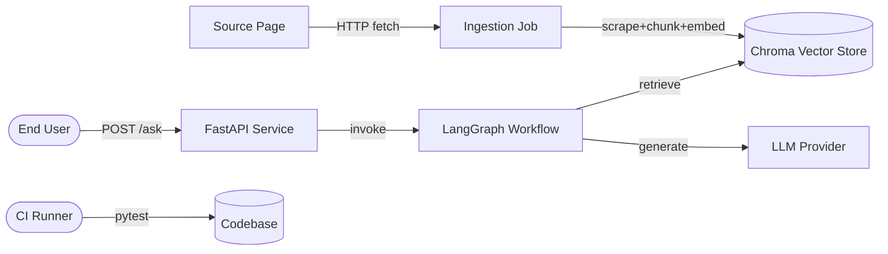

# Feature Specification: Customer Support RAG Agent

**Feature Branch**: `001-customer-support-rag-agent`
**Created**: 2026-09-06
**Status**: Draft

> Cross-cutting constraints (apply to every requirement below)
>
> 1. **SOLID / Hexagonal layering.** Domain entities and application services
>    depend on nothing. All I/O collaborators (HTTP, embedding provider,
>    vector store, LLM provider, scraper, chunker) are reached exclusively
>    through **ports** (interfaces) defined inside the domain layer.
>    Concrete **adapters** implementing those ports live in the adapters
>    package and are wired at the composition root.
> 2. **Test-first.** For every domain or application-service change, a
>    failing test is committed before the implementation. For I/O surfaces
>    (HTTP routes, Chroma adapter, LLM adapter) the test layer is smoke +
>    contract tests with the real adapter replaced by a fake that
>    implements the same port. The CI gate runs `pytest` and fails the
>    build on any non-passing test.
> 3. **Documentation.** Every module, class, and public function carries a
>    Google-style docstring that states intent, design choices, and
>    rationale (why this interface, why this default, why this rejection).

---

## Context *(mandatory)*

### System Interactions

The system is a self-hosted customer-support assistant that reads a single
public product page from a configurable source URL, builds a local retrieval
index over the page content, and answers end-user questions about that
content through an HTTP API. The deployment target is a Kubernetes cluster
exposed through a Helm chart; local development uses Docker Compose.

Actors and external systems:

- **End user** — a person who sends a question via HTTP and expects an
  answer grounded in the indexed page content.
- **Operations engineer** — runs the ingestion Job, redeploys the API,
  rotates secrets, reads logs.
- **Content owner** — owns the source page. The page may change shape
  (new sections, restructured DOM) without notice.
- **Embedding provider** — third-party model behind the `Embedder` port.
- **LLM provider** — third-party model behind the `AnswerGenerator` port.
- **Chroma vector store** — separate service exposing the
  `VectorStore` port.
- **Kubernetes cluster** — runs the Helm chart.
- **CI runner** — runs `pytest` on every PR.

### Context Diagram

### Use Cases

- **UC1**: End user + submits a natural-language question via `POST /ask`
  + receives an answer grounded in retrieved chunks, with a confidence
  flag indicating whether retrieval was successful.
- **UC2**: End user + submits a question whose answer is not present in
  the indexed content + receives a refusal message and a low-confidence
  flag, with no hallucinated content.
- **UC3**: Operations engineer + runs the ingestion Job (locally or via
  `helm install`) + the configured source page is fetched, cleaned,
  chunked, embedded, and persisted to Chroma in an idempotent manner.
- **UC4**: Operations engineer + deploys the Helm chart to a Kubernetes
  cluster + the API Deployment, Chroma Deployment, supporting Services,
  PVC, and ingestion Job become available and the API responds on
  `/healthz`.
- **UC5**: Operations engineer + rotates the LLM or embedding API key by
  updating a Kubernetes Secret + the running API picks up the new
  credentials on the next request without a full restart of the cluster.
- **UC6**: CI runner + runs `pytest` against the codebase + all
  domain, application, and contract tests pass; coverage thresholds for
  domain and application packages are met.
- **UC7**: Content owner + edits the source page + the next ingestion
  run rebuilds the index from the new content; stale chunks are removed
  or marked inactive.

---

## Misfits *(mandatory)*

- **Misfit A** (Data Integrity): The configured source URL is unreachable,
  returns non-2xx, or returns an empty body. The ingestion Job must
  fail loudly without leaving a half-populated index in Chroma.
- **Misfit B** (Data Integrity): The source page structure changes
  (headings disappear, boilerplate appears in the main column) and the
  scraper returns garbage or empty content. The ingestion Job must
  reject empty/garbage content rather than embedding noise.
- **Misfit C** (Retrieval Quality): A user question is lexically far from
  any indexed chunk and the retriever returns zero or low-similarity
  results. The agent must not invent an answer and must surface a
  low-confidence refusal.
- **Misfit D** (Concurrency): Two ingestion Jobs run concurrently (manual
  retry + scheduled run, or two operators trigger at once). The index
  must end up in a consistent state and no chunks are duplicated.
- **Misfit E** (Security): The LLM or embedding API key leaks via logs,
  error messages, or response bodies. Sensitive credentials must never
  appear in user-visible output or in log lines.
- **Misfit F** (Availability): The Chroma service is down or unreachable
  when a `/ask` request arrives. The API must return a clear
  service-unavailable error rather than hanging or returning a 500 with
  a stack trace.
- **Misfit G** (Operational): The Helm chart is installed with
  incompatible values (e.g. an image tag that does not exist, missing
  required Secret). Installation must fail fast at `helm install` /
  `helm template` validation time, not silently at runtime.
- **Misfit H** (Retrieval Quality / Cost): The LLM hallucinates content
  outside the retrieved chunks. The answer-generation node must be
  instructed and constrained to answer only from retrieved context, and
  the system must be testable for this constraint.

### Misfit Interaction Notes

- **A ↔ B** are linked: both produce empty/garbage input to the embedder.
  Resolving both is best done at the same boundary — the ingestion Job
  must validate scraper output *before* embedding.
- **C ↔ H** are linked: when retrieval is poor, the LLM is most likely
  to hallucinate. The retrieval-quality misfit (C) and the
  hallucination misfit (H) share the same mitigation surface — the
  prompt template and the low-confidence policy.
- **D ↔ A** are linked: concurrent ingestion Jobs during a flaky source
  page will compound Misfit A. Resolving D requires a deterministic
  ingestion run id so the second Job can detect the first is in
  progress and either queue or skip.
- **E ↔ F** are linked: when Chroma is down (F), the API may log its
  connection string or the LLM API key in the error path. Both must be
  scrubbed by a single error-response mapper.
- **G ↔ D**: a misconfigured Helm release (G) can cause two ingestion
  Jobs to schedule against a half-initialized PVC. The chart's
  pre-install hook and the Job's run-id lock should both contribute.

---

## User Scenarios & Testing *(mandatory)*

### User Story 1 — Grounded Q&A (Priority: P1)

As an end user, I want to ask natural-language questions about the
indexed product page and receive an answer that is grounded in that
content, so that I can self-serve without contacting support.

**Why this priority**: this is the core value of the system; every
other story supports it.

**Independent Test**: start the docker-compose stack, wait for
ingestion to complete, send `POST /ask` with a question whose answer
is in the source page, assert HTTP 200 with `confidence == "high"`
and a non-empty `answer` that includes a quote from the source.

**Acceptance Scenarios**:

1. **Given** the ingestion Job has populated the vector store with
   chunks from the configured source URL, **When** a user sends
   `POST /ask` with a question whose answer is in the indexed content,
   **Then** the API returns HTTP 200 with a `confidence` field set to
   `"high"` and an `answer` field that quotes at least one retrieved
   chunk.
2. **Given** the ingestion Job has populated the vector store,
   **When** a user sends `POST /ask` with malformed JSON, **Then** the
   API returns HTTP 422 with a structured error body and never echoes
   the raw request body back.

### User Story 2 — Refusal on low confidence (Priority: P1)

As an end user, I want a clear "I don't know" response when the system
has no relevant content, so that I am not misled by fabricated answers.

**Why this priority**: it directly addresses Misfit C and Misfit H,
both of which are critical to customer trust.

**Independent Test**: send `POST /ask` with a question whose terms do
not appear in any indexed chunk, assert HTTP 200 with
`confidence == "low"` and an `answer` that is a static refusal string
starting with `"I cannot answer based on the available content."`.

**Acceptance Scenarios**:

1. **Given** the vector store contains chunks from the source page,
   **When** a user sends `POST /ask` with a question whose top
   retrieval similarity is below the rejection threshold, **Then** the
   agent returns a refusal answer and `confidence == "low"` without
   invoking the LLM, **Or** invokes the LLM but the LLM answer is
   constrained to the retrieved context and the response is tagged
   `confidence == "low"` when the retrieved context is empty.
2. **Given** the vector store is empty, **When** a user sends
   `POST /ask`, **Then** the agent returns the same refusal with
   `confidence == "low"` and the API still returns HTTP 200.

### User Story 3 — Idempotent ingestion (Priority: P2)

As an operations engineer, I want to re-run the ingestion Job and end
up with a single, consistent index, so that retries and redeployments
do not corrupt retrieval.

**Why this priority**: it directly addresses Misfit A, B, D and is the
foundation for Misfit G's CI gate.

**Independent Test**: run the ingestion container twice against the
same source URL in quick succession; assert that the vector store
ends with the same number of chunks as a single run and that no chunk
ids are duplicated.

**Acceptance Scenarios**:

1. **Given** the configured source URL is reachable and returns HTML,
   **When** the ingestion container is run, **Then** it fetches the
   page, extracts main content, removes boilerplate, chunks the text,
   embeds each chunk, writes to Chroma, and exits 0.
2. **Given** the ingestion container is run twice, **When** both runs
   complete, **Then** the vector store contains the same chunk ids
   as a single run (no duplicates) and the run is recorded in the
   ingestion log with a `run_id`.
3. **Given** the source URL is unreachable or returns non-2xx,
   **When** the ingestion container is run, **Then** it exits non-zero
   with a structured error and does not delete any existing chunks.

### User Story 4 — Helm deployment (Priority: P2)

As an operations engineer, I want to install the system on a
Kubernetes cluster with a single `helm install` command, so that I can
promote the system across environments.

**Why this priority**: this is the production deployment story and
gates all higher-priority stories in any non-local environment.

**Independent Test**: run `helm template` against `values-dev.yaml`
and assert the rendered manifest contains the expected Deployments,
Service, PVC, Secret, ConfigMap, and Job. Then `helm install` against
a kind cluster, wait for the Job to succeed, and assert `/healthz`
returns HTTP 200.

**Acceptance Scenarios**:

1. **Given** a Kubernetes cluster and a populated values file,
   **When** the operator runs `helm install`, **Then** the chart
   renders without errors, all required resources are created, and
   the ingestion Job runs to completion before any `/ask` request is
   expected to succeed.
2. **Given** the chart is installed, **When** the operator runs
   `helm uninstall`, **Then** all chart-owned resources are removed
   and the PVC is preserved (so data survives reinstall).

### User Story 5 — Test-first discipline (Priority: P1)

As a developer on the team, I want every domain and application
module to ship with tests that fail before the implementation and
pass after, so that regressions are caught at PR time.

**Why this priority**: the assignment mandates TDD; this story is the
acceptance gate for that mandate.

**Independent Test**: for any module under `domain/` or
`application/`, removing the implementation body and re-running
`pytest` must yield failing tests that pass once the implementation
is restored.

**Acceptance Scenarios**:

1. **Given** the CI pipeline, **When** a PR is opened, **Then**
   `pytest` runs, all tests pass, and coverage for `domain/` and
   `application/` is at or above the configured threshold.

---

## Requirements *(mandatory)*

### Functional Requirements

- **FR-001** [WHEN]: WHEN the user sends `POST /ask` with a valid JSON
  body of shape `{"question": "<string>"}`, the API shall invoke the
  LangGraph workflow with the question as initial state and return
  HTTP 200 with a JSON body of shape
  `{"answer": "<string>", "confidence": "high"|"low",
  "trace": [<node-name>, ...]}`.
- **FR-002** [WHEN]: WHEN the API receives `GET /healthz`, the API
  shall return HTTP 200 with `{"status": "ok"}` if the API process
  is responsive and HTTP 503 otherwise. The endpoint shall not
  require Chroma to be reachable.
- **FR-003** [WHEN]: WHEN the ingestion container starts, the
  ingestion Job shall fetch the URL given by the `SOURCE_URL`
  environment variable using an HTTP client, extract the main
  content via the `PageScraper` port, clean it via the `PageCleaner`
  port, chunk it via the `Chunker` port, embed each chunk via the
  `Embedder` port, and persist via the `VectorStore` port, in that
  order.
- **FR-004** [UBIQUITOUS]: The system shall reach every external
  collaborator (HTTP source, embedding provider, LLM provider,
  Chroma) through a port interface defined in the domain layer, with
  no direct adapter import from domain or application code.
- **FR-005** [UBIQUITOUS]: The system shall be deployable via a Helm
  chart that renders all resources from `values.yaml` and supports
  per-environment overrides via `values-dev.yaml` and
  `values-prod.yaml`.
- **FR-006** [UBIQUITOUS]: Every module, class, and public function
  in the codebase shall carry a Google-style docstring describing
  intent, parameters, return value, raised exceptions, and design
  choices. CI shall fail if a module under `domain/` or
  `application/` lacks a module-level docstring.
- **FR-007** [UBIQUITOUS]: Every domain and application change shall
  ship with at least one failing test committed before the
  implementation. CI shall run `pytest` and fail the build on any
  non-passing test.
- **FR-008** [IF/THEN]: IF the `SOURCE_URL` request fails, returns
  non-2xx, or returns an empty body after cleaning, THEN the
  ingestion Job shall exit non-zero with a structured error and
  shall not write, mutate, or delete any chunks in the vector store.
- **FR-009** [IF/THEN]: IF the retriever returns zero chunks or the
  top-k similarities are all below the rejection threshold, THEN the
  LangGraph workflow shall route execution to the `LowConfidencePolicy`
  port (`should_refuse(chunks) -> bool` and `refusal_message() -> str`,
  per plan § Phase 0.5 / Retriever and LowConfidencePolicy), whose
  default implementation returns a refusal answer and sets
  `confidence == "low"` without invoking the LLM.
- **FR-010** [IF/THEN]: IF the LLM provider returns an error or
  times out, THEN the API shall return HTTP 502 with a structured
  error body that does not include the raw provider response or the
  API key.
- **FR-011** [IF/THEN]: IF the Chroma service is unreachable when a
  `/ask` request is processed, THEN the API shall return HTTP 503
  with a structured error body that does not include the Chroma
  connection string.
- **FR-012** [IF/THEN]: IF two ingestion runs overlap, THEN the
  second run shall detect the first via a shared run-id lock and
  shall exit with a structured "skipped: run in progress" status,
  leaving the first run's writes intact.
- **FR-013** [WHILE]: WHILE the API is running, the API shall emit
  one structured JSON log line per request containing at minimum
  `timestamp`, `request_id`, `route`, `status_code`, and
  `latency_ms`. The `request_id` shall be generated per request and
  echoed in the response header `X-Request-Id`.
- **FR-014** [WHILE]: WHILE the API is running, the API shall expose
  Prometheus metrics on `GET /metrics` containing at minimum
  `request_count_total{route,status}`, `request_latency_seconds`, and
  `retrieval_similarity_top1`.
- **FR-015** [WHERE]: WHERE the embedding provider is configured as
  `"openai"`, the `Embedder` adapter shall call the OpenAI Embeddings
  API with model `text-embedding-3-small` and 1536 dimensions.
- **FR-016** [WHERE]: WHERE the embedding provider is configured as
  `"local"`, the `Embedder` adapter shall load a local
  sentence-transformers model (default `all-MiniLM-L6-v2`, 384
  dimensions) and embed chunks entirely offline.
- **FR-017** [WHERE]: WHERE the answer-generation provider is
  configured as `"openai"`, the `AnswerGenerator` adapter shall call
  the OpenAI Chat Completions API with a system prompt that
  constrains the model to answer only from the supplied retrieved
  context and to refuse otherwise.
- **FR-018** [WHERE]: WHERE the Helm chart is rendered with
  `helm template`, all required resources (Deployment, Service,
  ConfigMap, Secret, PVC, Job) shall be present in the output and
  the rendered manifest shall pass `helm lint`.
- **FR-019** [WHERE]: WHERE the codebase is built under
  `docker-compose up`, the API container, the Chroma container, and
  the ingestion container shall start and the API container shall
  pass `GET /healthz`.

### Non-Functional Requirements

- **NFR-001** (Performance): `POST /ask` p95 latency must be below
  3 seconds end-to-end (including LLM round-trip) on the dev
  docker-compose stack with a populated vector store of up to 10,000
  chunks.
- **NFR-002** (Reliability): The API process shall survive a Chroma
  restart without crashing; the next request after Chroma recovers
  shall succeed.
- **NFR-003** (Security): API keys for the embedding and LLM
  providers shall be supplied exclusively via environment variables
  or mounted Secrets; they shall never appear in source code, log
  lines, response bodies, or rendered Helm manifests.
- **NFR-004** (Observability): All log lines shall be JSON objects
  written to stdout; the structured-log format shall be documented
  in the README and consistent across API and ingestion containers.
- **NFR-005** (Maintainability): Domain and application packages
  shall have no transitive imports from adapter packages, enforced
  by an architecture test (`pytest-archstyle` or equivalent) that
  fails CI on any back-import.
- **NFR-006** (Reproducibility): `docker-compose up` plus the
  ingestion container shall produce a working system on a fresh
  checkout without any out-of-band steps beyond setting the required
  environment variables in `.env.example`.
- **NFR-007** (Testability): Domain and application code shall have
  at least 90% line coverage; adapter packages shall have at least
  70% line coverage, measured by `pytest-cov` in CI.

---

## Key Entities

- **SourcePage**: a fetched HTML page, identified by URL, with raw and
  cleaned text. Owned by the scraper adapter.
- **Chunk**: a piece of cleaned text with stable `chunk_id`, parent
  `source_url`, ordinal position, and embedding vector reference.
- **Question**: the raw user input string, normalized at the API
  edge.
- **RetrievedChunk**: a chunk plus its similarity score to the
  question.
- **Answer**: the agent's final string, plus a confidence tag and a
  trace of node visits.
- **IngestionRun**: a record of one ingestion execution (run_id,
  source_url, status, started_at, finished_at, chunk_count).
- **AnsweredRequest**: a record of one `/ask` execution
  (request_id, question, top_similarity, confidence, latency_ms).

---

## Success Criteria *(mandatory)*

- **SC-001**: `docker-compose up` brings up the API, Chroma, and
  ingestion containers; ingestion completes; `POST /ask` with an
  in-source question returns HTTP 200 with `confidence == "high"`
  and a quoted answer; `POST /ask` with an off-topic question returns
  HTTP 200 with `confidence == "low"` and a refusal string.
- **SC-002**: `helm template ./chart --values values-dev.yaml`
  renders without error and produces Deployments, Services, ConfigMap,
  Secret, PVC, and Job resources; `helm lint ./chart` exits 0.
- **SC-003**: `pytest` runs green; coverage for `domain/` and
  `application/` ≥ 90%; coverage for `adapters/` ≥ 70%; architecture
  test confirms no back-imports from domain/application into
  adapters.
- **SC-004**: An end-to-end test sends a question, the agent walks
  the graph (`retrieve` → `generate` → `answer`), the trace is
  returned in the response, and the answer quotes a retrieved chunk.
- **SC-005**: A failure-injection test forces the scraper to return
  empty content; the ingestion Job exits non-zero and Chroma is
  unchanged.
- **SC-006**: A failure-injection test forces the LLM provider to
  return 500; the API returns HTTP 502 and the rendered response body
  contains neither the raw provider payload nor any substring of the
  API key.

---

## Assumptions

- The configured `SOURCE_URL` is publicly reachable from the network
  where the ingestion container runs.
- The Kubernetes cluster has a default Storage class capable of
  provisioning the Chroma PVC.
- The OpenAI API key (when used) is provided at runtime via Secret,
  not embedded in the image.
- The end user is trusted (no authentication on the API). Production
  deployments are expected to add an ingress-level auth layer.
- The vector store contains at most ~10,000 chunks for the target
  page; if larger corpora are needed, a re-design of the Chunker
  port is required.

---

## Out of Scope

- Multi-tenant API authentication and per-user rate limiting.
- Conversation memory across requests; each `/ask` is stateless.
- Streaming responses (SSE/WebSocket).
- Support for documents beyond a single web page (PDFs, multi-page
  crawls).
- A/B testing, model evaluation harness, or feedback collection.
- Cost-based provider routing or fallback providers.
- Production-grade secret management (HashiCorp Vault, AWS Secrets
  Manager); Kubernetes Secrets are sufficient.
- Horizontal Chroma sharding or replication; a single Chroma
  Deployment is sufficient for the target corpus size.