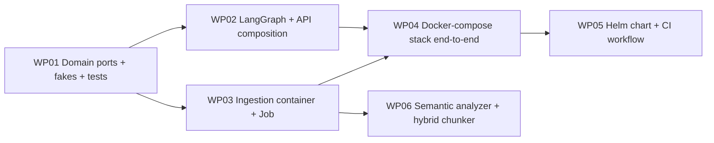

# Work Packages: 001 — Customer Support RAG Agent

**Inputs**: `specs/001-customer-support-rag-agent/`
**Prerequisites**: plan.md ✅ | spec.md ✅ | decomposition.md ✅ | CONTEXT.md ✅

> **Note on Integration WP.** The skill's Step 3c prescribes an
> "Integration — wire subsystems and entry points" WP as the final
> entry. In this feature, **WP04 ("Docker-compose stack")** already
> performs that role: it wires API + Chroma + ingestion containers,
> runs an end-to-end smoke test, and verifies
> `confidence == "high"`. WP05 then packages the integrated stack
> for k8s. Adding a separate Integration WP after WP05 would be
> redundant — the WP04 prompt below explicitly checks off every item
> the skill requires of an Integration WP (cross-subsystem wiring,
> host entry points, full test suite, e2e verification).

## Work Package WP01: Domain ports, fakes, and unit tests (Priority: P0)

**Goal**: Stand up the entire `domain/` package with port interfaces,
entities, domain exceptions, and **in-memory fakes** for every port,
backed by a `pytest` suite that follows the TDD mandate.
**Subsystem**: S1 Ingestion Pipeline + S2 Retrieval & Answering
**Abstract Components**:
- `domain/ingestion/ports.py` (`PageScraper`, `PageCleaner`, `Chunker`,
  `Embedder`, `VectorStore`)
- `domain/ingestion/entities.py` (`SourcePage`, `CleanedPage`, `Chunk`)
- `domain/answering/ports.py` (`Retriever`, `LowConfidencePolicy`,
  `AnswerGenerator`)
- `domain/answering/entities.py` (`Question`, `RetrievedChunk`,
  `Confidence`, `Answer`, `AgentState`)
- `domain/shared/errors.py` (`VectorStoreUnavailable`, `LLMUnavailable`,
  `EmptyRetrieval`, `SourcePageUnreachable`, `SourcePageGarbage`)
- `tests/fakes/` (`FakePageScraper`, `FakeChunker`, `FakeEmbedder`,
  `FakeVectorStore`, `FakeRetriever`, `FakeAnswerGenerator`,
  `StubLowConfidencePolicy`)

**Misfits Addressed**: M3 (distant question), M8 (hallucination —
policy structure), M1/M2/M4/M7 foundations only (full resolution in
WP03/WP05).
**Independent Test**: `pytest tests/domain -q` is green; every port
has at least one conformance test that a fake passes.
**Prompt**: `tasks/WP01-domain-ports-and-fakes.md`

### Included Subtasks
- T001 [P0] Verify `langgraph` 1.2.x `StateGraph.compile()` returns
  `CompiledStateGraph` and supports `.invoke(state)` with a Pydantic
  state model. Pin the minor.
- T002 [P0] `pyproject.toml` + `uv.lock` skeleton with all
  third-party dependencies, `[tool.pytest.ini_options]`, dev
  dependencies, and tool configs.
- T003 [P0] `domain/ingestion/ports.py` — five `Protocol` ports with
  Google-style docstrings.
- T004 [P0] `domain/ingestion/entities.py` — three entities with
  field-level types and validators.
- T005 [P0] `domain/answering/ports.py` — three `Protocol` ports.
- T006 [P0] `domain/answering/entities.py` — five entities including
  the Pydantic `AgentState`.
- T007 [P0] `domain/shared/errors.py` — typed exception hierarchy.
- T008 [P0] In-memory fakes under `tests/fakes/` implementing every
  port with controllable failure modes.
- T009 [P0] `pytest` unit tests for each entity (immutability,
  validation, equality).
- T010 [P0] Port conformance tests under `tests/fakes/` that assert
  every fake satisfies its port.

### TDD Targets (from Misfits)
- Test: `FakeRetriever` returns `[]` for a question with no matches →
  `LowConfidencePolicy.should_refuse([]) is True` (M3 foundation).
- Test: `AgentState.confidence` only accepts `"high" | "low"` —
  Pydantic validator rejects `"maybe"` (M3).
- Test: `FakeVectorStore.upsert(chunks)` raises
  `VectorStoreUnavailable` when the configured `fail=True` (M6
  foundation).
- Test: `FakePageScraper` raises `SourcePageUnreachable` on 5xx
  and `SourcePageGarbage` on empty body (M1/M2 foundation).

### Dependencies
- None (first WP).

---

## Work Package WP02: LangGraph workflow + API composition (Priority: P0)

**Goal**: Build the application services (LangGraph topology + nodes),
the API routes/middleware/error mapper, and the FastAPI composition
root, all driven by fakes from WP01.
**Subsystem**: S2 Retrieval & Answering + S3 API & Cross-Cutting Safety
**Abstract Components**:
- `application/answering/nodes.py` (`retrieve_node`, `guard_node`,
  `generate_node`, `refuse_node`)
- `application/answering/graph.py` (`LangGraphWorkflow`)
- `application/answering/answering_service.py`
- `application/api/routes.py`, `middleware.py`, `error_mapper.py`
- `composition/api_app.py`
- `composition/settings.py` (pydantic-settings)

**Misfits Addressed**: M3 (low-confidence path), M5 (secret scrubbing
at API edge), M6 (Chroma-down → 503 mapping), M8 (LLM hallucination
constraint at generate-node).
**Independent Test**: `pytest tests/application tests/composition -q`
is green; `POST /ask` returns 200 with `confidence == "high"` against
fakes; returning empty retrieval returns 200 with `confidence == "low"`.
**Prompt**: `tasks/WP02-langgraph-and-api.md`

### Included Subtasks
- T011 [P0] `LangGraphWorkflow` topology using `START`/`END` sentinels,
  Pydantic `AgentState`, `Literal["generate", "refuse", "__end__"]`
  conditional-edge return types (deferred from plan).
- T012 [P0] Four nodes (`retrieve`, `guard`, `generate`, `refuse`)
  each consuming ports only.
- T013 [P0] `answering_service.answer(question)` returning
  `Answer` or raising typed exceptions.
- T014 [P0] `application/api/error_mapper.py` with a single
  `ErrorResponseMapper` that converts typed domain exceptions to HTTP
  responses via `SecretScrubber` (M5, M6).
- T015 [P0] `application/api/middleware.py` — `RequestIdMiddleware`
  generated first in the chain so `request_id` is bound before any
  handler runs (deferred FastAPI ordering note from plan).
- T016 [P0] `application/api/routes.py` — `POST /ask`, `GET
  /healthz`, `GET /metrics` with pydantic request/response models.
- T017 [P0] `composition/api_app.py` — FastAPI composition root
  wiring adapters behind the `ANSWERER_BACKEND` factory (default
  `openai`, opt-in `create_agent` for future WP).
- T018 [P0] Structured-JSON logging and `prometheus_client` metrics
  (counters + histograms for `request_count_total`, `request_latency_seconds`,
  `retrieval_similarity_top1`).
- T019 [P0] Tests: graph with `FakeRetriever`/`FakeAnswerGenerator`/
  `StubLowConfidencePolicy` walks `retrieve → guard → generate` and
  emits the trace; with empty retrieval it walks `retrieve → guard →
  refuse` and never calls the LLM.
- T020 [P0] Tests: routes return 422 on malformed body, 503 on
  `VectorStoreUnavailable`, 502 on `LLMUnavailable`, 200 with
  `confidence == "low"` on empty retrieval; response bodies never
  contain a substring of `OPENAI_API_KEY`.

### TDD Targets (from Misfits)
- Test: `answering_service.answer` with empty retrieval returns
  `Answer(confidence="low", trace=["retrieve","guard","refuse"])` and
  the `FakeAnswerGenerator.generate` is never called (M3).
- Test: `ErrorResponseMapper` produces 503 with body
  `{"detail": "vector store unavailable"}` and no substring of the
  configured `CHROMA_URL` value (M5, M6).
- Test: `ErrorResponseMapper` produces 502 with body `{"detail":
  "answer generation unavailable"}` and no substring of
  `OPENAI_API_KEY` (M5).
- Test: `RequestIdMiddleware` is the first middleware added to the
  FastAPI app and every log line emitted by a handler carries the
  same `request_id` as the response header (M5 evidence path).

### Dependencies
- WP01

---

## Work Package WP03: Ingestion container + Job (Priority: P1)

**Goal**: Build the ingestion pipeline (scraper → cleaner → chunker
→ embedder → vector store) with the pre-embed validator and run-id
lock, plus the CLI entry point and the ingestion Docker image.
**Subsystem**: S1 Ingestion Pipeline
**Abstract Components**:
- `adapters/http_source.py` (`RequestsPageScraper`)
- `adapters/cleaner.py` (`BoilerplatePageCleaner`)
- `adapters/chunker.py` (`FixedSizeChunker`)
- `adapters/embedding_local.py` (`SentenceTransformersEmbedder`)
- `adapters/embedding_openai.py` (`OpenAIEmbedder`, opt-in)
- `adapters/vectorstore_chroma.py` (`ChromaVectorStore` +
  `ChromaRetriever`)
- `application/ingestion/pre_embed_validator.py`
- `application/ingestion/ingestion_lock.py` (TTL-file scheme on the
  shared PVC)
- `application/ingestion/ingestion_service.py`
- `composition/ingestion_main.py`
- `docker/ingestion.Dockerfile`

**Misfits Addressed**: M1 (unreachable URL → non-zero exit, no write),
M2 (garbage/empty content → rejected before embed), M4 (concurrent
  Jobs → second one skipped via run-id lock).
**Independent Test**: Failure-injection tests for the scraper,
cleaner, validator, and lock pass; running
`docker/ingestion.Dockerfile` against a fixture source URL exits 0
and produces chunks; running it twice in < 60 s yields identical
chunk ids (no duplicates).
**Prompt**: `tasks/WP03-ingestion-container.md`

### Included Subtasks
- T021 [P0] `RequestsPageScraper` with a 10 s timeout and a
  `SourcePageUnreachable` raise on non-2xx.
- T022 [P0] `BoilerplatePageCleaner` — strips `<nav>`, `<footer>`,
  cookie banners, and short remaining text.
- T023 [P0] `FixedSizeChunker` — 500-char chunks, 50-char overlap,
  stable `chunk_id = sha1(source_url + ordinal)`.
- T024 [P0] `SentenceTransformersEmbedder` (default) loading
  `all-MiniLM-L6-v2` (384 dims).
- T025 [P0] `OpenAIEmbedder` (opt-in via `EMBEDDER_BACKEND=openai`).
- T026 [P0] `ChromaVectorStore` using `chromadb.HttpClient` with
  atomic upsert + `delete_by_source`.
- T027 [P0] `PreEmbedValidator` — rejects empty cleaned text and text
  shorter than 100 chars (catches M2).
- T028 [P0] `IngestionRunLock` — TTL-keyed file on a shared volume;
  second run exits with `{"status": "skipped", "reason":
  "run_in_progress"}` (M4).
- T029 [P0] `IngestionService` orchestrating fetch → clean → validate →
  chunk → embed → upsert inside a try/finally that releases the lock
  and never writes if the validator rejects (M1, M2, M4).
- T030 [P0] `ingestion_main.py` CLI entry point reading
  `SOURCE_URL` and config from `composition/settings.py`.
- T031 [P0] `docker/ingestion.Dockerfile` — `python:3.11-slim`,
  multi-stage, non-root, no secrets baked in.
- T032 [P0] Failure-injection contract tests:
  scraper 5xx → exit non-zero, store untouched;
  cleaner empty → validator rejects, store untouched;
  two concurrent runs → second skipped.

### TDD Targets (from Misfits)
- Test: `RequestsPageScraper` returns 5xx → `IngestionService` raises
  `SourcePageUnreachable`, the `FakeVectorStore.upsert` is **never**
  called, the lock is released (M1).
- Test: `BoilerplatePageCleaner` returns empty string →
  `PreEmbedValidator` rejects with `SourcePageGarbage`,
  `FakeVectorStore.upsert` never called (M2).
- Test: `IngestionService.run_with_lock(run_id="A")` holds the lock;
  a concurrent `run_with_lock(run_id="B")` exits with
  `"skipped: run_in_progress"`. (M4)
- Test: Two consecutive non-overlapping runs end with identical
  `chunk_id` set in the `FakeVectorStore` (idempotency).

### Dependencies
- WP01

---

## Work Package WP04: Docker-compose stack end-to-end (Priority: P1)

**Goal**: Build the API Docker image, the docker-compose stack
(api + chroma + ingestion one-shot profile), the e2e smoke test, and
the README sections required by the assignment.
**Subsystem**: S1+S2+S3 (cross-subsystem integration)
**Abstract Components**:
- `docker/api.Dockerfile`
- `deploy/docker-compose.yml`
- `.env.example`
- `tests/e2e/test_docker_compose.py`
- `README.md` (local run, model/store rationale, LangGraph design,
  AWS view)
- `docs/architecture/local-flow.mmd`
- `docs/architecture/aws-flow.mmd`

**Misfits Addressed**: FR-019 (compose stack), NFR-006
(reproducibility), and **end-to-end verification** of every other WP.
**Independent Test**: `docker compose up -d` brings up the three
services; `curl POST /ask` returns 200 with `confidence == "high"`
and a non-empty `answer` quoting a chunk.
**Prompt**: `tasks/WP04-docker-compose-stack.md`

### Included Subtasks
- T033 [P0] `docker/api.Dockerfile` — `python:3.11-slim`, non-root,
  multi-stage, gunicorn-style entrypoint for `composition/api_app`.
- T034 [P0] `deploy/docker-compose.yml` with three services:
  `api`, `chroma` (using upstream `chromadb/chroma` image, pinned
  version — deferred Chroma-image decision from plan), and
  `ingestion` (one-shot profile).
- T035 [P0] `.env.example` documenting every required env var
  (`SOURCE_URL`, `OPENAI_API_KEY`, `EMBEDDING_API_KEY`, `CHROMA_URL`,
  `LOG_LEVEL`, `ANSWERER_BACKEND`).
- T036 [P0] `tests/e2e/test_docker_compose.py` (pytest marker:
  `e2e`) that runs `docker compose up -d --wait`, sends
  `POST /ask`, asserts `confidence == "high"` and a non-empty
  `answer`, then `docker compose down -v`.
- T037 [P0] `README.md` with the four required sections (Local run,
  Models/libraries/vector store rationale, LangGraph workflow design,
  Architecture diagrams). Includes the AWS view as a brief
  paragraph (per assignment + per chosen plan option).
- T038 [P0] `docs/architecture/local-flow.mmd` rendered into the
  README.
- T039 [P0] `docs/architecture/aws-flow.mmd` rendered into the README.
- T040 [P0] Cross-check: every port, adapter, route, and Job is wired
  in `docker-compose.yml`; the e2e test covers the assignment's
  end-to-end success criterion.

### TDD Targets (from Misfits)
- Test: e2e — stack is up, `GET /healthz` returns 200, `POST /ask`
  with an in-source question returns `confidence == "high"` and
  `answer` is non-empty (SC-001 from spec).
- Test: e2e — same stack, off-topic question returns
  `confidence == "low"` and the static refusal string (SC-001).

### Dependencies
- WP02, WP03

---

## Work Package WP05: Helm chart + CI workflow (Priority: P2)

**Goal**: Package the system as a Helm chart with dev/prod values,
add the CI gate (pytest + helm lint + helm template +
import-linter), and produce the pre-install hook that resolves M7.
**Subsystem**: S4 Helm Packaging & CI
**Abstract Components**:
- `deploy/helm/support-bot/Chart.yaml`
- `deploy/helm/support-bot/values.yaml`,
  `values-dev.yaml`, `values-prod.yaml`
- `deploy/helm/support-bot/templates/_helpers.tpl`
- `deploy/helm/support-bot/templates/deployment-api.yaml`
- `deploy/helm/support-bot/templates/deployment-chroma.yaml`
- `deploy/helm/support-bot/templates/service-{api,chroma}.yaml`
- `deploy/helm/support-bot/templates/configmap.yaml`
- `deploy/helm/support-bot/templates/secret.yaml`
- `deploy/helm/support-bot/templates/pvc.yaml`
- `deploy/helm/support-bot/templates/job-ingestion.yaml`
- `deploy/helm/support-bot/templates/pre-install-hook.yaml`
- `.github/workflows/ci.yml`
- `tests/architecture/test_imports.py` (shells out to
  `lint-imports`)
- `.importlinter` (layers + forbidden SDK contracts)
- `pyproject.toml` `[tool.importlinter]` block

**Misfits Addressed**: M7 (bad Helm values fail at `helm install`
time via the pre-install hook), NFR-005 (architecture test fails
CI on any back-import), FR-005/FR-018 (chart renders without
errors).
**Independent Test**: `helm template ./deploy/helm/support-bot
--values values-dev.yaml` renders all required resources and
`helm lint ./deploy/helm/support-bot` exits 0;
`pytest tests/architecture/test_imports.py` is green.
**Prompt**: `tasks/WP05-helm-chart-and-ci.md`

### Included Subtasks
- T041 [P0] `.importlinter` with one **exhaustive `layers` contract**
  (`support_bot.domain < support_bot.application <
  support_bot.adapters < support_bot.composition`) **plus** one
  **`forbidden` SDK contract** that bans `langchain`, `langgraph`,
  `chromadb`, `fastapi`, `requests`, `beautifulsoup4` from
  `support_bot.domain`.
- T042 [P0] `Chart.yaml` and `values.yaml` with default image
  tags, replica counts, and resource requests.
- T043 [P0] `values-dev.yaml` (1 replica, debug logging) and
  `values-prod.yaml` (2–4 replicas, INFO logging, PDB).
- T044 [P0] Templates: deployment-api, deployment-chroma,
  service-api, service-chroma, configmap, secret, pvc (reclaim
  `Retain`).
- T045 [P0] Templates: job-ingestion with
  `helm.sh/hook: post-install,post-upgrade` and
  `hook-delete-policy: hook-succeeded`.
- T046 [P0] Templates: pre-install-hook that asserts the Secret
  exists and exits non-zero if missing (resolves M7).
- T047 [P0] `tests/architecture/test_imports.py` shells out to
  `lint-imports` and asserts both contracts are intact.
- T048 [P0] `tests/architecture/test_helm.py` runs
  `helm template` against `values-dev.yaml` and `values-prod.yaml`,
  asserts Deployment / Service / ConfigMap / Secret / PVC / Job are
  present, and asserts no substring of any default-test key appears
  in the rendered manifests.
- T049 [P0] `.github/workflows/ci.yml` runs `uv sync`, `pytest`,
  `lint-imports`, `helm lint`, `helm template --validate`, and a
  secret-scanner pass on rendered manifests.
- T050 [P0] README updates: production deployment section with
  `helm install` commands.

### TDD Targets (from Misfits)
- Test: `lint-imports` passes on a clean tree; adding a forbidden
  import to `domain/` (e.g. `from fastapi import APIRouter`)
  fails the test (NFR-005).
- Test: `helm template` with an `image.tag` that does not exist in
  the values schema still renders cleanly (values are valid); a
  chart that drops the Secret fails the pre-install hook (M7).
- Test: A rendered manifest never contains `sk-` followed by 32+
  characters (NFR-003).

### Dependencies
- WP04

---

## Work Package WP06: Semantic page analyzer + hybrid chunker (LLM-driven) (Priority: P1)

**Goal**: Replace the FixedSizeChunker's character-offset slicing
with an LLM-driven semantic analyzer + hybrid chunker so the RAG
answerer receives **one chunk per detected FAQ Q/A pair** and
**semantically coherent chunks for the rest of the page**.
Target outcome: the OpenAI answerer stops answering
`"Ik weet het niet."` against `https://www.ziggo.nl/internet`.

**Subsystem**: S1 Ingestion Pipeline
**Abstract Components**:
- `domain/ingestion/entities.py` (extend): `PageStructure`,
  `SemanticChunk`, `ContentKind`
- `domain/ingestion/ports.py` (extend): `PageAnalyzer` Protocol,
  `Chunker.chunk` signature extension (`structure` kwarg)
- `adapters/bs4_text_extractor.py` (new): `Bs4TextExtractor`
- `adapters/llm_page_analyzer.py` (new): `OpenAIPageAnalyzer`
- `adapters/hybrid_chunker.py` (new): `HybridChunker`
- `application/ingestion/ingestion_service.py` (extend): analyze
  step, `analyzer` ctor kwarg
- `composition/ingestion_main.py` (extend): `select_analyzer`,
  `select_chunker` branch
- `composition/settings.py` (extend): `analyzer_backend`,
  `chunker_backend`, `openai_page_analyzer_model`
- Helm + docker-compose propagation (T058)
- Spec / plan / AGENTS.md updates (T059)

**Misfits Addressed**: M9 (semantic chunking — new misfit
introduced by the WP06 end-to-end smoke test against
`ziggo.nl/internet`).
**Independent Test**:
`pytest tests/adapters tests/application/ingestion
tests/composition tests/architecture -q` is green;
`spec-bridge-skill-tool tasks --feature 001-customer-support-rag-agent`
returns `status: ok`; `helm template` renders with the three
new env vars; the Ziggo smoke test (T060) returns a
non-`"Ik weet het niet."` answer for at least one of the
canonical questions.
**Prompt**: `tasks/WP06-semantic-analyzer.md`

### Included Subtasks
- T051 [P0] Domain entities (`PageStructure`, `SemanticChunk`,
  `ContentKind`)
- T052 [P0] `PageAnalyzer` Protocol + `Chunker.chunk` extension
- T053 [P0] `Bs4TextExtractor` preprocessor
- T054 [P0] `OpenAIPageAnalyzer` (LLM-driven, structured output)
- T055 [P0] `HybridChunker` consuming `PageStructure`
- T056 [P0] `IngestionService.run` analyze step
- T057 [P0] Composition wiring (`select_analyzer`,
  `select_chunker` branch)
- T058 [P0] Helm + docker-compose propagation
- T059 [P1] Spec / plan / `AGENTS.md` updates
- T060 [P1] Real Ziggo smoke verification

### TDD Targets (from Misfits)
- Test: `PageStructure` rejects malformed LLM JSON
  (T051).
- Test: `FakePageAnalyzer` round-trips through
  `IngestionService.run`; emitted `Chunk` objects have
  populated `section` (T051/T056).
- Test: `OpenAIPageAnalyzer` retries on 5xx and raises
  `LLMUnavailable` after `max_retries` (T054).
- Test: `HybridChunker` keeps `chunk_id` stable across re-runs
  for the same `source_url` (T055, AGENTS.md §4.5).
- Test: `HybridChunker` rejects `None` `structure` with
  `ConfigurationError` (T055).
- Test: `IngestionService.run` with `analyzer=None` behaves
  identically to the WP03 pipeline (T056, backward-compat).
- Test: `IngestionService.run` with `LLMUnavailable` from the
  analyzer exits non-zero and releases the lock in `finally`
  (T056).
- Test: Helm Job template renders with the three new env vars
  (T058).

### Dependencies
- WP03

---

## Misfit Coverage Matrix

Every misfit from `spec.md` must appear in at least one WP's
"Misfits Addressed" field. Uncovered misfits are implementation gaps.

| Misfit | Domain | Covered by WP(s) |
|--------|--------|------------------|
| M1 (A) Data Integrity — unreachable URL | S1 Ingestion | WP01 (foundation), WP03 (resolution) |
| M2 (B) Data Integrity — garbage content | S1 Ingestion | WP01 (foundation), WP03 (resolution) |
| M3 (C) Retrieval Quality — distant question | S2 Answering | WP01 (entities/ports), WP02 (policy + graph) |
| M4 (D) Concurrency — overlapping Jobs | S1 Ingestion | WP01 (lock interface), WP03 (resolution) |
| M5 (E) Security — key leakage | S3 API | WP02 (scrubber + error mapper), WP05 (CI secret scan) |
| M6 (F) Availability — Chroma down | S3 API | WP02 (error mapper 503), WP05 (liveness probes) |
| M7 (G) Operational — bad Helm values | S4 Packaging | WP05 (pre-install hook + lint) |
| M8 (H) Retrieval Quality — hallucination | S2 Answering | WP01 (policy interface), WP02 (prompt constraint + guard) |
| M9 (I) Retrieval Quality — fragmented chunks | S1 Ingestion | WP06 (LLM-driven PageAnalyzer + HybridChunker) |

---

## Dependency & Execution Summary

- **Sequence**: WP01 → (WP02 in parallel with WP03) → WP04 → WP05.
  WP02 and WP03 both depend only on WP01 and can be developed in
  parallel. WP06 is an optional follow-up that depends on WP03
  and can be developed in parallel with WP04 / WP05.
- **MVP Scope**: WP01 (domain only). The system is not runnable
  until WP02 lands.
- **Integration WP role**: WP04 (see note at the top of this file).

---

## Subtask Index (Reference)

| Subtask ID | Summary | Work Package | Priority | Parallel? |
|------------|---------|--------------|----------|-----------|
| T001 | Verify langgraph 1.2.x surface | WP01 | P0 | No |
| T002 | pyproject.toml + uv.lock skeleton | WP01 | P0 | No |
| T003 | `domain/ingestion/ports.py` (5 ports) | WP01 | P0 | No |
| T004 | `domain/ingestion/entities.py` (3 entities) | WP01 | P0 | No |
| T005 | `domain/answering/ports.py` (3 ports) | WP01 | P0 | No |
| T006 | `domain/answering/entities.py` (5 entities) | WP01 | P0 | No |
| T007 | `domain/shared/errors.py` | WP01 | P0 | No |
| T008 | In-memory fakes for every port | WP01 | P0 | No |
| T009 | Entity unit tests | WP01 | P0 | No |
| T010 | Port conformance tests | WP01 | P0 | No |
| T011 | `LangGraphWorkflow` topology | WP02 | P0 | No |
| T012 | Four graph nodes | WP02 | P0 | No |
| T013 | `answering_service.answer` | WP02 | P0 | No |
| T014 | `ErrorResponseMapper` | WP02 | P0 | No |
| T015 | `RequestIdMiddleware` | WP02 | P0 | No |
| T016 | Routes (`/ask`, `/healthz`, `/metrics`) | WP02 | P0 | No |
| T017 | `composition/api_app.py` | WP02 | P0 | No |
| T018 | Structured logging + Prometheus metrics | WP02 | P0 | No |
| T019 | Graph tests with fakes | WP02 | P0 | No |
| T020 | Route tests with fakes | WP02 | P0 | No |
| T021 | `RequestsPageScraper` | WP03 | P0 | No |
| T022 | `BoilerplatePageCleaner` | WP03 | P0 | No |
| T023 | `FixedSizeChunker` | WP03 | P0 | No |
| T024 | `SentenceTransformersEmbedder` | WP03 | P0 | No |
| T025 | `OpenAIEmbedder` | WP03 | P0 | No |
| T026 | `ChromaVectorStore` | WP03 | P0 | No |
| T027 | `PreEmbedValidator` | WP03 | P0 | No |
| T028 | `IngestionRunLock` | WP03 | P0 | No |
| T029 | `IngestionService` orchestrator | WP03 | P0 | No |
| T030 | `ingestion_main.py` CLI | WP03 | P0 | No |
| T031 | `docker/ingestion.Dockerfile` | WP03 | P0 | No |
| T032 | Failure-injection contract tests | WP03 | P0 | No |
| T033 | `docker/api.Dockerfile` | WP04 | P0 | No |
| T034 | `deploy/docker-compose.yml` | WP04 | P0 | No |
| T035 | `.env.example` | WP04 | P0 | No |
| T036 | e2e docker-compose smoke test | WP04 | P0 | No |
| T037 | `README.md` (4 sections) | WP04 | P0 | No |
| T038 | `docs/architecture/local-flow.mmd` | WP04 | P0 | No |
| T039 | `docs/architecture/aws-flow.mmd` | WP04 | P0 | No |
| T040 | Cross-check wiring | WP04 | P0 | No |
| T041 | `.importlinter` (layers + forbidden) | WP05 | P0 | No |
| T042 | `Chart.yaml` + `values.yaml` | WP05 | P0 | No |
| T043 | `values-dev.yaml` + `values-prod.yaml` | WP05 | P0 | No |
| T044 | Templates (deployments, services, config, secret, pvc) | WP05 | P0 | No |
| T045 | `job-ingestion.yaml` | WP05 | P0 | No |
| T046 | `pre-install-hook.yaml` | WP05 | P0 | No |
| T047 | `tests/architecture/test_imports.py` | WP05 | P0 | No |
| T048 | `tests/architecture/test_helm.py` | WP05 | P0 | No |
| T049 | `.github/workflows/ci.yml` | WP05 | P0 | No |
| T050 | README production section | WP05 | P0 | No |
| T051 | Domain entities (`PageStructure`, `SemanticChunk`, `ContentKind`) | WP06 | P0 | No |
| T052 | `PageAnalyzer` Protocol + `Chunker.chunk` extension | WP06 | P0 | No |
| T053 | `Bs4TextExtractor` preprocessor | WP06 | P0 | No |
| T054 | `OpenAIPageAnalyzer` (LLM-driven, structured output) | WP06 | P0 | No |
| T055 | `HybridChunker` consuming `PageStructure` | WP06 | P0 | No |
| T056 | `IngestionService.run` analyze step | WP06 | P0 | No |
| T057 | Composition wiring (`select_analyzer`, `select_chunker` branch) | WP06 | P0 | No |
| T058 | Helm + docker-compose propagation | WP06 | P0 | No |
| T059 | Spec / plan / `AGENTS.md` updates | WP06 | P1 | No |
| T060 | Real Ziggo smoke verification | WP06 | P1 | No |