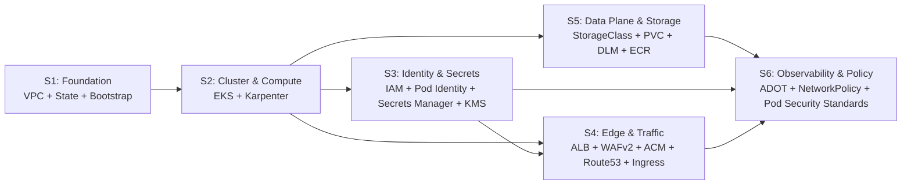

# Decomposition: Alternative AWS Infrastructure (OpenTofu)

**Feature Branch**: `[002-alternative-aws-infrastructure]`
**Created**: 2026-09-12
**Status**: Draft

> Apply Alexander's misfit analysis (Notes on the Synthesis of Form, 1964) to the 10 misfits identified in [`spec.md`](spec.md). Group the misfits that strongly interact (dense internal coupling) into subsystems with sparse external coupling. The subsystem boundaries are the natural seams between work packages; the cross-subsystem contracts are the seams between EKS-managed Kubernetes and OpenTofu-managed AWS resources.

---

## Misfit Inventory

Every misfit from spec.md is imported below. The short ID `M#` is reused in the Interaction Matrix, Subsystem Identification, and Mapping to Plan sections.

| ID | Misfit | Domain | Description |
|----|--------|--------|-------------|
| M1 | A | Security | OpenAI API key leaks to stderr, to a CloudWatch log group, to a `helm template` rendered Secret, or to a committed Terraform state file. |
| M2 | B | Configuration Drift | Prose says 50 GiB / Karpenter Spot / HPA, but `values-prod.yaml` ships 10 GiB / no HPA / no Karpenter — `tofu apply` produces effective state that diverges from the prose within one release. |
| M3 | C | Data Integrity | Chroma PVC is destroyed by `helm uninstall` or `tofu destroy` because the StorageClass `reclaimPolicy` defaults to `Delete`, not `Retain`. Embeddings are lost. |
| M4 | D | Availability | ALB target group has one healthy target because API pods run on a single node in a single AZ; AZ failure takes the API down. |
| M5 | E | Identity / Privilege | IAM role grants `secretsmanager:GetSecretValue` on `*` instead of scoped to per-environment secret ARNs; a single compromised pod can read every secret in the AWS account. |
| M6 | F | Supply Chain | Image pushed to ECR without `cosign` signing / `trivy` scan, and the cluster accepts unsigned images because no `ValidatingAdmissionPolicy` is installed. |
| M7 | G | Network Egress | New egress dependency added without a matching `NetworkPolicy` egress rule; traffic silently fails because Cilium in chained mode and the VPC CNI network policy add-on are both unconfigured. |
| M8 | H | Operational | `tofu apply` destroys and recreates the EKS control plane, Secrets Manager entry, or ALB because `lifecycle.prevent_destroy` is missing; downstream Helm release is re-installed, losing in-flight `request_id` lines and the in-flight ingestion run. |
| M9 | I | Disaster Recovery | Chroma PVC is AZ-bound to one EBS volume with no DLM snapshot schedule; AZ failure or accidental PVC deletion forces re-ingestion (RTO ≈ 5 min, RPO undefined). |
| M10 | J | Configuration Drift II | Dev and prod share one ECR repository and the chart's `image.tag` is `latest` or a moving tag; prod pulls a build that has not passed prod's gating checks. |

---

## Interaction Matrix

For every ordered pair `(M_i, M_j)` the cell is marked **X** if resolving `M_i` forces a change to the resolution of `M_j`. The matrix is the source of truth for which misfits belong together in one subsystem. The six explicit interaction notes from `spec.md` are folded in, plus four additional pairs I identified during analysis (marked **+**).

|     | M1 | M2 | M3 | M4 | M5 | M6 | M7 | M8 | M9 | M10 |
|-----|----|----|----|----|----|----|----|----|----|-----|
| M1  | -- |    |    |    | **X** |    |    |    |    |     |
| M2  |    | -- |    | **X** |    |    | **X** |    |    |     |
| M3  |    |    | -- |    |    |    |    | **X+** | **X** |     |
| M4  |    |    |    | -- |    |    | **X+** |    |    |     |
| M5  | **X** |    |    |    | -- |    |    |    |    |     |
| M6  |    |    |    |    |    | -- |    |    |    | **X+** |
| M7  |    |    |    | **X+** |    |    | -- |    |    |     |
| M8  |    |    | **X+** |    |    |    |    | -- |    |     |
| M9  |    |    | **X** |    |    |    |    |    | -- |     |
| M10 |    |    |    |    |    | **X+** |    |    |    | --  |

**Linked pairs (alphabetical, with rationale):**

- **M1 ↔ M5** (spec): secrets-in-logs and unscoped-IAM are two sides of the same threat model; resolving one without the other leaves the chain broken.
- **M2 ↔ M4** (spec): the chart's HPA / multi-AZ topology / Karpenter NodePool only take effect when the values match the OpenTofu output; configuration drift and AZ-singleness are the same problem at two layers.
- **M2 ↔ M7** (+): multi-AZ pods (`M4`) require working `NetworkPolicy` egress (`M7`) for cross-AZ Chroma traffic; if either fails the cluster is broken. `M2` is the "chart values match infra" half, `M7` is the "NetworkPolicy enforced" half.
- **M3 ↔ M8** (+): `prevent_destroy` on the StorageClass (and PVC) is the only thing that prevents a `tofu destroy` from undoing the `Retain` reclaim policy.
- **M3 ↔ M9** (spec): StorageClass Retain is a prerequisite for DLM snapshot; a `Delete` reclaim policy destroys the volume before DLM can snapshot it.
- **M4 ↔ M7** (+): `topologySpreadConstraints` spreads pods across AZs but if cross-AZ egress to Chroma is not allowed by NetworkPolicy, the system is worse off.
- **M6 ↔ M10** (+): pinning the image tag (`M10`) is a prerequisite for signature enforcement (`M6`); the policy controller needs a stable tag to verify against.

**Independent misfits** (no `X` in their row): **none**. Every misfit interacts with at least one other, which is why the work-package structure must respect these boundaries rather than naively split "infra / Kubernetes / observability".

---

## Subsystem Identification

I identify **six subsystems**. The grouping follows the interaction matrix: dense rows/columns become a subsystem; sparse connections become cross-subsystem contracts.



### Subsystem S1 — Foundation (VPC, State, Bootstrap)

**Misfits**: (none directly — S1 is the substrate every other subsystem depends on)
**Boundary justification**: The Terraform state backend, DynamoDB lock table, and per-environment VPC are the foundation. They have no misfits of their own but **every other subsystem imports the VPC and the state backend**. Extracting S1 first lets later work packages run `tofu init` against a real backend before they provision anything.
**Key responsibilities**:
- Bootstrap workspace: S3 state bucket, DynamoDB lock table, both with `prevent_destroy`, both with KMS encryption.
- Per-environment VPC: 3 AZs in `eu-central-1`, public subnets (ALB), private subnets (EKS nodes, Pods), single NAT gateway, 6 VPC interface endpoints (Secrets Manager, STS, ECR API, ECR DKR, CloudWatch Logs, CloudWatch Monitoring), 1 gateway endpoint (S3).
- Output: `vpc_id`, `private_subnet_ids`, `public_subnet_ids`, `vpc_endpoint_security_group_id`, `state_bucket_name`, `lock_table_name`.

### Subsystem S2 — Cluster & Compute (EKS, Karpenter)

**Misfits**: M2 (chart ↔ infra values drift, partial), M4 (multi-AZ), M7 (NetworkPolicy egress, partial)
**Boundary justification**: M2 + M4 + M7 (egress half) form a triangle — multi-AZ scheduling, chart-driven HPA / replica counts / image tag, and the cross-AZ connectivity needed for Chroma. The cluster is the unit of scheduling; Karpenter + the node groups are the unit of compute provisioning.
**Key responsibilities**:
- EKS cluster (Kubernetes 1.30) with control-plane logging, secret envelope encryption with the per-env CMK, public endpoint restricted to `admin_cidr`.
- OIDC provider for IRSA.
- EKS Pod Identity Agent add-on.
- Managed node group `baseline` (2× `m7i.large`, On-Demand) for system pods + baseline API replicas.
- Karpenter v1 controller + one `NodePool` (`burst`, Spot-first with On-Demand fallback, WhenEmptyOrUnderutilized consolidation) + one `EC2NodeClass` per environment.
- Chart-driven `topologySpreadConstraints` applied via values in `values-prod.yaml` (additive; no existing template edits).
- Outputs: `eks_cluster_name`, `eks_cluster_endpoint`, `eks_oidc_provider_arn`, `karpenter_iam_role_arn`, `node_iam_role_arn`.

### Subsystem S3 — Identity & Secrets (IAM, Pod Identity, Secrets Manager, KMS)

**Misfits**: M1 (secrets leak), M5 (unscoped IAM), M8 (prevent_destroy missing, partial)
**Boundary justification**: M1 ↔ M5 is the strongest interaction in the matrix (the IAM/secrets threat model). M8 partially belongs here because `prevent_destroy` on Secrets Manager + KMS CMKs is the secret-side of the operational durability story (M8 also covers EKS + ALB).
**Key responsibilities**:
- Per-environment customer-managed KMS CMK (`support-bot-<env>-cmk`) with a key policy that allows only the per-env role to use it.
- Secrets Manager entries `support-bot/<env>/openai-api-key` and `support-bot/<env>/chroma-auth-token`, encrypted with the per-env CMK, with `lifecycle.prevent_destroy = true`.
- IAM role for External Secrets Operator with `secretsmanager:GetSecretValue` and `secretsmanager:DescribeSecret` scoped to the specific secret ARNs (NOT `*`), plus `kms:Decrypt` scoped to the per-env CMK ARN.
- IAM role for ADOT Collector with `xray:PutTraceSegments`, `logs:CreateLogGroup/Stream`, `logs:PutLogEvents` scoped to per-env log groups.
- IAM role for AWS Load Balancer Controller scoped to the per-env ALB / SG / WAFv2 ARNs.
- IAM role for Karpenter controller scoped to the EC2 / ASG / IAM-PassRole actions Karpenter needs (scoped by tag, not `*`).
- IAM role for GitHub Actions OIDC provider with `ecr:PutImage`, `ecr:InitiateLayerUpload`, etc. scoped to the per-env ECR repository ARN.
- Outputs: `external_secrets_role_arn`, `adot_role_arn`, `alb_controller_role_arn`, `karpenter_controller_role_arn`, `github_actions_role_arn`, `openai_secret_arn`, `chroma_auth_secret_arn`, `cmk_arn`.

### Subsystem S4 — Edge & Traffic (ALB, WAFv2, ACM, Route53, Ingress)

**Misfits**: M4 (multi-AZ, partial — the ALB half), M8 (prevent_destroy on ALB), M2 (chart ↔ infra values drift, partial — the chart's `image.tag` driving the ALB target group)
**Boundary justification**: The ALB is the only public-facing component. It has its own misfit (M8 — ALB recreate loses the `X-Request-Id` propagation state and the in-flight `request_id` log lines) and shares multi-AZ concerns (M4) and chart-driven configuration (M2) with S2.
**Key responsibilities**:
- ACM certificate per environment (DNS validated, wildcard SAN `*.<env>.support-bot.example.com`).
- Route53 alias record `<env>.support-bot.example.com` → ALB.
- WAFv2 WebACL with `AWSManagedRulesCommonRuleSet`, `AWSManagedRulesSQLiRuleSet`, `AWSManagedRulesBotControlRuleSet`, and a rate-based rule (1000 req / 5 min / IP).
- `Ingress` resource installed via the `kubernetes` provider (the chart has no `Ingress` template; this is the only template added to the chart by this feature) with ALB controller annotations.
- ALB access logs to S3 (separate bucket from the state bucket).
- Outputs: `acm_cert_arn`, `wafv2_web_acl_arn`, `alb_dns_name`, `route53_zone_id`, `ingress_hostname`.

### Subsystem S5 — Data Plane & Storage (StorageClass, PVC, DLM, ECR)

**Misfits**: M3 (PVC Retain), M9 (DLM snapshot), M10 (shared ECR + moving tag)
**Boundary justification**: M3 ↔ M9 is a strong sequential pair (StorageClass Retain → DLM snapshot). M10 is image-tag governance and shares the ECR repository — it pairs naturally with M3/M9 because both are about "the things that persist data or binaries".
**Key responsibilities**:
- Per-environment `support-bot-gp3` StorageClass with `parameters: { type=gp3, iops=3000, throughput=250, encrypted=true }`, `reclaimPolicy=Retain`, `volumeBindingMode=WaitForFirstConsumer`.
- Per-environment ECR repository `support-bot-api-<env>` (or shared if `var.shared_ecr=true`), image scan on push, tag immutability, repository policy allowing only the GitHub Actions OIDC role.
- DLM snapshot policy attached to the Chroma EBS volume, 24-hour interval, 7-day retention, tagged with cluster name and the latest successful ingestion `request_id`.
- Outputs: `storage_class_name`, `ecr_repository_url`, `ecr_repository_arn`, `dlm_policy_id`.

### Subsystem S6 — Observability & Policy (ADOT, NetworkPolicy, Pod Security Standards)

**Misfits**: M1 (secret leak via logs, residual), M2 (chart ↔ infra drift, final), M6 (unsigned images), M7 (NetworkPolicy egress, residual)
**Boundary justification**: S6 is the "policy / observability" subsystem — it enforces the rules that the other subsystems rely on. M1 has a residual half here (the `SecretScrubber` in `structlog` is the in-process defence; the CloudWatch side is M1's IAM half in S3). M7's residual half is the `NetworkPolicy` resources themselves. M2's residual half is the `ValidatingAdmissionPolicy` and the chart's `values.schema.json` governance. M6 is entirely supply-chain policy.
**Key responsibilities**:
- ADOT Collector DaemonSet per cluster (hostNetwork, OTLP receivers on `:4317`/`:4318`), with IRSA → `awsxray` and `awsemf` exporters.
- CloudWatch log group for the application (`/aws/eks/support-bot-<env>/application`, 30-day retention) and for the ADOT collector (`/aws/eks/support-bot-<env>/otel`, 7-day retention).
- Namespace labels enforcing Pod Security Standards `restricted`.
- `NetworkPolicy` resources per workload (default-deny + explicit ingress/egress allows for Chroma, OpenAI, ADOT, kube-dns, EKS API).
- `ValidatingAdmissionPolicy` blocking images without `cosign` signatures (deferred WP if `var.enforce_signed_images=true`).
- Outputs: `adot_collector_endpoint`, `application_log_group_name`, `application_log_group_arn`, `network_policy_names`.

---

## Constructive Diagrams

### S2 — Cluster & Compute Diagram

```
┌─────────────────────────────────────────────────────────────┐
│ EKS support-bot-<env> (Kubernetes 1.30)                     │
│ ┌─────────────────────────┐    ┌──────────────────────────┐ │
│ │ Managed node group      │    │ Karpenter NodePool       │ │
│ │ "baseline"              │    │ "burst"                  │ │
│ │ m7i.large × 2           │    │ Spot + On-Demand         │ │
│ │ On-Demand               │    │ c/m/r gen ≥ 5            │ │
│ │                         │    │ Consolidation enabled    │ │
│ │ runs:                   │    │                          │ │
│ │  • system pods          │    │ runs:                    │ │
│ │  • API replicas 2–3     │    │  • API replicas 4–6      │ │
│ │  • Chroma pod           │    │                          │ │
│ └─────────────────────────┘    └──────────────────────────┘ │
│                                                             │
│ Pod Security Standards: restricted                          │
│ topologySpreadConstraints: maxSkew=1, zones=eu-central-1abc │
└─────────────────────────────────────────────────────────────┘
```

**Components derived**:
- `module.eks.aws_eks_cluster.this` — resolves M4 (control plane in 3 AZs).
- `module.eks.aws_eks_node_group.baseline` — resolves M4 (deterministic baseline across AZs).
- `module.karpenter.helm_release.karpenter` + `karpenter_node_pool.burst` — resolves M2 (chart's `image.tag` + HPA map to Spot-fallback nodes).
- `module.eks.eks_pod_identity_association.karpenter` — resolves M5 (scoped IRSA for Karpenter).

### S3 — Identity & Secrets Diagram

```
Secrets Manager                        IAM Role (Pod Identity)
┌──────────────────────────┐           ┌─────────────────────────┐
│ support-bot/dev/         │◀──Get──── │ ExternalSecretsOperator  │
│   openai-api-key         │           │   ARN = arn:...:role/   │
│ support-bot/dev/         │◀──Get──── │   eso-support-bot-dev   │
│   chroma-auth-token      │           │   (scoped to ARNs ↑)    │
└──────────────────────────┘           └─────────────────────────┘
         │ encrypted with                      │
         ▼                                     ▼
┌──────────────────────────┐           ┌─────────────────────────┐
│ KMS CMK                  │           │ KMS:Decrypt on          │
│ support-bot-dev-cmk      │◀──────────│   arn:...:key/          │
│ (key policy: only        │           │   support-bot-dev-cmk   │
│  eso role + cmk admin)   │           │   (NOT *)               │
└──────────────────────────┘           └─────────────────────────┘
```

**Components derived**:
- `module.secrets.aws_kms_key.env_cmk` — resolves M1 (CMK encrypts secret at rest; key policy restricts who can use it).
- `module.secrets.aws_secretsmanager_secret.openai` + `..._chroma` — resolves M1, M5, M8 (encrypted, scoped ARN, `prevent_destroy`).
- `module.iam.aws_iam_role.external_secrets` + `eks_pod_identity_association.external_secrets` — resolves M1, M5 (scoped to secret ARNs + CMK ARN).
- `module.secrets.aws_secretsmanager_secret_rotation.rotation_openai` — opens the door for a future OpenAI rotation Lambda (out of scope here, but the secret is created with rotation enabled so it's plug-and-play).

### S5 — Data Plane & Storage Diagram

```
ECR repository                              EBS volume
┌─────────────────────────────┐             ┌──────────────────────┐
│ support-bot-api-prod        │             │ Chroma PVC           │
│  image scan on push: on     │             │  size: 20 GiB        │
│  tag immutability: on       │             │  storageClass:       │
│  policy: GitHub OIDC role   │             │   support-bot-gp3    │
│         only (NOT *)        │             │  reclaimPolicy:      │
│                             │             │   Retain             │
│  pin: image.tag = sha-...   │             │  encrypted: true     │
│  (NOT latest, NOT moving)   │             │  iops: 3000          │
└─────────────────────────────┘             │  throughput: 250 MiB/s│
                                            └──────────────────────┘
                                                     │
                                            DLM snapshot policy
                                                     │
                                            ┌──────────────────────┐
                                            │ every 24h, retain 7d │
                                            │ tags:                │
                                            │  Cluster=support-bot │
                                            │  RequestId=<latest>  │
                                            └──────────────────────┘
```

**Components derived**:
- `module.storage.kubernetes_manifest.support_bot_gp3_storageclass` (via the `kubernetes` provider) — resolves M3 (explicit `reclaimPolicy=Retain`).
- `module.compute.aws_ecr_repository.support_bot_api` — resolves M10 (per-env repo + tag immutability + scoped policy).
- `module.storage.aws_dlm_lifecycle_policy.chroma_snapshot` — resolves M9 (snapshots exist; AZ failover is a manual step in this version).

### S6 — Observability & Policy Diagram

```
Application Pod                                ADOT Collector DaemonSet
┌─────────────────────────────┐                ┌─────────────────────────┐
│ structlog JSON to stdout    │                │  hostNetwork: true      │
│   + SecretScrubber          │                │  :4317 gRPC / :4318 HTTP│
│   + request_id from env     │──────OTLP────▶│  IRSA → awsxray         │
│   + trace_id/span_id        │                │  IRSA → awsemf          │
└─────────────────────────────┘                │  IRSA → logging         │
                                               └─────────────────────────┘
                                                        │
                              ┌─────────────────────────┼─────────────────────────┐
                              ▼                         ▼                         ▼
                       AWS X-Ray              CloudWatch Logs             CloudWatch Metrics
                       /aws/xray/...           /aws/eks/support-bot-prod/  AMP workspace
                                               application (30d)
                                               otel (7d)

NetworkPolicy (per namespace):
  ingress: ALB target group SG only
  egress:  Chroma :8000, OpenAI :443, ADOT :4318, kube-dns :53, EKS API :443
```

**Components derived**:
- `module.observability.helm_release.adot_collector` — resolves M1 (ADOT picks up `trace_id`/`span_id` from `structlog`; emits to X-Ray; no key in spans).
- `module.policy.kubernetes_manifest.network_policies` (via `kubernetes` provider) — resolves M7 (default-deny + explicit allows).
- `module.policy.kubernetes_manifest.namespace_labels` — resolves M2 (chart's `pod-security.kubernetes.io/enforce=restricted`).

---

## Cross-Subsystem Contracts

These are the only permitted couplings between subsystems. Every cross-subsystem call uses one of these contracts; nothing else is allowed.

### Contract: S1 → S2, S3, S4, S5, S6

- **Data exchanged**: `vpc_id`, `private_subnet_ids`, `public_subnet_ids`, `vpc_endpoint_security_group_id`, `state_bucket_name`, `lock_table_name`.
- **Failure mode**: if S1 is missing, all later subsystems fail at plan time with `Error: Reference to undeclared resource`.
- **Coupling type**: Terraform outputs (`output "vpc_id" { value = module.vpc.vpc_id }`).

### Contract: S2 → S3, S4, S5, S6

- **Data exchanged**: `eks_cluster_name`, `eks_cluster_endpoint`, `eks_oidc_provider_arn`, `karpenter_iam_role_arn`, `node_iam_role_arn`.
- **Failure mode**: if S2 is missing, the Helm providers in S3/S4/S5/S6 fail at plan time with `Error: cluster not found`.
- **Coupling type**: Terraform outputs + Kubernetes providers that read `data "aws_eks_cluster_auth"` for `host` and `token`.

### Contract: S3 → S4, S5, S6

- **Data exchanged**: per-env role ARNs (`external_secrets_role_arn`, `alb_controller_role_arn`, `adot_role_arn`, `github_actions_role_arn`), `cmk_arn`, secret ARNs.
- **Failure mode**: if S3 is missing, S4 (ALB controller) and S6 (ADOT) cannot get IAM credentials; pods fail with `AccessDenied` on first call to AWS APIs.
- **Coupling type**: IAM role ARNs passed via EKS Pod Identity associations; secret ARNs read by the ExternalSecret resources in the chart's new `templates/externalsecret.yaml`.

### Contract: S4 → S2

- **Data exchanged**: ALB DNS name → Route53 alias record (no Kubernetes resource changes; this is a Route53-only coupling).
- **Failure mode**: if Route53 alias is broken, the HTTPS endpoint is unreachable even though the ALB is healthy.
- **Coupling type**: Route53 alias record.

### Contract: S5 → S2

- **Data exchanged**: `storage_class_name` consumed by the chart's existing `templates/pvc.yaml` via the `persistence.storageClassName` value (no template edit; only a value set in `values-prod.yaml`).
- **Failure mode**: if `support-bot-gp3` is missing, the Chroma PVC fails to bind; the API returns 500 because Chroma is unreachable.
- **Coupling type**: Kubernetes StorageClass referenced by PVC.

---

## Mapping to Plan

The subsystems map to work packages (WPs) in `plan.md`. Each WP gets one subsystem (or one subsystem's slice). Dependencies between WPs follow the cross-subsystem contracts above. Suggested sequencing assumes an experienced OpenTofu / EKS practitioner; reorder if the team is new to any layer.

| Subsystem | Components | Suggested WP Scope | Depends on |
|---|---|---|---|
| **S1 — Foundation** | S3 state bucket, DynamoDB lock, VPC, NAT, VPC endpoints | **WP01 — Bootstrap: state backend, VPC, NAT, endpoints** | (none — first WP) |
| **S2 — Cluster & Compute** | EKS, OIDC, Pod Identity Agent, baseline MNG, Karpenter | **WP02 — EKS cluster, baseline node group, Karpenter** | WP01 |
| **S3 — Identity & Secrets** | KMS CMKs, Secrets Manager entries, IAM roles for ESO/ADOT/ALBC/GHA, Pod Identity associations | **WP03 — IAM, KMS, Secrets Manager, Pod Identity associations** | WP02 |
| **S4 — Edge & Traffic** | ACM, Route53, WAFv2, ALB controller, Ingress resource | **WP04 — ALB, WAFv2, ACM, Route53, Ingress** | WP02, WP03 |
| **S5 — Data Plane & Storage** | StorageClass, ECR, DLM snapshot policy | **WP05 — StorageClass, ECR, DLM** | WP02, WP03 |
| **S6 — Observability & Policy** | ADOT, NetworkPolicy, PSS labels, (optional) ValidatingAdmissionPolicy | **WP06 — ADOT, NetworkPolicy, Pod Security Standards** | WP02, WP03, WP04, WP05 |
| **Integration** | Helm chart installation of `deploy/helm/support-bot`, end-to-end smoke test | **WP07 — Helm chart install, smoke test, end-to-end verification** | WP01–WP06 |

**WP count**: 7. **Misfits covered**: M1–M10 (all). **Cross-subsystem contracts enforced**: 5.

**Out-of-band work** (recorded here so `plan.md` can reference it):
- Per-environment `envs/dev.tfvars` and `envs/prod.tfvars` — written in WP01, extended in WP02–WP06.
- `infra/README.md` — written in WP01, extended in WP07.
- `docs/architecture/aws-flow-v2.md` — written in WP07.
- The chart's new `templates/externalsecret.yaml`, `templates/serviceaccount.yaml`, `templates/ingress.yaml` — written in WP03, WP04, WP07 respectively. The chart's existing 8 templates are not touched.

---

## Glossary

Terms used in this decomposition that match the project's `CONTEXT.md` vocabulary:

- `SourcePage`, `Chunk`, `Answer`, `IngestionRun`, `AgentState` — refer to the application domain, not the infrastructure. Not used here.
- `Port`, `Adapter`, `CompositionRoot` — used in `src/support_bot/`. The infrastructure side does not introduce new domain terms; `CompositionRoot` (the OpenTofu root module) is the only carry-over, and it has a deliberately different meaning here (it is the IaC root, not the Python composition root). This dual use is intentional and noted in `plan.md`.