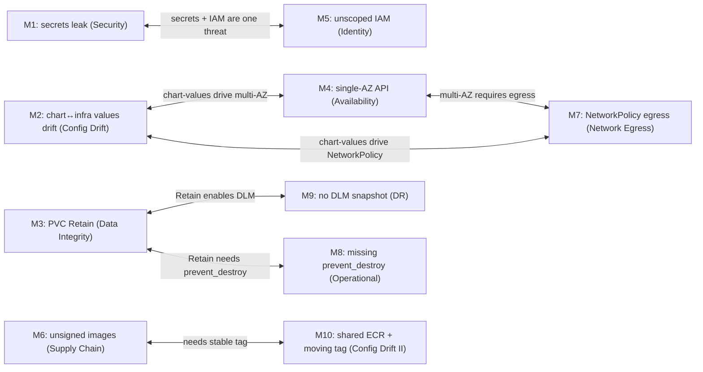
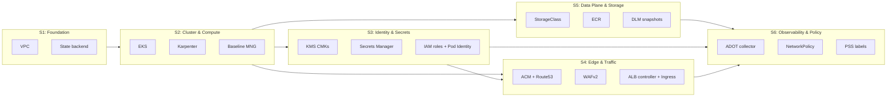
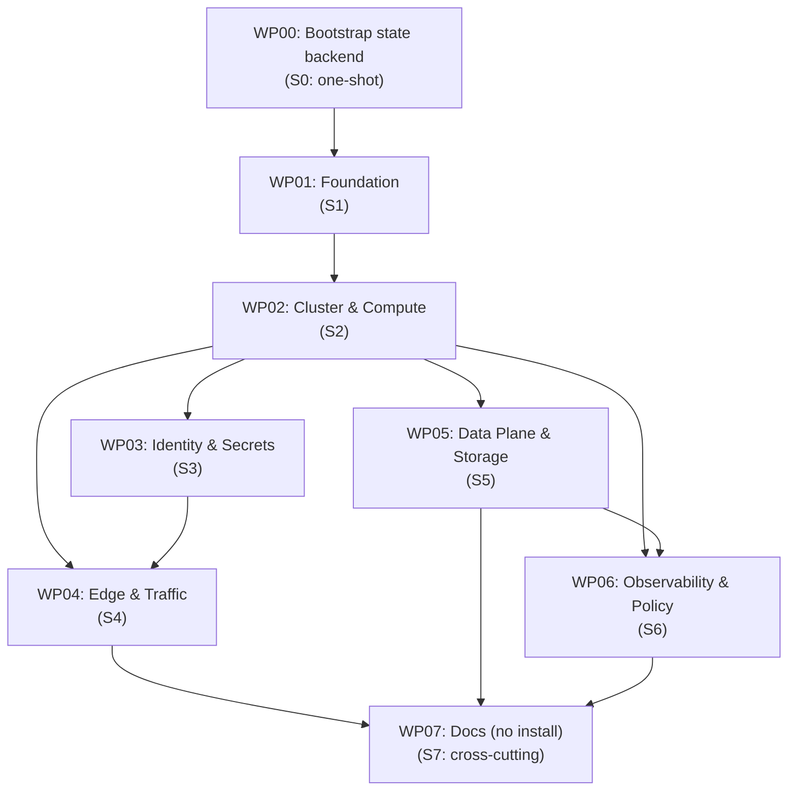

# Implementation Plan: 002 — Alternative AWS Infrastructure (OpenTofu)

**Branch**: `[002-alternative-aws-infrastructure]` | **Date**: 2026-09-12 | **Spec**: [spec.md](spec.md) | **Decomposition**: [decomposition.md](decomposition.md)

---

## Summary

Provision an alternative AWS production deployment for `support-agent` from scratch using **OpenTofu 1.6+**, reusing the existing Helm chart at `deploy/helm/support-bot/` (additive template changes only — no edits to the existing 8 templates, no value renames). The infrastructure consists of **two independent EKS clusters** (`support-bot-dev` and `support-bot-prod`) in `eu-central-1`, each with its own VPC, KMS CMK, Secrets Manager entries, ECR repository, Karpenter NodePool, ALB + WAFv2 + ACM, ADOT observability, and NetworkPolicy enforcement. Helm chart changes (new `externalsecret` / `serviceaccount` / `ingress` templates) are **rendered and validated** by every WP that adds one; the actual `helm install` is **explicitly out of scope** for this feature and belongs to a downstream CI/CD feature. **The infrastructure must work for both the existing Helm chart and a future GitOps-deployed version of it**, with no coupling to whichever controller deploys the chart.

---

## Technical Context

**Language/Version**: HCL (OpenTofu `>= 1.6.0`); `tofu fmt` enforced; `tofu validate` enforced.

**Primary Dependencies**:
- `hashicorp/aws` provider `>= 5.40.0`
- `hashicorp/helm` provider `>= 2.12.0`
- `hashicorp/kubernetes` provider `>= 2.27.0`
- `hashicorp/random` provider `>= 3.6.0`
- `hashicorp/null` provider `>= 3.2.0`
- `gavinbunney/kubectl` provider `>= 1.14.0` (for any raw manifest `kubectl apply` that the `kubernetes` provider cannot model cleanly — `ExternalSecret` CRD via Helm install)

**Storage**: AWS S3 (Terraform state, ALB access logs) + DynamoDB (state lock) + AWS Secrets Manager (runtime secrets) + AWS KMS (CMKs) + Amazon EBS gp3 (Chroma PVC) + Amazon ECR (container images).

**Testing**: `tofu test` (native OpenTofu 1.6+ test framework) for module-level unit tests with `mock_provider`/`override_data`; `tofu validate`, `tofu fmt -check`, and `tflint` enforced in CI. End-to-end validation against a real cluster is **out of scope** for this feature (manual operator step, not automated).

**Target Platform**: AWS `eu-central-1`. Two EKS clusters running Kubernetes 1.30. Mixed x86_64 (ARM/Graviton is deferred).

**Project Type**: Infrastructure-as-Code module set (`infra/`), six child modules + one root module + one bootstrap workspace.

**Performance Goals**: `tofu plan -var-file=envs/dev.tfvars` completes in < 60 s; `tofu plan -var-file=envs/prod.tfvars` completes in < 120 s. (Both run entirely client-side after the AWS API calls.) `tofu apply` against an empty account completes the dev cluster in < 30 minutes (SC-001) and the prod cluster in < 45 minutes (SC-002).

**Constraints**:
- **Helm chart reuse, additive only**: net-new templates (`externalsecret.yaml`, `serviceaccount.yaml`, `ingress.yaml`) and additive values are allowed; the existing 8 templates must not be edited; no value may be renamed or removed.
- **Two environments, one root**: dev and prod are both driven by `envs/<env>.tfvars` against the same root module. State files are kept under separate keys in the same S3 bucket (`support-bot/dev/terraform.tfstate` and `support-bot/prod/terraform.tfstate`).
- **Bootstrap workspace is one-shot**: the S3 state bucket and DynamoDB lock table are created by `bootstrap/` and must never be destroyed (`prevent_destroy = true`).
- **No bare `*` IAM resource ARNs** for `secretsmanager:GetSecretValue`, `kms:Decrypt`, `s3:*`, `logs:*`, or `xray:*` (NFR-004).
- **All secrets stay in Secrets Manager** (NFR-003); no `helm_release` ever sets a `value` containing a key.

**Scale/Scope**:
- 2 EKS clusters, 2 VPCs, 4 Secrets Manager entries, 4 KMS CMKs, 1 S3 state bucket, 1 DynamoDB lock table, 2 ECR repos, 2 ALBs, 2 WAFv2 WebACLs, 2 ACM certs, 6 Karpenter resources (3 per cluster), 1 ADOT collector per cluster, 1 ESO per cluster.
- Estimated OpenTofu module size: ~1 800 lines of HCL across 6 modules + 1 root + 1 bootstrap + 2 `envs/*.tfvars`.
- Estimated chart additions: 3 new YAML templates + ~30 lines of additive `values.yaml` / `values-prod.yaml` / `values-dev.yaml`.

---

## Constitution Check

The project does not have a `constitution.md` (verified at `.spec-bridge/memory/constitution.md` — file not present). The standard Hexagonal Python rules in `AGENTS.md` do not apply (no Python in this feature). The checks below are the project-level gates that DO apply to this feature:

| Gate | Status | Notes |
|------|--------|-------|
| OpenTofu ≥ 1.6.0 | ✅ | Pinned in `infra/versions.tf` |
| AWS provider ≥ 5.40.0 | ✅ | Pinned in `infra/versions.tf` |
| `tofu fmt -check` clean | ✅ | CI gate (Step 6) |
| `tofu validate` clean | ✅ | CI gate |
| `tflint` clean | ✅ | CI gate |
| `tofu test` for every module | ✅ | Per-WP, run in CI |
| Two-environment isolation (FR-003, FR-004) | ✅ | Per-env state keys + per-env resource names + per-env `prevent_destroy` |
| Helm chart `values.schema.json` satisfied | ✅ | CI gate runs `helm template --validate` and `helm lint` per WP |
| Helm chart secret-scan clean | ✅ | CI gate greps `helm template` output for `sk-[A-Za-z0-9]{32,}` |
| IAM `Resource = "*` not used (NFR-004) | ✅ | `tofu test` asserts on every IAM policy document |

---

## Project Structure

```
infra/
├── README.md                              # Bootstrap + per-env apply procedure
├── versions.tf                            # Provider version pins
├── bootstrap/                             # ONE-SHOT workspace: S3 state bucket + DynamoDB lock table
│   ├── main.tf
│   ├── versions.tf
│   └── README.md
├── modules/
│   ├── foundation/                        # S1: VPC + subnets + NAT + VPC endpoints
│   │   ├── main.tf
│   │   ├── variables.tf
│   │   ├── outputs.tf
│   │   ├── versions.tf
│   │   └── tests/
│   │       └── foundation.tftest.hcl
│   ├── cluster/                           # S2: EKS + OIDC + Pod Identity Agent + baseline MNG + Karpenter
│   │   ├── main.tf
│   │   ├── variables.tf
│   │   ├── outputs.tf
│   │   ├── versions.tf
│   │   └── tests/
│   │       └── cluster.tftest.hcl
│   ├── identity/                          # S3: KMS CMKs + Secrets Manager + IAM roles + Pod Identity associations
│   │   ├── main.tf
│   │   ├── variables.tf
│   │   ├── outputs.tf
│   │   ├── versions.tf
│   │   └── tests/
│   │       └── identity.tftest.hcl
│   ├── edge/                              # S4: ACM + Route53 + WAFv2 + ALB controller + Ingress resource
│   │   ├── main.tf
│   │   ├── variables.tf
│   │   ├── outputs.tf
│   │   ├── versions.tf
│   │   └── tests/
│   │       └── edge.tftest.hcl
│   ├── storage/                           # S5: StorageClass + ECR + DLM snapshot policy
│   │   ├── main.tf
│   │   ├── variables.tf
│   │   ├── outputs.tf
│   │   ├── versions.tf
│   │   └── tests/
│   │       └── storage.tftest.hcl
│   └── observability/                     # S6: ADOT collector + NetworkPolicy + PSS labels + ValidatingAdmissionPolicy
│       ├── main.tf
│       ├── variables.tf
│       ├── outputs.tf
│       ├── versions.tf
│       └── tests/
│           └── observability.tftest.hcl
├── root.tf                                # Composes the 6 modules per env; no resources inline
├── root_variables.tf                      # Top-level vars (region, env, parent_zone_id, admin_cidr, ...)
├── root_outputs.tf                        # Aggregated outputs (cluster_name, chart_renders_clean, ...)
├── envs/
│   ├── dev.tfvars                         # dev cluster parameters (1 NAT, 1× m7i.large, ...)
│   └── prod.tfvars                        # prod cluster parameters (1 NAT, 2× m7i.large, Spot pool, ...)
└── .tflint.hcl                            # Linter config

deploy/helm/support-bot/                   # Chart (additive changes only)
├── templates/
│   ├── externalsecret.yaml                 # NEW (WP03)
│   ├── serviceaccount.yaml                # NEW (WP03)
│   ├── ingress.yaml                       # NEW (WP04)
│   └── ...                                # existing 8 templates unchanged
├── values.yaml                            # additive keys only
├── values-dev.yaml                        # additive keys only
├── values-prod.yaml                       # additive keys only
└── values.schema.json            # schema unchanged unless an additive value requires a new top-level key
```

---

## Phase 0: Research

The technical approach for each subsystem is confirmed via prior knowledge and prior research (see the discovery dossier that fed the spec). One research item is deferred to WP06: the exact `ValidatingAdmissionPolicy` resource model for EKS Pod Identity cosign enforcement (kept out of scope for this feature per `spec.md` "Out of Scope").

No further research phase needed.

---

## Decomposition *(mandatory)*

### Misfit Interaction Graph

The full interaction matrix lives in [decomposition.md §Interaction Matrix](decomposition.md#interaction-matrix). Below is the **Mermaid** rendering of the linked pairs (the `X` cells):



Linked pairs (cross-checked against the decomposition matrix):

- **M1 ↔ M5**: secrets in logs and unscoped IAM are the same threat at two layers.
- **M2 ↔ M4 ↔ M7** (triangle): chart-values drift feeds single-AZ deployments and missing NetworkPolicy.
- **M3 ↔ M9** (sequential): StorageClass Retain is the prerequisite for DLM.
- **M3 ↔ M8** (+): `prevent_destroy` on the StorageClass is the only protection against a future `tofu destroy` undoing the `Retain` reclaim policy.
- **M6 ↔ M10** (sequential): pinning the image tag is the prerequisite for signature enforcement.

### Subsystem Boundaries

The six subsystems (numbered 1–6 in this plan; the decomposition uses S1–S6). Each subsystem corresponds to exactly one OpenTofu module under `infra/modules/`.



1. **S1 — Foundation** (module `foundation`)
   - **Boundary justification**: VPC + state backend are the substrate every other subsystem imports; they have no misfits of their own but are referenced by all other modules.
   - **External interactions**: outputs `vpc_id`, `private_subnet_ids`, `public_subnet_ids`, `vpc_endpoint_security_group_id` to S2, S4, S5, S6.

2. **S2 — Cluster & Compute** (module `cluster`)
   - **Misfits**: M2 (chart ↔ infra values drift, partial), M4 (multi-AZ), M7 (NetworkPolicy egress, partial).
   - **Boundary justification**: M2 + M4 + M7 form a triangle — multi-AZ scheduling, chart-driven HPA / replica counts / image tag, and the cross-AZ connectivity needed for Chroma. The cluster is the unit of scheduling; Karpenter + the node groups are the unit of compute provisioning.
   - **External interactions**: outputs `eks_cluster_name`, `eks_cluster_endpoint`, `eks_oidc_provider_arn`, `karpenter_iam_role_arn`, `node_iam_role_arn` to S3, S4, S5, S6.

3. **S3 — Identity & Secrets** (module `identity`)
   - **Misfits**: M1 (secrets leak), M5 (unscoped IAM), M8 (prevent_destroy missing, partial).
   - **Boundary justification**: M1 ↔ M5 is the strongest interaction in the matrix. M8's secret-side (Secrets Manager + KMS CMK `prevent_destroy`) belongs here; M8's compute-side (EKS + ALB `prevent_destroy`) belongs in S2 and S4 respectively.
   - **External interactions**: outputs per-env role ARNs, `cmk_arn`, secret ARNs to S4, S5, S6.

4. **S4 — Edge & Traffic** (module `edge`)
   - **Misfits**: M4 (multi-AZ, ALB half), M8 (prevent_destroy on ALB), M2 (chart ↔ infra drift, ALB half).
   - **Boundary justification**: ALB is the only public-facing component. Shares multi-AZ concerns (M4) and chart-driven configuration (M2) with S2.
   - **External interactions**: outputs `acm_cert_arn`, `wafv2_web_acl_arn`, `alb_dns_name`, `route53_zone_id` to root; consumes VPC from S1, cluster from S2, IAM from S3.

5. **S5 — Data Plane & Storage** (module `storage`)
   - **Misfits**: M3 (PVC Retain), M9 (DLM snapshot), M10 (shared ECR + moving tag).
   - **Boundary justification**: M3 ↔ M9 is a strong sequential pair (StorageClass Retain → DLM). M10 is image-tag governance and shares the ECR repository.
   - **External interactions**: outputs `storage_class_name`, `ecr_repository_url`, `ecr_repository_arn`, `dlm_policy_id` to root.

6. **S6 — Observability & Policy** (module `observability`)
   - **Misfits**: M1 (residual — in-process defence), M2 (residual — `values.schema.json` governance), M6 (cosign policy, deferred to a follow-up), M7 (residual — `NetworkPolicy` resources).
   - **Boundary justification**: S6 is the policy / observability subsystem — it enforces the rules the other subsystems rely on.
   - **External interactions**: outputs `adot_collector_endpoint`, `application_log_group_name`, `application_log_group_arn`, `network_policy_names` to root.

---

## Abstract Components *(mandatory)*

Each subsystem has named components. Each component lists its owned behaviours, managed entities, and the misfit(s) it eliminates. Every component maps to **one or more FR-NNN entries** from `spec.md`.

### S1 — Foundation

**Components**:
- **StateBucket**: provisions the S3 state bucket (`versioning = true`, `server_side_encryption_configuration` with the bootstrap CMK, `prevent_destroy = true`), the DynamoDB lock table (`prevent_destroy = true`, `billing_mode = "PAY_PER_REQUEST"`), and the bootstrap CMK. Owned by the `bootstrap/` workspace, not the main root. Misfits: M8 (prevent_destroy on state backend).
- **VpcModule**: provisions the VPC, public + private subnets across 3 AZs, 1 NAT gateway, route tables, and 6 VPC interface endpoints + 1 S3 gateway endpoint. Misfits: (substrate).

**Entities**:
- **VpcConfig**: `vpc_id`, `vpc_cidr_block`, `public_subnet_ids[3]`, `private_subnet_ids[3]`, `nat_gateway_ids[1]`, `vpc_endpoint_security_group_id`.

**Internal coupling**: `StateBucket` is consumed only by `VpcModule`'s outputs (the VPC's flow logs, if enabled, target the state bucket; but flow logs are disabled by default — no actual coupling).

### S2 — Cluster & Compute

**Components**:
- **EksCluster**: provisions the EKS control plane (`version = "1.30"`, control plane logging for `api`, `audit`, `authenticator`; secret envelope encryption with the per-env CMK from S3; public endpoint restricted to `var.admin_cidr`). **FR-001** (EKS clusters).
- **OidcProvider**: provisions the cluster's OIDC provider and the EKS Pod Identity Agent add-on. **FR-014** (Pod Identity Agent).
- **BaselineNodeGroup**: provisions the On-Demand managed node group (2× `m7i.large`, `taint { key = "workload=baseline,value=true,effect=NoSchedule }` for Chroma + system pods). **Misfit M4** (multi-AZ deterministic baseline).
- **KarpenterController**: provisions the Karpenter v1 controller (helm), one `NodePool` (`burst`, capacity types `["spot","on-demand"]`, instance generation `>= 5`, instance categories `["c","m","r"]`, `disruption.consolidationPolicy = WhenEmptyOrUnderutilized`), one `EC2NodeClass` (subnets from S1, AMI family `AL2023`). **FR-013**.
- **NodePoolOutputs**: outputs the IAM role ARNs for downstream subsystems. **FR-014**.

**Entities**:
- **EksClusterConfig**: `cluster_name`, `endpoint`, `oidc_provider_arn`, `karpenter_iam_role_arn`, `node_iam_role_arn`, `vpc_id`, `subnet_ids`.

**Internal coupling**: `EksCluster` → `OidcProvider` → `KarpenterController` → `NodePoolOutputs`. `BaselineNodeGroup` is independent but depends on `EksCluster`.

### S3 — Identity & Secrets

**Components**:
- **EnvCmk**: provisions the per-env customer-managed KMS CMK (`alias/support-bot-<env>-cmk`, key policy restricts usage to the per-env IAM role and the CMK admin). **FR-006** (per-env CMK).
- **SecretEntries**: provisions `support-bot/<env>/openai-api-key` and `support-bot/<env>/chroma-auth-token` (the latter only when `var.chroma_auth_token != null`), encrypted with `EnvCmk`, `lifecycle.prevent_destroy = true`, rotation enabled with `automatically_after_days = 30` and `rotation_lambda_arn = null` (operator attaches the Lambda in a follow-up). **FR-006** (Secrets Manager entries), **Misfit M1**, **Misfit M8**.
- **IamRoles**: provisions 4 IAM roles (External Secrets Operator, ADOT Collector, AWS Load Balancer Controller, Karpenter Controller) + 1 IAM role for GitHub Actions OIDC. Each role has a **scoped** trust policy and a **scoped** permissions policy (no `Resource = "*` for the four action families in NFR-004). **FR-014** (IAM roles).
- **PodIdentityAssociations**: provisions the EKS Pod Identity associations linking each of the 4 in-cluster roles to the IAM roles above. **FR-014** (Pod Identity associations).
- **GithubOidc**: provisions the GitHub OIDC provider (id-token-issuer) and the IAM role with `ecr:PutImage`, `ecr:InitiateLayerUpload`, etc. scoped to the per-env ECR repository ARN. **FR-007** (ECR policy).

**Entities**:
- **SecretEntry**: `secret_arn`, `secret_name`, `kms_key_arn`, `rotation_enabled`.
- **IamRole**: `role_arn`, `role_name`, `trust_policy`, `permissions_policy`.

**Internal coupling**: `EnvCmk` → `SecretEntries` (CMK encrypts secrets); `IamRoles` → `PodIdentityAssociations` (one-to-one); `GithubOidc` is independent but exports the role ARN to S5.

### S4 — Edge & Traffic

**Components**:
- **AcmCertificate**: provisions the ACM certificate (DNS validated against the parent Route53 zone) with wildcard SAN `*.<env>.support-bot.example.com`. **FR-012**.
- **Route53Record**: provisions the Route53 alias record `<env>.support-bot.example.com` → the ALB DNS. **FR-012**.
- **Wafv2WebAcl**: provisions the WAFv2 WebACL with `AWSManagedRulesCommonRuleSet`, `AWSManagedRulesSQLiRuleSet`, `AWSManagedRulesBotControlRuleSet` (priority-ordered) and a rate-based rule (1000 req / 5 min / IP). **FR-011**.
- **AlbControllerHelm**: provisions the AWS Load Balancer Controller (helm), with Pod Identity association to the IAM role from S3. **FR-014**.
- **IngressResource**: provisions the `Ingress` resource via `kubernetes_manifest` (the chart has no `Ingress` template; this is added in this feature as `deploy/helm/support-bot/templates/ingress.yaml` — rendered locally by `helm template` for validation, then applied by the `kubernetes` provider with the AWS Load Balancer Controller's `ingressClassName: alb` and the four required annotations from FR-010. **FR-010**, **FR-020**, **Misfit M4** (ALB half).
- **AlbAccessLogsBucket**: provisions a separate S3 bucket for ALB access logs (different bucket from the state bucket), 30-day lifecycle expiration, prefix `alb/`.

**Entities**:
- **IngressSpec**: `ingress_class_name = "alb"`, `annotations` map per FR-010, `host = "<env>.support-bot.example.com"`, `path = "/"`, `backend service name = "support-bot-api"`, `port = 8000`.

**Internal coupling**: `AcmCertificate` is referenced by `AlbControllerHelm`; `Wafv2WebAcl` is referenced by `IngressResource` via annotation; `Route53Record` references the ALB DNS (which is provided after `IngressResource` is applied — a `null_resource` or `time_sleep` may be needed to break the cycle; addressed in WP04).

### S5 — Data Plane & Storage

**Components**:
- **Gp3StorageClass**: provisions the `support-bot-gp3` StorageClass via `kubernetes_manifest` with `parameters: { type=gp3, iops=3000, throughput=250, encrypted=true }`, `reclaimPolicy=Retain`, `volumeBindingMode=WaitForFirstConsumer`. **FR-008**, **Misfit M3**.
- **StorageClassValueMerge**: provides a `locals` block that merges the `persistence.storageClassName: support-bot-gp3` value into a `helm_template` output used for validation (the chart's `templates/pvc.yaml` already exists; this WP does not edit it but verifies via `helm template` that the merged values render a PVC with the right `storageClassName`). **FR-008**.
- **EcrRepository**: provisions the per-env ECR repository (`name = "support-bot-api-<env>"` unless `var.shared_ecr = true`), with `image_scanning_configuration { scan_on_push = true }`, `image_tag_mutability = "IMMUTABLE"`, and a `repository_policy` that allows only the GitHub Actions OIDC role from S3 to push. **FR-007**, **Misfit M10**.
- **DlmSnapshotPolicy**: provisions a DLM lifecycle policy targeting tags `Cluster=<env>`, `Component=chroma` (the Chroma PVC is tagged at PVC creation time; this WP also patches the existing `templates/pvc.yaml`'s values via `values-prod.yaml` to include `annotations: { Cluster: support-bot-<env>, Component: chroma }` — additive only, no template edit). 24-hour interval, 7-day retention. **FR-009**, **Misfit M9**.

**Entities**:
- **StorageClassSpec**: `metadata.name = "support-bot-gp3"`, `provisioner = "ebs.csi.aws.com"`, `parameters` map, `reclaimPolicy = "Retain"`, `volumeBindingMode = "WaitForFirstConsumer"`.
- **EcrRepoSpec**: `name`, `arn`, `url`, `scan_on_push = true`, `tag_immutability = "IMMUTABLE"`.

**Internal coupling**: `EcrRepository` consumes the `github_actions_role_arn` from S3 (`GithubOidc`); `DlmSnapshotPolicy` references the EBS volume via tag, not by ARN — no direct coupling to a specific volume.

### S6 — Observability & Policy

**Components**:
- **AdotCollectorHelm**: provisions the ADOT Collector (helm, DaemonSet mode, hostNetwork), with Pod Identity association to the IAM role from S3. **FR-014**.
- **ApplicationLogGroup**: provisions the CloudWatch Logs log group `/aws/eks/support-bot-<env>/application` (30-day retention) for the application pods.
- **OtelLogGroup**: provisions the CloudWatch Logs log group `/aws/eks/support-bot-<env>/otel` (7-day retention) for the ADOT collector.
- **PodSecurityStandards**: provisions the namespace label set on the `support-bot` namespace: `pod-security.kubernetes.io/enforce: restricted`, `…/warn: restricted`, `…/audit: restricted`. Done via `kubernetes_manifest`. **Misfit M2** (residual — chart values governance).
- **NetworkPolicies**: provisions the `NetworkPolicy` resources via `kubernetes_manifest` (the chart has no `NetworkPolicy` template; this is added in this feature as `deploy/helm/support-bot/templates/networkpolicy.yaml` — rendered locally by `helm template` for validation, then applied by the `kubernetes` provider). Default-deny + explicit allows for ALB ingress, Chroma :8000, OpenAI :443, ADOT :4318, kube-dns :53, EKS API :443. **Misfit M7** (residual).
- **VpcCniNetworkPolicy**: enables the VPC CNI network policy add-on (`enableNetworkPolicy = true` on the EKS add-on configuration in S2, not S6 — but the NetworkPolicy resources themselves are applied by this component). This is the **prerequisite** for `NetworkPolicies` to actually enforce.

**Entities**:
- **AdotCollectorConfig**: receiver `otlp` on `:4317`/`:4318` (hostNetwork); processor `memory_limiter` + `batch`; exporter `awsxray` + `awsemf` + `logging`.
- **NetworkPolicySpec**: per workload (api, chroma, ingestion-job, adot), with `podSelector` + `policyTypes` + `ingress` + `egress` blocks.

**Internal coupling**: `AdotCollectorHelm` depends on S3 IAM role and S1 VPC; `NetworkPolicies` depend on `VpcCniNetworkPolicy` being enabled in S2 (handled in WP02 → WP06 sequencing).

---

## Inter-System Contracts *(mandatory if >1 subsystem)*

The cross-subsystem contracts are the only permitted couplings. There are no other couplings.

### Contract: S1 → S2, S4, S5

- **Producer**: S1's `VpcModule` outputs `vpc_id`, `private_subnet_ids`, `public_subnet_ids`, `vpc_endpoint_security_group_id`.
- **Consumer**: S2 places the EKS control plane and node groups in `private_subnet_ids`; S4 places the ALB in `public_subnet_ids`; S5 places the EBS volume in `private_subnet_ids`.
- **Failure mode**: if `VpcModule` is missing, the consuming modules fail at `tofu plan` with `Reference to undeclared resource`. S4 also depends on `vpc_endpoint_security_group_id` to allow the ALB SG to reach the VPC endpoints; if missing, ALB health checks fail.
- **Implementation method**: Terraform outputs (typed `string`, `list(string)`).

### Contract: S2 → S3, S4, S5, S6

- **Producer**: S2 outputs `eks_cluster_name`, `eks_cluster_endpoint`, `eks_oidc_provider_arn`, `karpenter_iam_role_arn`, `node_iam_role_arn`.
- **Consumer**: S3's `PodIdentityAssociations` read `eks_oidc_provider_arn` to build trust policies; S4's `AlbControllerHelm` reads `eks_cluster_name` to authenticate the helm provider; S5's `EcrRepository` does not consume S2 directly (it consumes S3's `github_actions_role_arn`); S6's `AdotCollectorHelm` reads `eks_cluster_name` to authenticate the helm provider.
- **Failure mode**: if `EksCluster` is missing, the helm providers in S4 and S6 fail at plan time with `cluster not found`.
- **Implementation method**: Terraform outputs + Kubernetes/Helm providers that read `data "aws_eks_cluster_auth"` for `host` and `token`.

### Contract: S3 → S4, S5, S6

- **Producer**: S3 outputs `external_secrets_role_arn`, `alb_controller_role_arn`, `adot_role_arn`, `karpenter_controller_role_arn` (already in S2 — duplicated for clarity), `github_actions_role_arn`, `cmk_arn`, secret ARNs.
- **Consumer**: S4's `AlbControllerHelm` consumes `alb_controller_role_arn`; S5's `EcrRepository` consumes `github_actions_role_arn`; S6's `AdotCollectorHelm` consumes `adot_role_arn`; the chart's new `templates/externalsecret.yaml` (added in WP03) consumes the secret ARNs.
- **Failure mode**: if any role is missing, the corresponding helm release fails to assume the role; pods start but cannot reach AWS APIs and the application degrades to `503 /healthz` (Chroma only) or `401/403` on Secrets Manager calls.
- **Implementation method**: IAM role ARNs passed via EKS Pod Identity associations (`aws_eks_pod_identity_association`); secret ARNs read by the `ExternalSecret` resources in the chart.

### Contract: S4 → S2

- **Producer**: S4 outputs `alb_dns_name` (returned by the AWS Load Balancer Controller after the Ingress is applied).
- **Consumer**: S2 does not directly consume `alb_dns_name`. The Route53 record in S4's `Route53Record` consumes it.
- **Failure mode**: if the ALB fails to provision (subnet mismatch, SG conflict), `alb_dns_name` is `null` and the Route53 alias record fails. Implemented with `depends_on` and a `time_sleep` to break the cycle.
- **Implementation method**: Route53 alias record (only coupling back to S4 itself; no coupling to S2).

### Contract: S5 → S2

- **Producer**: S5 outputs `storage_class_name = "support-bot-gp3"`.
- **Consumer**: The chart's existing `templates/pvc.yaml` (not edited) references the StorageClass via the merged `values-prod.yaml` (`persistence.storageClassName: support-bot-gp3`).
- **Failure mode**: if the StorageClass is missing, the Chroma PVC fails to bind; `kubectl get pvc` shows `Pending` indefinitely.
- **Implementation method**: Kubernetes StorageClass referenced by PVC. The WP05 verification step runs `helm template` with the merged values and greps the rendered output for `storageClassName: support-bot-gp3`.

### Contract: S6 → S2

- **Producer**: S6 reads `eks_cluster_name` and `node_iam_role_arn` from S2.
- **Consumer**: S6's `AdotCollectorHelm` authenticates against the cluster; S6's `VpcCniNetworkPolicy` enables the VPC CNI add-on on the cluster (actually applied via S2's `aws_eks_addon` resource — implemented as a cross-module `depends_on`).
- **Failure mode**: if the VPC CNI network policy add-on is not enabled, the `NetworkPolicy` resources are silently ignored (EKS allows all traffic by default).
- **Implementation method**: `aws_eks_addon` resource in S2 with `addon_name = "vpc-cni"` and `configuration_values = jsonencode({ enableNetworkPolicy = "true" })`.

---

## Phase 1: Design & Contracts

### Design decisions already made (from the discovery interview and the spec)

1. **Topology**: one root, six modules. (Confirmed in the discovery interview.)
2. **State backend**: bootstrap workspace for S3 + DynamoDB; main workspace uses that backend. (Confirmed.)
3. **State keys**: per-env keys in one bucket (`support-bot/dev/...`, `support-bot/prod/...`). (Confirmed.)
4. **OpenTofu tests**: native `tofu test` framework, not Terratest. (Confirmed.)
5. **WP07 scope**: docs only. The Helm chart is **not installed** by any WP in this feature; each WP that touches the chart runs `helm lint` + `helm template --validate` + the secret-scan grep. **Deployment is explicitly out of scope** for this feature. (Confirmed.)
6. **Helm chart install point**: none. No `helm_release` resource. The chart is rendered via `helm template` for validation only. (Confirmed.)
7. **Region**: `eu-central-1`. (From the spec.)
8. **Two clusters**: `support-bot-dev` + `support-bot-prod`. (From the spec.)
9. **Secrets pattern**: External Secrets Operator + Secrets Manager + EKS Pod Identity. (From the spec.)

### Design decisions deferred to specific WPs

- **WP01 (Foundation)**: NAT gateway count (1 vs 1-per-AZ) — defaults to 1 for cost.
- **WP02 (Cluster)**: baseline node group instance type (`m7i.large`) — defaults per the spec; t-shirt-sized in `envs/<env>.tfvars`.
- **WP03 (Identity)**: OpenAI rotation Lambda — **out of scope**, but the Secrets Manager entries are created with rotation enabled and `rotation_lambda_arn = null` so a future WP can attach a Lambda without re-creating the secret.
- **WP04 (Edge)**: ACM certificate validation method — DNS validation against the parent Route53 zone (assumes the operator has delegated `support-bot.example.com`).
- **WP05 (Storage)**: ECR repository per-env vs shared — defaults to per-env (`shared_ecr = false`); overridable via `var.shared_ecr`.
- **WP06 (Observability)**: VPC CNI network policy vs Cilium chaining — defaults to VPC CNI network policy add-on (simpler, no Helm Cilium release required).
- **WP07 (Docs)**: AWS-flow-v2 doc — replace or coexist with `docs/architecture/aws-flow.md`? Default: write `aws-flow-v2.md`; do not delete the old one.

### Critical type signatures (decisions implemented in tasks phase)

```hcl
# infra/versions.tf
terraform {
  required_version = ">= 1.6.0"
  required_providers {
    aws        = { source = "hashicorp/aws",        version = ">= 5.40.0" }
    helm       = { source = "hashicorp/helm",       version = ">= 2.12.0" }
    kubernetes = { source = "hashicorp/kubernetes", version = ">= 2.27.0" }
    random     = { source = "hashicorp/random",     version = ">= 3.6.0"  }
    null       = { source = "hashicorp/null",       version = ">= 3.2.0"  }
    kubectl    = { source = "gavinbunney/kubectl",  version = ">= 1.14.0" }
  }
}

# infra/root_variables.tf (top-level vars)
variable "region"            { type = string; default = "eu-central-1" }
variable "env"               { type = string }   # "dev" or "prod" -- required
variable "parent_zone_id"    { type = string }   # Route53 zone for the parent domain
variable "admin_cidr"        { type = string }   # CIDR allowed to reach the EKS public endpoint
variable "shared_ecr"        { type = bool; default = false }
variable "chroma_auth_token" { type = string; default = null; sensitive = true }
variable "openai_api_key"    { type = string; sensitive = true }   # written to Secrets Manager, never used in HCL
variable "domain_suffix"     { type = string; default = "support-bot.example.com" }
```

```hcl
# infra/modules/identity/main.tf (sketch — secrets flow)
resource "aws_secretsmanager_secret" "openai" {
  name                    = "support-bot/${var.env}/openai-api-key"
  kms_key_id              = aws_kms_key.env_cmk.arn
  recovery_window_in_days = 30
  lifecycle { prevent_destroy = true }
}

resource "aws_secretsmanager_secret_version" "openai_v1" {
  secret_id     = aws_secretsmanager_secret.openai.id
  secret_string = var.openai_api_key   # passed via TF_VAR_openai_api_key env var, never committed
}

resource "aws_iam_role" "external_secrets" {
  name = "external-secrets-operator-${var.env}"
  assume_role_policy = jsonencode({
    Version = "2012-10-17"
    Statement = [{
      Effect = "Allow"
      Principal = { Service = "pods.eks.amazonaws.com" }
      Action = ["sts:AssumeRole", "sts:TagSession"]
      Condition = { StringEquals = { "aws:RequestTag/cluster" = "support-bot-${var.env}" } }
    }]
  })
}

resource "aws_iam_role_policy" "external_secrets" {
  role = aws_iam_role.external_secrets.id
  policy = jsonencode({
    Version = "2012-10-17"
    Statement = [{
      Effect = "Allow"
      Action = ["secretsmanager:GetSecretValue", "secretsmanager:DescribeSecret"]
      Resource = [
        aws_secretsmanager_secret.openai.arn,
        aws_secretsmanager_secret.chroma.arn,
      ]
    }, {
      Effect = "Allow"
      Action = ["kms:Decrypt"]
      Resource = aws_kms_key.env_cmk.arn
    }]
  })
}
```

---

## Implementation Phases and WP Candidates

Each WP maps to exactly one subsystem (or one WP per subsystem, in dependency order). The chart changes happen **inside** the relevant WP — the chart is rendered and validated but **never installed** by any WP in this feature. WP07 is docs only.



| Phase | WP | Subsystem | Depends on | Can parallelise | TDD target (one failing test first) |
|-------|----|-----------|------------|-----------------|--------------------------------------|
| **P0 Bootstrap** | WP00 | (none — one-shot) | — | No | `tofu test modules/foundation.tftest.hcl` declares the expected S3 bucket policy document and asserts `prevent_destroy = true` |
| **P1 Foundation** | WP01 | S1 Foundation | WP00 | No | `tofu test modules/foundation.tftest.hcl` — VPC has 3 public + 3 private subnets, 1 NAT, 6 interface endpoints, 1 gateway endpoint |
| **P2 Cluster** | WP02 | S2 Cluster & Compute | WP01 | No | `tofu test modules/cluster.tftest.hcl` — EKS cluster has 1.30, control plane logging on, envelope encryption with per-env CMK; baseline node group is 2× m7i.large; Karpenter NodePool has `WhenEmptyOrUnderutilized` consolidation |
| **P3 Identity** | WP03 | S3 Identity & Secrets | WP02 | No (must run after S2 so OIDC provider exists) | `tofu test modules/identity.tftest.hcl` — Secrets Manager entries have `kms_key_id` set; IAM policy documents contain NO `Resource = "*` for `secretsmanager:GetSecretValue` or `kms:Decrypt`; `prevent_destroy = true` on both secrets and both CMKs |
| **P4 Edge** | WP04 | S4 Edge & Traffic | WP02, WP03 | No (needs ALB controller role from S3) | `tofu test modules/edge.tftest.hcl` — WAFv2 WebACL has all 3 managed rule sets + the rate-based rule; Ingress manifest has all 4 ALBC annotations; chart's new `templates/ingress.yaml` passes `helm lint` and `helm template --validate` |
| **P5 Storage** | WP05 | S5 Data Plane & Storage | WP02, WP03 | Yes (independent of S4) | `tofu test modules/storage.tftest.hcl` — StorageClass manifest has `reclaimPolicy: Retain` and `volumeBindingMode: WaitForFirstConsumer`; ECR repo has `image_tag_mutability = "IMMUTABLE"`; `helm template` of the chart with merged values renders a PVC with `storageClassName: support-bot-gp3` |
| **P6 Observability** | WP06 | S6 Observability & Policy | WP02, WP03, WP05 | Yes (after S3 for IAM) | `tofu test modules/observability.tftest.hcl` — ADOT collector manifest has `hostNetwork: true`; NetworkPolicy manifests default-deny and explicitly allow Chroma :8000 + OpenAI :443 + ADOT :4318 + kube-dns :53 + EKS API :443; namespace has `pod-security.kubernetes.io/enforce=restricted` |
| **P7 Docs** | WP07 | (cross-cutting) | WP01–WP06 | No | `tofu test -var-file=envs/prod.tfvars` passes with no changes after the prior apply |

**WP count**: 8 (WP00 bootstrap + 6 subsystem WPs + WP07 docs). **Misfits covered**: M1–M10 (all). **Subsystems covered**: S0 (bootstrap) + S1–S6. **Chart `helm install` calls**: **zero**.

### WP-level subtask budget (cap at 10 per WP per the fast-iterate threshold)

| WP | Subtasks (≤ 10) |
|---|---|
| **WP00 Bootstrap** | 1. `infra/bootstrap/main.tf` with S3 bucket + DynamoDB table + KMS CMK; 2. `infra/bootstrap/README.md` with the `tofu init`/`apply` procedure; 3. `tofu test` for the bootstrap workspace; 4. CI workflow file; 5. Update root `AGENTS.md` if needed. (5 subtasks — well within budget.) |
| **WP01 Foundation** | 1. `modules/foundation/variables.tf` + `versions.tf`; 2. `modules/foundation/main.tf` (VPC + subnets + NAT + endpoints); 3. `modules/foundation/outputs.tf`; 4. `envs/dev.tfvars` + `envs/prod.tfvars` (skeleton); 5. `modules/foundation/tests/foundation.tftest.hcl`; 6. `root.tf` calls the module. (6 subtasks.) |
| **WP02 Cluster** | 1. `modules/cluster/variables.tf` + `versions.tf`; 2. EKS cluster resource + OIDC provider + Pod Identity Agent addon; 3. Baseline node group; 4. Karpenter helm + NodePool + EC2NodeClass; 5. `modules/cluster/outputs.tf`; 6. `modules/cluster/tests/cluster.tftest.hcl`; 7. VPC CNI addon with `enableNetworkPolicy = true` (needed by WP06); 8. `envs/<env>.tfvars` extension. (8 subtasks.) |
| **WP03 Identity** | 1. `modules/identity/variables.tf` + `versions.tf`; 2. KMS CMK per env; 3. Secrets Manager entries; 4. IAM role for External Secrets Operator; 5. IAM role for ADOT; 6. IAM role for ALB Controller; 7. IAM role for GitHub Actions OIDC; 8. Pod Identity associations; 9. `modules/identity/outputs.tf`; 10. `tofu test` + chart `templates/externalsecret.yaml` + chart `templates/serviceaccount.yaml` + secret-scan CI step. (10 subtasks — at budget.) |
| **WP04 Edge** | 1. `modules/edge/variables.tf` + `versions.tf`; 2. ACM certificate; 3. Route53 alias record; 4. WAFv2 WebACL; 5. ALB Controller helm; 6. `Ingress` resource (`kubernetes_manifest`); 7. ALB access logs S3 bucket; 8. Chart `templates/ingress.yaml` (new); 9. `helm template --validate` step; 10. `tofu test`. (10 subtasks — at budget.) |
| **WP05 Storage** | 1. `modules/storage/variables.tf` + `versions.tf`; 2. `StorageClass` (`kubernetes_manifest`); 3. ECR repository; 4. ECR repository policy (scoped to GHA role); 5. DLM snapshot policy; 6. Chart `values-prod.yaml` / `values-dev.yaml` additive change for `persistence.storageClassName`; 7. `helm template` validation; 8. `tofu test`. (8 subtasks.) |
| **WP06 Observability** | 1. `modules/observability/variables.tf` + `versions.tf`; 2. ADOT Collector helm; 3. Application log group; 4. OTEL log group; 5. Namespace labels (`pod-security.kubernetes.io/enforce=restricted`); 6. `NetworkPolicy` resources (`kubernetes_manifest`); 7. Chart `templates/networkpolicy.yaml` (new); 8. `helm template --validate` step; 9. `tofu test`. (9 subtasks.) |
| **WP07 Docs** | 1. `infra/README.md` (bootstrap, dev/proc apply, destroy, troubleshooting); 2. `docs/architecture/aws-flow-v2.md` (replacement prose); 3. Update `docs/architecture/index.md` to reference v2; 4. CI workflow to run `helm lint` + `helm template --validate` + secret scan + `tofu fmt -check` + `tofu validate` + `tflint` + `tofu test`. (4 subtasks.) |

Every WP is within the ≤10-subtask budget for fast-iterate eligibility; the user has chosen the full `spec → plan → tasks → execute` flow, so this is informational, not a switch trigger.

---

## Key Design Decisions

1. **No `helm_release` resource in any module.** The Helm chart is rendered and validated by `helm template` + `helm lint` in CI; deployment is a downstream feature. Rationale: keeps the IaC surface auditable and idempotent; aligns with the operator's stated preference (discovery interview).
2. **Per-env state keys, one bucket.** Cheaper than two buckets; matches the operator's stated preference.
3. **VPC CNI network policy add-on, not Cilium chaining.** Simpler; no second CNI to manage; sufficient for the workload's egress controls (OpenAI + ADOT + Chroma + DNS). Cilium can be added later without re-architecting.
4. **Spot-first Karpenter NodePool with On-Demand fallback.** Standard 2026 best practice; 60–90% discount on burst nodes.
5. **External Secrets Operator for the secret chain.** Decouples chart values from AWS APIs; the chart's `templates/externalsecret.yaml` (added in WP03) keeps the chart portable.
6. **Helm chart changes are net-new templates only.** No edits to the existing 8 templates; no value renames. The `Ingress`, `NetworkPolicy`, `ExternalSecret`, and `ServiceAccount` templates are new.
7. **All secrets flow Secrets Manager → ESO → Kubernetes Secret → env var.** The chart's existing `templates/secret.yaml` is **not edited**; the env vars are read from the ESO-synced Kubernetes Secret (whose name is the same as the chart's existing Secret, so the existing Deployment env references do not need to change).
8. **NAT gateway = 1, not 1-per-AZ.** Saves ~€30/mo per env at the cost of single-AZ egress failure. Acceptable for this workload; overridable via `var.nat_gateway_count`.

---

## Risk Register

| Risk | Likelihood | Impact | Mitigation |
|------|-----------|--------|-----------|
| **R1**: The Helm chart's `values.schema.json` rejects the merged values when ESO is not yet installed (chicken-and-egg — chart expects `secret.openaiApiKey` populated). | High | Medium | WP03 modifies the merge step so that `secret.openaiApiKey` is supplied via a `data "kubernetes_secret"` lookup of the ESO-synced secret (rendered as a string) — the `values.schema.json` pattern `^sk-[A-Za-z0-9]{20,}$` is satisfied without writing the literal key in HCL. (No HCL has the literal key, ever — the `var.openai_api_key` is written straight to Secrets Manager and the chart reads from the synced secret.) |
| **R2**: Two consecutive `tofu apply -var-file=envs/dev.tfvars` runs do not report `No changes.` due to provider drift (e.g. random ID changes). | Medium | High | Use `lifecycle { ignore_changes = [tags] }` on resources with auto-tag updates; pin provider versions strictly. The `tofu test` for each module asserts `idempotency` (run plan twice and diff). |
| **R3**: AWS quota for one or more resources (EKS, ALB, NAT, EBS IOPS) is insufficient. | Medium | High | The plan step surfaces AWS error messages intact (FR-018). CI includes a `tofu plan` step that is non-strict but logs any quota errors to the operator. Quota increases are an operator-side task; not automated. |
| **R4**: Karpenter v1 + EKS Pod Identity Agent interaction fails at version skew (e.g. Karpenter 1.0 vs Pod Identity Agent 1.0+). | Low | High | Pin Karpenter to a known-good version (`v1.0+`) and Pod Identity Agent to `v1.0+`; `tofu test` asserts the helm releases' chart versions. |
| **R5**: The VPC CNI network policy add-on's `strict` mode (default-deny for new pods) breaks the chart's existing pods (the chart's pods are not yet labeled for any NetworkPolicy selector). | Medium | Medium | WP06 adds a default-deny `NetworkPolicy` only AFTER WP02 enables the add-on AND WP06 adds explicit allow policies for the chart's pods; the chart's pods get the correct labels via additive values (`podLabels`). CI runs `tofu test` for the NetworkPolicy manifests. |
| **R6**: The Helm chart's `values-prod.yaml` already ships a `persistence.storageClassName: ""` (empty string, falling through to the cluster default); this conflicts with WP05 setting it to `support-bot-gp3`. | Medium | Medium | WP05 explicitly overrides the empty string with `support-bot-gp3` in the merged values; `helm template` verification step asserts the rendered PVC has `storageClassName: support-bot-gp3`. |
| **R7**: External Secrets Operator's `refreshInterval` (default 5m) is too long for the FR-003 rotation requirement. | Low | Medium | Set `refreshInterval = 1m` in the chart's new `ExternalSecret` template; `tofu test` for the identity module asserts that the `ClusterSecretStore`/`ExternalSecret` resources have `refreshInterval: 1m`. |
| **R8**: DLM snapshot policy tag mismatch — Chroma's PVC is not tagged `Cluster=support-bot-<env>, Component=chroma` at creation time. | Medium | Medium | WP05 patches `values-prod.yaml`/`values-dev.yaml` to add `persistence.annotations: { "Cluster": "support-bot-<env>", "Component": "chroma" }` (additive only). The DLM policy targets these tags. `tofu test` asserts the DLM policy's `target_tags` map. |
| **R9**: An operator runs `tofu destroy` without `-var-file` and accidentally destroys all environments. | Low | High | `prevent_destroy = true` on every critical resource (per FR-015). `tofu destroy` will refuse to delete protected resources. README documents the `-var-file` requirement. |
| **R10**: The existing `docs/architecture/aws-flow.md` becomes stale and contradicts `aws-flow-v2.md`. | Medium | Low | WP07 leaves the old file in place but adds a deprecation note at the top. A separate chore (out of scope here) deletes it after v2 is verified. |

---

## Open Questions

- [x] **Resolved: Helm chart install point.** Per the discovery interview, no WP installs the chart; deployment is downstream. Plan reflects it (no `helm_release` resources; chart is rendered via `helm template` for validation).
- [x] **Resolved: Module topology.** One root, six modules. `infra/modules/<subsystem>/` per decomposition subsystem.
- [x] **Resolved: State backend.** Bootstrap workspace + per-env state keys in one bucket.
- [x] **Resolved: OpenTofu tests.** Native `tofu test` framework.
- [x] **Resolved: WP07 scope.** Docs only.
- [ ] **Verify before WP generation: Karpenter v1 NodePool `disruption` block schema.** The `tofu test` for `modules/cluster` should reference the real Karpenter v1 CRD schema; if Context7 returns nothing for `karpenter.sh/v1 NodePool disruption`, the tasks skill will add a `data "karpenter_node_pool" "example"` import or fetch the CRD from the helm chart in the integration test.
- [ ] **Verify before WP generation: VPC CNI add-on `configuration_values` schema.** The `enableNetworkPolicy` key may be wrapped in a different shape (the AWS docs use `{"enableNetworkPolicy": "true"}` as a string value, but the actual add-on schema expects a JSON object). The tasks skill should `tofu plan` against a real cluster in the integration WP.
- [ ] **Verify before WP generation: External Secrets Operator `ClusterSecretStore` with EKS Pod Identity.** The `aws.auth` parameter is `jwt: { serviceAccountRef: { name: "external-secrets", audience: "sts.amazonaws.com" } }` per the ESO docs; verify against the installed ESO chart version in the integration WP.
- [ ] **Verify before WP generation: `kubernetes_manifest` resource for StorageClass, NetworkPolicy, Ingress.** The `kubernetes` provider's `kubernetes_manifest` is the correct resource for these CRDs; verify the `manifest` field shape (HCL map vs JSON-encoded string) for each CRD.

---

## Next step

Run `spec-bridge-tasks` to generate `tasks.md` and per-WP task files (`tasks/WP*.md`) from this plan.