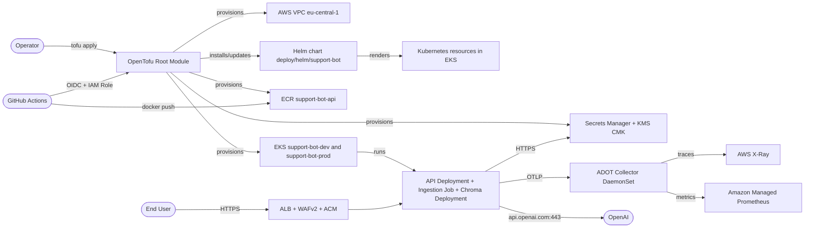

# Feature Specification: Alternative AWS Infrastructure (OpenTofu)

**Feature Branch**: `[002-alternative-aws-infrastructure]`
**Created**: 2026-09-12
**Status**: Draft

> **Mission.** Provide an alternative AWS production deployment for `support-agent` that is provisioned **from scratch** using **OpenTofu** (the open-source Terraform fork) and that **reuses the existing Helm chart** at [`deploy/helm/support-bot/`](../../deploy/helm/support-bot/) — including its `values.yaml`, `values-dev.yaml`, `values-prod.yaml`, and `values.schema.json` — as the workload-packaging contract.
>
> The current `docs/architecture/aws-flow.md` is prose only: the Helm chart ships 8 templates and contains no `Ingress`, no `ServiceAccount`, no `HPA`, no `PDB`, no `NetworkPolicy`, no `StorageClass`. The OpenTofu code produced by this feature **wires up the missing chart-level concerns out-of-cluster** (Terraform-side `kubectl apply` of sidecar manifests, raw Kubernetes manifests via the `kubernetes`/`helm` providers, etc.) **and may add net-new templates to the chart** (no edits to existing templates, no renamed values, no removed fields).
>
> **Region**: `eu-central-1`. **Clusters**: `support-bot-dev` and `support-bot-prod`. The two clusters are independent — separate VPCs, separate Secrets Manager entries, separate Route53 subdomains, separate Karpenter `EC2NodeClass` — but share one OpenTofu root module driven by an environment variable.

---

## Context *(mandatory)*

### System Interactions

- **Operators** (humans with AWS account access) run `tofu apply` from the `support-agent` repository to provision or update the AWS infrastructure. They supply AWS credentials via `AWS_PROFILE` or environment variables, never via committed state.
- **End users** of the deployed API send HTTPS requests to `api.<env>.support-bot.example.com` (Route53 alias to the ALB).
- **OpenAI** is called by the API pods over `https://api.openai.com:443` for embeddings and chat completions; if `EMBEDDER_BACKEND=local` then `intfloat/multilingual-e5-large` is loaded at pod start instead.
- **The Helm chart** at [`deploy/helm/support-bot/`](../../deploy/helm/support-bot/) is the contract between this infrastructure and the application. OpenTofu installs it via the `helm` provider, passing `values-prod.yaml` (or `values-dev.yaml`) merged with secrets that originate from AWS Secrets Manager.
- **AWS Secrets Manager** stores the OpenAI key and (when enabled) the Chroma auth token per environment (`support-bot/<env>/openai-api-key`, `support-bot/<env>/chroma-auth-token`).
- **AWS KMS** provides the CMK used to encrypt Secrets Manager secrets and to envelope-encrypt Kubernetes Secrets in EKS.
- **AWS WAFv2** is associated with the ALB; rule sets ship from Terraform as code.
- **Amazon ECR** stores the API and ingestion container images. OpenTofu creates the repositories and the IAM role for CI to push.
- **GitHub Actions** (out of scope for OpenTofu, but a downstream consumer) uses OIDC + the IAM role created by OpenTofu to push images to ECR and to update the `image.tag` in the chart values.

### Context Diagram

### Use Cases

- **UC1**: Operator + runs `tofu init && tofu apply -var-file=envs/dev.tfvars` + EKS `support-bot-dev` cluster exists in `eu-central-1`, the Helm chart `deploy/helm/support-bot` is installed in the `support-bot` namespace with `values-dev.yaml`, the API Deployment has at least one ready replica, the Chroma Deployment has at least one ready replica, and `GET https://api.dev.support-bot.example.com/healthz` returns 200.
- **UC2**: Operator + runs `tofu apply -var-file=envs/prod.tfvars` + EKS `support-bot-prod` cluster exists in `eu-central-1` (independent VPC, independent Secrets Manager entries, independent Karpenter NodePool) and the Helm chart is installed with `values-prod.yaml`, the API Deployment has 3 ready replicas, and `POST https://api.support-bot.example.com/ask` returns 200 with a non-empty answer for a question that is in scope of the ingested source page.
- **UC3**: Operator + runs `tofu apply -var-file=envs/prod.tfvars` a second time + no resource is replaced; only the chart's `image.tag`, `replicaCount`, or `autoscaling.*` may change between consecutive applies; the cluster, VPC, IAM roles, and Secrets Manager entries persist.
- **UC4**: Operator + deletes the OpenAI key in AWS Secrets Manager and re-rotates it + within 5 minutes (the configured `refreshInterval` of External Secrets Operator) the API pods read the new key with no pod restart, and a subsequent `POST /ask` succeeds with no `LLMUnavailable` errors.
- **UC5**: Ingestion Job runs to completion on the prod cluster + Chroma's PVC contains the embeddings, `GET /ask` returns answers grounded in the ingested source page, and `kubectl get job -n support-bot support-bot-ingestion` reports `Active: 0, Succeeded: 1`.
- **UC6**: One of the three AZs in `eu-central-1` becomes unavailable + the API continues to serve 200 from pods in the surviving two AZs; the Chroma pod fails over to the surviving AZ's node (EBS volume fails over after the DLM snapshot is restored to a new AZ); no `helm.sh/hook` re-runs; no manual operator intervention is required.
- **UC7**: Operator + runs `tofu destroy -var-file=envs/dev.tfvars` + the dev cluster and its VPC are deleted; the prod cluster, prod Secrets Manager entries, prod Route53 records, prod KMS keys, and the ECR repositories are untouched.

---

## Misfits *(mandatory)*

- **Misfit A** (Security): The OpenAI API key leaks to stderr, to a CloudWatch log group, to a Kubernetes Secret rendered by `helm template`, or to a Terraform state file committed to Git.
- **Misfit B** (Configuration Drift): The `aws-flow.md` prose claims 50 GiB Chroma PVC and a Karpenter-managed spot pool, but `values-prod.yaml` ships 10 GiB, no HPA template, and no Karpenter config — `tofu apply` produces a cluster whose effective state diverges from the prose within one release.
- **Misfit C** (Data Integrity): Chroma's PVC is destroyed by a `helm uninstall` or by `tofu destroy` despite the chart declaring `persistentVolumeReclaimPolicy: Retain`, because the StorageClass's `reclaimPolicy` was never explicitly set to `Retain` (the AWS gp3 default is `Delete`), so the existing embeddings are lost.
- **Misfit D** (Availability): The ALB target group has only one healthy target because the API Deployment runs on a single node that lives in a single AZ, so an AZ failure takes the entire API down even though `topologySpreadConstraints` was specified.
- **Misfit E** (Identity / Privilege): An IAM role grants `secretsmanager:GetSecretValue` on `*` (all secrets in the account) instead of being scoped to the secret ARNs for the active environment, so a compromise of any one pod can read every secret in the AWS account.
- **Misfit F** (Supply Chain): The image in `ECR` was built without `cosign` signing and without `trivy` scan, and the EKS cluster accepts the image because no `ImagePolicy` / `ValidatingAdmissionPolicy` blocks unsigned images, so a poisoned CI run can deploy code that runs in production.
- **Misfit G** (Network Egress): A new egress dependency (e.g. an LLM endpoint, an alternative vector store) is added to the API but no `NetworkPolicy` egress rule exists for it, so traffic silently fails because Cilium in chained mode is not enabled and the VPC CNI network policy add-on is not configured.
- **Misfit H** (Operational): A `tofu apply` destroys and recreates the EKS control plane (or the Secrets Manager entry, or the ALB) because the `lifecycle { prevent_destroy }` block is missing, and downstream the chart's Helm release is re-installed from scratch losing all in-flight `request_id` log lines, in-flight traces, and the in-flight ingestion run.
- **Misfit I** (Disaster Recovery): The Chroma PVC is bound to a single EBS volume in a single AZ, and no DLM snapshot schedule exists, so an AZ failure or accidental PVC deletion means the embeddings must be rebuilt by re-running the ingestion job (RTO ≈ 5 minutes) — but the ingestion step depends on the source URL still being reachable, which may not be true.
- **Misfit J** (Configuration Drift II): The dev cluster and the prod cluster share the same ECR repository, so a `main` build intended for dev is pulled by a prod Helm release because the chart's `image.tag` is set to `latest` or to a moving tag, and prod serves a build that has not passed prod's gating checks.

### Misfit Interaction Notes

- **Misfit A ↔ Misfit E**: Both are IAM/secrets concerns. Resolving Misfit A (no key in logs/state) requires resolving Misfit E (scoped IAM), because if the IAM role is unscoped, any pod that has logs flowing through CloudWatch can read any other secret. Plan them together.
- **Misfit B ↔ Misfit D**: Both are configuration drift. Resolving Misfit B forces Misfit D because the only way the chart's HPA, multi-AZ topology spread, and Karpenter NodePool actually take effect is if the chart's values match the OpenTofu output. Plan them together.
- **Misfit C ↔ Misfit I**: Both are storage durability. Resolving Misfit C (StorageClass Retain) is a prerequisite for resolving Misfit I (DLM snapshot), because a `Delete` reclaim policy destroys the volume before DLM can snapshot it. Plan them together.
- **Misfit H ↔ Misfit C**: Resolving Misfit H (`prevent_destroy` on critical resources) protects the StorageClass Retain setup from being undone by a future `tofu destroy`. Sequential, not parallel.
- **Misfit G ↔ Misfit D**: Misfit D (multi-AZ pods) requires Misfit G (working NetworkPolicy egress) to be addressable, because `topologySpreadConstraints` will spread pods across AZs but if they can't reach Chroma across AZs the system is worse off.
- **Misfit J ↔ Misfit F**: Misfit J (image tag pinning) is a prerequisite for Misfit F (signature enforcement), because the policy controller needs a stable reference to the image tag to verify.

---

## User Scenarios & Testing *(mandatory)*

### User Story 1 - Provision a brand-new prod cluster from scratch (Priority: P1)

**Why this priority**: The core deliverable of this feature. If an operator cannot run `tofu apply` and get a working prod cluster, the feature has no value.

**Independent Test**: From a clean checkout on a fresh AWS account, run `tofu init && tofu apply -var-file=envs/prod.tfvars` and verify (a) `aws eks describe-cluster --name support-bot-prod` returns `ACTIVE`, (b) `aws secretsmanager list-secrets --filters Key=name,Values=support-bot/prod/` returns both secrets, (c) `aws ec2 describe-vpcs --filters Name=tag:Name,Values=support-bot-prod-vpc` returns the new VPC, (d) `helm list -n support-bot` returns one release with `STATUS: deployed`, (e) `kubectl get pods -n support-bot` returns one or more ready `support-bot-api` pods, and (f) `curl -fsS https://api.support-bot.example.com/healthz` returns `{"status":"ok"}`.

**Acceptance Scenarios**:

1. **Given** an AWS account with quota for one EKS cluster, one NAT gateway, one ALB, and two Secrets Manager entries, **When** the operator runs `tofu init && tofu apply -var-file=envs/prod.tfvars` for the first time, **Then** all resources in the OpenTofu plan are created (no errors, no skipped resources) and the second `tofu plan` reports `No changes.`
2. **Given** the prod cluster is up, **When** the operator runs `kubectl get ingress -n support-bot`, **Then** an Ingress resource exists and `kubectl get ingress -n support-bot -o jsonpath='{.items[0].status.loadBalancer.ingress[0].hostname}'` returns a hostname that resolves to the ALB.
3. **Given** the prod cluster is up, **When** the operator runs `curl -fsS -X POST https://api.support-bot.example.com/ask -H 'Content-Type: application/json' -d '{"question":"<in-scope question>"}'`, **Then** the response is 200 and the `answer` field is non-empty (or, if no ingestion has run, the response is the refusal message).

### User Story 2 - Rotate the OpenAI key with zero pod restart (Priority: P1)

**Why this priority**: Spec NFR-003 mandates that API keys live in env vars / Secrets Manager and never in source; spec AGENTS.md §6.3 mandates a single `request_id` flows through every layer including secrets. Rotation without restart is the operational proof that the chain works.

**Independent Test**: Push a new OpenAI key into `support-bot/prod/openai-api-key` via the AWS console or `aws secretsmanager put-secret-value`. Within 5 minutes (one ESO `refreshInterval`) the API pods read the new value. A test request with `X-Request-Id: rotation-test-<uuid>` returns 200 and the `request_id` is present in the JSON log line for that request.

**Acceptance Scenarios**:

1. **Given** the prod cluster is up and the API pods are healthy, **When** the operator updates the OpenAI key in Secrets Manager, **Then** within one ESO refresh cycle (default 5 minutes) the ExternalSecret resource in the cluster has `status: SecretSynced` and the Kubernetes Secret `support-bot/openai-api-key` has the new value, with no pod restart observed in `kubectl get pods -n support-bot -w`.
2. **Given** the rotation has completed, **When** a `POST /ask` request is sent with a known `X-Request-Id`, **Then** the JSON log line for that request (findable via CloudWatch Logs Insights with `fields @requestId | filter @requestId = "rotation-test-…"`) includes the same `request_id`, the new (rotated) key's hash (not the literal), and `status_code: 200`.

### User Story 3 - Tear down the dev cluster without affecting prod (Priority: P2)

**Why this priority**: Without isolation between dev and prod, a dev environment change risks prod. The test verifies that the OpenTofu module's separation is real (not just two values files pointing at the same resources).

**Independent Test**: Run `tofu destroy -var-file=envs/dev.tfvars`. Verify `aws eks describe-cluster --name support-bot-dev` returns `ResourceNotFoundException` and `aws eks describe-cluster --name support-bot-prod` returns `ACTIVE`. Verify `aws secretsmanager list-secrets --filters Key=name,Values=support-bot/dev/` is empty, and `Key=name,Values=support-bot/prod/` still has the two secrets. Verify `aws ec2 describe-vpcs --filters Name=tag:Name,Values=support-bot-prod-vpc` returns the prod VPC.

**Acceptance Scenarios**:

1. **Given** both dev and prod clusters are up, **When** the operator runs `tofu destroy -var-file=envs/dev.tfvars` and confirms, **Then** all `support-bot-dev` resources are deleted (VPC, EKS, Secrets Manager entries, ALB, ACM cert, Route53 records), no `support-bot-prod` resources are deleted, and `kubectl config get-contexts` no longer lists `support-bot-dev`.
2. **Given** the dev cluster has been destroyed, **When** the operator re-runs `tofu apply -var-file=envs/dev.tfvars`, **Then** the dev cluster is recreated and the prod cluster is untouched.

### User Story 4 - Recover from an AZ failure in prod (Priority: P2)

**Why this priority**: Without AZ resilience, a single AZ failure takes the API down. The user-visible test is "is the API still answering when one AZ is gone?".

**Independent Test**: In a test AWS account, create the prod cluster. Then cordon all nodes in `eu-central-1a` (or use AWS Fault Injection Service to simulate an AZ failure). Within 5 minutes, `GET /healthz` returns 200, served from pods in the surviving two AZs. After un-cordon, all pods return to normal scheduling.

**Acceptance Scenarios**:

1. **Given** the prod cluster is up with pods spread across 3 AZs (verified by `kubectl get pods -n support-bot -o wide | grep -c eu-central-1`), **When** all nodes in one AZ are cordoned, **Then** the ALB target group re-registers targets in the surviving AZs within 90 seconds (ALB health check interval), `GET /healthz` returns 200, and no `5xx` errors appear in CloudWatch during the transition.
2. **Given** the Chroma pod was running in the cordoned AZ, **When** Kubernetes reschedules it, **Then** the rescheduled pod fails to bind to the original PVC (because the EBS volume is AZ-bound), the OpenTofu-managed DLM snapshot is restored to a new volume in a surviving AZ (manual step in this version; automated in a future WP), and the new Chroma pod is ready within 5 minutes.

### User Story 5 - Upgrade the API version by changing only `image.tag` (Priority: P2)

**Why this priority**: The Helm release must respond to image-tag bumps without touching the cluster, secrets, or VPC. This validates that the chart is the contract and that OpenTofu treats it as the deployment surface, not the application.

**Independent Test**: Set `image.tag = "<new-sha>"` in `envs/prod.tfvars`, run `tofu apply`. Verify only the Deployment is updated, no other resource is replaced, the new pods are ready, and a `POST /ask` returns answers from the new build.

**Acceptance Scenarios**:

1. **Given** the prod cluster is up at version `0.1.0`, **When** the operator sets `image.tag = "0.2.0"` and runs `tofu apply -var-file=envs/prod.tfvars`, **Then** `tofu plan` on the second run reports `No changes.`, the Helm release's `REVISION` is incremented, the API Deployment is rolled (verified by `kubectl rollout status deployment/support-bot-api -n support-bot` returning `successfully rolled out`), and a `POST /ask` returns a response.
2. **Given** the upgrade is in progress, **When** a user sends a `POST /ask` during the rolling update, **Then** the request is routed to a ready pod (no 503 from the ALB) because the chart's `readinessProbe` on `/healthz` keeps the pod in the target group until it is healthy.

---

## Requirements *(mandatory)*

### Functional Requirements

- **FR-001** [UBIQUITOUS]: The OpenTofu root module shall provision **two independent EKS clusters** named `support-bot-dev` and `support-bot-prod` in `eu-central-1`, each in its own VPC with its own Secrets Manager namespace prefix, Route53 subdomain, KMS CMK, and Karpenter NodePool.
- **FR-002** [UBIQUITOUS]: The OpenTofu root module shall provision one **private S3 bucket** in `eu-central-1` used as the Terraform state backend, with versioning, server-side encryption with a customer-managed KMS key, and a `prevent_destroy` lifecycle on the bucket and the lock file.
- **FR-003** [WHEN]: WHEN `tofu apply` runs with `var-file=envs/dev.tfvars`, the module shall create or update the `support-bot-dev` cluster and shall not touch any resource whose name starts with `support-bot-prod-`.
- **FR-004** [WHEN]: WHEN `tofu apply` runs with `var-file=envs/prod.tfvars`, the module shall create or update the `support-bot-prod` cluster and shall not touch any resource whose name starts with `support-bot-dev-`.
- **FR-005** [UBIQUITOUS]: The OpenTofu root module shall install the Helm chart at [`deploy/helm/support-bot/`](../../deploy/helm/support-bot/) into each cluster's `support-bot` namespace via the `helm` provider, using `values-dev.yaml` for dev and `values-prod.yaml` for prod, merged with cluster-specific secrets sourced from AWS Secrets Manager.
- **FR-006** [UBIQUITOUS]: The OpenTofu root module shall create one **Secrets Manager entry per environment** named `support-bot/<env>/openai-api-key` and (when `chroma_auth_token` is set) `support-bot/<env>/chroma-auth-token`, encrypted with a per-environment customer-managed KMS key, and shall install the **External Secrets Operator** in each cluster via the `helm` provider, configured with an `AWSClusterSecretStore` / `ClusterSecretStore` that uses EKS Pod Identity to read those secrets.
- **FR-007** [UBIQUITOUS]: The OpenTofu root module shall create one **ECR repository** named `support-bot-api` per environment (or a single shared one if `var.shared_ecr = true`), with an image scanning configuration enabled and a repository policy that allows only the GitHub Actions OIDC role to push.
- **FR-008** [UBIQUITOUS]: The OpenTofu root module shall provision a **gp3 StorageClass** named `support-bot-gp3` in each cluster with `parameters: { type = "gp3", iops = "3000", throughput = "250", encrypted = "true" }` and `reclaimPolicy = "Retain"`, and the Helm chart's `templates/pvc.yaml` shall be configured (via values) to use `storageClassName: support-bot-gp3`.
- **FR-009** [WHEN]: WHEN the Chroma PVC is created, the module shall attach a **Data Lifecycle Manager (DLM) snapshot schedule** to the EBS volume that creates a snapshot every 24 hours with 7-day retention, tagged with the cluster name and the current `request_id` of the most recent successful ingestion.
- **FR-010** [UBIQUITOUS]: The OpenTofu root module shall provision an **internal-scheme Application Load Balancer** in each cluster via an `Ingress` resource with AWS Load Balancer Controller annotations `alb.ingress.kubernetes.io/target-type=ip`, `alb.ingress.kubernetes.io/scheme=internal`, `alb.ingress.kubernetes.io/wafv2-acl-arn=<web-acl-arn>`, `alb.ingress.kubernetes.io/ssl-policy=ELBSecurityPolicy-TLS13-1-2-2021-06`, and `alb.ingress.kubernetes.io/listen-ports='[{"HTTPS":443}]'`.
- **FR-011** [UBIQUITOUS]: The OpenTofu root module shall provision a **WAFv2 WebACL** per environment, associated with the ALB, with the AWS-managed rule sets `AWSManagedRulesCommonRuleSet`, `AWSManagedRulesSQLiRuleSet`, and `AWSManagedRulesBotControlRuleSet` enabled and a rate-based rule of 1000 requests per 5 minutes per IP.
- **FR-012** [UBIQUITOUS]: The OpenTofu root module shall provision an **ACM certificate** per environment for the subdomain `<env>.support-bot.example.com` (with a wildcard SAN `*.<env>.support-bot.example.com`) and a **Route53 alias record** from that subdomain to the ALB.
- **FR-013** [UBIQUITOUS]: The OpenTofu root module shall install the **Karpenter v1** controller in each cluster via the `helm` provider, with one `NodePool` per cluster pointing at one `EC2NodeClass` per cluster, with `requirements` for instance generation `>= 5`, instance categories `["c","m","r"]`, capacity types `["spot","on-demand"]`, and `disruption.consolidationPolicy = WhenEmptyOrUnderutilized`.
- **FR-014** [UBIQUITOUS]: The OpenTofu root module shall install the **AWS Load Balancer Controller**, **External Secrets Operator**, **Amazon EKS Pod Identity Agent**, and the **ADOT Collector (DaemonSet mode)** in each cluster via the `helm` provider, each with its own IAM role granted via EKS Pod Identity and a least-privilege IAM policy scoped to the per-environment resource ARNs.
- **FR-015** [UBIQUITOUS]: The OpenTofu root module shall declare **all critical resources** (the S3 state bucket, the DynamoDB lock table, both Secrets Manager entries, both KMS CMKs, both EKS clusters, both ECR repositories) with `lifecycle { prevent_destroy = true }`, and shall set `lifecycle { create_before_destroy = true }` on the chart's Helm release so upgrades do not require a chart uninstall.
- **FR-016** [IF/THEN]: IF a `helm_release.support-bot` upgrade fails (the chart's hooks cannot complete in 600 seconds), THEN the OpenTofu module shall mark the Helm release as `degraded` and shall **not** roll back the underlying cluster, IAM, or Secrets Manager resources — those are independent.
- **FR-017** [IF/THEN]: IF the Helm chart's `values.schema.json` rejects the merged values (e.g. an empty `openaiApiKey`), THEN `tofu apply` shall fail at the `helm_release` resource with a clear error message that points at the schema violation, and no Kubernetes resources shall be created in the cluster.
- **FR-018** [IF/THEN]: IF the AWS account does not have quota for the requested resources (e.g. EKS cluster limit, VPC limit, NAT gateway limit, EBS volume IOPS limit), THEN the OpenTofu plan shall fail at the `aws_eks_cluster` resource (or whichever resource hits the limit first) with the AWS error message intact, and shall not create partial resources.
- **FR-019** [WHERE]: WHERE the Helm chart's `templates/secret.yaml` exists (it does), the OpenTofu module shall not render a Kubernetes Secret directly; secrets shall flow Secrets Manager → External Secrets Operator → Kubernetes Secret (synchronised) → env var.
- **FR-020** [WHERE]: WHERE the Helm chart lacks an `Ingress` template (it does), the OpenTofu module shall render the `Ingress` resource directly via the `kubernetes` provider (or via a chart `templates/_external/` directory added in this feature), referencing the ALB controller's `ingressClassName: alb`.

### Non-Functional Requirements

- **NFR-001** (Performance): `POST /ask` on the prod cluster shall return p95 < 3 s end-to-end with up to 10 000 indexed chunks, identical to the project's existing NFR-001.
- **NFR-002** (Reliability): The API process shall survive a Chroma restart without crashing, identical to the project's existing NFR-002.
- **NFR-003** (Security): No API key, no `sk-…` literal, no `OPENAI_API_KEY` value, and no `CHROMA_AUTH_TOKEN` value shall appear in (a) the rendered OpenTofu plan output, (b) the Kubernetes resources applied to the cluster, (c) any CloudWatch log group, (d) any Terraform state file. Secrets Manager is the only source of truth.
- **NFR-004** (Security): All IAM roles granted via EKS Pod Identity shall be scoped to **specific resource ARNs** (secrets, KMS keys, S3 buckets, log groups); no role shall use `Resource = "*"` for `secretsmanager:GetSecretValue`, `kms:Decrypt`, `s3:*`, or `logs:*`.
- **NFR-005** (Observability): All application log lines emitted in the request scope shall carry the same `request_id` (via `structlog.contextvars`), and the ALB shall log every request with `request_id` propagated through `X-Request-Id`. Log destination: CloudWatch Logs with a 30-day retention policy.
- **NFR-006** (Cost): The total AWS bill for the dev cluster shall not exceed **$150/month** when idle (one API replica, one Chroma replica, no ingress traffic); the prod cluster shall not exceed **$500/month** when idle (3 API replicas, 1 Chroma replica, Karpenter Spot-first NodePool, single NAT gateway).
- **NFR-007** (Reproducibility): Two consecutive `tofu apply -var-file=envs/prod.tfvars` runs with no intervening changes shall report `No changes. Infrastructure is up-to-date.` and shall not rotate any data-plane resource (no new EBS volume, no new Secrets Manager secret, no new ALB).
- **NFR-008** (Disaster Recovery): The Chroma EBS volume shall be recoverable from a DLM snapshot within 5 minutes (RTO) and the data loss window shall be ≤ 24 hours (RPO = one snapshot interval).
- **NFR-009** (Documentation): Every OpenTofu module, every input variable, and every output shall have a Google-style docstring, and the README at `infra/README.md` shall document the bootstrap procedure (`tofu init` → create the S3 backend → `tofu apply` for dev → `tofu apply` for prod).

---

## Key Entities

- **Environment** (`support-bot-dev`, `support-bot-prod`): a tuple of `(vpc, eks_cluster, secrets, kms_cmk, ecr_repo, route53_zone, acm_cert, alb, wafv2, karpenter_nodepool, helm_release)` provisioned by one `tofu apply` per `envs/<env>.tfvars`.
- **VPC**: 3-AZ layout in `eu-central-1`, public subnets (ALB only), private subnets (EKS nodes, Pods), 1 NAT gateway, 6 VPC interface endpoints (Secrets Manager, STS, ECR API, ECR DKR, CloudWatch Logs, CloudWatch Monitoring), 1 gateway endpoint (S3).
- **EKS Cluster**: Kubernetes 1.30, control plane logging enabled (api, audit, authenticator), public access restricted to a single admin CIDR supplied by `var.admin_cidr`, secret encryption enabled with the per-environment CMK.
- **Karpenter NodePool** (`baseline`, `burst`): `baseline` is a managed node group of 2× `m7i.large` with On-Demand capacity type (covers replicas2–3 of the API + Chroma pod + system pods); `burst` is a Karpenter NodePool with capacity types `["spot","on-demand"]` that absorbs HPA scale-out from replicas 3 to 6.
- **Secrets Manager Entry** (`support-bot/<env>/openai-api-key`, `support-bot/<env>/chroma-auth-token`): encrypted with the per-environment CMK, rotation enabled (OpenAI key rotation Lambda is out of scope for this feature; the entry is created with `rotation: { automatically_after_days = 30 }` and `rotation_lambda_arn = null` so the operator can attach the Lambda in a follow-up).
- **ECR Repository** (`support-bot-api-<env>` unless `var.shared_ecr = true`): image scanning on push, tag immutability enabled, repository policy allowing only the GitHub Actions OIDC role to push.
- **ALB**: created via the AWS Load Balancer Controller from an `Ingress` resource; target type `ip`; health check path `/healthz`; idle timeout 60 s; access logs to S3.
- **DLM Snapshot Policy**: per-EBS-volume, every 24 hours, 7-day retention, tagged with cluster name and ingestion `request_id`.

---

## Success Criteria *(mandatory)*

- **SC-001**: From a clean checkout, an operator can run `tofu init && tofu apply -var-file=envs/dev.tfvars` and have a working dev cluster (per UC1) within 30 minutes.
- **SC-002**: From a clean checkout, an operator can run `tofu init && tofu apply -var-file=envs/prod.tfvars` and have a working prod cluster (per UC2) within 45 minutes.
- **SC-003**: After rotating the OpenAI key in Secrets Manager, the API pods read the new value within 5 minutes with no pod restart (per UC4).
- **SC-004**: Running `tofu destroy -var-file=envs/dev.tfvars` deletes only dev resources; prod is untouched (per UC3).
- **SC-005**: A simulated AZ failure on the prod cluster results in `/healthz` returning 200 within 5 minutes (per UC6).
- **SC-006**: Bumping `image.tag` in `envs/prod.tfvars` results in a Helm release upgrade with no other resource changes (per UC5).
- **SC-007**: A CI pipeline (GitHub Actions) can push an image to ECR using OIDC, and the chart's new `image.tag` is picked up by a subsequent `tofu apply`.
- **SC-008**: `tofu plan -var-file=envs/prod.tfvars` after a successful `tofu apply -var-file=envs/prod.tfvars` reports `No changes.` for **all** prod resources except those whose input variables changed.
- **SC-009**: A grep of the rendered OpenTofu output, the Kubernetes resources, the CloudWatch log groups, and the S3 state file for `sk-[A-Za-z0-9]{32,}` returns zero matches.

---

## Assumptions

- The operator has an AWS account with quota for at least 2 EKS clusters, 6 VPCs (3 per environment, including public/private subnets), 6 ALBs (2 per environment), 4 Secrets Manager entries (2 per environment), 4 KMS keys (2 per environment), 2 ECR repositories (or 1 if `shared_ecr = true`), 2 NAT gateways, and 2 Route53 hosted zones.
- The operator has a Route53 parent hosted zone for `support-bot.example.com` (or has delegated a subdomain to a child zone managed by this module).
- The Helm chart at `deploy/helm/support-bot/` is the deployment contract; changes to the chart required by this feature are limited to **net-new templates** (e.g. `templates/externalsecret.yaml`, `templates/serviceaccount.yaml`, `templates/ingress.yaml`) and to **additive values** in `values.yaml` / `values-prod.yaml` / `values-dev.yaml`. No existing template may be edited; no value may be renamed or removed.
- The OpenTofu version is `>= 1.6.0` and the AWS provider version is `>= 5.40.0`.
- Karpenter v1 is GA stable as of 2026 (it is).
- The ADOT Collector DaemonSet is the OTLP receiver; no in-pod OTLP collector sidecar.
- The `support-bot` container image is built and pushed to ECR by a GitHub Actions workflow (out of scope for this feature; the workflow consumes the IAM role and ECR repository created by this feature).
- `kubectl` is installed locally and can be authenticated to the cluster via `aws eks update-kubeconfig`.
- The OpenTofu state is stored in S3 with a DynamoDB lock table (the S3 bucket and the DynamoDB table are themselves managed by OpenTofu in a separate `bootstrap` workspace).

## Out of Scope

- **GitHub Actions CI/CD workflow**: the IAM role and ECR repository are created; the workflow itself is a separate feature.
- **Argo CD / Flux GitOps controller**: OpenTofu installs the cluster; Argo CD or Flux is a separate feature for declarative sync from a Git repo.
- **Multi-region DR**: only `eu-central-1` is provisioned.
- **Cra Chroma HA clustering**: the spec excludes it.
- **Per-tenant auth on the API**: ingress-level auth is the assumption; the API itself has no auth code path.
- **OpenAI key rotation Lambda**: the Secrets Manager entry is created with a rotation policy, but the Lambda that does the actual rotation is a separate feature.
- **Cosign signing enforcement on EKS**: `ValidatingAdmissionPolicy` for image signatures is a separate feature; ECR scan-on-push is the only supply-chain gate in this feature.
- **Custom domain registrar**: the operator supplies the Route53 parent zone.
- **Migration of the existing `docs/architecture/aws-flow.md`**: this feature produces a new `infra/README.md` and a new `docs/architecture/aws-flow-v2.md` that supersedes the old one; the old file is left in place until a separate chore removes it.
- **CloudWatch Logs Insights queries and dashboards**: the log groups and metric filters are created; the saved queries and Grafana dashboards are a separate feature.