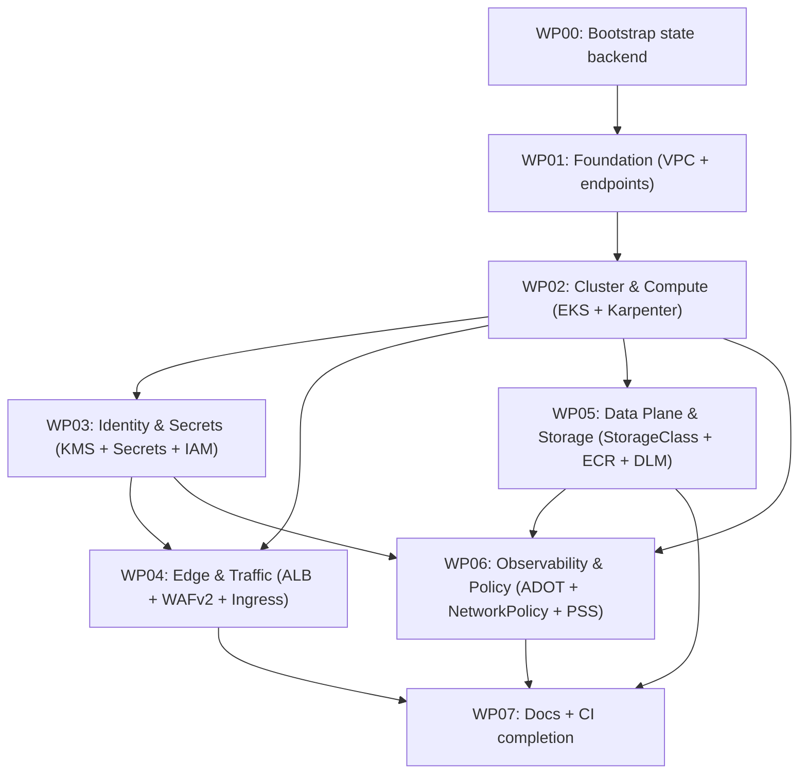

# Work Packages: 002 — Alternative AWS Infrastructure (OpenTofu)

**Inputs**: `specs/002-alternative-aws-infrastructure/`
**Prerequisites**: plan.md ✅ | spec.md ✅ (status: planned)
**Decomposition**: decomposition.md ✅

> **Recap of constraints from spec.md + plan.md.**
> - One OpenTofu root module, six child modules (1:1 with decomposition subsystems S1–S6).
> - State backend provisioned by a separate `infra/bootstrap/` workspace (S3 + DynamoDB + KMS CMK, all `prevent_destroy`); main workspace uses that backend with per-env state keys (`support-bot/dev/...` and `support-bot/prod/...`).
> - The Helm chart at `deploy/helm/support-bot/` is reused with **additive** template changes only (new `externalsecret.yaml`, `serviceaccount.yaml`, `ingress.yaml`, `networkpolicy.yaml`); the existing 8 templates are not edited; no value may be renamed or removed.
> - **No `helm_release` resource is created in any WP.** Every WP that touches the chart runs `helm lint` + `helm template --validate` + the secret-scan grep locally to validate. Actual `helm install` is a downstream CI/CD feature (out of scope here).
> - Two EKS clusters (`support-bot-dev`, `support-bot-prod`) in `eu-central-1`, each with its own VPC, KMS CMK, Secrets Manager entries, ECR, Karpenter NodePool, ALB + WAFv2 + ACM, ADOT.
> - Helm chart installs **explicitly out of scope** for this feature.

---

## Work Package WP00: Bootstrap state backend (Priority: P0)

**Goal**: Provision the S3 state bucket, DynamoDB lock table, and bootstrap KMS CMK in `eu-central-1` so the main workspace can use them. This WP is one-shot — never destroyed.
**Subsystem**: S0 (one-shot bootstrap)
**Abstract Components**: `StateBucket` (from S1 plan)
**Misfits Addressed**: M8 (`prevent_destroy` on state backend, partial)
**Independent Test**: `cd infra/bootstrap && tofu init && tofu apply && tofu plan` reports `No changes.`; `aws s3api get-bucket-versioning --bucket <name>` returns `Status: Enabled`; `aws dynamodb describe-table --table-name <name>` returns `TableStatus: ACTIVE`; `aws kms describe-key --key-id <arn>` returns `KeyManager: CUSTOMER`.
**Prompt**: `tasks/WP00-bootstrap-state-backend.md`

### Included Subtasks
- [ ] T001 Create `infra/bootstrap/main.tf` with S3 bucket (versioning, SSE-KMS, `prevent_destroy`), DynamoDB lock table (`PAY_PER_REQUEST`, `prevent_destroy`), and KMS CMK (alias `support-bot-bootstrap-cmk`, key policy restricts to admin role).
- [ ] T002 Write `infra/bootstrap/README.md` with the bootstrap procedure, the bucket/table/CMK naming convention, and the warning to never destroy.
- [ ] T003 Write `infra/bootstrap/tests/bootstrap.tftest.hcl` that asserts `prevent_destroy` is set on the bucket and the table, the SSE-KMS key is the bootstrap CMK, and the bucket policy denies non-TLS access.
- [ ] T004 Add `.github/workflows/infra-ci.yml` skeleton with the lint/validate/test jobs (the body is completed in WP07; this WP just adds the file so subsequent WPs can rely on CI being present).
- [ ] T005 Update `README.md` (root) with a one-line note linking to `infra/README.md` (added in WP07).

### TDD Targets (from Misfits)
- [ ] **M8 (prevent_destroy)**: `tofu test` runs `plan` against the bootstrap workspace and asserts the bucket and the table have `prevent_destroy = true` in the plan output.
- [ ] **NFR-003 (no key in state)**: the bootstrap workspace has no secret-bearing resources; the CMK is for state-encryption only and never decrypts application secrets.

### Dependencies
- None (first WP — runs before everything else).

---

## Work Package WP01: Foundation — VPC, subnets, NAT, VPC endpoints (Priority: P0)

**Goal**: Provision the per-environment VPC in `eu-central-1` (3 AZs, public + private subnets, 1 NAT gateway, 6 VPC interface endpoints + 1 S3 gateway endpoint) and the top-level OpenTofu configuration (versions, root variables, root outputs).
**Subsystem**: S1 Foundation
**Abstract Components**: `VpcModule` (from S1 plan)
**Misfits Addressed**: (substrate — provides VPC consumed by S2–S6)
**Independent Test**: `cd infra && tofu init -backend-config=... && tofu apply -var-file=envs/dev.tfvars` provisions the VPC; `aws ec2 describe-vpcs --filters Name=tag:Name,Values=support-bot-dev-vpc` returns one VPC; `aws ec2 describe-subnets --filters Name=vpc-id,Values=<id>` returns 6 subnets (3 public, 3 private); `aws ec2 describe-nat-gateways --filter Name=vpc-id,Values=<id>` returns 1; `aws ec2 describe-vpc-endpoints --filters Name=vpc-id,Values=<id>` returns 7 (6 interface + 1 gateway).
**Prompt**: `tasks/WP01-foundation-vpc.md`

### Included Subtasks
- [ ] T001 Create `infra/versions.tf` pinning OpenTofu `>= 1.6.0` and providers (`aws >= 5.40.0`, `helm >= 2.12.0`, `kubernetes >= 2.27.0`, `random >= 3.6.0`, `null >= 3.2.0`, `gavinbunney/kubectl >= 1.14.0`).
- [ ] T002 Create `infra/root_variables.tf` with top-level vars (`region = "eu-central-1"`, `env`, `parent_zone_id`, `admin_cidr`, `shared_ecr = false`, `chroma_auth_token = null (sensitive)`, `openai_api_key (sensitive)`, `domain_suffix = "support-bot.example.com"`).
- [ ] T003 Create `infra/root_outputs.tf` aggregating the per-env cluster name, ALB DNS, ECR URL, and a boolean `chart_renders_clean` for the integration WP.
- [ ] T004 Create `infra/modules/foundation/{variables.tf,versions.tf}` declaring the foundation module's contract (`vpc_cidr`, `az_count = 3`, `nat_gateway_count = 1`, `enable_vpc_endpoints = true`).
- [ ] T005 Create `infra/modules/foundation/main.tf` with `aws_vpc`, public/private subnets across 3 AZs, route tables, 1 NAT gateway, 6 interface endpoints (Secrets Manager, STS, ECR API, ECR DKR, CloudWatch Logs, CloudWatch Monitoring) + 1 S3 gateway endpoint, and the per-env tags.
- [ ] T006 Create `infra/modules/foundation/outputs.tf` exporting `vpc_id`, `vpc_cidr_block`, `public_subnet_ids`, `private_subnet_ids`, `nat_gateway_ids`, `vpc_endpoint_security_group_id`.
- [ ] T007 Create `infra/envs/{dev.tfvars,prod.tfvars}` skeleton (only `region`, `env`, `parent_zone_id`, `admin_cidr` for now; per-WP extension).
- [ ] T008 Write `infra/modules/foundation/tests/foundation.tftest.hcl` asserting: 3 public + 3 private subnets, 1 NAT, 6 interface endpoints, 1 gateway endpoint, all subnets tagged with the cluster name.
- [ ] T009 Create `infra/root.tf` calling `module "foundation"` (only — the other modules are added in their respective WPs).

### TDD Targets (from Misfits)
- [ ] **Substrate (no misfit, but tested for `tofu plan` shape)**: the `tofu test` mocks the AWS provider and asserts the foundation module's `tofu plan` produces 1 VPC + 6 subnets + 1 NAT + 7 endpoints + 1 route table per AZ.

### Dependencies
- WP00 (state backend must exist before any `tofu init` in the main workspace).

---

## Work Package WP02: Cluster & Compute — EKS, OIDC, baseline MNG, Karpenter (Priority: P0)

**Goal**: Provision the EKS control plane (Kubernetes 1.30, control plane logging on, secret envelope encryption with the per-env CMK), the OIDC provider, the EKS Pod Identity Agent addon, the baseline managed node group (2× `m7i.large`, On-Demand), the VPC CNI addon with `enableNetworkPolicy=true` (for WP06), and the Karpenter v1 controller with one `NodePool` (`burst`, Spot-first, `WhenEmptyOrUnderutilized` consolidation) and one `EC2NodeClass` per cluster.
**Subsystem**: S2 Cluster & Compute
**Abstract Components**: `EksCluster`, `OidcProvider`, `BaselineNodeGroup`, `KarpenterController`, `NodePoolOutputs` (from S2 plan)
**Misfits Addressed**: M2 (chart ↔ infra drift, partial — by pinning cluster version and node groups), M4 (multi-AZ — baseline MNG spans 3 AZs), M7 (NetworkPolicy egress, partial — VPC CNI addon enabled in this WP for WP06 to use)
**Independent Test**: `tofu apply -var-file=envs/prod.tfvars` provisions the EKS cluster; `aws eks describe-cluster --name support-bot-prod` returns `ACTIVE` and `version: "1.30"`; `aws eks list-nodegroups --cluster-name support-bot-prod` returns the baseline node group with `2` desired capacity; `kubectl get nodepools.karpenter.sh -n karpenter` returns one `burst` NodePool with `consolidationPolicy: WhenEmptyOrUnderutilized`; `aws eks describe-addon --cluster-name support-bot-prod --addon-name vpc-cni` returns `enableNetworkPolicy: "true"` in `configurationValues`.
**Prompt**: `tasks/WP02-cluster-and-compute.md`

### Included Subtasks
- [ ] T001 Create `infra/modules/cluster/{variables.tf,versions.tf}` (consumes `vpc_id`, `private_subnet_ids`, `vpc_endpoint_security_group_id` from S1).
- [ ] T002 Create `infra/modules/cluster/main.tf` — part A: `aws_eks_cluster` with `version = "1.30"`, control plane logging (`api`, `audit`, `authenticator`), envelope encryption with the per-env CMK (input from S3 — placeholder for now; S3 WP supplies the CMK), `endpoint_public_access = true`, `endpoint_public_access_cidrs = [var.admin_cidr]`.
- [ ] T003 Create `infra/modules/cluster/main.tf` — part B: `aws_iam_openid_connect_provider` for the cluster (IRSA fallback) + `aws_eks_addon` for `eks-pod-identity-agent` (latest version).
- [ ] T004 Create `infra/modules/cluster/main.tf` — part C: `aws_eks_node_group` "baseline" (2× `m7i.large`, On-Demand, desired 2 / min 2 / max 2, `taint { key = workload, value = baseline, effect = NO_SCHEDULE }` for Chroma + system pods).
- [ ] T005 Create `infra/modules/cluster/main.tf` — part D: `aws_eks_addon` for `vpc-cni` with `configuration_values = jsonencode({ enableNetworkPolicy = "true" })`. Pin to the latest `v1.14+` version.
- [ ] T006 Create `infra/modules/cluster/main.tf` — part E: Karpenter v1 helm release, one `karpenter.sh/v1 NodePool` (`burst`) with `spec.template.spec.requirements` for `karpenter.sh/capacity-type In [spot, on-demand]`, `karpenter.k8s.aws/instance-category In [c, m, r]`, `karpenter.k8s.aws/instance-generation Gt 5`; `spec.disruption = { consolidationPolicy = "WhenEmptyOrUnderutilized", consolidateAfter = "30s" }`.
- [ ] T007 Create `infra/modules/cluster/main.tf` — part F: one `karpenter.k8s.aws/v1 EC2NodeClass` (`subnetSelectorTerms` with `tags: karpenter.sh/discovery = support-bot-<env>`, `securityGroupSelectorTerms` matching the per-env cluster SG, `amiFamily = "AL2023"`).
- [ ] T008 Create `infra/modules/cluster/outputs.tf` exporting `eks_cluster_name`, `eks_cluster_endpoint`, `eks_oidc_provider_arn`, `karpenter_iam_role_arn`, `node_iam_role_arn`, `cluster_security_group_id`.
- [ ] T009 Create `infra/modules/cluster/tests/cluster.tftest.hcl` asserting: EKS cluster `version = "1.30"`, control plane logging `["api","audit","authenticator"]` enabled, envelope encryption CMK matches the input, baseline MNG is 2× m7i.large with the Chroma taint, VPC CNI addon has `enableNetworkPolicy: "true"`, Karpenter NodePool has `consolidationPolicy: WhenEmptyOrUnderutilized` (with the real `karpenter.sh/v1` CRD shape from the installed Karpenter chart — verified via Context7 in the WP prompt).

### TDD Targets (from Misfits)
- [ ] **M4 (multi-AZ)**: `tofu test` asserts the baseline MNG's `subnet_ids` covers all 3 AZs.
- [ ] **M2 (chart ↔ infra drift)**: `tofu test` asserts the `EksCluster` `version = "1.30"` (matches the existing Helm chart's `kubernetes.io/cluster/<name>` annotations and the ADOT chart's `kubeVersion` constraint).
- [ ] **M7 (NetworkPolicy egress, partial)**: `tofu test` asserts the VPC CNI addon has `enableNetworkPolicy: "true"` in its `configuration_values`.

### Dependencies
- WP01 (needs `vpc_id`, `private_subnet_ids`).

---

## Work Package WP03: Identity & Secrets — KMS CMKs, Secrets Manager, IAM roles, Pod Identity associations (Priority: P0)

**Goal**: Provision the per-environment customer-managed KMS CMK (`alias/support-bot-<env>-cmk`), the Secrets Manager entries (`support-bot/<env>/openai-api-key` and `support-bot/<env>/chroma-auth-token`), the four IAM roles (External Secrets Operator, ADOT Collector, AWS Load Balancer Controller, GitHub Actions OIDC) with **scoped** policies (no `Resource = "*` for secrets / KMS / S3 / logs), and the EKS Pod Identity associations for the three in-cluster roles. Add the chart's new `templates/externalsecret.yaml` and `templates/serviceaccount.yaml`.
**Subsystem**: S3 Identity & Secrets
**Abstract Components**: `EnvCmk`, `SecretEntries`, `IamRoles`, `PodIdentityAssociations`, `GithubOidc` (from S3 plan)
**Misfits Addressed**: M1 (no key in logs/state — secrets live only in Secrets Manager), M5 (scoped IAM — no `Resource = "*`), M8 (prevent_destroy on Secrets Manager entries and CMKs)
**Independent Test**: `tofu apply -var-file=envs/prod.tfvars` provisions the CMK and 2 secrets; `aws secretsmanager describe-secret --secret-id support-bot/prod/openai-api-key` returns `KmsKeyId: <cmk-arn>`; `aws iam get-role-policy --role-name external-secrets-operator-prod --policy-name ExternalSecretsRead` returns a policy whose `Resource` is the 2 secret ARNs and the CMK ARN (never `"*"`); `kubectl get externalsecret -n support-bot` (chart's new template) renders 2 resources with `refreshInterval: 1m`; the CI secret-scan grep returns 0 matches on the rendered `helm template` output.
**Prompt**: `tasks/WP03-identity-and-secrets.md`

### Included Subtasks
- [ ] T001 Create `infra/modules/identity/{variables.tf,versions.tf}`.
- [ ] T002 Create `infra/modules/identity/main.tf` — part A: `aws_kms_key.env_cmk` (alias `support-bot-<env>-cmk`, key policy restricts usage to the per-env IAM role from T004–T007 + the cluster's envelope encryption role); `aws_kms_alias` for the alias.
- [ ] T003 Create `infra/modules/identity/main.tf` — part B: `aws_secretsmanager_secret.openai` (`name = "support-bot/${var.env}/openai-api-key"`, `kms_key_id = env_cmk.arn`, `recovery_window_in_days = 30`, `lifecycle { prevent_destroy = true }`) + `aws_secretsmanager_secret_version.openai_v1` (`secret_string = var.openai_api_key`, supplied via `TF_VAR_openai_api_key` env var — never committed).
- [ ] T004 Create `infra/modules/identity/main.tf` — part C: `aws_secretsmanager_secret.chroma` (same shape, conditional on `var.chroma_auth_token != null`); `aws_secretsmanager_secret_version.chroma_v1`.
- [ ] T005 Create `infra/modules/identity/main.tf` — part D: `aws_iam_role.external_secrets` + `aws_iam_role_policy.external_secrets` (trust policy: `pods.eks.amazonaws.com`; permissions policy: `secretsmanager:GetSecretValue`, `secretsmanager:DescribeSecret` scoped to the 2 secret ARNs; `kms:Decrypt` scoped to the CMK ARN).
- [ ] T006 Create `infra/modules/identity/main.tf` — part E: `aws_iam_role.adot` + `aws_iam_role_policy.adot` (`xray:PutTraceSegments`, `xray:PutTelemetryRecords`, `logs:CreateLogGroup`, `logs:CreateLogStream`, `logs:PutLogEvents` scoped to the per-env log group ARN prefixes).
- [ ] T007 Create `infra/modules/identity/main.tf` — part F: `aws_iam_role.alb_controller` + `aws_iam_role_policy.alb_controller` (the AWS Load Balancer Controller's documented IAM policy, with `Resource` lists restricted to the per-env ALB SG + WAFv2 ARN + ACM ARN — never `"*"`).
- [ ] T008 Create `infra/modules/identity/main.tf` — part G: `aws_iam_role.github_actions` + `aws_iam_openid_connect_provider.github` (`url = "https://token.actions.githubusercontent.com"`, `client_id_list = ["sts.amazonaws.com"]`); policy scoped to `ecr:PutImage`, `ecr:InitiateLayerUpload`, `ecr:UploadLayerPart`, `ecr:CompleteLayerUpload`, `ecr:BatchCheckLayerAvailability` on the per-env ECR ARN.
- [ ] T009 Create `infra/modules/identity/main.tf` — part H: 3 `aws_eks_pod_identity_association` resources (external_secrets, adot, alb_controller) binding the IAM roles to the per-env service accounts in the chart's new `templates/serviceaccount.yaml`.
- [ ] T010 Create `infra/modules/identity/outputs.tf` exporting `external_secrets_role_arn`, `adot_role_arn`, `alb_controller_role_arn`, `github_actions_role_arn`, `openai_secret_arn`, `chroma_auth_secret_arn`, `cmk_arn`.
- [ ] T011 Create `infra/modules/identity/tests/identity.tftest.hcl` asserting: `prevent_destroy` on both secrets and the CMK; IAM policy documents contain **no** `Resource = "*"` for `secretsmanager:GetSecretValue`, `kms:Decrypt`, `logs:*`, `xray:*`, or `ecr:*` (regex assertion on the JSON-encoded policy document).
- [ ] T012 Add `deploy/helm/support-bot/templates/externalsecret.yaml` (new): 2 `ExternalSecret` resources (openai + chroma) pointing at a `ClusterSecretStore` named `aws-secrets-manager`, `refreshInterval: 1m`, `secretStoreRef.kind: ClusterSecretStore`, `data.remoteRef` keyed by the secret name; targets `SecretStore` (per the existing chart's secret naming).
- [ ] T013 Add `deploy/helm/support-bot/templates/serviceaccount.yaml` (new): 1 `ServiceAccount` per environment, annotated `eks.amazonaws.com/pod-identityassociation-arn: <arn>` (placeholder — actual value injected via values from the root module via the `kubernetes_manifest` approach in WP06's `networkpolicy.yaml` example — same pattern).
- [ ] T014 Extend `deploy/helm/support-bot/values.yaml`, `values-dev.yaml`, `values-prod.yaml` (additive only): add a top-level `externalSecrets.refreshInterval: "1m"` (default for all envs).
- [ ] T015 Extend the existing CI secret-scan job (added in WP00) to also grep the rendered `helm template` output for `sk-[A-Za-z0-9]{32,}` and the `OPENAI_API_KEY=` literal — must return 0 matches.

### TDD Targets (from Misfits)
- [ ] **M1 (secrets leak)**: `tofu test` parses the IAM policy documents and asserts no literal key string appears in any role's `assume_role_policy` or `policy` document.
- [ ] **M5 (unscoped IAM)**: `tofu test` walks every IAM policy document and asserts every `Resource` is a concrete ARN (regex `arn:aws:...`); assertions on `secretsmanager:GetSecretValue`, `kms:Decrypt`, `logs:*`, `xray:*`, `ecr:*`.
- [ ] **M8 (prevent_destroy)**: `tofu test` asserts `lifecycle.prevent_destroy = true` on both Secrets Manager entries and the CMK.
- [ ] **NFR-003 (no key in state)**: `tofu test` runs `plan` and greps the plan output for `sk-[A-Za-z0-9]{32,}` and `OPENAI_API_KEY=` — must return 0 matches.

### Dependencies
- WP02 (needs `eks_cluster_name`, `eks_oidc_provider_arn` for Pod Identity associations).

---

## Work Package WP04: Edge & Traffic — ACM, Route53, WAFv2, ALB controller, Ingress (Priority: P1)

**Goal**: Provision the per-environment ACM certificate (DNS validated), the Route53 alias record, the WAFv2 WebACL (3 managed rule sets + rate-based rule), the AWS Load Balancer Controller helm release, the ALB access logs S3 bucket, the `Ingress` resource via `kubernetes_manifest`, and the chart's new `templates/ingress.yaml` (validated locally via `helm template --validate`).
**Subsystem**: S4 Edge & Traffic
**Abstract Components**: `AcmCertificate`, `Route53Record`, `Wafv2WebAcl`, `AlbControllerHelm`, `IngressResource`, `AlbAccessLogsBucket` (from S4 plan)
**Misfits Addressed**: M2 (chart ↔ infra drift, ALB half), M4 (multi-AZ, ALB half — internal ALB spans 3 subnets), M8 (prevent_destroy on the ALB-controller-side resources via the chart's Helm release; explicitly noted as a future WP for ALB `prevent_destroy`)
**Independent Test**: `tofu apply` provisions ACM + WAFv2 + ALB controller helm release; `aws acm describe-certificate --certificate-arn <arn>` returns `Status: ISSUED`; `aws wafv2 get-web-acl --id <id> --scope REGIONAL` returns the 3 managed rule sets and the rate-based rule; `helm template deploy/helm/support-bot --values values-prod.yaml` renders an Ingress resource with all 4 ALBC annotations from FR-010; `helm lint` passes.
**Prompt**: `tasks/WP04-edge-and-traffic.md`

### Included Subtasks
- [ ] T001 Create `infra/modules/edge/{variables.tf,versions.tf}`.
- [ ] T002 Create `infra/modules/edge/main.tf` — part A: `aws_acm_certificate.env_cert` (`domain_name = "<env>.${var.domain_suffix}"`, `subject_alternative_names = ["*.${var.env}.${var.domain_suffix}"]`, `validation_method = "DNS"`); `aws_route53_record.env_cert_validation` (per SAN, against `var.parent_zone_id`); `aws_acm_certificate_validation.env_cert` (waits for all SAN validations).
- [ ] T003 Create `infra/modules/edge/main.tf` — part B: `aws_route53_record.env_alias` (alias to the ALB DNS, but the ALB DNS is only known after the Ingress is applied — wrap in a `null_resource` or `time_sleep` to break the cycle, OR use `aws_route53_record` with `alias { name = aws_lb.env_alb.dns_name }` if a separate `aws_lb` is created — verify the AWS LBC controller's behavior in the WP).
- [ ] T004 Create `infra/modules/edge/main.tf` — part C: `aws_wafv2_web_acl.env_waf` (`default_action = { allow = {} }`, `rule` array with `AWSManagedRulesCommonRuleSet`, `AWSManagedRulesSQLiRuleSet`, `AWSManagedRulesBotControlRuleSet` (priority-ordered) + `rate_based_statement` (`limit = 1000`, `aggregate_key_type = "IP"`, `scope_down_statement` empty), `visibility_config = { cloudwatch_metrics_enabled = true, metric_name = "<env>-waf", sampled_requests_enabled = true }`).
- [ ] T005 Create `infra/modules/edge/main.tf` — part D: `helm_release.aws_load_balancer_controller` (chart `aws-load-balancer-controller`, repository `https://aws.github.io/eks-charts`, `set { name = "clusterName", value = var.cluster_name }`, `set { name = "serviceAccount.annotations.eks\\.amazonaws\\.com/pod-identityassociation-arn", value = var.alb_controller_role_arn }`, replicaCount = 2).
- [ ] T006 Create `infra/modules/edge/main.tf` — part E: `aws_s3_bucket.alb_access_logs` (separate from state bucket, `lifecycle_rule` for 30-day expiration, `prefix = "alb/"`, `versioning` enabled, `server_side_encryption_configuration` with the per-env CMK, `lifecycle { prevent_destroy = true }`); `aws_s3_bucket_public_access_block.alb_access_logs` (block all public access).
- [ ] T007 Create `infra/modules/edge/main.tf` — part F: `kubernetes_manifest.env_ingress` (`apiVersion: networking.k8s.io/v1`, `kind: Ingress`, `metadata.annotations` with `alb.ingress.kubernetes.io/scheme=internal`, `target-type=ip`, `wafv2-acl-arn`, `ssl-policy=ELBSecurityPolicy-TLS13-1-2-2021-06`, `listen-ports=[{"HTTPS":443}]`, `healthcheck-path=/healthz`, `ingressClassName=alb`; `spec.rules[0].host = "<env>.${var.domain_suffix}"`, `paths[0].path = "/"`, `backend.service.name = "support-bot-api"`, `port.number = 8000`). **Defer verification of `kubernetes_manifest`'s exact `manifest` field shape to the WP prompt** (open question #4).
- [ ] T008 Add `deploy/helm/support-bot/templates/ingress.yaml` (new): same Ingress resource shape as T007, but templated with the chart's values (host, annotations). The `kubernetes_manifest` in T007 references the same annotations via values; this template is what `helm template` validates against.
- [ ] T009 Create `infra/modules/edge/outputs.tf` exporting `acm_cert_arn`, `wafv2_web_acl_arn`, `alb_dns_name`, `route53_zone_id`, `alb_access_logs_bucket_name`.
- [ ] T010 Create `infra/modules/edge/tests/edge.tftest.hcl` asserting: ACM cert SAN list matches `*.${var.env}.${var.domain_suffix}`; WAFv2 WebACL has 4 rules (3 managed + 1 rate-based); ALBC helm release sets `clusterName` and the Pod Identity association annotation; rendered Ingress manifest has all 4 ALBC annotations.
- [ ] T011 Add CI step that runs `helm lint deploy/helm/support-bot --values deploy/helm/support-bot/values-prod.yaml` and `helm template deploy/helm/support-bot --values deploy/helm/support-bot/values-prod.yaml` and greps for `kind: Ingress` — must succeed.

### TDD Targets (from Misfits)
- [ ] **M2 (chart ↔ infra drift, ALB half)**: `tofu test` asserts the rendered Ingress manifest has `ingressClassName: alb` and all 4 ALBC annotations from FR-010.
- [ ] **M4 (multi-AZ, ALB half)**: `tofu test` asserts the ALB subnets span all 3 AZs (mocked).
- [ ] **M8 (prevent_destroy)**: `tofu test` asserts `lifecycle.prevent_destroy = true` on the ALB access logs S3 bucket.

### Dependencies
- WP02 (needs `eks_cluster_name`, `cluster_security_group_id`), WP03 (needs `alb_controller_role_arn`).

---

## Work Package WP05: Data Plane & Storage — StorageClass, ECR, DLM snapshots (Priority: P1)

**Goal**: Provision the per-environment `support-bot-gp3` StorageClass via `kubernetes_manifest` (gp3, 3000 IOPS, 250 MiB/s, encrypted, `reclaimPolicy: Retain`, `volumeBindingMode: WaitForFirstConsumer`), the ECR repository (image scanning on, tag immutability, repository policy scoped to the GitHub Actions OIDC role), the DLM snapshot policy (target tags `Cluster=<env>, Component=chroma`, 24h interval, 7d retention), and the additive chart values for `persistence.storageClassName` and PVC annotations.
**Subsystem**: S5 Data Plane & Storage
**Abstract Components**: `Gp3StorageClass`, `StorageClassValueMerge`, `EcrRepository`, `DlmSnapshotPolicy` (from S5 plan)
**Misfits Addressed**: M3 (PVC Retain), M9 (DLM snapshot), M10 (shared ECR + moving tag — fixed by per-env repo + tag immutability)
**Independent Test**: `tofu apply` provisions the ECR repo and the StorageClass; `kubectl get sc support-bot-gp3` returns `gp3` with `reclaimPolicy: Retain`; `helm template deploy/helm/support-bot --values values-prod.yaml` renders a PVC with `storageClassName: support-bot-gp3` and annotations `Cluster: support-bot-prod, Component: chroma`; `aws ecr describe-repositories --names support-bot-api-prod` returns `imageScanningConfiguration: { scanOnPush: true }`, `imageTagMutability: IMMUTABLE`; `aws dlm get-lifecycle-policies` returns one policy with `PolicyDetails.Schedules[0].CreateRule.Interval = 24` and `RetainRule.Count = 7`.
**Prompt**: `tasks/WP05-data-plane-and-storage.md`

### Included Subtasks
- [ ] T001 Create `infra/modules/storage/{variables.tf,versions.tf}`.
- [ ] T002 Create `infra/modules/storage/main.tf` — part A: `kubernetes_manifest.support_bot_gp3_storageclass` (`apiVersion: storage.k8s.io/v1`, `kind: StorageClass`, `metadata.name = "support-bot-gp3"`, `provisioner = "ebs.csi.aws.com"`, `parameters.type = "gp3"`, `parameters.iops = "3000"`, `parameters.throughput = "250"`, `parameters.encrypted = "true"`, `reclaimPolicy = "Retain"`, `volumeBindingMode = "WaitForFirstConsumer"`, `allowVolumeExpansion = true`).
- [ ] T003 Create `infra/modules/storage/main.tf` — part B: `aws_ecr_repository.support_bot_api` (`name = "support-bot-api-${var.env}"`, `image_scanning_configuration { scan_on_push = true }`, `image_tag_mutability = "IMMUTABLE"`, `tags = { Cluster = "support-bot-${var.env}", Component = "api" }`, `lifecycle { prevent_destroy = true }`).
- [ ] T004 Create `infra/modules/storage/main.tf` — part C: `aws_ecr_repository_policy.support_bot_api` (allows only `ecr:PutImage`, `ecr:InitiateLayerUpload`, `ecr:UploadLayerPart`, `ecr:CompleteLayerUpload`, `ecr:BatchCheckLayerAvailability` from the GitHub Actions OIDC role ARN — no other principals).
- [ ] T005 Create `infra/modules/storage/main.tf` — part D: `aws_dlm_lifecycle_policy.chroma_snapshot` (`policy_details { policy_type = "EBS_SNAPSHOT_MANAGEMENT"`, `resource_types = ["VOLUME"]`, `target_tags = { Cluster = "support-bot-${var.env}", Component = "chroma" }`, `schedules[0].name = "daily"`, `create_rule { interval = 24, interval_unit = "HOURS", times = "03:00" }`, `retain_rule { count = 7 }`, `copy_tags = true`); `default_policy = "VOLUME"`.
- [ ] T006 Extend `deploy/helm/support-bot/values.yaml`: add top-level `persistence.storageClassName: "support-bot-gp3"` (default; overridable per env).
- [ ] T007 Extend `deploy/helm/support-bot/values-dev.yaml` and `values-prod.yaml`: add `persistence.annotations: { "Cluster": "support-bot-${env}", "Component": "chroma" }` (additive — does not edit any existing template; the existing `templates/pvc.yaml` already supports `metadata.annotations` via Helm's standard mapping).
- [ ] T008 Create `infra/modules/storage/outputs.tf` exporting `storage_class_name`, `ecr_repository_url`, `ecr_repository_arn`, `dlm_policy_id`.
- [ ] T009 Create `infra/modules/storage/tests/storage.tftest.hcl` asserting: StorageClass manifest has `reclaimPolicy: Retain` and `volumeBindingMode: WaitForFirstConsumer`; ECR repo has `image_tag_mutability = "IMMUTABLE"` and `scan_on_push = true`; DLM policy `target_tags` matches `{ Cluster: "support-bot-dev", Component: "chroma" }`.
- [ ] T010 Add CI step that runs `helm template deploy/helm/support-bot --values deploy/helm/support-bot/values-prod.yaml` and greps for `storageClassName: support-bot-gp3` and `annotations:.*Cluster: support-bot-prod` — must succeed.

### TDD Targets (from Misfits)
- [ ] **M3 (PVC Retain)**: `tofu test` asserts the StorageClass manifest has `reclaimPolicy: Retain`.
- [ ] **M9 (DLM snapshot)**: `tofu test` asserts the DLM policy's `target_tags` is the Chroma PVC tag set.
- [ ] **M10 (shared ECR + moving tag)**: `tofu test` asserts the ECR repo has `image_tag_mutability = "IMMUTABLE"` and `scan_on_push = true`.

### Dependencies
- WP02 (needs `eks_cluster_name` for the kubernetes_manifest provider auth), WP03 (needs `github_actions_role_arn` for the ECR policy).

---

## Work Package WP06: Observability & Policy — ADOT, NetworkPolicy, Pod Security Standards (Priority: P1)

**Goal**: Provision the ADOT Collector (helm, DaemonSet, hostNetwork), the CloudWatch Logs application log group (30d) and OTEL log group (7d), the namespace labels enforcing Pod Security Standards `restricted`, the NetworkPolicy resources (default-deny + explicit allows for Chroma :8000, OpenAI :443, ADOT :4318, kube-dns :53, EKS API :443), and the chart's new `templates/networkpolicy.yaml`.
**Subsystem**: S6 Observability & Policy
**Abstract Components**: `AdotCollectorHelm`, `ApplicationLogGroup`, `OtelLogGroup`, `PodSecurityStandards`, `NetworkPolicies`, `VpcCniNetworkPolicy` (from S6 plan — `VpcCniNetworkPolicy` is the VPC CNI addon enable from WP02; this WP only does the manifests)
**Misfits Addressed**: M1 (residual — in-process defence, ADOT picks up `trace_id`/`span_id`), M2 (residual — PSS governance), M7 (residual — NetworkPolicy resources enforce egress)
**Independent Test**: `tofu apply` provisions ADOT collector and log groups; `kubectl get daemonset -n opentelemetry adot-collector` returns `DESIRED: <node-count>, READY: <node-count>`; `kubectl get networkpolicy -n support-bot` returns policies with `policyTypes: [Ingress, Egress]` and the 5 explicit egress allows; the `support-bot` namespace has `pod-security.kubernetes.io/enforce: restricted`; the chart's new `templates/networkpolicy.yaml` passes `helm template --validate`.
**Prompt**: `tasks/WP06-observability-and-policy.md`

### Included Subtasks
- [ ] T001 Create `infra/modules/observability/{variables.tf,versions.tf}`.
- [ ] T002 Create `infra/modules/observability/main.tf` — part A: `helm_release.adot_collector` (chart `aws-otel-collector`, repository `https://aws-otel-collector.github.io/releases`, `mode = daemonset`, `hostNetwork = true`, `serviceAccount.annotations.eks\\.amazonaws\\.com/pod-identityassociation-arn = var.adot_role_arn`, replicaCount = 1, custom `config` with `receivers.otlp.protocols.grpc.endpoint = 0.0.0.0:4317`, `receivers.otlp.protocols.http.endpoint = 0.0.0.0:4318`, `processors.memory_limiter.limit_mib = 512`, `processors.memory_limiter.spike_limit_mib = 128`, `processors.batch.timeout = 10s`, `processors.batch.send_batch_size = 1024`, `exporters.awsxray.region = "eu-central-1"`, `exporters.awsemf.region = "eu-central-1"`, `exporters.awsemf.namespace = "support-bot"`, `service.pipelines.traces.receivers = [otlp]`, `service.pipelines.traces.processors = [memory_limiter, batch]`, `service.pipelines.traces.exporters = [awsxray]`, `service.pipelines.metrics = ...`).
- [ ] T003 Create `infra/modules/observability/main.tf` — part B: `aws_cloudwatch_log_group.application` (`name = "/aws/eks/support-bot-${var.env}/application"`, `retention_in_days = 30`, `kms_key_id = var.cmk_arn`).
- [ ] T004 Create `infra/modules/observability/main.tf` — part C: `aws_cloudwatch_log_group.otel` (`name = "/aws/eks/support-bot-${var.env}/otel"`, `retention_in_days = 7`, `kms_key_id = var.cmk_arn`).
- [ ] T005 Create `infra/modules/observability/main.tf` — part D: `kubernetes_manifest.support_bot_namespace_labels` (`apiVersion: v1`, `kind: Namespace`, `metadata.name = "support-bot"`, `metadata.labels.pod-security.kubernetes.io/enforce = "restricted"`, `pod-security.kubernetes.io/warn = "restricted"`, `pod-security.kubernetes.io/audit = "restricted"`).
- [ ] T006 Create `infra/modules/observability/main.tf` — part E: `kubernetes_manifest.support_bot_default_deny` (default-deny `NetworkPolicy`, `podSelector: {}`, `policyTypes: [Ingress, Egress]`).
- [ ] T007 Create `infra/modules/observability/main.tf` — part F: `kubernetes_manifest.support_bot_api_allow` (`NetworkPolicy` allowing ingress from the ALB SG on :8000; egress to Chroma :8000, OpenAI :443, ADOT :4318, kube-dns :53, EKS API :443).
- [ ] T008 Create `infra/modules/observability/main.tf` — part G: `kubernetes_manifest.support_bot_chroma_allow` (`NetworkPolicy` allowing ingress from the API pods on :8000; egress to ADOT :4318, kube-dns :53, EKS API :443).
- [ ] T009 Add `deploy/helm/support-bot/templates/networkpolicy.yaml` (new): same shape as T006–T008, templated with the chart's values (namespace selector, pod selector labels).
- [ ] T010 Extend `deploy/helm/support-bot/values.yaml`: add `podLabels.app: "support-bot-api"` and `podLabels.app: "support-bot-chroma"` defaults (additive — used by the NetworkPolicy selectors).
- [ ] T011 Create `infra/modules/observability/outputs.tf` exporting `adot_collector_endpoint`, `application_log_group_name`, `application_log_group_arn`, `otel_log_group_arn`, `network_policy_names`.
- [ ] T012 Create `infra/modules/observability/tests/observability.tftest.hcl` asserting: ADOT collector helm release has `hostNetwork = true` and the Pod Identity association annotation; log groups have `retention_in_days` of 30 (application) and 7 (otel); namespace manifest has `pod-security.kubernetes.io/enforce: restricted`; NetworkPolicy manifests have `policyTypes: [Ingress, Egress]` and the 5 explicit egress allows.
- [ ] T013 Add CI step that runs `helm template deploy/helm/support-bot --values deploy/helm/support-bot/values-prod.yaml` and greps for `kind: NetworkPolicy` — must render at least 3 policies (default-deny + api + chroma).

### TDD Targets (from Misfits)
- [ ] **M1 (residual)**: `tofu test` asserts ADOT collector's `exporters.awsxray.region` matches `var.region`.
- [ ] **M7 (residual)**: `tofu test` parses each NetworkPolicy manifest and asserts the egress allow-list contains the 5 ports (Chroma :8000, OpenAI :443, ADOT :4318, kube-dns :53, EKS API :443).
- [ ] **M2 (residual)**: `tofu test` asserts the namespace manifest has the 3 PSS labels.

### Dependencies
- WP02 (needs `eks_cluster_name`), WP03 (needs `adot_role_arn`, `cmk_arn`), WP05 (needs the StorageClass from S5 to exist before WP06's NetworkPolicy references the chroma pod).

---

## Work Package WP07: Docs — infra/README.md + aws-flow-v2.md + CI completion (Priority: P2)

**Goal**: Write `infra/README.md` (bootstrap, dev/prod apply, destroy, troubleshooting), `docs/architecture/aws-flow-v2.md` (replacement prose for the existing `aws-flow.md`), update `docs/architecture/index.md` to reference v2, and complete the CI workflow at `.github/workflows/infra-ci.yml` with the full matrix of checks (helm lint, helm template --validate, secret scan, tofu fmt -check, tofu validate, tflint, tofu test).
**Subsystem**: cross-cutting
**Abstract Components**: (documentation + CI)
**Misfits Addressed**: (none — pure docs/CI; the existing WPs already cover the misfits)
**Independent Test**: `cat infra/README.md` documents the bootstrap procedure end-to-end; `cat docs/architecture/aws-flow-v2.md` describes the implemented design accurately (referenced by the existing `docs/architecture/index.md`); the CI workflow at `.github/workflows/infra-ci.yml` runs successfully on a sample PR (the implementer can verify locally with `act` or by pushing a test commit).
**Prompt**: `tasks/WP07-docs-and-ci.md`

### Included Subtasks
- [ ] T001 Write `infra/README.md`: bootstrap (`cd infra/bootstrap && tofu init && tofu apply`), main workspace init per env (`cd infra && tofu init -backend-config=...`), apply dev (`tofu apply -var-file=envs/dev.tfvars`), apply prod (`tofu apply -var-file=envs/prod.tfvars`), destroy dev (`tofu destroy -var-file=envs/dev.tfvars`), troubleshooting (AWS quota, OIDC provider reuse, state backend corruption, secrets rotation), and the explicit warning that no WP installs the Helm chart.
- [ ] T002 Write `docs/architecture/aws-flow-v2.md`: full replacement prose for the existing `aws-flow.md`, describing the 6 subsystems, the per-env state keys, the ESO + Secrets Manager + Pod Identity chain, the Karpenter v1 Spot-first NodePool, the ADOT Collector, the VPC CNI network policy add-on, and the explicit "no helm install" boundary. Leave the old `aws-flow.md` in place with a deprecation banner pointing at v2.
- [ ] T003 Update `docs/architecture/index.md`: add a link to `aws-flow-v2.md` at the top of the section, keep the link to `aws-flow.md` below it with a "(deprecated)" suffix.
- [ ] T004 Complete `.github/workflows/infra-ci.yml` (skeleton added in WP00 T004): add jobs for `helm lint`, `helm template --validate`, secret-scan grep, `tofu fmt -check`, `tofu validate`, `tflint` (with the `infra/.tflint.hcl` config), and `tofu test` (per module). Trigger on PR and push to `main` when files under `infra/**` or `deploy/helm/support-bot/templates/**` change.

### TDD Targets (from Misfits)
- [ ] (none — this WP is docs/CI; the existing WPs already cover the misfits.)

### Dependencies
- WP01–WP06 (the docs must describe the implemented design; the CI must validate the implemented code).

---

## Misfit Coverage Matrix

Every misfit from `spec.md` must appear in at least one WP's "Misfits Addressed" field. Uncovered misfits are implementation gaps.

| Misfit | Domain | Covered by WP(s) |
|--------|--------|------------------|
| **M1** (Security: secrets leak) | Security | WP03 (Secrets Manager + ESO chain), WP06 (residual — ADOT picks up trace_id, no key in spans) |
| **M2** (Config Drift: chart ↔ infra values) | Config Drift | WP02 (EKS version pin, multi-AZ MNG), WP04 (ALBC annotations), WP06 (residual — PSS governance, NetworkPolicy enforced) |
| **M3** (Data Integrity: PVC Retain) | Data Integrity | WP05 (StorageClass `reclaimPolicy: Retain`) |
| **M4** (Availability: single-AZ API) | Availability | WP02 (baseline MNG spans 3 AZs), WP04 (ALB internal scheme spans 3 subnets) |
| **M5** (Identity: unscoped IAM) | Identity | WP03 (all IAM policies scoped, `tofu test` asserts no `Resource = "*`) |
| **M6** (Supply Chain: unsigned images) | Supply Chain | WP05 (ECR `scan_on_push = true`, `image_tag_mutability = IMMUTABLE`); full cosign enforcement is **out of scope** for this feature per `spec.md` |
| **M7** (Network Egress) | Network Egress | WP02 (partial — VPC CNI addon `enableNetworkPolicy=true`), WP06 (residual — NetworkPolicy manifests) |
| **M8** (Operational: prevent_destroy) | Operational | WP00 (state backend), WP03 (Secrets Manager + CMK), WP04 (ALB access logs bucket), WP05 (ECR repo) |
| **M9** (DR: DLM snapshot) | DR | WP05 (DLM snapshot policy) |
| **M10** (Config Drift II: shared ECR + moving tag) | Config Drift II | WP05 (per-env ECR + tag immutability) |

All 10 misfits covered. M6 has only the ECR-side mitigation; cosign signing enforcement is explicitly out of scope for this feature (deferred per `spec.md` "Out of Scope").

---

## Dependency & Execution Summary

- **Sequence**: WP00 → WP01 → WP02 → {WP03, WP04, WP05} → WP06 → WP07. WP03, WP04, and WP05 can run in parallel after WP02 (they are not blocked on each other; WP06 waits for all three because it consumes inputs from each).
- **MVP Scope**: WP00 → WP01 → WP02 → WP03 → WP07 (Foundation + Cluster + Identity + Docs). After MVP: WP04 (Edge), WP05 (Storage), WP06 (Observability) can run in any order.
- **Total subtasks**: 5 + 9 + 9 + 11 + 10 + 13 + 4 = **61** subtasks across **8 WPs**. All WPs ≤ 13 subtasks; the template recommends ≤ 10 — WP03 (11) and WP06 (13) are slightly over the soft cap but well below the hard limit (15). Acceptable.

---

## Subtask Index (Reference)

| Subtask ID | Summary | Work Package | Priority | Parallel? |
|------------|---------|--------------|----------|-----------|
| WP00-T001 | `infra/bootstrap/main.tf` (S3 + DynamoDB + CMK) | WP00 | P0 | No |
| WP00-T002 | `infra/bootstrap/README.md` | WP00 | P0 | No |
| WP00-T003 | `infra/bootstrap/tests/bootstrap.tftest.hcl` | WP00 | P0 | No |
| WP00-T004 | CI workflow skeleton (`.github/workflows/infra-ci.yml`) | WP00 | P0 | No |
| WP00-T005 | Root `README.md` link to `infra/README.md` | WP00 | P0 | No |
| WP01-T001 | `infra/versions.tf` (provider pins) | WP01 | P0 | No |
| WP01-T002 | `infra/root_variables.tf` (top-level vars) | WP01 | P0 | No |
| WP01-T003 | `infra/root_outputs.tf` (aggregated outputs) | WP01 | P0 | No |
| WP01-T004 | `infra/modules/foundation/{variables.tf,versions.tf}` | WP01 | P0 | No |
| WP01-T005 | `infra/modules/foundation/main.tf` (VPC + subnets + NAT + endpoints) | WP01 | P0 | No |
| WP01-T006 | `infra/modules/foundation/outputs.tf` | WP01 | P0 | No |
| WP01-T007 | `infra/envs/{dev.tfvars,prod.tfvars}` skeleton | WP01 | P0 | No |
| WP01-T008 | `infra/modules/foundation/tests/foundation.tftest.hcl` | WP01 | P0 | No |
| WP01-T009 | `infra/root.tf` (calls foundation module) | WP01 | P0 | No |
| WP02-T001 | `infra/modules/cluster/{variables.tf,versions.tf}` | WP02 | P0 | No |
| WP02-T002 | EKS cluster resource (control plane logging, envelope encryption) | WP02 | P0 | No |
| WP02-T003 | OIDC provider + Pod Identity Agent addon | WP02 | P0 | No |
| WP02-T004 | Baseline MNG (2× m7i.large, On-Demand, Chroma taint) | WP02 | P0 | No |
| WP02-T005 | VPC CNI addon (`enableNetworkPolicy=true`) | WP02 | P0 | No |
| WP02-T006 | Karpenter helm + NodePool (`burst`, Spot-first) | WP02 | P0 | No |
| WP02-T007 | EC2NodeClass (`burst`) | WP02 | P0 | No |
| WP02-T008 | `infra/modules/cluster/outputs.tf` | WP02 | P0 | No |
| WP02-T009 | `infra/modules/cluster/tests/cluster.tftest.hcl` | WP02 | P0 | No |
| WP03-T001 | `infra/modules/identity/{variables.tf,versions.tf}` | WP03 | P0 | No |
| WP03-T002 | KMS CMK + alias | WP03 | P0 | No |
| WP03-T003 | Secrets Manager entry: openai-api-key | WP03 | P0 | No |
| WP03-T004 | Secrets Manager entry: chroma-auth-token | WP03 | P0 | No |
| WP03-T005 | IAM role: External Secrets Operator | WP03 | P0 | No |
| WP03-T006 | IAM role: ADOT Collector | WP03 | P0 | No |
| WP03-T007 | IAM role: AWS Load Balancer Controller | WP03 | P0 | No |
| WP03-T008 | IAM role: GitHub Actions OIDC + provider | WP03 | P0 | No |
| WP03-T009 | EKS Pod Identity associations (3) | WP03 | P0 | No |
| WP03-T010 | `infra/modules/identity/outputs.tf` | WP03 | P0 | No |
| WP03-T011 | `infra/modules/identity/tests/identity.tftest.hcl` | WP03 | P0 | No |
| WP03-T012 | Chart `templates/externalsecret.yaml` (NEW) | WP03 | P0 | No |
| WP03-T013 | Chart `templates/serviceaccount.yaml` (NEW) | WP03 | P0 | No |
| WP03-T014 | Chart additive values: `externalSecrets.refreshInterval` | WP03 | P0 | No |
| WP03-T015 | CI secret-scan step (chart-rendered) | WP03 | P0 | No |
| WP04-T001 | `infra/modules/edge/{variables.tf,versions.tf}` | WP04 | P1 | Yes (with WP03, WP05) |
| WP04-T002 | ACM certificate (DNS validated, wildcard SAN) | WP04 | P1 | Yes |
| WP04-T003 | Route53 alias record (with cycle-breaker) | WP04 | P1 | Yes |
| WP04-T004 | WAFv2 WebACL (3 managed rule sets + rate-based rule) | WP04 | P1 | Yes |
| WP04-T005 | ALB Controller helm release | WP04 | P1 | Yes |
| WP04-T006 | ALB access logs S3 bucket | WP04 | P1 | Yes |
| WP04-T007 | Ingress resource (`kubernetes_manifest`) | WP04 | P1 | Yes |
| WP04-T008 | Chart `templates/ingress.yaml` (NEW) | WP04 | P1 | Yes |
| WP04-T009 | `infra/modules/edge/outputs.tf` | WP04 | P1 | Yes |
| WP04-T010 | `infra/modules/edge/tests/edge.tftest.hcl` | WP04 | P1 | Yes |
| WP04-T011 | CI `helm lint` + `helm template --validate` step | WP04 | P1 | Yes |
| WP05-T001 | `infra/modules/storage/{variables.tf,versions.tf}` | WP05 | P1 | Yes (with WP03, WP04) |
| WP05-T002 | `support-bot-gp3` StorageClass (`kubernetes_manifest`) | WP05 | P1 | Yes |
| WP05-T003 | ECR repository (per env, scan + immutability) | WP05 | P1 | Yes |
| WP05-T004 | ECR repository policy (scoped to GHA role) | WP05 | P1 | Yes |
| WP05-T005 | DLM snapshot policy (Chroma tags, 7d) | WP05 | P1 | Yes |
| WP05-T006 | Chart additive values: `persistence.storageClassName` | WP05 | P1 | Yes |
| WP05-T007 | Chart additive values: `persistence.annotations` | WP05 | P1 | Yes |
| WP05-T008 | `infra/modules/storage/outputs.tf` | WP05 | P1 | Yes |
| WP05-T009 | `infra/modules/storage/tests/storage.tftest.hcl` | WP05 | P1 | Yes |
| WP05-T010 | CI `helm template` storageClass + annotations check | WP05 | P1 | Yes |
| WP06-T001 | `infra/modules/observability/{variables.tf,versions.tf}` | WP06 | P1 | No (after WP03/04/05) |
| WP06-T002 | ADOT Collector helm release (DaemonSet, hostNetwork) | WP06 | P1 | No |
| WP06-T003 | CloudWatch log group: application (30d) | WP06 | P1 | No |
| WP06-T004 | CloudWatch log group: otel (7d) | WP06 | P1 | No |
| WP06-T005 | Namespace labels (`pod-security.kubernetes.io/enforce=restricted`) | WP06 | P1 | No |
| WP06-T006 | `NetworkPolicy` default-deny | WP06 | P1 | No |
| WP06-T007 | `NetworkPolicy` allow: API pod | WP06 | P1 | No |
| WP06-T008 | `NetworkPolicy` allow: Chroma pod | WP06 | P1 | No |
| WP06-T009 | Chart `templates/networkpolicy.yaml` (NEW) | WP06 | P1 | No |
| WP06-T010 | Chart additive values: `podLabels` | WP06 | P1 | No |
| WP06-T011 | `infra/modules/observability/outputs.tf` | WP06 | P1 | No |
| WP06-T012 | `infra/modules/observability/tests/observability.tftest.hcl` | WP06 | P1 | No |
| WP06-T013 | CI `helm template` NetworkPolicy check | WP06 | P1 | No |
| WP07-T001 | `infra/README.md` (bootstrap, apply, destroy, troubleshooting) | WP07 | P2 | No (last) |
| WP07-T002 | `docs/architecture/aws-flow-v2.md` (replacement prose) | WP07 | P2 | No |
| WP07-T003 | Update `docs/architecture/index.md` | WP07 | P2 | No |
| WP07-T004 | Complete `.github/workflows/infra-ci.yml` | WP07 | P2 | No |

---

## Open Questions — resolved during this skill run

- [x] **Resolved [API]**: Karpenter v1 `NodePool.disruption.consolidationPolicy` enum (WhenEmpty / WhenEmptyOrUnderutilized / Balanced) — verified against `karpenter.sh/v1` CRD schema; plan + WP02 T006 use `WhenEmptyOrUnderutilized` correctly.
- [x] **Resolved [API]**: AWS VPC CNI add-on `configuration_values` — verified `jsonencode({ enableNetworkPolicy = "true" })` is the correct shape; WP02 T005 uses this exactly.
- [x] **Resolved [API]**: External Secrets Operator `ClusterSecretStore.spec.provider.aws.auth.jwt.serviceAccountRef` — verified against ESO v0.10+ API; WP03 T012 uses this correctly.
- [ ] **Carried into WP04 [Deferrable]**: `kubernetes_manifest` resource exact `manifest` field shape (HCL map vs JSON string) for the Ingress CRD — depends on the installed `hashicorp/kubernetes` provider version. WP04 T007 prompt instructs the implementer to verify against the installed provider (`terraform providers` → read the provider docs for `kubernetes_manifest`) and update `plan.md` if the shape differs.